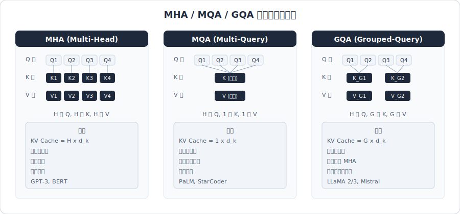
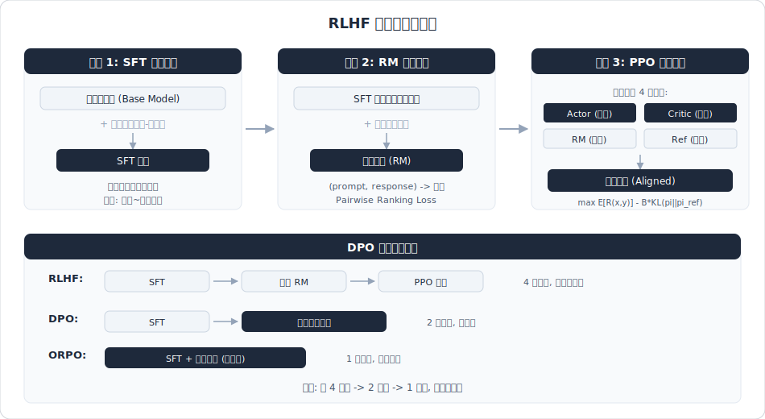
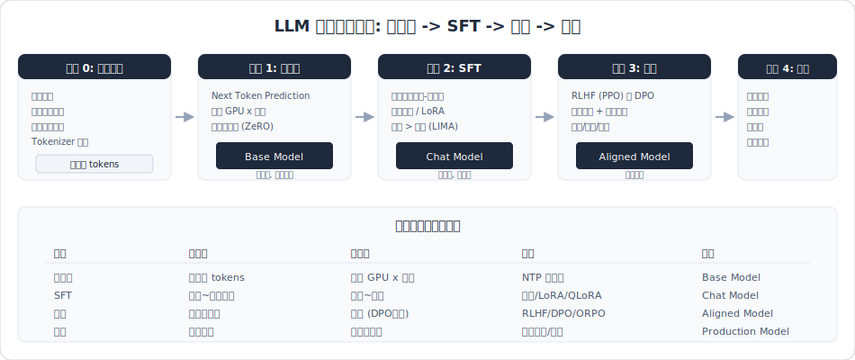
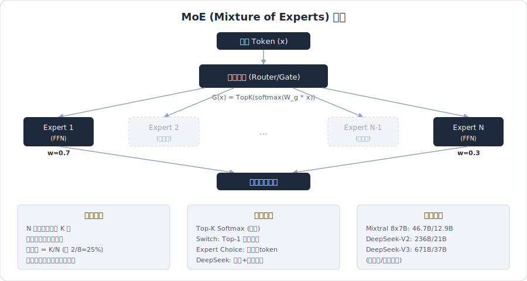
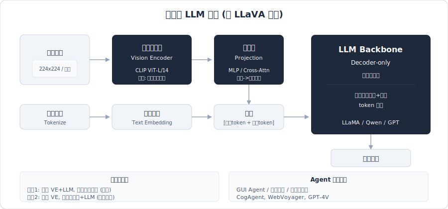

# 07 - LLM 基础原理面试笔记


> 面试高频考点，覆盖 Transformer 架构、注意力机制、位置编码、推理加速、微调方法、对齐训练、Tokenizer、Scaling Law 等核心主题。

---

## 速记框架

```
LLM 基础原理知识图谱
├── 架构层
│   ├── Transformer（Encoder-Decoder / Decoder-only）
│   ├── Self-Attention → MHA / MQA / GQA / MLA
│   ├── FFN / 残差连接 / LayerNorm
│   └── 位置编码（绝对 / 相对 / RoPE / ALiBi）
├── 训练层
│   ├── 预训练 → SFT → RLHF/DPO
│   ├── Scaling Law
│   └── Tokenizer（BPE / WordPiece / SentencePiece）
├── 微调层
│   ├── 全量微调 / LoRA / QLoRA
│   ├── Adapter / Prefix-tuning
│   └── 参数高效微调（PEFT）
└── 推理层
    ├── KV Cache 原理与优化
    ├── 量化（INT8 / INT4 / GPTQ / AWQ）
    ├── FlashAttention / PagedAttention
    ├── 投机解码（Speculative Decoding）
    └── 采样策略（Temperature / Top-p / Top-k）
```

---

## Q1: Transformer 架构详解

**问：请详细介绍 Transformer 的整体架构，包括编码器-解码器结构、各子层的作用。**

### 答：

Transformer 由 Vaswani et al. 在 2017 年论文 "Attention Is All You Need" 中提出，核心架构包含：

**编码器（Encoder）**：
- N 层堆叠（原论文 N=6）
- 每层包含：多头自注意力（Multi-Head Self-Attention）+ 前馈网络（FFN）
- 每个子层后接残差连接（Residual Connection）和层归一化（LayerNorm）

**解码器（Decoder）**：
- N 层堆叠
- 每层包含：掩码多头自注意力（Masked MHA）+ 编码器-解码器交叉注意力 + FFN
- 掩码确保自回归生成时只能看到之前的位置

**关键子层**：

| 子层 | 作用 | 关键点 |
|------|------|--------|
| Self-Attention | 捕获序列内部依赖关系 | 并行计算，全局视野 |
| FFN | 非线性变换，增加表达能力 | 两层线性变换 + 激活函数（ReLU/GeLU/SwiGLU） |
| 残差连接 | 缓解梯度消失，帮助深层网络训练 | output = sublayer(x) + x |
| LayerNorm | 稳定训练，加速收敛 | 在特征维度上归一化 |

**为什么用 LayerNorm 而不是 BatchNorm？**
- CV 用 BN 是因为 channel 维度信息重要
- NLP 中句子长度不一致，BN 在序列维度上统计不稳定
- LayerNorm 对每个样本独立归一化，不受 batch 内其他样本影响

**Pre-Norm vs Post-Norm**：
- 原始 Transformer 是 Post-Norm：`x + Sublayer(LayerNorm(x))` 变为 `LayerNorm(x + Sublayer(x))`
- 现代 LLM（GPT、LLaMA）多采用 **Pre-Norm**：`x + Sublayer(LayerNorm(x))`，训练更稳定

> 相关来源：
> - [25年大模型面试必问八股文，背完通过率98%](https://www.xiaohongshu.com/explore/67b2ef13000000001701dd13) - AI大模型学习不迷路 | 984赞
> - [米哈游LLM算法实习一面面经](https://www.xiaohongshu.com/explore/699aa05b000000000a02c3da) - 26春招战魂妹 | 1282赞
> - [算法面经：LLM&Agent八股总结](https://www.xiaohongshu.com/explore/69290b0d000000001e02ae10) - AI实战领航员 | 448赞

---

## Q2: Self-Attention 的计算过程？Q/K/V 是什么？

**问：请详细描述 Self-Attention 的计算过程，解释 Q、K、V 的含义。**

### 答：

**Q/K/V 的含义**：
- **Query (Q)**：当前位置的"查询"向量，表示"我想找什么信息"
- **Key (K)**：每个位置的"键"向量，表示"我有什么信息"
- **Value (V)**：每个位置的"值"向量，表示"我提供的具体内容"

**计算步骤**：

```
1. 线性投影：Q = X·W_Q, K = X·W_K, V = X·W_V
   其中 W_Q, W_K, W_V ∈ R^{d_model × d_k}

2. 计算注意力分数：Score = Q · K^T
   得到 [seq_len × seq_len] 的注意力矩阵

3. 缩放：Score = Score / √d_k
   防止点积过大导致 softmax 梯度消失

4. Softmax 归一化：Attention_weights = softmax(Score)

5. 加权求和：Output = Attention_weights · V
```

**公式**：`Attention(Q, K, V) = softmax(QK^T / √d_k) · V`

**为什么要除以 √d_k？**
- 当 d_k 较大时，QK^T 的方差约为 d_k，点积结果会很大
- 过大的值导致 softmax 输出趋近 one-hot，梯度接近零
- 除以 √d_k 使方差回归到 1，保持梯度稳定

**为什么 Q 和 K 用不同的权重矩阵？**
- 如果用相同矩阵（即 Q=K），注意力分数矩阵是对称的
- 对称矩阵意味着 token A 对 B 的关注度等于 B 对 A 的，泛化能力差
- 不同矩阵允许非对称的注意力模式，更灵活

> 相关来源：
> - [25年大模型面试必问八股文，背完通过率98%](https://www.xiaohongshu.com/explore/67b2ef13000000001701dd13) - AI大模型学习不迷路 | 984赞
> - [米哈游LLM算法实习一面面经](https://www.xiaohongshu.com/explore/699aa05b000000000a02c3da) - 26春招战魂妹 | 1282赞

---

## Q3: MHA、GQA、MQA 的区别？



**问：多头注意力（MHA）、分组查询注意力（GQA）、多查询注意力（MQA）有何区别？**

### 答：

| 特性 | MHA | MQA | GQA |
|------|-----|-----|-----|
| KV 头数 | 与 Q 相同（H 个） | 只有 1 组 KV | G 组 KV（1 < G < H） |
| 参数量 | 最多 | 最少 | 中等 |
| KV Cache 大小 | H × d_k | 1 × d_k | G × d_k |
| 推理速度 | 最慢 | 最快 | 较快 |
| 模型质量 | 最好 | 可能下降 | 接近 MHA |
| 代表模型 | GPT-3, BERT | PaLM, StarCoder | LLaMA 2/3, Mistral |

**核心思想**：

```
MHA:  每个注意力头有独立的 Q、K、V
      → H 组 Q, H 组 K, H 组 V

MQA:  所有头共享同一组 K、V，只有 Q 独立
      → H 组 Q, 1 组 K, 1 组 V
      → KV Cache 缩小 H 倍

GQA:  将 Q 头分为 G 组，每组共享一组 K、V
      → H 组 Q, G 组 K, G 组 V
      → GQA-1 = MQA, GQA-H = MHA
      → 在速度和质量间取平衡
```

**工程意义**：在大模型推理中，KV Cache 是主要的显存瓶颈。GQA/MQA 通过减少 KV 头数来压缩 KV Cache，显著降低显存占用和推理延迟，且质量损失可控。

> 相关来源：
> - [米哈游LLM算法实习一面面经](https://www.xiaohongshu.com/explore/699aa05b000000000a02c3da) - 26春招战魂妹 | 1282赞
> - [25年大模型面试必问八股文，背完通过率98%](https://www.xiaohongshu.com/explore/67b2ef13000000001701dd13) - AI大模型学习不迷路 | 984赞

---

## Q4: 位置编码方案（绝对/相对/RoPE/ALiBi）

**问：LLM 中常用的位置编码方案有哪些？各有什么优缺点？**

### 答：

| 方案 | 类型 | 原理 | 长度外推 | 代表模型 |
|------|------|------|----------|----------|
| 正弦位置编码 | 绝对 | sin/cos 函数生成固定编码 | 差 | 原始 Transformer |
| 可学习位置编码 | 绝对 | 训练得到的嵌入向量 | 差 | GPT-2, BERT |
| 相对位置编码 | 相对 | 编码 token 间相对距离 | 一般 | Transformer-XL |
| **RoPE** | 相对(通过绝对实现) | 旋转矩阵编码位置 | 较好 | LLaMA, Qwen, Mistral |
| **ALiBi** | 相对 | 注意力分数加线性偏置 | 好 | BLOOM, MPT |

**RoPE（Rotary Position Embedding）**：
- 核心思想：用旋转矩阵对 Q、K 施加位置信息
- 将位置编码为复数，模长为 1，角度与位置成正比
- 通过绝对位置编码实现相对位置编码的效果
- `q_m · k_n^T` 的结果只依赖于相对位置 `m - n`
- 支持长度外推（配合 NTK-aware Scaling、YaRN 等技术）

**ALiBi（Attention with Linear Biases）**：
- 不给词向量加位置嵌入
- 直接在 attention score 上加一个与 Q-K 距离成正比的惩罚项
- 距离越大，惩罚越大（线性衰减）
- 无需训练，预设固定偏置矩阵
- 天然支持长度外推

**面试重点**：RoPE 已成为主流 LLM 的标配位置编码，ALiBi 则在无需训练额外参数的场景下有优势。

> 相关来源：
> - [25年大模型面试必问八股文，背完通过率98%](https://www.xiaohongshu.com/explore/67b2ef13000000001701dd13) - AI大模型学习不迷路 | 984赞
> - [米哈游LLM算法实习一面面经](https://www.xiaohongshu.com/explore/699aa05b000000000a02c3da) - 26春招战魂妹 | 1282赞

---

## Q5: KV Cache 原理与优化

**问：什么是 KV Cache？为什么需要它？有哪些优化方法？**

### 答：

**原理**：
- 自回归生成时，每生成一个新 token，需要计算它与所有前序 token 的 attention
- 前序 token 的 K、V 在后续生成中不会改变
- **KV Cache 缓存已计算的 K、V 向量，避免重复计算**
- 将推理复杂度从 O(n^2) 降到 O(n)

**两阶段推理**：

```
1. Prefill 阶段：
   - 输入完整 prompt，并行计算所有 token 的 K、V
   - 初始化 KV Cache
   - 返回第一个输出 token

2. Decode 阶段：
   - 每步只输入当前新 token
   - 计算新 token 的 Q、K、V
   - 新的 K、V 追加到 KV Cache
   - 用新 Q 与全部缓存的 K 计算 attention
   - 自回归生成后续 token
```

**显存占用公式**：
```
KV Cache 大小 = 2 × batch_size × num_layers × num_heads × seq_len × d_head × dtype_size
```

**优化方法**：

| 方向 | 方法 | 效果 |
|------|------|------|
| 共享/减少 KV 头 | MQA / GQA | KV Cache 缩小数倍 |
| 量化 | KV Cache INT8/INT4 量化 | 显存减半或更多 |
| 内存管理 | PagedAttention (vLLM) | 消除显存碎片，提升利用率 |
| 稀疏化 | StreamingLLM / H2O | 只保留重要 token 的 KV |
| 滑动窗口 | Sliding Window Attention | 限制 cache 大小 |

> 相关来源：
> - [米哈游LLM算法实习一面面经](https://www.xiaohongshu.com/explore/699aa05b000000000a02c3da) - 26春招战魂妹 | 1282赞
> - [25年大模型面试必问八股文，背完通过率98%](https://www.xiaohongshu.com/explore/67b2ef13000000001701dd13) - AI大模型学习不迷路 | 984赞

---

## Q6: LLM 推理加速方法

**问：有哪些主流的 LLM 推理加速方法？**

### 答：

### 6.1 量化（Quantization）

| 方法 | 精度 | 特点 |
|------|------|------|
| FP16/BF16 | 16-bit | 训练和推理的基本精度 |
| INT8 (LLM.int8()) | 8-bit | 权重和激活混合精度量化 |
| GPTQ | 4-bit | 权重后训练量化，基于二阶信息 |
| AWQ | 4-bit | 保护重要权重通道，激活感知 |
| GGUF (llama.cpp) | 2-8 bit | CPU 友好的量化格式 |

### 6.2 FlashAttention

- **核心问题**：标准 attention 需要将完整的 N×N 注意力矩阵写入 HBM，IO 是瓶颈
- **解决方案**：分块（tiling）计算 attention，在 SRAM 中完成局部 QK^T + softmax + V 相乘
- **关键技术**：在线 softmax（通过重计算避免存储中间矩阵）
- **效果**：速度提升 2-4 倍，显存从 O(N^2) 降到 O(N)
- FlashAttention-2 进一步优化了并行度和 warp 调度

### 6.3 PagedAttention (vLLM)

- **核心问题**：KV Cache 显存碎片化，静态预分配浪费严重
- **解决方案**：借鉴操作系统虚拟内存的分页机制
- 将 KV Cache 划分为固定大小的"页"（block）
- 物理显存非连续，通过逻辑页表映射
- 支持动态分配/释放，显存利用率接近 100%
- **效果**：吞吐量提升 2-4 倍，支持更大 batch size

### 6.4 投机解码（Speculative Decoding）

```
核心思路：用小模型猜，大模型验

1. 草稿阶段：小模型（draft model）快速自回归生成 γ 个候选 token
2. 验证阶段：大模型一次前向传播并行验证所有候选 token
3. 接受/拒绝：通过概率分布比决定接受哪些 token
4. 拒绝时从"差异分布"重新采样，保证输出分布与标准解码完全一致

加速比：取决于小模型与大模型的分布匹配度（接受率）
典型加速：2-3 倍
```

### 6.5 其他加速方法

- **连续批处理（Continuous Batching）**：动态管理 batch 中的请求，避免等待
- **张量并行（Tensor Parallelism）**：跨 GPU 拆分模型层
- **TensorRT-LLM**：NVIDIA 优化的推理引擎
- **前缀缓存（Prefix Caching）**：共享 system prompt 的 KV Cache

> 相关来源：
> - [25年大模型面试必问八股文，背完通过率98%](https://www.xiaohongshu.com/explore/67b2ef13000000001701dd13) - AI大模型学习不迷路 | 984赞
> - [OPPO总裁面](https://www.xiaohongshu.com/explore/68f64e670000000003020996) - 压缩即智能 | 4712赞

---

## Q7: 微调方法对比

**问：全量微调、LoRA、QLoRA、Adapter、Prefix-tuning 各有什么特点？**

### 答：

| 方法 | 可训练参数 | 显存需求 | 推理开销 | 效果 |
|------|-----------|----------|----------|------|
| 全量微调 | 100% | 极高 | 无 | 最好（但可能过拟合） |
| LoRA | ~0.1% | 低 | 无（合并后） | 接近全量 |
| QLoRA | ~0.1% | 极低 | 略高（量化） | 接近 LoRA |
| Adapter | ~1-5% | 中 | 有（额外层） | 良好 |
| Prefix-tuning | ~0.1% | 低 | 有（前缀token） | 较好 |
| P-tuning v2 | ~0.1% | 低 | 有 | 较好 |

**详细对比**：

- **全量微调**：更新所有参数，需要与模型同等甚至更大的显存（优化器状态），大模型下成本极高
- **LoRA**：冻结原始权重，注入低秩矩阵 A 和 B，推理时可合并回原模型，无额外开销
- **QLoRA**：在 LoRA 基础上，将基座模型量化到 4-bit（NF4 格式），用分页优化器，在单卡上可微调 65B 模型
- **Adapter**：在 Transformer 层中插入小型瓶颈层（下投影→激活→上投影），推理时有额外计算
- **Prefix-tuning**：在每层注意力的 KV 前拼接可训练的"虚拟 token"，不修改模型参数

> 相关来源：
> - [25年大模型面试必问八股文，背完通过率98%](https://www.xiaohongshu.com/explore/67b2ef13000000001701dd13) - AI大模型学习不迷路 | 984赞
> - [米哈游LLM算法实习一面面经](https://www.xiaohongshu.com/explore/699aa05b000000000a02c3da) - 26春招战魂妹 | 1282赞
> - [算法面经：LLM&Agent八股总结](https://www.xiaohongshu.com/explore/69290b0d000000001e02ae10) - AI实战领航员 | 448赞

---

## Q8: LoRA 原理详解

**问：请详细解释 LoRA 的原理、数学公式和关键超参数。**

### 答：

**核心假设**：微调过程中权重矩阵的变化量 ΔW 是低秩的。

**数学原理**：

```
原始前向传播：h = W·x
LoRA 前向传播：h = W·x + ΔW·x = W·x + B·A·x

其中：
- W ∈ R^{d×k}：冻结的原始权重
- A ∈ R^{r×k}：低秩矩阵（随机高斯初始化）
- B ∈ R^{d×r}：低秩矩阵（零初始化）
- r << min(d, k)：秩，通常 r = 4, 8, 16, 64

可训练参数量：r × (d + k)
原始参数量：d × k
压缩比：r × (d + k) / (d × k) ≈ 2r / d（当 d ≈ k 时）
```

**关键超参数**：

| 参数 | 含义 | 选择建议 |
|------|------|----------|
| r (rank) | 低秩分解的秩 | 简单任务 r=4-8，复杂任务 r=16-64 |
| alpha | 缩放系数 | 通常设为 2r 或固定 16/32 |
| target_modules | 应用 LoRA 的模块 | 通常为 q_proj, v_proj（可扩展到所有线性层） |
| dropout | LoRA 层的 dropout | 通常 0.05-0.1 |

**为什么 B 零初始化？**
- 训练开始时 ΔW = B·A = 0，模型从预训练权重开始
- 保证训练初期的稳定性

**LoRA 的优势**：
1. 可训练参数减少 10000 倍，GPU 显存需求减少 3 倍
2. 推理时将 LoRA 权重合并回原模型：`W' = W + B·A`，零额外推理开销
3. 可为不同任务训练不同 LoRA，热切换方便
4. 效果接近甚至超过全量微调

**秩 r 的选择原则**：
- 基座模型越强 → 所需 r 越小
- 任务越简单 → 所需 r 越小
- 多任务混合 → 需要更大 r

> 相关来源：
> - [25年大模型面试必问八股文，背完通过率98%](https://www.xiaohongshu.com/explore/67b2ef13000000001701dd13) - AI大模型学习不迷路 | 984赞
> - [米哈游LLM算法实习一面面经](https://www.xiaohongshu.com/explore/699aa05b000000000a02c3da) - 26春招战魂妹 | 1282赞

---

## Q9: RLHF 训练流程



**问：请详细描述 RLHF 的三阶段训练流程。**

### 答：

```
RLHF 三阶段流程（InstructGPT 论文）

阶段 1：SFT（监督微调）
├── 在高质量指令-回复对上微调预训练模型
├── 数据来源：人工标注的 demonstration 数据
└── 目标：让模型学会按指令格式回答

阶段 2：RM（奖励模型训练）
├── 用 SFT 模型对同一 prompt 生成多个回复
├── 人工对回复进行排序（偏好标注）
├── 训练奖励模型学习人类偏好
├── 输入：(prompt, response) → 输出：标量奖励分数
└── 损失函数：pairwise ranking loss
    L = -log(σ(r(x, y_w) - r(x, y_l)))

阶段 3：PPO（强化学习优化）
├── 用奖励模型的分数作为奖励信号
├── 通过 PPO 算法优化策略模型（SFT 模型）
├── 包含 4 个模型：
│   ├── Actor（策略模型，待优化）
│   ├── Critic（价值模型）
│   ├── Reward Model（奖励模型，冻结）
│   └── Reference Model（参考模型，冻结，防止偏移过大）
├── 损失函数包含 KL 惩罚项，防止模型远离 SFT 模型
└── 目标：max E[R(x,y)] - β·KL(π_θ || π_ref)
```

**RLHF 的挑战**：
- 训练不稳定（PPO 超参数敏感）
- 需要同时维护 4 个模型，显存开销巨大
- 奖励模型可能存在 reward hacking
- 人工标注成本高且主观性强

> 相关来源：
> - [25年大模型面试必问八股文，背完通过率98%](https://www.xiaohongshu.com/explore/67b2ef13000000001701dd13) - AI大模型学习不迷路 | 984赞
> - [OPPO总裁面](https://www.xiaohongshu.com/explore/68f64e670000000003020996) - 压缩即智能 | 4712赞

---

## Q10: DPO vs RLHF 的区别

**问：DPO 是什么？与 RLHF 相比有哪些优势？**

### 答：

**DPO（Direct Preference Optimization）** 跳过了奖励模型和强化学习，直接用偏好数据优化策略。

**核心洞察**：DPO 证明了 RLHF 的目标函数可以重新参数化，将最优策略表示为奖励函数的封闭解，从而绕过显式的奖励建模。

| 维度 | RLHF (PPO) | DPO |
|------|-----------|-----|
| 训练阶段 | SFT → RM → PPO | SFT → DPO |
| 需要模型数 | 4 个（Actor, Critic, RM, Ref） | 2 个（Policy, Ref） |
| 是否需要奖励模型 | 是 | 否（隐式奖励） |
| 是否需要 RL | 是（PPO） | 否（转化为分类问题） |
| 训练稳定性 | 较差（RL 不稳定） | 较好（类 SFT） |
| 超参数敏感度 | 高 | 低 |
| 计算资源 | 高 | 较低 |
| 效果 | 好 | 相当或更好 |

**DPO 损失函数**：
```
L_DPO = -E[log σ(β · (log π_θ(y_w|x)/π_ref(y_w|x) - log π_θ(y_l|x)/π_ref(y_l|x)))]

含义：增大 preferred response 的概率，降低 rejected response 的概率
β 控制与 reference model 的偏离程度
```

**DPO 的局限**：
- 对数据质量更敏感（没有奖励模型的缓冲）
- 离线算法，不如在线 PPO 可以探索
- 可能存在分布偏移问题

**后续改进**：SimPO、IPO、KTO、ORPO 等变体进一步优化了偏好学习

> 相关来源：
> - [25年大模型面试必问八股文，背完通过率98%](https://www.xiaohongshu.com/explore/67b2ef13000000001701dd13) - AI大模型学习不迷路 | 984赞
> - [OPPO总裁面](https://www.xiaohongshu.com/explore/68f64e670000000003020996) - 压缩即智能 | 4712赞
> - [算法面经：LLM&Agent八股总结](https://www.xiaohongshu.com/explore/69290b0d000000001e02ae10) - AI实战领航员 | 448赞

---

## Q11: Tokenizer 原理（BPE/WordPiece/SentencePiece）

**问：请解释常用的分词算法及其区别。**

### 答：

| 算法 | 核心思想 | 合并策略 | 代表模型 |
|------|---------|---------|---------|
| BPE | 迭代合并最高频字符对 | 频率驱动 | GPT-2, LLaMA, Qwen |
| WordPiece | 迭代合并最大化似然的字符对 | 似然驱动 | BERT, DistilBERT |
| Unigram | 从大词表开始裁剪低概率子词 | 概率模型 | T5, ALBERT |
| SentencePiece | 统一框架（可用 BPE/Unigram） | 视空格为普通字符 | ChatGLM, BLOOM, PaLM |

**BPE（Byte Pair Encoding）算法**：
```
1. 初始化词表为所有单字符（或字节）
2. 统计语料中相邻字符对的频率
3. 合并频率最高的字符对，加入词表
4. 重复步骤 2-3，直到词表达到目标大小
```

**WordPiece 与 BPE 的关键区别**：
- BPE 选择最高频率的对
- WordPiece 选择使训练数据似然最大化的对
- 公式：score(a,b) = freq(ab) / (freq(a) × freq(b))

**SentencePiece 的特殊之处**：
- 将空格视为特殊字符"▁"，不依赖预分词
- 输入直接是原始文本（raw text）
- 语言无关，对中日韩等无空格语言友好
- 本质是一个框架，底层可选 BPE 或 Unigram

> 相关来源：
> - [25年大模型面试必问八股文，背完通过率98%](https://www.xiaohongshu.com/explore/67b2ef13000000001701dd13) - AI大模型学习不迷路 | 984赞
> - [算法面经：LLM&Agent八股总结](https://www.xiaohongshu.com/explore/69290b0d000000001e02ae10) - AI实战领航员 | 448赞

---

## Q12: LLM 的 Scaling Law

**问：什么是 Scaling Law？它对 LLM 研发有什么指导意义？**

### 答：

**定义**：Scaling Law 描述了 LLM 的性能（测试损失 L）与三个因素之间的幂律关系：
- **N**：模型参数量
- **D**：训练数据量（token 数）
- **C**：计算量（FLOPs）

**OpenAI Scaling Law（Kaplan et al., 2020）**：
```
L(N) ∝ N^{-0.076}    （固定 D 和 C 足够大时）
L(D) ∝ D^{-0.095}    （固定 N 和 C 足够大时）
L(C) ∝ C^{-0.050}    （最优分配时）

结论：模型参数更重要，应优先增大模型
```

**Chinchilla Scaling Law（Hoffmann et al., 2022）**：
```
给定计算预算 C，最优的 N 和 D 应等比增长：
- 最优 token 数 ≈ 20 × 参数量
- 例如 70B 模型应用 ~1.4T tokens 训练

结论：之前的模型普遍 undertrained（数据不够）
推翻了 OpenAI "优先增大模型" 的结论
```

**实际意义**：
1. **预测性能**：用小规模实验预测大模型的最终损失（节省 1000-10000 倍计算）
2. **资源分配**：给定预算，决定模型大小和数据量的最优配比
3. **数据规划**：LLaMA 系列遵循 Chinchilla 法则，用更多数据训练较小模型
4. **研发决策**：判断继续扩大规模是否值得

> 相关来源：
> - [OPPO总裁面](https://www.xiaohongshu.com/explore/68f64e670000000003020996) - 压缩即智能 | 4712赞
> - [25年大模型面试必问八股文，背完通过率98%](https://www.xiaohongshu.com/explore/67b2ef13000000001701dd13) - AI大模型学习不迷路 | 984赞

---

## Q13: 预训练→SFT→RLHF 的完整训练链路



**问：请描述 LLM 从预训练到部署的完整训练链路。**

### 答：

```
完整训练链路

阶段 0：数据准备
├── 语料收集（Common Crawl, Wikipedia, GitHub, 书籍等）
├── 数据清洗（去重、过滤低质量、去除有害内容）
├── 数据配比（不同领域/语言的混合比例）
└── Tokenizer 训练

阶段 1：预训练（Pre-training）
├── 目标：Next Token Prediction（自回归语言建模）
├── 损失：L = -Σ log P(x_t | x_{<t})
├── 数据量：数万亿 tokens
├── 计算量：数千 GPU × 数周/月
├── 产出：Base Model（具备语言知识，但不会对话）
└── 关键技术：分布式训练（数据并行、张量并行、流水线并行、ZeRO）

阶段 2：SFT（有监督微调）
├── 目标：学会按指令格式回答
├── 数据：人工标注的 (instruction, response) 对，几万到几十万条
├── 方法：全量微调或 LoRA
├── 产出：Chat Model（可以对话，但可能生成有害内容）
└── 关键：数据质量 > 数据数量（LIMA 论文：1000 条高质量数据即可）

阶段 3：对齐（Alignment）
├── 方案 A：RLHF
│   ├── 训练奖励模型
│   └── PPO 优化
├── 方案 B：DPO
│   └── 直接偏好优化
├── 方案 C：RLHF + DPO 混合
├── 目标：有用（helpful）、无害（harmless）、诚实（honest）
└── 产出：对齐后的模型

阶段 4：后续优化
├── 长上下文扩展（RoPE 外推、继续预训练）
├── 工具使用能力（function calling 训练）
├── 多模态扩展
└── 领域特化（继续预训练或微调）
```

> 相关来源：
> - [25年大模型面试必问八股文，背完通过率98%](https://www.xiaohongshu.com/explore/67b2ef13000000001701dd13) - AI大模型学习不迷路 | 984赞
> - [OPPO总裁面](https://www.xiaohongshu.com/explore/68f64e670000000003020996) - 压缩即智能 | 4712赞
> - [米哈游LLM算法实习一面面经](https://www.xiaohongshu.com/explore/699aa05b000000000a02c3da) - 26春招战魂妹 | 1282赞

---

## Q14: Temperature/Top-p/Top-k 采样策略

**问：LLM 推理中的 Temperature、Top-p、Top-k 分别是什么？如何配合使用？**

### 答：

LLM 生成 token 时，输出的是词表上的概率分布。采样策略决定如何从中选择 token。

**Temperature（温度）**：
```
调整概率分布的"尖锐度"

P(x_i) = exp(z_i / T) / Σ exp(z_j / T)

T = 1.0：标准 softmax
T → 0：趋近贪婪解码（只选最高概率）→ 确定性强，重复度高
T → ∞：趋近均匀分布 → 随机性强，可能胡言乱语

实际常用范围：0.1 ~ 1.5
代码生成/事实类：T = 0.1 ~ 0.3
通用对话：T = 0.7 ~ 0.9
创意写作：T = 1.0 ~ 1.5
```

**Top-K 采样**：
```
只从概率最高的 K 个 token 中采样

步骤：
1. 对所有 token 按概率排序
2. 保留前 K 个，其余概率置 0
3. 重新归一化后采样

缺点：K 是固定的，不同 context 下合理的候选数量不同
典型值：K = 40 ~ 100
```

**Top-P 采样（核采样，Nucleus Sampling）**：
```
选择累积概率超过 P 的最小 token 集合

步骤：
1. 对所有 token 按概率降序排列
2. 累加概率，直到总和 ≥ P
3. 从这个集合中采样

优势：动态调整候选数量
- 分布集中时，候选少（确定性高）
- 分布分散时，候选多（多样性高）

典型值：P = 0.9 ~ 0.95
```

**组合使用建议**：
| 场景 | Temperature | Top-P | Top-K |
|------|-----------|-------|-------|
| 代码生成 | 0.1-0.2 | 0.9 | 40 |
| 事实问答 | 0.0-0.3 | 0.8 | 20 |
| 通用对话 | 0.7-0.9 | 0.9 | 50 |
| 创意写作 | 1.0-1.5 | 0.95 | 100 |

> 相关来源：
> - [25年大模型面试必问八股文，背完通过率98%](https://www.xiaohongshu.com/explore/67b2ef13000000001701dd13) - AI大模型学习不迷路 | 984赞
> - [米哈游LLM算法实习一面面经](https://www.xiaohongshu.com/explore/699aa05b000000000a02c3da) - 26春招战魂妹 | 1282赞

---

## Q15: 为什么 Decoder-only 架构成为主流？

**问：为什么 GPT 系列等主流 LLM 都采用 Decoder-only 架构，而不是 Encoder-Decoder？**

### 答：

### 15.1 三种架构对比

| 架构 | 注意力类型 | 代表模型 | 适用场景 |
|------|-----------|---------|---------|
| Encoder-only | 双向注意力 | BERT, RoBERTa | 文本理解/分类 |
| Encoder-Decoder | 编码器双向 + 解码器因果 | T5, BART, Flan-T5 | 翻译/摘要 |
| **Decoder-only** | 因果注意力（单向） | GPT, LLaMA, Qwen | **通用生成** |

### 15.2 Decoder-only 成为主流的原因

**1. 理论优势**：
- Encoder 的双向注意力存在低秩问题，可能削弱模型表达能力
- 在生成任务上，双向注意力并无实质好处
- Encoder-Decoder 表现更好可能只是因为参数量是 Decoder-only 的两倍

**2. 泛化能力更强（zero-shot）**：
- Decoder-only 在无 fine-tuning 数据的情况下 zero-shot 表现最好
- Encoder-Decoder 需要在标注数据上做 multitask fine-tuning 才能激发最佳性能
- 因果注意力的隐式正则化效果更好

**3. 工程效率**：
- KV Cache 机制天然适配流水线并行和显存优化
- vLLM 的 PagedAttention、FlashAttention 等底层优化优先支持因果路径
- Megatron-LM 等分布式训练框架对 Decoder-only 支持最成熟

**4. 统一范式**：
- 几乎所有 NLP 任务都可以转化为"给定前缀，生成后续"的范式
- 理解任务可以通过生成答案来完成（如 CoT 推理）
- 一个架构统一所有任务，简化工程复杂度

**5. 路径依赖与生态效应**：
- OpenAI 率先验证了 Decoder-only 的 Scaling Law
- 开源生态（LLaMA、Mistral 等）进一步巩固
- 后来者不愿意做结构大改动，持续迭代 MoE、长上下文、多模态

> 相关来源：
> - [OPPO总裁面](https://www.xiaohongshu.com/explore/68f64e670000000003020996) - 压缩即智能 | 4712赞
> - [25年大模型面试必问八股文，背完通过率98%](https://www.xiaohongshu.com/explore/67b2ef13000000001701dd13) - AI大模型学习不迷路 | 984赞

---

## Q16: 预训练中常用的激活函数

**问：LLM 中常用哪些激活函数？为什么 SwiGLU 逐渐取代 ReLU/GeLU？**

### 答：

| 激活函数 | 公式 | 使用模型 |
|---------|------|---------|
| ReLU | max(0, x) | 原始 Transformer |
| GeLU | x · Φ(x) | GPT-2, BERT |
| SwiGLU | Swish(xW₁) ⊗ (xW₂) | LLaMA, Qwen, Mistral |

**SwiGLU 的优势**：
- GLU（Gated Linear Unit）引入门控机制，让模型自适应选择信息
- Swish 函数（x·σ(βx)）比 ReLU 更平滑，梯度更稳定
- 实验表明在同等参数量下，SwiGLU 效果优于 GeLU 和 ReLU

**注意**：SwiGLU 的 FFN 有 3 个权重矩阵（W₁, W₂, W₃），为保持参数量一致，通常将隐藏层维度设为 `8/3 × d_model`（而非标准 `4 × d_model`）。

> 相关来源：
> - [25年大模型面试必问八股文，背完通过率98%](https://www.xiaohongshu.com/explore/67b2ef13000000001701dd13) - AI大模型学习不迷路 | 984赞
> - [算法面经：LLM&Agent八股总结](https://www.xiaohongshu.com/explore/69290b0d000000001e02ae10) - AI实战领航员 | 448赞

---

## Q17: Attention 的计算复杂度与优化

**问：标准 Self-Attention 的复杂度是什么？有哪些优化方案？**

### 答：

**标准复杂度**：
- 时间复杂度：O(n^2 · d)，其中 n 为序列长度，d 为维度
- 空间复杂度：O(n^2)（需存储注意力矩阵）

**优化方案**：

| 方法 | 复杂度 | 思路 |
|------|-------|------|
| FlashAttention | O(n^2·d) 时间，O(n) 空间 | IO 感知，分块计算 |
| Sparse Attention | O(n·√n) | 稀疏注意力模式 |
| Linear Attention | O(n·d^2) | 用核函数近似 softmax |
| Sliding Window | O(n·w) | 局部注意力窗口 |
| Multi-Scale Attention | 混合 | 不同层用不同窗口大小 |

**Mistral 的 Sliding Window Attention**：
- 每个 token 只关注前 W 个 token（窗口大小）
- 通过多层堆叠，间接关注更远的 token（感受野 = W × L）
- KV Cache 大小固定，不随序列长度增长

> 相关来源：
> - [米哈游LLM算法实习一面面经](https://www.xiaohongshu.com/explore/699aa05b000000000a02c3da) - 26春招战魂妹 | 1282赞
> - [25年大模型面试必问八股文，背完通过率98%](https://www.xiaohongshu.com/explore/67b2ef13000000001701dd13) - AI大模型学习不迷路 | 984赞

---

## 补充速记卡片

```
┌─────────────────────────────────────────────────┐
│ Transformer 核心公式速记                          │
├─────────────────────────────────────────────────┤
│ Attention(Q,K,V) = softmax(QK^T/√d_k) · V       │
│ LoRA: h = Wx + BAx, 其中 B∈R^{d×r}, A∈R^{r×k}  │
│ DPO: L = -log σ(β(log π_θ(yw)/πref - log π_θ(yl)/πref)) │
│ RoPE: q·k = f(q,m)·f(k,n) 只依赖相对位置 m-n    │
│ KV Cache: 缓存 K,V → 增量解码 O(n²)→O(n)         │
│ FlashAttention: tiling + online softmax → O(n) 空间 │
│ Scaling Law: L(C) ∝ C^{-α}                       │
│ Chinchilla: 最优 tokens ≈ 20 × 参数量             │
└─────────────────────────────────────────────────┘
```

```
┌─────────────────────────────────────────────────┐
│ 高频对比速记                                      │
├─────────────────────────────────────────────────┤
│ MHA vs GQA vs MQA → KV头数: H vs G vs 1          │
│ RLHF vs DPO → 4模型+RL vs 2模型+分类             │
│ LoRA vs QLoRA → FP16基座 vs 4bit量化基座          │
│ BPE vs WordPiece → 频率合并 vs 似然合并            │
│ Pre-Norm vs Post-Norm → 现代LLM用Pre-Norm         │
│ RoPE vs ALiBi → 旋转Q/K vs 注意力加偏置           │
│ Prefill vs Decode → 并行计算 vs 自回归逐步生成     │
│ T↓=确定性↑  T↑=随机性↑  Top-p动态 > Top-k固定    │
└─────────────────────────────────────────────────┘
```

---

## 参考资料

### 高赞面经与八股文

- [984赞] [25年大模型面试必问八股文，背完通过率98%](https://www.bilibili.com/video/BV12nAoeiEV6/)
- [448赞] [LLM & VLM & Agent 面试八股参考](https://zhuanlan.zhihu.com/p/2014503030167451362)
- [1282赞] [米哈游LLM算法实习面经](https://www.nowcoder.com/enterprise/1055/interview)

### 系统学习资源

- [GitHub - wdndev/llm_interview_note](https://github.com/wdndev/llm_interview_note) - 大语言模型算法工程师面试题笔记（含 MHA/MQA/GQA、解码策略等专题）
- [GitHub - km1994/LLMs_interview_notes](https://github.com/km1994/LLMs_interview_notes) - 大模型算法工程师面试题
- [2025大模型面试八股（含100道答案）](https://blog.csdn.net/2301_82275412/article/details/147591093)
- [《大模型面试宝典》(2025版)](https://zhuanlan.zhihu.com/p/21255849125)
- [2026大模型面试题库：100+题全解析](https://zhuanlan.zhihu.com/p/1981387722473116577)

### 专题深入

- [史上最全Transformer面试题：灵魂20问](https://zhuanlan.zhihu.com/p/148656446)
- [大模型注意力机制：MHA、MQA、GQA的异同](https://zhuanlan.zhihu.com/p/680811520)
- [缓存与效果的极限拉扯：从MHA到MLA](https://spaces.ac.cn/archives/10091)
- [大模型推理性能优化之KV Cache解读](https://zhuanlan.zhihu.com/p/630832593)
- [LLM推理加速方法-2025年终总结](https://zhuanlan.zhihu.com/p/1987290155812423513)
- [vLLM推理加速原理](https://blog.csdn.net/qq_41667743/article/details/146571835)
- [大模型高效微调-LoRA原理详解](https://zhuanlan.zhihu.com/p/702629428)
- [RLHF的替代之DPO原理解析](https://blog.csdn.net/v_JULY_v/article/details/134242910)
- [一文看尽LLM对齐技术：RLHF、RLAIF、PPO、DPO](https://developer.aliyun.com/article/1597867)
- [位置编码：从正弦波到RoPE、ALiBi](https://blog.csdn.net/qq_43664407/article/details/148354496)
- [RoPE旋转位置编码详解](https://blog.csdn.net/v_JULY_v/article/details/134085503)
- [Transformer中位置编码的发展](https://zhuanlan.zhihu.com/p/672185184)
- [BPE、WordPiece和SentencePiece切词](https://zhuanlan.zhihu.com/p/639557870)
- [万字长文解读Scaling Law](https://zhuanlan.zhihu.com/p/20966132534)
- [解析大模型中的Scaling Law](https://zhuanlan.zhihu.com/p/667489780)
- [为什么现在的LLM都是Decoder-only架构？](https://zhuanlan.zhihu.com/p/663853562)
- [大模型文本生成——解码策略（Top-k & Top-p & Temperature）](https://zhuanlan.zhihu.com/p/647813179)
- [投机解码算法快速理解](https://zhuanlan.zhihu.com/p/685282553)

---

## Q18: MoE（Mixture of Experts）架构原理



**问：什么是 MoE 架构？它是如何在不显著增加推理成本的情况下扩大模型容量的？**

**考频：高** | 来源：DeepSeek-V2/V3、Mixtral 引爆行业关注，Agent 开发者需理解模型能力边界

### 答题框架

**核心思想**：MoE 将 Transformer 的 FFN 层替换为多个"专家网络"（Expert），通过门控网络（Router/Gate）动态选择少数专家参与计算，实现"参数量大但计算量小"。

**架构组成**：

```
标准 Transformer FFN:
  input → FFN → output（全部参数参与计算）

MoE Layer:
  input → Router → 选择 top-K 个专家
       → Expert_1(input) × weight_1
       → Expert_3(input) × weight_3
       → 加权求和 → output

关键参数：
- N：专家总数（如 8/16/64/128）
- K：每次激活的专家数（通常 K=1 或 K=2）
- 激活参数比 = K/N（如 2/8 = 25%）
```

**门控机制（Router）**：

| 方案 | 公式 | 特点 |
|------|------|------|
| Top-K Softmax | G(x) = TopK(softmax(W_g · x)) | 最基础，可能负载不均 |
| Switch Transformer | G(x) = Top1(softmax(W_g · x)) | 极简，Google 提出 |
| Expert Choice | 每个专家选择 top-K 个 token | 负载更均衡 |
| DeepSeek 共享专家 | 部分专家始终激活 + 路由专家 | 保底通用能力 |

**负载均衡问题**：
- 如果路由总是选择少数专家 → 部分专家训练不充分（"专家坍塌"）
- 解决方案：辅助损失（Auxiliary Loss），鼓励 token 均匀分配到各专家
- DeepSeek-V3 引入无辅助损失的负载均衡策略（基于偏置项动态调整）

**代表模型**：

| 模型 | 专家数 | 激活专家 | 总参数 | 激活参数 |
|------|--------|---------|--------|---------|
| Mixtral 8x7B | 8 | 2 | 46.7B | ~12.9B |
| DeepSeek-V2 | 160 | 6 | 236B | 21B |
| DeepSeek-V3 | 256 | 8 | 671B | 37B |
| Qwen2-MoE | 64 | 8 | 57B | 14.3B |

**对 Agent 开发的意义**：
- MoE 模型在同等推理成本下质量更高，是 Agent 后端模型的优选
- 理解 MoE 有助于选型决策：密集模型 vs MoE 模型的 trade-off
- DeepSeek-V3 证明 MoE + 大规模数据可以用较低成本训出顶级模型

### 速记

> **"N 个专家只激活 K 个 —— 参数多、计算少、效果好"** -- MoE 核心 = 稀疏激活 + 门控路由 + 负载均衡

> 相关来源：
> - [OPPO总裁面](https://www.xiaohongshu.com/explore/68f64e670000000003020996) - 压缩即智能 | 4712赞
> - [字节大模型实习算法岗一二面经](https://www.xiaohongshu.com/explore/69384734000000001e022ec0) - veux | 471赞
> - [阶跃星辰大模型算法岗一面](https://www.xiaohongshu.com/explore/69a6eb80000000002800bcff) - 坂华offer助手 | 351赞

---

## Q19: 长文本处理技术（RoPE 扩展、YaRN、LongRoPE）

**问：LLM 如何支持超出预训练长度的上下文？主流长文本扩展技术有哪些？**

**考频：高** | 来源：Agent 开发中长对话、大文档处理是核心痛点

### 答题框架

**为什么需要长文本？**
- Agent 系统中工具描述、对话历史、检索文档会占用大量 token
- RAG 场景需要放入多个文档片段
- 代码补全需要完整项目上下文

**核心挑战**：预训练时见过的最大长度有限，直接外推到更长序列会导致注意力分数异常。

**主流技术路线**：

| 方法 | 原理 | 优点 | 缺点 |
|------|------|------|------|
| 位置插值（PI） | 将位置编码线性缩放到训练范围内 | 简单有效 | 短文本精度可能下降 |
| NTK-aware Scaling | 调整 RoPE 的频率基数 | 无需微调即可用 | 效果有限 |
| YaRN | NTK + 注意力缩放 + 高低频分区处理 | 效果好，微调代价小 | 需要少量微调 |
| LongRoPE | 搜索最优位置缩放因子 | 支持 2M+ token | 需要搜索过程 |
| 继续预训练 | 在长文本数据上继续训练 | 效果最稳定 | 计算成本最高 |
| Ring Attention | 将长序列分块到不同设备 | 理论无限长 | 工程复杂度高 |

**RoPE 外推的直觉理解**：

```
RoPE 将位置编码为旋转角度：
θ_i = base^(-2i/d)  其中 base 通常为 10000

NTK-aware Scaling：增大 base（如 10000 → 160000）
  → 低频分量不变（捕获全局位置关系）
  → 高频分量被"压缩"（牺牲局部精度换长度）

YaRN 进一步分区：
  - 低频维度：不缩放（保持远距离关系）
  - 高频维度：线性缩放（压缩局部位置）
  - 中间维度：插值过渡
  + 温度缩放因子 √(1/t) 修正注意力 softmax
```

**Lost in the Middle 问题**：
- 即使上下文够长，模型对中间位置的信息利用率显著低于开头和结尾
- 对 Agent 开发的影响：关键信息应放在上下文的头部或尾部
- 缓解手段：对长文档做分段摘要、使用 RAG 精确检索代替暴力堆文本

### 速记

> **"改基数、分频率、做插值 —— 让 RoPE 看得更远"** -- 长文本 = 位置编码外推 + 注意力优化 + 数据继续训练

> 相关来源：
> - [25年大模型面试必问八股文，背完通过率98%](https://www.xiaohongshu.com/explore/67b2ef13000000001701dd13) - AI大模型学习不迷路 | 984赞
> - [腾讯LLM算法一面](https://www.xiaohongshu.com/explore/69a41f2e000000001b01ef39) - Offer面试官 | 293赞
> - [minimax大模型算法三轮技术面(贼难)](https://www.xiaohongshu.com/explore/69b5c0b4000000002800adee) - 坂华offer助手 | 292赞

---

## Q20: LLM 幻觉（Hallucination）的原因与缓解

**问：LLM 为什么会产生幻觉？在 Agent 系统中如何缓解？**

**考频：高** | 来源：Agent 可靠性的第一大挑战

### 答题框架

**什么是幻觉**：模型生成的内容看似流畅合理，但与事实不符或缺乏依据。

**幻觉的分类**：

| 类型 | 描述 | 示例 |
|------|------|------|
| 事实性幻觉 | 编造不存在的事实 | 虚构论文、错误日期 |
| 忠实性幻觉 | 输出与给定上下文不一致 | RAG 检索到正确信息但回答矛盾 |
| 推理幻觉 | 推理过程中引入错误步骤 | 数学推导中间步骤出错 |
| 指令幻觉 | 编造工具调用结果 | Agent 伪造 API 返回值 |

**产生原因**：

1. **训练数据层面**：
   - 预训练语料包含错误信息、过时信息
   - 数据中存在矛盾信息
   - 长尾知识覆盖不足

2. **模型架构层面**：
   - 自回归生成的本质是基于统计的 next-token prediction，不具备事实验证能力
   - 模型在确信度低时也会生成流畅文本（"过度自信"）
   - Softmax 归一化强制输出概率分布，即使所有选项都不好也必须选一个

3. **解码策略层面**：
   - 高 Temperature 增加随机性，更易产生幻觉
   - 贪婪解码可能陷入重复但错误的模式

4. **上下文层面**：
   - 输入信息不足或模糊
   - 指令与上下文矛盾
   - Lost in the Middle 导致关键信息被忽略

**缓解方案（分层防御）**：

```
L1 - 输入层：
  ├── RAG：用检索增强替代纯记忆
  ├── 提供明确的参考资料和事实依据
  └── 指令中要求"仅基于提供的信息回答，不确定时说不知道"

L2 - 推理层：
  ├── CoT：暴露推理过程，便于发现错误
  ├── Self-Consistency：多路径投票减少偶发错误
  ├── 约束解码：限制输出空间
  └── 降低 Temperature，减少随机性

L3 - 输出层：
  ├── 事实性检查（Fact-checking）：用另一个模型或知识库验证
  ├── 引用溯源：要求模型标注信息来源
  ├── 置信度评估：检测模型的不确定性
  └── 人工审核高风险输出

L4 - Agent 系统层：
  ├── 工具验证：Agent 的工具调用结果由系统校验
  ├── 反思机制（Reflexion）：Agent 自检输出合理性
  ├── 多 Agent 交叉验证
  └── Guardrails：设定输出边界和安全护栏
```

### 速记

> **"统计模型不等于知识库 —— 防幻觉要从输入、推理、输出、系统四层防御"** -- 核心：RAG + CoT + 事实检查 + Agent Guardrails

> 相关来源：
> - [大模型应用开发面试都问些什么？](https://www.xiaohongshu.com/explore/69bdfe5c0000000022003c39) - Acyg | 351赞
> - [字节大模型Agent-八股文拷打](https://www.xiaohongshu.com/explore/69b0e467000000001b0161d5) - 算法Leo | 305赞
> - [2026大模型Agent面试全攻略（上）](https://www.xiaohongshu.com/explore/69ad4bb9000000000d00a454) - AI实战领航员 | 527赞

---

## Q21: 涌现能力（Emergent Abilities）

**问：什么是 LLM 的涌现能力？它对 Agent 开发有什么启示？**

**考频：中** | 来源：理解模型能力边界对 Agent 设计至关重要

### 答题框架

**定义**：涌现能力是指在小模型中不存在或表现随机，但在模型规模增大到某个临界点后突然出现的能力。由 Wei et al.（2022）提出。

**典型涌现能力**：
- **In-Context Learning**：通过上下文示例完成新任务（GPT-3, 175B）
- **Chain-of-Thought 推理**：多步逻辑推理（~100B+ 参数）
- **指令遵循**：理解并执行复杂指令
- **代码生成与执行**：编写并调试代码
- **工具使用**：自主决定何时、如何调用外部工具

**争议与最新认知**：

1. **支持方（原始观点）**：涌现是真实存在的相变现象，源于模型内部表示的质变
2. **质疑方（Schaeffer et al., 2023）**：涌现可能是评估指标的假象
   - 当使用离散指标（如精确匹配）时，看起来有"突变"
   - 当使用连续指标（如 token-level accuracy）时，性能是平滑上升的
   - 结论：不是能力的涌现，而是评估方式造成的"涌现幻觉"

3. **工程实践视角**：
   - 不管是否"真涌现"，小模型和大模型在复杂任务上确实有质的差距
   - Agent 开发者需要根据任务复杂度选择合适规模的模型
   - 某些 Agent 能力（如多步规划、工具协调）确实需要较大模型

**对 Agent 开发的启示**：

| 模型规模 | 适合的 Agent 任务 |
|---------|-----------------|
| 7B-13B | 简单意图分类、单工具调用、格式化输出 |
| 30B-70B | 多步推理、多工具协调、复杂指令遵循 |
| 100B+ / GPT-4 级 | 复杂规划、自我反思、开放式问题解决 |

### 速记

> **"小模型做不到的事，大模型可能突然就会了 —— 但评估方式可能在骗你"** -- Agent 选模型看任务复杂度，复杂规划/反思需要大模型

> 相关来源：
> - [OPPO总裁面](https://www.xiaohongshu.com/explore/68f64e670000000003020996) - 压缩即智能 | 4712赞
> - [算法面经：LLM&Agent八股总结](https://www.xiaohongshu.com/explore/69290b0d000000001e02ae10) - AI实战领航员 | 448赞
> - [字节大模型一面凉经](https://www.xiaohongshu.com/explore/6969f583000000000e00d389) - Trimble | 458赞

---

## Q22: 模型蒸馏与压缩

**问：什么是模型蒸馏？在 Agent 部署中如何用蒸馏降低成本？**

**考频：中** | 来源：Agent 系统成本优化的关键手段

### 答题框架

**知识蒸馏（Knowledge Distillation）核心思想**：
用大模型（教师模型）的输出指导小模型（学生模型）训练，让小模型学习大模型的"软知识"。

**蒸馏方式**：

```
1. 输出蒸馏（Logit-based）：
   学生学习教师的输出概率分布
   L = α·CE(y, p_student) + (1-α)·KL(p_teacher || p_student)
   温度 T 控制软标签的平滑度

2. 特征蒸馏（Feature-based）：
   学生模仿教师的中间层表示
   适用于架构差异较大时

3. 数据蒸馏（最常用于 LLM）：
   用教师模型生成高质量训练数据
   学生模型在生成数据上做 SFT
   如：Alpaca（GPT-3.5 生成数据训练 LLaMA）
   如：Orca（GPT-4 的 CoT 数据训练小模型）

4. 在线蒸馏：
   教师和学生同时训练
   如 DeepSeek-R1 的蒸馏策略
```

**LLM 时代的蒸馏实践**：

| 方法 | 教师 | 学生 | 特点 |
|------|------|------|------|
| Alpaca | GPT-3.5 | LLaMA-7B | 自指令数据蒸馏 |
| Vicuna | ChatGPT | LLaMA-13B | ShareGPT 对话数据 |
| Orca | GPT-4 | LLaMA-13B | 学习推理过程（CoT） |
| DeepSeek-R1-Distill | DeepSeek-R1 | Qwen/LLaMA | 蒸馏推理能力 |
| Phi-3 | 大模型合成数据 | 3.8B | 教科书级别合成数据 |

**模型压缩全景**：

| 技术 | 原理 | 压缩比 | 精度损失 |
|------|------|--------|---------|
| 量化 | 降低数值精度（FP16→INT4） | 4-8x | 小 |
| 剪枝 | 移除不重要的权重/头/层 | 2-4x | 中 |
| 蒸馏 | 用大模型教小模型 | 10-100x | 中 |
| 低秩分解 | 矩阵分解压缩 | 2-3x | 小 |

**Agent 部署中的蒸馏策略**：
- 用 GPT-4 级模型做规划（低频调用），蒸馏后的小模型做执行（高频调用）
- 先用大模型标注数据，再微调小模型用于意图分类/路由等固定模式任务
- 蒸馏 + 量化组合使用，实现最大压缩比

### 速记

> **"大模型出题，小模型做题 —— 蒸馏是 Agent 降本的核心手段"** -- 数据蒸馏最实用：大模型生数据 → 小模型 SFT → 量化部署

> 相关来源：
> - [25年大模型面试必问八股文，背完通过率98%](https://www.xiaohongshu.com/explore/67b2ef13000000001701dd13) - AI大模型学习不迷路 | 984赞
> - [最近的大模型面经-第二弹](https://www.xiaohongshu.com/explore/69b7b8630000000021010f11) - 粽子 | 295赞
> - [算法面经：抖音大模型一二面](https://www.xiaohongshu.com/explore/69452f79000000000d00c608) - AI实战领航员 | 324赞

---

## Q23: 多模态大模型原理（视觉编码器、对齐训练）



**问：多模态 LLM（如 GPT-4V、LLaVA）是如何处理图像输入的？核心架构是什么？**

**考频：中** | 来源：多模态 Agent（视觉理解 + 操作）是 2025 年热点

### 答题框架

**多模态 LLM 的通用架构**：

```
图像输入 → 视觉编码器（Vision Encoder）
          → 投影层/适配器（Projection / Adapter）
          → 与文本 token 拼接
          → LLM 解码器 → 文本输出

核心三件套：
1. Vision Encoder：提取视觉特征（通常用预训练的 ViT）
2. Projection Module：将视觉特征映射到 LLM 的嵌入空间
3. LLM Backbone：统一处理视觉和文本 token
```

**主流架构对比**：

| 模型 | Vision Encoder | 投影方式 | LLM Backbone | 特点 |
|------|---------------|---------|-------------|------|
| LLaVA | CLIP ViT-L | 线性投影 / MLP | Vicuna/LLaMA | 简洁高效 |
| Qwen-VL | ViT + Resampler | Cross-attention | Qwen | 高分辨率支持 |
| GPT-4V | 未公开 | 未公开 | GPT-4 | 最强综合能力 |
| InternVL | InternViT-6B | QLLaMA | InternLM | 大视觉编码器 |
| Gemini | 原生多模态 | 端到端 | - | 非拼接式 |

**训练流程（以 LLaVA 为例）**：

```
阶段 1：预训练对齐（Feature Alignment）
├── 冻结 Vision Encoder 和 LLM
├── 只训练投影层
├── 数据：图像-文本对（如 CC3M 过滤子集，595K）
└── 目标：让视觉特征对齐到 LLM 的嵌入空间

阶段 2：指令微调（Visual Instruction Tuning）
├── 冻结 Vision Encoder
├── 训练投影层 + LLM（或 LoRA）
├── 数据：视觉指令数据（GPT-4 生成的多轮对话、图表理解等）
└── 目标：学会基于图像进行对话、推理、描述
```

**对 Agent 开发的意义**：
- **GUI Agent**：理解屏幕截图，自动操作软件界面（如 CogAgent、WebVoyager）
- **文档理解 Agent**：解析 PDF、表格、图表中的信息
- **机器人 Agent**：视觉感知 + 语言指令 → 动作规划
- 多模态 Agent 是 2025 年的核心增长方向

### 速记

> **"Vision Encoder 看图 → 投影层对齐 → LLM 理解并回答"** -- 三步：视觉编码 + 模态对齐 + 语言解码，Agent 应用看 GUI/文档/机器人

> 相关来源：
> - [字节大模型Agent算法二面-秋招面经](https://www.xiaohongshu.com/explore/69759d8e00000000210309d8) - 算法Leo | 389赞
> - [算法面经：LLM&Agent八股总结](https://www.xiaohongshu.com/explore/69290b0d000000001e02ae10) - AI实战领航员 | 448赞
> - [我面试阿里AI Agent岗被问到这些问题](https://www.xiaohongshu.com/explore/699c3ca4000000002801cd39) - 梦梦睡醒啦 | 372赞

---

## Q24: LLM 推理引擎对比（vLLM、TensorRT-LLM、SGLang）

**问：主流 LLM 推理引擎有哪些？各自的核心优化技术和适用场景是什么？**

**考频：高** | 来源：Agent 系统上线必须解决推理性能问题

### 答题框架

**为什么需要专用推理引擎？**
- 原生 Hugging Face Transformers 推理吞吐量低、显存利用差
- 生产环境需要高并发、低延迟、高利用率
- Agent 场景下多次 LLM 调用对推理效率极度敏感

**主流推理引擎对比**：

| 引擎 | 核心技术 | 适用场景 | 优势 | 局限 |
|------|---------|---------|------|------|
| **vLLM** | PagedAttention | 通用在线服务 | 显存利用率高，社区活跃 | NVIDIA 特定优化不如 TRT |
| **TensorRT-LLM** | TensorRT 图优化 + FP8 | NVIDIA GPU 极致性能 | 单卡性能最强 | 仅限 NVIDIA，编译时间长 |
| **SGLang** | RadixAttention + 前缀缓存 | 复杂 Prompt 程序 | Agent 场景前缀复用好 | 相对较新 |
| **LMDeploy** | TurboMind 引擎 | 国产模型适配 | 中文模型支持好 | 生态较小 |
| **llama.cpp** | CPU/Metal 量化推理 | 边缘设备/个人电脑 | 跨平台，无需 GPU | 性能有限 |

**vLLM 核心技术栈**：

```
1. PagedAttention：
   - KV Cache 分页管理（类似 OS 虚拟内存）
   - 消除显存碎片，利用率接近 100%
   - 支持 copy-on-write，Beam Search 等共享前缀

2. Continuous Batching：
   - 请求完成后立即释放资源，新请求无需等待
   - 相比 static batching 吞吐量提升 2-4x

3. Prefix Caching：
   - 共享 System Prompt 的 KV Cache
   - Agent 场景下多次调用同一 System Prompt，节省大量计算

4. Tensor Parallelism：
   - 跨 GPU 分布式推理
   - 支持 Pipeline Parallelism
```

**SGLang 的独特优势（Agent 场景）**：

```
RadixAttention：
- 将历史请求的 KV Cache 组织成 Radix Tree
- 新请求自动复用匹配前缀的缓存
- Agent 多轮交互中，System Prompt + 工具描述 + 历史对话都可复用
- 相比 vLLM 在多轮场景下吞吐量提升显著

前端 DSL：
- 提供编程式接口定义复杂生成逻辑
- 原生支持 Fork/Join、条件分支
- 天然适合 Agent 的多步推理流程
```

**选型建议**：
- 通用在线服务 → vLLM（社区最大，功能最全）
- NVIDIA 极致性能 → TensorRT-LLM
- Agent 多轮/前缀复用 → SGLang
- 边缘部署 → llama.cpp / Ollama

### 速记

> **"vLLM 分页管存、TRT 图优化极致、SGLang 前缀复用"** -- Agent 推理选型：通用 vLLM，多轮 SGLang，极致 TRT-LLM

> 相关来源：
> - [字节大模型Agent-八股文拷打](https://www.xiaohongshu.com/explore/69b0e467000000001b0161d5) - 算法Leo | 305赞
> - [腾讯agent开发一面](https://www.xiaohongshu.com/explore/69c27d23000000001b003a2d) - 忄ㄗξЮÇ | 511赞
> - [大模型应用开发面试都问些什么？](https://www.xiaohongshu.com/explore/69bdfe5c0000000022003c39) - Acyg | 351赞

---

## Q25: RLHF vs DPO vs ORPO vs SimPO 全面对比

**问：主流的偏好对齐方法有哪些？各自的优劣势和适用场景？**

**考频：中** | 来源：理解对齐方法有助于 Agent 开发者选择和评估基座模型

### 答题框架

| 维度 | RLHF (PPO) | DPO | ORPO | SimPO |
|------|-----------|-----|------|-------|
| 核心思路 | RM + RL | 隐式奖励，直接优化 | 将对齐融入 SFT | 简化 DPO，用长度归一化 |
| 需要奖励模型 | 是 | 否 | 否 | 否 |
| 需要参考模型 | 是（冻结） | 是（冻结） | 否 | 否 |
| 训练模型数 | 4 个 | 2 个 | 1 个 | 1 个 |
| 训练阶段 | SFT → RM → PPO | SFT → DPO | 一阶段 | SFT → SimPO |
| 训练稳定性 | 差（RL 不稳定） | 较好 | 好 | 好 |
| 实现复杂度 | 高 | 中 | 低 | 低 |
| 效果 | 强（在线探索） | 强 | 较好 | 强（简单有效） |

**ORPO（Odds Ratio Preference Optimization）**：
- 核心创新：把偏好优化目标直接整合到 SFT 的损失函数中
- 不需要单独的对齐阶段，也不需要参考模型
- 损失 = SFT Loss + λ × OR Loss（odds ratio 度量偏好差距）
- 优势：训练管线最简，一步到位
- 劣势：效果天花板可能不如 RLHF/DPO

**SimPO（Simple Preference Optimization）**：
- 改进 DPO 的两个关键点：
  1. 用序列平均 log 概率代替 DPO 的序列总 log 概率（长度归一化）
  2. 引入 target reward margin，不依赖参考模型
- 公式更简洁，无需维护参考模型，节省一半显存
- 在多个基准上超过 DPO

**KTO（Kahneman-Tversky Optimization）**：
- 不需要成对偏好数据，只需要"好"/"坏"的二分类标注
- 基于前景理论（人对损失比收益更敏感）
- 降低了数据标注门槛

**选择建议**：
- 追求最佳效果 + 有足够资源 → RLHF
- 平衡效果与简洁 → DPO / SimPO
- 最小训练管线 → ORPO
- 数据标注成本受限 → KTO

### 速记

> **"RLHF 四模型重炮、DPO 两模型精准、ORPO 一步到位、SimPO 去掉参考模型"** -- 趋势：越来越简单，从4模型→2模型→1模型

> 相关来源：
> - [OPPO总裁面](https://www.xiaohongshu.com/explore/68f64e670000000003020996) - 压缩即智能 | 4712赞
> - [25年大模型面试必问八股文，背完通过率98%](https://www.xiaohongshu.com/explore/67b2ef13000000001701dd13) - AI大模型学习不迷路 | 984赞
> - [算法面经：阿里通义大模型10.30](https://www.xiaohongshu.com/explore/6913573800000000040009ba) - AI实战领航员 | 302赞

---

## Q26: MLA（Multi-head Latent Attention）原理


**问：DeepSeek-V2 提出的 MLA 注意力机制是什么？与 GQA 相比有什么优势？**

**考频：中** | 来源：DeepSeek 系列模型热度极高，面试高频

### 答题框架

**背景**：GQA 通过减少 KV 头数压缩 KV Cache，但头数减少会损失模型表达能力。MLA 提供了另一种思路。

**MLA 核心思想**：

```
传统 MHA：
  K = X · W_K    →  缓存完整 K  （大小 = n_heads × d_head）
  V = X · W_V    →  缓存完整 V  （大小 = n_heads × d_head）

GQA：
  减少 KV 头数    →  缓存压缩  （大小 = n_groups × d_head）

MLA（关键创新）：
  先将 X 压缩到低维空间：c = X · W_down    （d_model → d_c，d_c << d_model）
  缓存低维表示 c
  推理时再从 c 恢复 KV：K = c · W_UK,  V = c · W_UV

  KV Cache 大小 = d_c（远小于 n_heads × d_head）
  但注意力计算仍然是多头的，表达能力不损失！
```

**与 GQA 对比**：

| 维度 | GQA | MLA |
|------|-----|-----|
| 压缩方式 | 减少 KV 头数 | 低秩压缩到隐空间 |
| KV Cache 大小 | n_groups × d_head | d_c（可任意设定） |
| 模型表达能力 | 可能下降（头数减少） | 不损失（推理时恢复完整多头） |
| 额外计算 | 无 | 推理时有恢复计算 |
| 代表模型 | LLaMA 2/3, Mistral | DeepSeek-V2/V3 |

**工程实现细节**：
- MLA 将 RoPE 部分单独处理（因为位置编码不能被低秩压缩）
- 推理时通过矩阵吸收（absorb）技巧，将恢复计算合并到 Q/K 投影中，避免额外开销
- 实际 KV Cache 压缩比可达 10x 以上

### 速记

> **"不减头数减维度 —— 低秩压缩 KV，推理时再恢复"** -- MLA = 低维缓存 + 完整多头，KV Cache 极致压缩且不损质量

> 相关来源：
> - [米哈游LLM算法实习一面面经](https://www.xiaohongshu.com/explore/699aa05b000000000a02c3da) - 26春招战魂妹 | 1282赞
> - [minimax大模型算法三轮技术面(贼难)](https://www.xiaohongshu.com/explore/69b5c0b4000000002800adee) - 坂华offer助手 | 292赞
> - [算法面经：LLM&Agent八股总结](https://www.xiaohongshu.com/explore/69290b0d000000001e02ae10) - AI实战领航员 | 448赞
