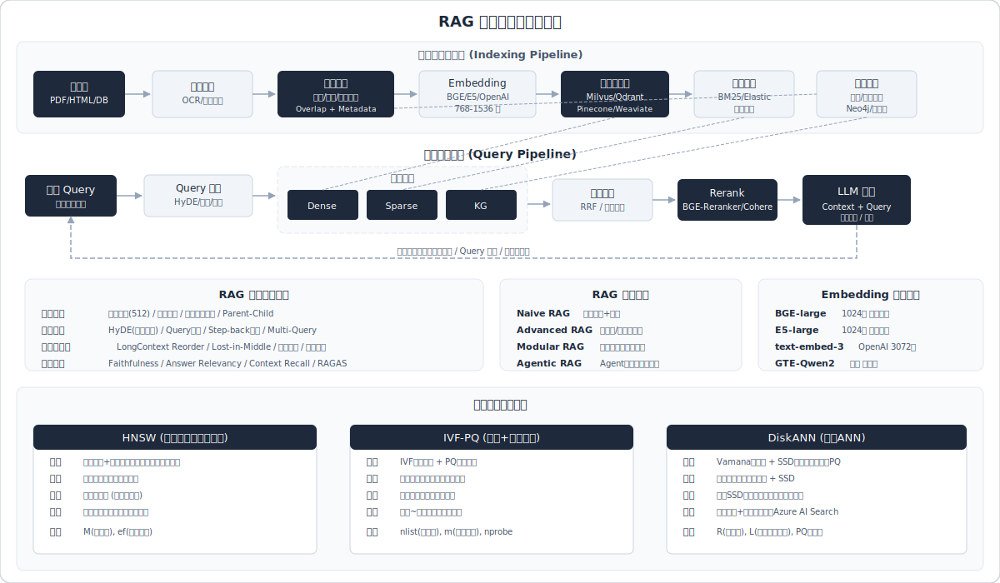

# RAG 系统设计与优化



> 面试高频指数：⭐⭐⭐⭐⭐（几乎所有大模型/Agent岗位必考，覆盖率极高）

## 概述

RAG（Retrieval-Augmented Generation，检索增强生成）是当前大模型落地最核心的技术方案之一，面试中从基础原理到工程落地全链路都会被考察。2025-2026 春招中，RAG 系统与 Agent 框架并列为最热门技术方向，面试题库覆盖文档处理与检索（约40%）、知识图谱（约35%）、向量数据库与系统设计（约25%）。无论是算法岗还是工程岗，RAG 相关问题几乎是标配，深度从"说说 RAG 是什么"到"如何设计一个生产级 RAG 系统"层层递进。

---

## 高频面试题

### Q1: 什么是 RAG？它的核心架构是怎样的？
**考察点：** 基础概念与整体架构理解
**考察深度：** 基础

**答案要点：**
- RAG = Retrieval-Augmented Generation，结合"外部知识检索"与"大语言模型生成"的混合架构
- 核心流程：**用户Query → 检索器(Retriever)从知识库召回相关文档 → 将检索结果与Query拼接为Prompt → 生成器(Generator/LLM)基于上下文生成回答**
- 五大组件：**数据处理（文档解析/分块）→ 索引构建（Embedding/向量化）→ 检索（Retrieval）→ 重排序（Reranking）→ 生成（Generation）**
- 解决的核心问题：LLM 知识过时、幻觉（hallucination）、缺乏领域专业知识
- 优势：无需重新训练模型即可更新知识、可溯源、成本低于微调

**深入追问：**
- RAG 与 Fine-tuning(SFT) 的区别和适用场景分别是什么？
- RAG 系统的延迟瓶颈在哪里？如何优化？

> 相关来源：
> - [字节三面被问的RAG知识，面完直被夸](https://www.xiaohongshu.com/explore/66d5b4ce000000001d019290) - AI speaker | 641赞
> - [RAG 面试复习速通](https://www.xiaohongshu.com/explore/69a7a7e70000000022023f71) - 今天LOSS降了吗 | 498赞
> - [听劝，别在简历里继续写熟悉RAG了，穿帮！](https://www.xiaohongshu.com/explore/685becf3000000001703532d) - camellia | 441赞

---

### Q2: RAG 和 Fine-tuning 怎么选？各自的适用场景？
**考察点：** 技术选型判断力
**考察深度：** 基础

**答案要点：**
- **RAG 适用场景**：知识更新频繁、需要可溯源性、数据量有限不足以微调、需要多领域知识覆盖
- **Fine-tuning 适用场景**：特定任务格式/风格适配、需要模型内化领域能力、对延迟要求极高（不想多一次检索）
- **实际生产中常结合使用**：先 SFT 让模型适配任务格式，再用 RAG 补充实时知识
- RAG 成本更低、迭代更快，SFT 对底座模型能力提升更根本
- RAG 的知识更新只需更新知识库，SFT 需要重新训练

**深入追问：**
- 什么情况下 RAG + SFT 一起用效果最好？
- 如果预算有限，你会优先做哪个？

> 相关来源：
> - [听劝，别在简历里继续写熟悉RAG了，穿帮！](https://www.xiaohongshu.com/explore/685becf3000000001703532d) - camellia | 441赞
> - [RAG 面试复习速通](https://www.xiaohongshu.com/explore/69a7a7e70000000022023f71) - 今天LOSS降了吗 | 498赞

---

### Q3: 文档分块（Chunking）有哪些策略？如何选择合适的分块方案？
**考察点：** 数据预处理工程能力
**考察深度：** 进阶

**答案要点：**
- **固定大小分块（Fixed-size Chunking）**：按字符数/token数切分，加入overlap（如512 tokens，overlap 50 tokens），简单高效，适合格式统一的文本
- **递归字符分割（Recursive Character Splitting）**：按层级分隔符（\n\n → \n → 句号 → 空格）递归切分，LangChain 默认方案
- **语义分块（Semantic Chunking）**：基于 Embedding 相似度判断句子间的语义断点，在语义变化大的位置切分，保证块内语义一致性
- **文档结构感知分块**：利用标题、章节、段落等文档结构信息切分，适合 Markdown/HTML/PDF
- **Agentic Chunking**：用 LLM 判断每个句子是否属于当前块，更智能但成本高
- **关键参数**：chunk_size（块大小）、chunk_overlap（重叠区）、分块粒度直接影响召回质量
- **选择原则**：技术文档用结构感知 > 通用文本用语义分块 > 简单场景用固定大小

**深入追问：**
- chunk_size 设置太大或太小分别会有什么问题？
- 如何处理表格、图片等非文本内容的分块？
- 分块后如何保留上下文信息（如 Parent Document Retriever）？

> 相关来源：
> - [RAG系统里面最难搞定的是哪部分？](https://www.xiaohongshu.com/explore/690dc15f0000000005033345) - 大模型-瓦力 | 360赞
> - [大厂RAG项目必考面试题（实战干货）](https://www.xiaohongshu.com/explore/69626cee000000002200b688) - 小白 | 582赞

---

### Q4: Embedding 模型怎么选？有哪些主流选择？
**考察点：** 向量化技术选型
**考察深度：** 进阶

**答案要点：**
- **选型维度**：支持语言、最大输入长度、向量维度、检索精度（参考 MTEB 排行榜）、推理速度
- **主流中文模型**：
  - **BGE-M3**（智源）：多语言+多粒度+多功能（稠密/稀疏/多向量），支持 8192 tokens，一站式方案
  - **BGE-large-zh-v1.5**：中文专精，维度1024，速度快
  - **GTE**（阿里）：通义系列，多语言支持好
  - **M3E**：300W+指令微调数据，中英双语
  - **Jina Embeddings**：支持超长文本（8192 tokens）
- **英文/通用模型**：OpenAI text-embedding-3-large/small、Cohere Embed v3
- **关键考量**：是否需要多语言、文本长度分布、是否需要微调、成本（API vs 自部署）
- **微调策略**：用领域数据对 Embedding 模型做对比学习微调，可显著提升领域检索精度

**深入追问：**
- BGE-M3 的三种检索功能分别是什么？各有什么优劣？
- 如何评估 Embedding 模型在你业务场景下的效果？

> 相关来源：
> - [大厂RAG项目必考面试题（实战干货）](https://www.xiaohongshu.com/explore/69626cee000000002200b688) - 小白 | 582赞
> - [RAG 面试复习速通](https://www.xiaohongshu.com/explore/69a7a7e70000000022023f71) - 今天LOSS降了吗 | 498赞

---

### Q5: 密集检索、稀疏检索和混合检索分别是什么？为什么要用混合检索？
**考察点：** 检索策略核心原理
**考察深度：** 进阶

**答案要点：**
- **密集检索（Dense Retrieval）**：基于向量相似度（余弦相似度/内积），通过 Embedding 模型将 Query 和文档编码为稠密向量后计算相似性。**优势**：语义理解强，能匹配同义表达。**劣势**：对专有名词、精确关键词匹配弱
- **稀疏检索（Sparse Retrieval）**：基于关键词匹配，如 BM25/TF-IDF，文档表示为高维稀疏向量。**优势**：精确关键词匹配强、可解释性好、无需训练。**劣势**：无法理解语义相似性
- **混合检索（Hybrid Search）**：同时使用密集检索和稀疏检索，通过加权融合（如 RRF - Reciprocal Rank Fusion）合并结果。**典型权重**：向量 0.7 + 关键词 0.3（需根据场景调参）
- **为什么要混合**：单一检索方式各有盲区，混合检索能最大化召回率（Recall），实验证明混合查询在输入相同时提供最大的召回率
- **工程实现**：Elasticsearch（BM25）+ 向量数据库（Milvus/Weaviate），或使用原生支持混合检索的数据库

**深入追问：**
- RRF（Reciprocal Rank Fusion）的原理是什么？
- 如何确定密集和稀疏检索的权重比例？
- 除了 RRF，还有什么结果融合方法？

> 相关来源：
> - [面试官：RAG为啥得混合检索？](https://www.xiaohongshu.com/explore/68eb03810000000005038718) - AI芝士派学长 | 405赞
> - [假如面试被问：你是怎么做RAG的召回的？](https://www.xiaohongshu.com/explore/686bb6410000000010013701) - 向内林木聊AI | 892赞

---

### Q6: 面试官问"RAG 召回率低怎么办"，你怎么回答？
**考察点：** 全链路问题诊断与优化能力
**考察深度：** 深入

**答案要点：**
- **不要直接甩方案，先诊断问题出在哪个环节**：
  1. **数据层面**：文档解析是否完整（PDF/表格是否丢信息）、分块策略是否合理（块太大语义混杂、块太小丢上下文）、数据清洗是否充分
  2. **Embedding 层面**：模型是否匹配业务领域、是否需要微调、向量维度是否合适
  3. **索引层面**：索引类型选择（HNSW/IVF/Flat）、参数调优（nprobe、ef_search）
  4. **检索层面**：是否使用了混合检索、top-k 是否合适、是否有 Query 改写
  5. **重排序层面**：是否加了 Reranker、Reranker 模型效果如何
- **具体优化手段（按优先级）**：
  - 引入混合检索（密集+稀疏）
  - 添加 Query 改写（HyDE、多查询扩展）
  - 优化分块策略（语义分块、调整 chunk_size）
  - 添加 Reranker 模型
  - 微调 Embedding 模型
  - 使用 Parent Document Retriever（小块检索、大块返回）

**深入追问：**
- 如何量化定位是哪个环节导致的召回率低？
- 你在实际项目中优化召回率做了哪些事情？效果如何？

> 相关来源：
> - [面试问RAG召回率低怎么办，不要直接甩方案](https://www.xiaohongshu.com/explore/698b1c49000000001a0297d8) - AI研学社 | 329赞
> - [假如面试被问：你是怎么做RAG的召回的？](https://www.xiaohongshu.com/explore/686bb6410000000010013701) - 向内林木聊AI | 892赞
> - [沉浸式体验面试现场：RAG拷打](https://www.xiaohongshu.com/explore/690c8452000000000302e0f1) - 跟着扶安学AI | 735赞

---

### Q7: Query 改写有哪些方法？HyDE 是什么原理？
**考察点：** 高级检索优化技术
**考察深度：** 进阶

**答案要点：**
- **Query 改写的目的**：用户原始 Query 往往口语化、模糊、信息不完整，改写后能提升检索匹配度
- **主要方法**：
  - **HyDE（Hypothetical Document Embeddings）**：让 LLM 先根据 Query 生成一个"假设性答案"，用这个伪文档的 Embedding 去检索，弥补 Query 与 Document 之间的语义鸿沟。来自论文 "Precise Zero-Shot Dense Retrieval without Relevance Labels"
  - **多查询扩展（Multi-Query）**：用 LLM 将原始 Query 改写为多个不同角度的子查询，分别检索后合并结果，提高召回多样性
  - **Query2Doc**：类似 HyDE，但生成的是更完整的文档片段
  - **Step-back Prompting**：先让 LLM 生成一个更抽象/更高层次的问题，用高层问题检索更广泛的上下文
  - **Rewrite-Retrieve-Read**：LLM 先改写 Query，用改写后的 Query 检索，再基于检索结果生成回答
  - **子问题分解（Sub-question Decomposition）**：将复杂问题分解为多个子问题分别检索
- **HyDE 的局限**：生成的假设文档可能引入偏差，对事实性强的问题不太适用；增加一次 LLM 调用带来额外延迟

**深入追问：**
- HyDE 在什么场景下效果好/不好？
- 多查询扩展的结果如何去重和融合？

> 相关来源：
> - [面试官问：RAG如何进行Query改写？](https://www.xiaohongshu.com/explore/69afdb21000000000c0080c0) - AI大模型学习 | 268赞
> - [假如面试被问：你是怎么做RAG的召回的？](https://www.xiaohongshu.com/explore/686bb6410000000010013701) - 向内林木聊AI | 892赞

---

### Q8: Reranking（重排序）的原理和作用是什么？
**考察点：** 检索后优化技术
**考察深度：** 进阶

**答案要点：**
- **为什么需要 Reranking**：初次检索（召回）阶段追求高召回率（Recall），会返回较多候选文档（如 top-20），但其中可能包含不相关文档，且排序不够精确。Reranker 对候选文档精排，确保最相关的排在前面
- **Bi-Encoder vs Cross-Encoder**：
  - **Bi-Encoder**（召回阶段）：Query 和 Document 分别编码，速度快，适合大规模召回
  - **Cross-Encoder**（重排阶段）：将 Query 和 Document 拼接后联合编码，能捕捉细粒度交互关系，精度高但速度慢
- **典型流程**：Bi-Encoder 召回 top-20 → Cross-Encoder 重排 → 取 top-5 送入 LLM
- **主流 Reranker 模型**：
  - BGE-reranker（智源）：中文场景首选
  - Cohere Rerank：API 服务，效果好
  - cross-encoder/ms-marco-MiniLM：轻量级英文 reranker
  - Jina Reranker
- **评估指标**：MRR（Mean Reciprocal Rank）、MAP（Mean Average Precision）、NDCG（Normalized Discounted Cumulative Gain）

**深入追问：**
- Cross-Encoder 为什么比 Bi-Encoder 精度高？
- Reranker 的延迟开销如何优化？
- 除了模型 Reranking，还有哪些重排策略（如基于规则、基于 LLM）？

> 相关来源：
> - [沉浸式体验面试现场：RAG拷打](https://www.xiaohongshu.com/explore/690c8452000000000302e0f1) - 跟着扶安学AI | 735赞
> - [RAG 面试复习速通](https://www.xiaohongshu.com/explore/69a7a7e70000000022023f71) - 今天LOSS降了吗 | 498赞

---

### Q9: 什么是"Lost in the Middle"问题？如何解决？
**考察点：** LLM 长上下文处理能力理解
**考察深度：** 进阶

**答案要点：**
- **问题定义**：LLM 在处理长上下文时，对位于中间位置的信息注意力显著下降，呈现 U 型性能曲线 — 开头和结尾的信息利用率高，中间的信息容易被"遗忘"
- **来源**：Stanford & UC Berkeley 的研究论文 "Lost in the Middle: How Language Models Use Long Contexts"
- **影响**：相关信息从首尾移到中间位置时，性能可下降 20-30 个百分点
- **根本原因**：Transformer 的注意力机制和位置编码（如 RoPE）导致的长程衰减效应
- **解决方案**：
  1. **关键信息放置策略**：将最相关的 chunk 放在上下文的开头或结尾
  2. **上下文压缩（Context Compression）**：使用 LLMLingua/LongLLMLingua 等工具压缩 prompt，减少无关 token
  3. **Reranking 后精选**：只保留最相关的少量文档（如 top-3-5），减少总上下文量
  4. **Map-Reduce 策略**：分批处理文档，每批生成摘要，再汇总
  5. **多步检索（Iterative Retrieval）**：分步检索，每步只处理少量上下文

**深入追问：**
- LongLLMLingua 是怎么做 prompt 压缩的？
- 长上下文模型（如 128k/1M context）能彻底解决这个问题吗？

> 相关来源：
> - [RAG系统里面最难搞定的是哪部分？](https://www.xiaohongshu.com/explore/690dc15f0000000005033345) - 大模型-瓦力 | 360赞
> - [字节三面被问的RAG知识，面完直被夸](https://www.xiaohongshu.com/explore/66d5b4ce000000001d019290) - AI speaker | 641赞

---

### Q10: 什么场景下必须用 GraphRAG 而不是传统 RAG？
**考察点：** 前沿技术判断力
**考察深度：** 深入

**答案要点：**
- **GraphRAG 核心原理**：将文档中的实体和关系构建为知识图谱（Knowledge Graph），检索时通过图遍历发现关联信息，而非单纯的向量相似度匹配
- **必须用 GraphRAG 的场景**：
  1. **多跳推理（Multi-hop Reasoning）**：问题的答案需要跨多个文档/段落关联推理，如"A公司的CEO毕业于哪所大学？"需要先找到CEO是谁，再找其教育背景
  2. **复杂关系查询**：涉及实体间复杂关系网络，如供应链分析、法律案例关联、医学知识图谱
  3. **全局性总结问题**：如"这个领域的主要研究方向有哪些？" — 需要对全局信息做聚合，传统 RAG 只能检索局部片段
  4. **结构化知识密集领域**：医疗、法律、金融等已有较完善知识体系的领域
- **GraphRAG vs 传统 RAG**：
  - 传统 RAG：平面文档结构 + 向量相似度搜索，适合单跳问答、事实查找
  - GraphRAG：图结构 + 图遍历算法，适合多跳推理、关系推理
- **GraphRAG 劣势**：图构建成本高（需要实体识别和关系抽取）、维护复杂、对简单问题过度设计
- **两者非替代关系而是互补**：可以结合使用，向量检索负责语义匹配，图检索负责关系推理

**深入追问：**
- GraphRAG 中知识图谱是怎么自动构建的？
- 微软的 GraphRAG 方案具体是怎么做的（community detection + summarization）？
- 图数据库选型考虑哪些因素（Neo4j vs NebulaGraph）？

> 相关来源：
> - [什么场景下必须用GraphRAG？而不是RAG？](https://www.xiaohongshu.com/explore/694ea503000000002200a69b) - 丁师兄大模型 | 352赞
> - [大厂RAG项目必考面试题（实战干货）](https://www.xiaohongshu.com/explore/69626cee000000002200b688) - 小白 | 582赞

---

### Q11: RAG 系统有哪些评估指标？如何科学评估一个 RAG 系统？
**考察点：** 系统评估方法论
**考察深度：** 进阶

**答案要点：**
- **评估框架**：RAGAS（最主流）、TruLens、DeepEval
- **核心指标（RAGAS 六大指标）**：
  1. **Faithfulness（忠实度）**：生成的回答是否忠于检索到的上下文，低分 → LLM 产生幻觉
  2. **Answer Relevancy（答案相关性）**：回答与用户问题的匹配程度，低分 → 回答跑题或冗余
  3. **Context Precision（上下文精度）**：检索到的文档中有多少是真正相关的，低分 → 检索噪声大
  4. **Context Recall（上下文召回）**：相关文档是否都被检索到了，低分 → 遗漏关键信息
  5. **Context Relevancy（上下文相关性）**：召回的上下文支持回答的程度
  6. **Answer Correctness（答案正确性）**：与标准答案的匹配度
- **分模块评估**：
  - 检索模块：Recall@K、Precision@K、MRR、NDCG、Hit Rate
  - 生成模块：Faithfulness、Answer Relevancy、BLEU/ROUGE（与参考答案对比）
- **评估方法**：LLM-as-a-Judge（用 GPT-4 等强模型做评判）、人工评估、自动化指标结合
- **端到端评估**：构建标准 QA 测试集（question + ground_truth + contexts），跑全链路打分

**深入追问：**
- 如何构建高质量的 RAG 评估数据集？
- LLM-as-a-Judge 有什么局限性？
- 线上环境如何持续监控 RAG 系统质量？

> 相关来源：
> - [大厂RAG项目必考面试题（实战干货）](https://www.xiaohongshu.com/explore/69626cee000000002200b688) - 小白 | 582赞
> - [面的985学妹，重点拷问了RAG项目](https://www.xiaohongshu.com/explore/670cc323000000002100105f) - 丁师兄大模型 | 319赞

---

### Q12: RAG 系统中常见的"幻觉"问题如何解决？
**考察点：** 生成质量优化
**考察深度：** 进阶

**答案要点：**
- **RAG 中幻觉的两种来源**：
  1. **检索失败导致**：没有检索到相关文档，LLM 基于自身知识"编造"答案
  2. **生成偏差导致**：检索到了正确文档，但 LLM 没有忠实使用，而是"自由发挥"
- **解决方案**：
  - **检索端**：提升召回率（混合检索、Query改写、Reranking），确保 LLM 能看到正确信息
  - **Prompt 端**：明确要求"仅根据提供的上下文回答，如果信息不足请说不知道"
  - **生成端**：降低 temperature、使用 Constrained Decoding
  - **后处理**：Faithfulness 检测（检查回答中的每个 claim 是否能在上下文中找到支持）
  - **引用溯源**：要求模型输出时标注引用来源（如 [1][2]），便于验证
  - **Self-RAG / CRAG**：让模型自己判断是否需要检索、检索结果是否有用、回答是否忠实

**深入追问：**
- Self-RAG 和 Corrective RAG(CRAG) 分别是什么原理？
- 如何自动化检测 RAG 系统的幻觉率？

> 相关来源：
> - [沉浸式体验面试现场：RAG拷打](https://www.xiaohongshu.com/explore/690c8452000000000302e0f1) - 跟着扶安学AI | 735赞
> - [字节三面被问的RAG知识，面完直被夸](https://www.xiaohongshu.com/explore/66d5b4ce000000001d019290) - AI speaker | 641赞

---

### Q13: 如何设计一个生产级的 RAG 系统？需要考虑哪些方面？
**考察点：** 系统设计与工程能力
**考察深度：** 深入

**答案要点：**
- **数据处理层**：
  - 多格式文档解析（PDF、Word、HTML、Markdown），推荐使用 Unstructured.io / PyPDF / Docling
  - 数据清洗（去重、去噪、标准化）
  - 智能分块（根据文档类型选择分块策略）
  - 元数据提取与标注（来源、时间、类别等）
- **索引层**：
  - 向量数据库选型（Milvus/Weaviate/Qdrant/Pinecone/Chroma）
  - 索引策略（HNSW 适合高精度、IVF 适合大规模）
  - 倒排索引（Elasticsearch）用于关键词检索
- **检索层**：
  - 混合检索（向量 + BM25）
  - Query 改写与扩展
  - Reranking
- **生成层**：
  - Prompt 工程（系统提示、上下文格式化、引用要求）
  - 模型选型（大模型生成质量 vs 小模型成本/延迟）
- **工程基础设施**：
  - 缓存（语义缓存，相似 Query 复用结果）
  - 监控与告警（延迟、错误率、质量指标）
  - 安全（Prompt Injection 防护、输入校验、权限管控）
  - 可扩展性（分片、多副本、异步处理）

**深入追问：**
- 你的 RAG 系统 QPS 是多少？是怎么优化延迟的？
- 如何做多租户隔离？
- 如何实现知识库的增量更新？

> 相关来源：
> - [大厂RAG项目必考面试题（实战干货）](https://www.xiaohongshu.com/explore/69626cee000000002200b688) - 小白 | 582赞
> - [RAG系统里面最难搞定的是哪部分？](https://www.xiaohongshu.com/explore/690dc15f0000000005033345) - 大模型-瓦力 | 360赞
> - [字节三面被问的RAG知识，面完直被夸](https://www.xiaohongshu.com/explore/66d5b4ce000000001d019290) - AI speaker | 641赞

---

### Q14: Parent Document Retriever 和 Small-to-Big 策略是什么？


**考察点：** 高级检索架构设计
**考察深度：** 深入

**答案要点：**
- **核心思想**：分块检索和上下文提供使用不同粒度 — 用小块做检索（精确匹配），返回大块做上下文（信息完整）
- **Parent Document Retriever**：
  - 将文档切成大块（Parent Chunk，如 2000 tokens）
  - 大块再切成小块（Child Chunk，如 200 tokens）
  - 检索时匹配小块（精确度高），返回时给 LLM 的是小块所属的大块（上下文完整）
  - 解决了"块太小丢上下文"与"块太大匹配不精确"的矛盾
- **Small-to-Big Retrieval**：
  - 类似原理：先用小粒度检索定位，再扩展到大粒度上下文
  - 可以结合句子级别检索 + 段落/章节级别上下文返回
- **Sentence Window Retrieval**：
  - 检索匹配到某个句子后，自动扩展返回其前后 N 个句子作为上下文窗口
- **实现方式**：在索引中维护 child → parent 的映射关系，或存储句子在原文中的位置偏移量

**深入追问：**
- 这种策略对向量数据库有什么额外要求？
- 如何确定 parent chunk 和 child chunk 的最优大小？

> 相关来源：
> - [假如面试被问：你是怎么做RAG的召回的？](https://www.xiaohongshu.com/explore/686bb6410000000010013701) - 向内林木聊AI | 892赞
> - [RAG系统里面最难搞定的是哪部分？](https://www.xiaohongshu.com/explore/690dc15f0000000005033345) - 大模型-瓦力 | 360赞

---

### Q15: RAG 系统如何处理多模态文档（表格、图片、PDF）？
**考察点：** 非结构化数据处理能力
**考察深度：** 深入

**答案要点：**
- **PDF 解析挑战**：排版复杂、多栏布局、扫描件 OCR、嵌入图表
  - 工具选型：PyMuPDF、Unstructured.io、Docling（IBM）、LlamaParse
  - 高级方案：多模态模型（GPT-4V/Qwen-VL）直接理解 PDF 页面截图
- **表格处理**：
  - 将表格转为 Markdown/HTML 格式后分块，保留结构信息
  - 或为表格生成自然语言摘要，用摘要做检索
  - Text2SQL 方案：将表格数据存入数据库，用 NL2SQL 查询
- **图片处理**：
  - 多模态 Embedding（如 CLIP）将图片向量化
  - 用多模态 LLM 生成图片描述文本，再用文本 Embedding 检索
- **混合索引策略**：为不同类型的内容建立不同的索引，检索时路由到对应索引

**深入追问：**
- 你项目中 PDF 解析遇到过什么坑？怎么解决的？
- 多模态检索的评估指标有哪些特殊考虑？

> 相关来源：
> - [RAG系统里面最难搞定的是哪部分？](https://www.xiaohongshu.com/explore/690dc15f0000000005033345) - 大模型-瓦力 | 360赞
> - [大厂RAG项目必考面试题（实战干货）](https://www.xiaohongshu.com/explore/69626cee000000002200b688) - 小白 | 582赞

---

### Q16: 向量数据库怎么选？不同向量数据库的优劣？
**考察点：** 基础设施选型能力
**考察深度：** 进阶

**答案要点：**
- **主流选择**：
  - **Milvus**：开源、高性能、支持多种索引（HNSW/IVF/DiskANN）、适合大规模生产，Go+C++实现
  - **Weaviate**：原生支持混合检索、GraphQL API、模块化架构
  - **Qdrant**：Rust 实现、性能优秀、支持过滤检索、易部署
  - **Pinecone**：全托管云服务、零运维、适合快速上线，但成本高
  - **Chroma**：轻量级、适合原型开发和小规模场景
  - **FAISS**（Meta）：库而非数据库，适合研究和嵌入到应用中
- **选型维度**：数据规模、QPS 要求、是否需要混合检索、是否需要过滤、部署方式（自建/云服务）、成本
- **索引类型**：
  - **Flat**：精确搜索，小数据集用
  - **IVF**：倒排文件索引，适合大规模，需要训练
  - **HNSW**：图索引，查询快但内存占用高
  - **DiskANN**：磁盘索引，适合超大规模低成本

**深入追问：**
- HNSW 的 ef_construction 和 ef_search 参数含义？
- 如何在召回精度和查询速度之间取得平衡？

> 相关来源：
> - [大厂RAG项目必考面试题（实战干货）](https://www.xiaohongshu.com/explore/69626cee000000002200b688) - 小白 | 582赞
> - [RAG 面试复习速通](https://www.xiaohongshu.com/explore/69a7a7e70000000022023f71) - 今天LOSS降了吗 | 498赞

---

### Q17: RAG 正在被 Agent 改写，这句话怎么理解？
**考察点：** 技术趋势判断
**考察深度：** 深入

**答案要点：**
- **传统 RAG 的局限**：固定流水线（Retrieve → Generate），无法根据检索结果动态调整策略
- **Agentic RAG 的核心思想**：将 RAG 的各个环节（Query 分析、检索策略选择、结果判断、是否需要再次检索）交给 Agent 动态决策
- **关键能力**：
  - **自适应检索**：Agent 判断是否需要检索、需要检索什么、从哪里检索
  - **迭代检索**：第一次检索不够好 → 自动改写 Query 再检索
  - **工具调用**：Agent 可以调用多种检索工具（向量搜索、知识图谱、SQL 查询、Web 搜索）
  - **结果评估**：Agent 自行评估检索结果质量，决定是否需要补充检索
- **代表方案**：Self-RAG、CRAG（Corrective RAG）、Adaptive RAG
- **本质**：从"固定流水线"到"智能决策循环"的转变

**深入追问：**
- Agentic RAG 和传统 RAG 在延迟和成本上有什么权衡？
- 你怎么看 RAG 和 Agent 的融合趋势？

---

### Q18: RAG 系统里面最难搞定的是哪部分？
**考察点：** 实战经验与工程深度
**考察深度：** 深入

**答案要点：**
- **数据处理（公认最难）**：
  - 真实世界的文档格式千奇百怪（扫描 PDF、复杂表格、多语言混排）
  - "Garbage In, Garbage Out" — 数据质量直接决定 RAG 上限
  - 数据清洗、格式转换、分块策略调优占据 70% 以上的工程时间
- **检索质量调优**：
  - 召回率和精确率的平衡难以一次到位
  - 不同类型的 Query 需要不同的检索策略，难以用一套方案覆盖
- **评估与迭代**：
  - 缺乏标准化的评估体系
  - Bad case 分析和针对性优化是持续的工作
  - 线上效果与离线评估的 gap
- **多文档拼接的语义边界问题**：
  - 多个检索到的 chunk 拼接后可能上下文断裂
  - LLM 可能误将不同文档的信息混淆
- **生产环境的稳定性**：延迟波动、数据更新时效、多租户隔离

**深入追问：**
- 你在项目中遇到最棘手的问题是什么？怎么解决的？
- 如何系统性地做 Bad Case 分析？

---

### Q19: 向量数据库深入对比 — Milvus vs Qdrant vs Weaviate vs Chroma vs Pinecone 怎么选？

**考频：高** | 来源：面试高频基础设施选型题

### 答题框架

**一、核心对比表格**

| 维度 | Milvus | Qdrant | Weaviate | Chroma | Pinecone |
|------|--------|--------|----------|--------|----------|
| **语言** | Go + C++ | Rust | Go | Python | 闭源云服务 |
| **部署方式** | 自建/Zilliz Cloud | 自建/Qdrant Cloud | 自建/Weaviate Cloud | 嵌入式/自建 | 全托管SaaS |
| **数据规模** | 亿级+（分布式） | 千万~亿级 | 千万~亿级 | 百万级 | 亿级（云端） |
| **索引类型** | HNSW/IVF/DiskANN/FLAT/ScaNN | HNSW | HNSW/FLAT | HNSW | 专有索引 |
| **混合检索** | v2.5 起原生 BM25 | 支持稀疏向量 | 原生 BM25+向量 | 支持 metadata filter | 支持稀疏向量 |
| **过滤检索** | 标量过滤 + 表达式 | Payload 过滤（先过滤后搜索） | GraphQL 过滤 | metadata 过滤 | metadata 过滤 |
| **多租户** | Partition Key | Collection + Payload | 多租户原生支持 | 需自行实现 | Namespace |
| **分布式架构** | 完整分布式（Proxy/Index/Data/Query Node） | 分布式分片+复制 | 多节点复制 | 不支持 | 全托管 |
| **社区生态** | CNCF 毕业项目，生态最丰富 | 增长最快，集成简便 | GraphQL 友好 | LangChain 默认 | 商用生态好 |
| **适用场景** | 企业级大规模生产 | 中小规模高性能 | 语义搜索/推荐 | 原型开发/小规模 | 快速上线零运维 |

**二、选型决策树**

1. **快速原型/学习** → Chroma（Python 嵌入式，开箱即用）
2. **中小规模生产（<1000万向量）** → Qdrant（Rust 高性能，部署简单，API 设计优雅）
3. **需要原生混合检索** → Weaviate（BM25+向量原生融合）或 Milvus 2.5+
4. **大规模生产（亿级向量）** → Milvus（分布式架构成熟，索引类型丰富）
5. **零运维/快速商用** → Pinecone（全托管，按用量付费）

**三、关键性能指标参考（千万级数据集）**

- Milvus：QPS 可达数千，P99 延迟 < 100ms，支持亿级向量水平扩展
- Qdrant：单节点 100-400 QPS（2000万向量），延迟 < 100ms
- Weaviate：混合检索场景延迟略高但召回质量好

**四、分布式架构深入（以 Milvus 为例）**

- **Proxy Node**：接入层，负责请求路由和负载均衡
- **Index Node**：负责索引构建（CPU/GPU 加速）
- **Data Node**：负责数据写入和持久化到对象存储（MinIO/S3）
- **Query Node**：负责向量搜索，加载索引到内存
- **元数据管理**：etcd 存储 Schema 和集群元信息
- **消息队列**：Pulsar/Kafka 实现写入解耦和日志持久化
- **对象存储**：MinIO/S3 存储原始数据和索引文件

### 速记

> **"Chroma 做原型，Qdrant 轻部署，Weaviate 混合搜，Milvus 大规模，Pinecone 零运维"** -- 五大数据库一句话选型

> 相关来源：
> - [大厂RAG项目必考面试题（实战干货）](https://www.xiaohongshu.com/explore/69626cee000000002200b688) - 小白 | 582赞
> - [RAG 面试复习速通](https://www.xiaohongshu.com/explore/69a7a7e70000000022023f71) - 今天LOSS降了吗 | 498赞
> - [面试时被问到"为什么需要混合检索？向量检索"](https://www.xiaohongshu.com/explore/68e7b4e40000000007036753) - 王月半子 | 185赞

---

### Q20: ANN 近似最近邻算法与向量索引类型详解 — HNSW、IVF、DiskANN 的原理和选择？

**考频：高** | 来源：向量数据库底层原理必考题

### 答题框架

**一、为什么需要 ANN（Approximate Nearest Neighbor）？**

- 精确最近邻（KNN）在高维空间复杂度为 O(N*D)，百万级数据不可接受
- ANN 用近似换速度，Recall@10 通常可达 95%+ 同时查询耗时降低 100x+
- 核心权衡：**召回率（Recall） vs 查询速度（QPS） vs 内存占用（Memory）**

**二、主流索引类型详解**

**1. HNSW（Hierarchical Navigable Small World）**
- **原理**：构建多层跳表式图结构。底层包含所有节点，每一层是下层的子集。搜索从最高层的入口点开始，贪心地跳到离查询最近的节点，然后下降到下一层继续搜索，直到底层找到最近邻
- **关键参数**：
  - `M`：每个节点的最大连接数（一般 16-64），M 越大精度越高但内存越大
  - `ef_construction`：构建时搜索宽度（一般 100-500），影响索引质量
  - `ef_search`：查询时搜索宽度（一般 64-512），影响查询精度和速度
- **优势**：查询速度极快（毫秒级）、精度高、无需训练
- **劣势**：内存占用大（索引需全部载入 RAM）、构建速度慢
- **适用场景**：数据量 < 数千万、对精度和延迟要求高、内存充足

**2. IVF（Inverted File Index）系列**
- **IVF-Flat**：
  - 用 K-Means 将向量聚为 `nlist` 个簇，查询时只搜索最近的 `nprobe` 个簇内的向量
  - 精度接近暴力搜索，但速度快很多
  - 关键参数：`nlist`（簇数，一般 sqrt(N)~4*sqrt(N)）、`nprobe`（查询探测簇数）
- **IVF-PQ（Product Quantization）**：
  - 在 IVF 基础上加入乘积量化压缩：将高维向量切成 `m` 个子空间，每个子空间独立做 K-Means 量化（一般量化为 8-bit）
  - **内存节省巨大**：768维 float32 (3KB) → PQ 压缩后可降至几十字节
  - 适合十亿级数据，以精度换空间
  - 关键参数：`m`（子空间数）、`nbits`（量化位数）
- **适用场景**：数据量大、内存受限、可接受一定精度损失

**3. DiskANN**
- **原理**：微软提出，专为磁盘存储设计的图索引算法（Vamana 算法）。构建单层图（不同于 HNSW 的多层），通过精心设计的图连接策略减少磁盘随机读取次数
- **核心优势**：索引可存储在 SSD 上，仅需少量内存存储压缩的导航图（PQ 压缩版本在内存中），实际向量存储在磁盘
- **性能**：在索引无法全部载入内存时，性能远优于 HNSW
- **适用场景**：超大规模数据集（十亿级+）、内存受限但有 SSD

**4. ScaNN（Scalable Nearest Neighbors，Google）**
- 各向异性向量量化（Anisotropic Vector Quantization），在量化时考虑不同方向的重要性
- 在精度-速度 trade-off 上优于 IVF-PQ
- Google 内部大规模使用，开源实现可用

**5. Flat（暴力搜索）**
- 100% 精确的 KNN，无近似
- 适合小数据集（< 10 万）或作为精度基准线

**三、选型对比表**

| 索引 | 内存占用 | 查询速度 | 召回精度 | 构建速度 | 适合规模 |
|------|---------|---------|---------|---------|---------|
| Flat | 低（原始向量） | 慢 | 100% | 无需构建 | < 10万 |
| HNSW | 高（图+原始向量） | 极快 | 极高(>98%) | 慢 | 百万~千万 |
| IVF-Flat | 中 | 快 | 高(>95%) | 中 | 千万 |
| IVF-PQ | 极低 | 快 | 中高(>90%) | 中 | 亿级 |
| DiskANN | 极低（SSD） | 中快 | 高(>95%) | 中 | 十亿+ |
| ScaNN | 低~中 | 极快 | 高 | 中 | 亿级 |

**四、生产调优要点**

- HNSW：优先调 `ef_search`（查询精度）和 `M`（内存 vs 精度权衡）
- IVF：`nprobe` 是最关键参数，一般从 `nlist` 的 5%-10% 开始调
- 混合策略：先 IVF 粗排 → 再 HNSW 精排（部分系统支持）
- 索引预热：生产环境需预加载索引到内存，避免冷启动延迟

### 速记

> **"HNSW 图快准、IVF 倒排省、PQ 量化压、DiskANN 盘上跑"** -- 四大索引一句话记忆

> 相关来源：
> - [大厂RAG项目必考面试题（实战干货）](https://www.xiaohongshu.com/explore/69626cee000000002200b688) - 小白 | 582赞
> - [字节后端实习agent一面](https://www.xiaohongshu.com/explore/69b3a4a20000000021007dbe) - Friday.. | 412赞
> - [2026大模型Agent面试全攻略（上）](https://www.xiaohongshu.com/explore/69ad4bb9000000000d00a454) - AI实战领航员 | 527赞

---

### Q21: 多路召回与融合排序 — RRF、线性加权等融合算法怎么选？


**考频：高** | 来源：混合检索核心考点

### 答题框架

**一、多路召回架构**

多路召回（Multi-way Recall）是指同时使用多种检索策略从不同维度召回候选文档，再通过融合算法合并结果。常见多路召回包括：

- **路1：密集向量检索**（Embedding 相似度）— 语义匹配
- **路2：稀疏检索/BM25**（关键词匹配）— 精确匹配
- **路3：知识图谱检索**（图遍历）— 关系推理
- **路4：结构化查询**（SQL/ES 过滤）— 元数据过滤
- **路5：Web 搜索**（搜索引擎 API）— 实时信息补充

**二、融合排序算法详解**

**1. RRF（Reciprocal Rank Fusion，倒数排名融合）**

最常用的融合方法，核心思想是**只看排名不看分数**：

```
RRF_score(d) = Σ 1/(k + rank_i(d))
```

- `k`：常数，通常取 60（原论文推荐值），用于平滑排名差异
- `rank_i(d)`：文档 d 在第 i 路检索结果中的排名（从 1 开始）
- **优势**：对不同检索系统的分数量纲不敏感（不需要归一化）、实现简单、鲁棒性强
- **劣势**：无法利用原始相关性分数的信息，所有路等权重

**示例**：文档 A 在向量检索排第 1、BM25 排第 3：
- RRF_score = 1/(60+1) + 1/(60+3) = 0.0164 + 0.0159 = 0.0323

**2. 线性加权融合（Weighted Sum）**

```
Final_score(d) = α * score_dense(d) + (1-α) * score_sparse(d)
```

- 需要先对各路分数做归一化（Min-Max 或 Z-score）
- 权重 α 通常需要在验证集上调参，典型值：向量 0.7 + BM25 0.3
- **优势**：可以利用原始分数信息、可以为不同路设置不同权重
- **劣势**：对分数归一化敏感、需要调参

**3. 基于学习的融合（Learning to Rank）**

- 用机器学习模型（如 LambdaMART、XGBoost）对多路召回特征做排序
- 特征包括：各路排名、各路分数、文档特征、Query 特征
- 需要标注数据训练，效果最好但成本最高

**三、工程实现要点**

- **Elasticsearch 8.x + kNN**：原生支持 BM25 + 向量混合，内置 RRF
- **Milvus 2.5**：原生 BM25 支持，可在一个查询中做混合检索
- **Weaviate**：`hybrid` 搜索参数 `alpha` 控制向量 vs BM25 权重
- **去重策略**：多路召回的结果可能重叠，需按文档 ID 去重后再融合

**四、选型建议**

- 默认首选 RRF（无需调参、鲁棒）
- 如果有标注数据且对效果要求极高 → Learning to Rank
- 如果各路检索的分数分布差异大 → 加权融合（需要调参）
- 生产环境建议先 RRF 上线，后续用 A/B 测试验证加权融合是否有增益

### 速记

> **"RRF 看排名不看分，加权融合要归一化，LTR 效果好但贵"** -- 三种融合算法核心差异

> 相关来源：
> - [面试官：RAG为啥得混合检索？](https://www.xiaohongshu.com/explore/68eb03810000000005038718) - AI芝士派学长 | 405赞
> - [假如面试被问：你是怎么做RAG的召回的？](https://www.xiaohongshu.com/explore/686bb6410000000010013701) - 向内林木聊AI | 892赞
> - [面试时被问到"为什么需要混合检索？向量检索"](https://www.xiaohongshu.com/explore/68e7b4e40000000007036753) - 王月半子 | 185赞

---

### Q22: GraphRAG 深入 — 微软 GraphRAG 的具体实现方案是怎样的？


**考频：中** | 来源：前沿技术深入考察

### 答题框架

**一、微软 GraphRAG 的核心流程**

微软于 2024 年开源的 GraphRAG 方案，核心思路是 **"先建图，再社区检测，最后分层摘要"**：

1. **实体与关系抽取（Entity & Relation Extraction）**：
   - 用 LLM 从每个文档块中抽取实体（人名、组织、概念等）和实体间关系
   - 生成三元组：(实体A, 关系, 实体B)

2. **知识图谱构建（Knowledge Graph Construction）**：
   - 将所有三元组合并为全局知识图谱
   - 相同实体做消歧合并（Entity Resolution）

3. **社区检测（Community Detection）**：
   - 用 Leiden 算法对图做分层社区检测
   - 将紧密关联的实体聚为社区（类似"主题聚类"）
   - 形成多层级的社区层次结构

4. **社区摘要生成（Community Summarization）**：
   - 用 LLM 为每个社区生成自然语言摘要
   - 从底层社区到高层社区递归摘要
   - 高层社区摘要反映全局信息

5. **查询时检索**：
   - **Local Search（局部搜索）**：根据 Query 匹配相关实体 → 扩展邻居 → 召回相关社区摘要 + 原文
   - **Global Search（全局搜索）**：利用高层社区摘要回答全局性问题（如"数据集的主要主题有哪些？"）

**二、GraphRAG vs 传统 RAG 适用场景判断**

| 问题类型 | 传统 RAG | GraphRAG |
|---------|---------|----------|
| "张三的职位是什么？" | 适合（单跳事实） | 过度设计 |
| "张三团队中谁参与了项目X？" | 困难（多跳） | 适合 |
| "这个领域的研究趋势是什么？" | 困难（全局总结） | 适合（Global Search） |
| "A公司和B公司有什么合作关系？" | 困难（关系推理） | 适合 |

**三、GraphRAG 的局限与优化**

- **构建成本高**：大量 LLM 调用做实体抽取和摘要，token 消耗可达原文的 10-100 倍
- **实时性差**：知识更新需要重新建图
- **优化方向**：增量图更新、用小模型替代 LLM 做抽取、混合使用向量 RAG + Graph RAG
- **替代方案**：LightRAG（更轻量）、nano-GraphRAG（极简实现）

### 速记

> **"抽实体、建图谱、分社区、做摘要 — 四步构建 GraphRAG"** -- 微软 GraphRAG 核心流程

> 相关来源：
> - [什么场景下必须用GraphRAG？而不是RAG？](https://www.xiaohongshu.com/explore/694ea503000000002200a69b) - 丁师兄大模型 | 352赞
> - [大厂RAG项目必考面试题（实战干货）](https://www.xiaohongshu.com/explore/69626cee000000002200b688) - 小白 | 582赞
> - [自己整理的Agent/RAG学习笔记分享7](https://www.xiaohongshu.com/explore/69c35d93000000001b001370) - MorningRainn | 461赞

---

### Q23: Agentic RAG — 什么是自适应检索？Self-RAG 和 CRAG 的原理是什么？


**考频：高** | 来源：2025-2026 面试热点前沿

### 答题框架

**一、Agentic RAG 的核心思想**

传统 RAG 是固定流水线（Query → Retrieve → Generate），Agentic RAG 引入 Agent 的自主决策能力，让 RAG 系统"会思考"：

- **是否需要检索**：简单问题直接回答，不做无效检索
- **检索什么**：自动改写 Query、选择检索源
- **检索结果够不够好**：自动评估检索质量，不够好则重新检索
- **答案是否忠实**：自动检查生成是否忠于检索结果

**二、Self-RAG（自反思 RAG）**

来自论文 "Self-RAG: Learning to Retrieve, Generate, and Critique through Self-Reflection"：

- **核心机制**：在生成过程中插入特殊的**反思 Token**，让模型自己判断：
  1. **[Retrieve]**：当前是否需要检索？（Yes/No/Continue）
  2. **[IsRel]**：检索到的段落是否与 Query 相关？（Relevant/Irrelevant）
  3. **[IsSup]**：生成的内容是否被检索段落支持？（Fully/Partially/No Support）
  4. **[IsUse]**：最终回答是否有用？（1-5分）
- **训练方式**：用 GPT-4 标注反思 Token 的训练数据，然后微调 LLM 学会输出这些判断
- **优势**：按需检索减少延迟、自我纠错减少幻觉
- **劣势**：需要微调模型，不适用于闭源 API

**三、CRAG（Corrective RAG，纠正式 RAG）**

来自论文 "Corrective Retrieval Augmented Generation"：

- **核心机制**：在检索后增加一个**评估器**判断检索质量：
  1. **Correct（正确）**：检索文档相关 → 做知识精炼（去除冗余）→ 正常生成
  2. **Incorrect（不正确）**：检索文档不相关 → 触发 Web 搜索补充 → 用外部知识生成
  3. **Ambiguous（模糊）**：不确定 → 同时使用检索文档和 Web 搜索结果
- **知识精炼**：将检索文档分解为条状知识（knowledge strips），逐条评估相关性，去除噪声
- **优势**：不需要微调模型，可用于任何 LLM
- **劣势**：增加额外评估步骤的延迟

**四、Adaptive RAG（自适应 RAG）**

- 引入**查询复杂度分类器**，根据 Query 难度选择策略：
  - **简单查询**：直接用 LLM 回答，无需检索
  - **中等查询**：单步检索 + 生成
  - **复杂查询**：多步迭代检索（iterative retrieval）
- 减少简单问题的不必要检索，对复杂问题投入更多计算资源

**五、对比总结**

| 方案 | 核心创新 | 是否需要微调 | 检索策略 |
|------|---------|------------|---------|
| 传统 RAG | 固定流水线 | 否 | 每次都检索 |
| Self-RAG | 反思 Token | 是 | 按需检索 |
| CRAG | 检索评估+纠正 | 否 | 检索+评估+补充 |
| Adaptive RAG | 复杂度分类 | 否（分类器） | 按复杂度调整 |

### 速记

> **"Self-RAG 自己判断要不要检索，CRAG 检索完再判断结果好不好，Adaptive RAG 先判断问题难不难"** -- 三种 Agentic RAG 的核心区别

> 相关来源：
> - [沉浸式体验面试现场：RAG拷打](https://www.xiaohongshu.com/explore/690c8452000000000302e0f1) - 跟着扶安学AI | 735赞
> - [字节三面被问的RAG知识，面完直被夸](https://www.xiaohongshu.com/explore/66d5b4ce000000001d019290) - AI speaker | 641赞
> - [如何系统性地评估一个 RAG 项目的效果？](https://www.xiaohongshu.com/explore/69bcc298000000001b0037dc) - 予枫与时 | 185赞

---

### Q24: RAG 评估实战 — 如何用 RAGAS 框架做端到端评估？

**考频：高** | 来源：生产落地必考

### 答题框架

**一、RAGAS 框架评估全流程**

RAGAS（Retrieval Augmented Generation Assessment）是最主流的 RAG 评估框架，核心流程：

1. **构建评估数据集**：
   - 格式：`{question, ground_truth, contexts, answer}`
   - 来源：人工标注、LLM 合成（用 `TestsetGenerator`）、历史日志
   - 建议规模：至少 50-100 条覆盖不同类型的问题

2. **检索模块评估**（独立于生成）：
   - **Context Precision**：检索结果中相关文档排在前面的比例（越高越好）
   - **Context Recall**：标准答案中的关键信息是否都被检索到了（越高越好）
   - 低 Precision → 检索噪声大，需要加 Reranker 或优化索引
   - 低 Recall → 遗漏关键信息，需要优化 Embedding 或分块策略

3. **生成模块评估**（独立于检索）：
   - **Faithfulness**：回答中的每个 claim 是否能在 context 中找到支撑（检测幻觉）
   - **Answer Relevancy**：回答是否切题（低分 = 跑题或冗余）
   - **Answer Correctness**：与标准答案的语义相似度

4. **端到端评估**：跑全套指标，生成雷达图，快速定位薄弱环节

**二、评估驱动的优化闭环**

```
离线评估 → 定位薄弱环节 → 针对性优化 → 重新评估 → 上线 A/B 测试 → 线上监控
```

- Faithfulness 低 → Prompt 优化（约束只用 context 回答）
- Context Recall 低 → 优化检索（混合检索、Query 改写）
- Context Precision 低 → 加 Reranker、优化分块
- Answer Relevancy 低 → 优化 Prompt 模板、调整 temperature

**三、LLM-as-a-Judge 的注意事项**

- 评估用的 LLM 应比被评估的 LLM 更强（如用 GPT-4 评估 GPT-3.5 的输出）
- 存在位置偏差（Position Bias）和长度偏差（Verbosity Bias）
- 建议：LLM 评估 + 人工抽样校验（10%-20%）结合使用
- 核心指标的评估者间一致性（Inter-annotator Agreement）需达到 Cohen's Kappa > 0.6

**四、线上监控指标**

- 用户反馈率（点赞/踩比例）
- 检索命中率（检索结果是否被引用）
- 回答延迟（P50/P95/P99）
- Token 消耗趋势
- 幻觉率（通过 Faithfulness 自动监控）

### 速记

> **"Precision 看噪声、Recall 看遗漏、Faithfulness 看幻觉、Relevancy 看跑题"** -- RAGAS 四大指标速记

> 相关来源：
> - [面试官问：RAG 的评估体系怎么做？](https://www.xiaohongshu.com/explore/693a6305000000001f00bb69) - 闭眼拿下大模型offer | 165赞
> - [如何系统性地评估一个 RAG 项目的效果？](https://www.xiaohongshu.com/explore/69bcc298000000001b0037dc) - 予枫与时 | 185赞
> - [面的985学妹，重点拷问了RAG项目](https://www.xiaohongshu.com/explore/670cc323000000002100105f) - 丁师兄大模型 | 319赞

---

### Q25: 生产环境 RAG 系统的常见问题与调优实战

**考频：高** | 来源：工程落地能力考察

### 答题框架

**一、延迟优化**

- **问题**：RAG 端到端延迟 = Embedding 编码 + 向量检索 + Reranking + LLM 生成，生产环境要求 P95 < 3s
- **优化手段**：
  1. **语义缓存**：相似 Query 复用结果（用向量相似度判断是否命中缓存，阈值 > 0.95）
  2. **异步并行**：多路召回并行执行，Reranking 与 Prompt 构造并行
  3. **流式输出**：LLM 生成部分用 Streaming，首字延迟 < 500ms
  4. **索引预热**：生产环境启动时预加载索引到内存
  5. **小模型 Reranker**：用蒸馏版 Cross-Encoder 替代大模型 Reranker

**二、数据更新时效**

- **增量更新**：新文档 → 解析分块 → Embedding → 写入向量数据库（不影响在线服务）
- **版本管理**：用 Collection Alias 实现蓝绿切换（新旧索引无缝切换）
- **删除处理**：标记删除 + 定期 Compaction，避免删除操作影响查询性能
- **元数据标记**：每条向量附带时间戳和版本号，支持按时间范围过滤

**三、多租户与权限隔离**

- **方案一**：每个租户独立 Collection（隔离性强，但资源消耗大）
- **方案二**：Partition Key 分区（Milvus 推荐，性能和隔离性平衡）
- **方案三**：元数据过滤（最灵活但安全性较弱，需在查询层严格校验）
- **权限控制**：API 层 RBAC + 向量查询层强制注入租户 ID 过滤条件

**四、成本控制**

- **Embedding 调用优化**：批量编码、缓存已编码文档的向量、增量更新而非全量重建
- **LLM 调用优化**：压缩 Context（只保留最相关的 top-3 chunks）、使用更便宜的小模型处理简单问题
- **向量存储优化**：使用 PQ 量化减少存储、冷数据归档到低成本存储
- **典型成本构成**：Embedding 计算 20% + 向量存储 10% + LLM 生成 60% + 基础设施 10%

**五、常见 Bad Case 与解决**

| Bad Case | 根因 | 解决方案 |
|----------|------|---------|
| 回答"我不知道"但文档中有答案 | 检索未命中 | Query 改写 + 混合检索 |
| 回答正确但引用了错误的来源 | 引用标注逻辑错误 | 修复引用匹配算法 |
| 回答编造了不存在的信息 | LLM 幻觉 | 降 temperature + Faithfulness 检查 |
| 不同时间问同一问题回答不一致 | 非确定性输出 | temperature=0 + 语义缓存 |
| 回答过于冗长或跑题 | Prompt 约束不足 | 明确输出格式要求 + 长度限制 |

### 速记

> **"缓存降延迟、增量保时效、分区做隔离、压缩控成本"** -- 生产 RAG 四大调优方向

> 相关来源：
> - [字节面试官怒怼："你的 RAG 系统召回了一堆"](https://www.xiaohongshu.com/explore/69b01fd50000000006009df3) - 闭眼拿下大模型offer | 209赞
> - [RAG系统里面最难搞定的是哪部分？](https://www.xiaohongshu.com/explore/690dc15f0000000005033345) - 大模型-瓦力 | 360赞
> - [项目中如何使用RAG？](https://www.xiaohongshu.com/explore/69ac6e480000000015020df2) - Offer面试官 | 198赞

---

## 快速记忆框架

### RAG 优化全链路 Checklist

```
数据层：  文档解析 → 数据清洗 → 智能分块 → 元数据标注
索引层：  Embedding选型 → 向量数据库 → 索引类型 → 混合索引
检索层：  Query改写 → 混合检索 → 过滤/路由 → Top-K调参
后处理层：Reranking → 上下文压缩 → 去重 → 信息放置策略
生成层：  Prompt工程 → 温度调参 → 引用溯源 → 幻觉检测
评估层：  RAGAS指标 → Bad Case分析 → A/B测试 → 持续监控
```

### RAG vs GraphRAG 速记

| 维度 | 传统 RAG | GraphRAG |
|------|---------|----------|
| 数据结构 | 平面文档/向量 | 知识图谱（节点+边） |
| 检索方式 | 向量相似度 | 图遍历 + 向量 |
| 擅长问题 | 单跳问答、事实查找 | 多跳推理、关系查询 |
| 构建成本 | 低 | 高（需实体/关系抽取） |
| 适用领域 | 通用 | 医疗/法律/金融等结构化知识领域 |

### Query 改写方法速记

| 方法 | 一句话原理 |
|------|-----------|
| HyDE | LLM 先生成假设答案，用答案 Embedding 去检索 |
| Multi-Query | 同一问题改写为多个角度的子查询 |
| Step-back | 先问更抽象的上位问题 |
| Sub-question | 复杂问题拆解为多个子问题 |
| Query2Doc | 生成伪文档片段辅助检索 |

---

## 相关笔记来源

以下小红书笔记与本主题高度相关，可作为补充阅读：

- [892赞] 假如面试被问：你是怎么做RAG的召回的？
- [735赞] 沉浸式体验面试现场：RAG拷打
- [641赞] 字节三面被问的RAG知识，面完直被夸
- [582赞] 大厂RAG项目必考面试题（实战干货）
- [498赞] RAG 面试复习速通
- [441赞] 听劝，别在简历里继续写熟悉RAG了，穿帮！
- [426赞] RAG正在被Agent改写
- [405赞] 面试官：RAG 为啥得混合检索？
- [360赞] RAG系统里面最难搞定的是哪部分？
- [352赞] 什么场景下必须用GraphRAG？而不是RAG？
- [329赞] 面试问RAG召回率低怎么办，不要直接甩方案
- [319赞] 面的985学妹，重点拷问了RAG项目
- [268赞] 面试官问：RAG如何进行Query改写？

---

## 参考资料

- [28个RAG面试高频问题解析 - CSDN](https://blog.csdn.net/huang9604/article/details/159117232)
- [面试官狂问的28个RAG问题全解析 - 知乎](https://zhuanlan.zhihu.com/p/1970073271211919256)
- [Top 30 RAG Interview Questions - DataCamp](https://www.datacamp.com/blog/rag-interview-questions)
- [100+ RAG Interview Questions - GitHub](https://github.com/KalyanKS-NLP/RAG-Interview-Questions-and-Answers-Hub)
- [RAG查询改写方案汇总 - 知乎](https://zhuanlan.zhihu.com/p/26631768854)
- [RAG优化之混合检索与重排序 - 知乎](https://zhuanlan.zhihu.com/p/8742833294)
- [万字长文整理RAG评估指标 - 知乎](https://zhuanlan.zhihu.com/p/717985736)
- [2025年末RAG技术全景总结 - 知乎](https://zhuanlan.zhihu.com/p/1987561705794986878)
- [RAG vs GraphRAG Systematic Evaluation - arXiv](https://arxiv.org/abs/2502.11371)
- [Enhancing RAG Pipelines with Re-Ranking - NVIDIA](https://developer.nvidia.com/blog/enhancing-rag-pipelines-with-re-ranking/)
- [Finding the Best Chunking Strategy - NVIDIA](https://developer.nvidia.com/blog/finding-the-best-chunking-strategy-for-accurate-ai-responses/)
- [Building Production RAG 2026 Guide](https://blog.premai.io/building-production-rag-architecture-chunking-evaluation-monitoring-2026-guide/)
- [深度解析影响RAG召回率的四大支柱 - 博客园](https://www.cnblogs.com/knqiufan/p/18968146)
