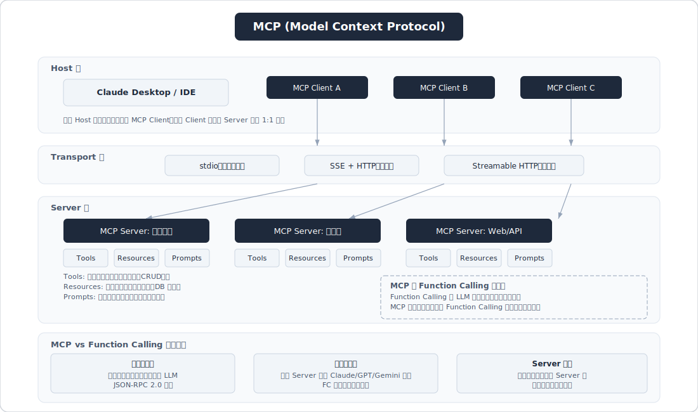
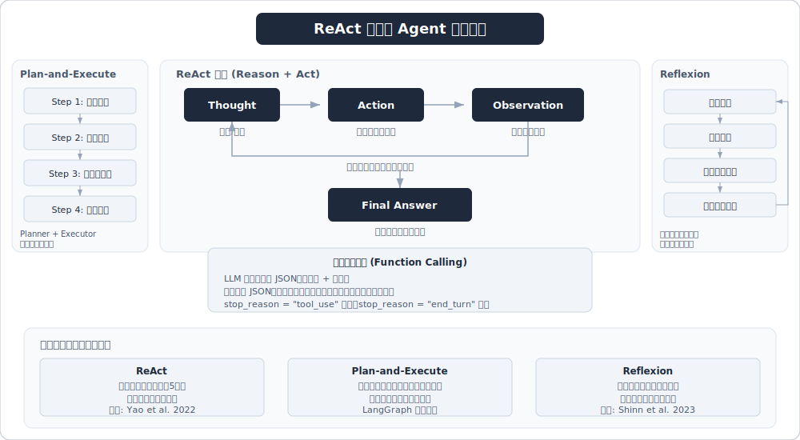
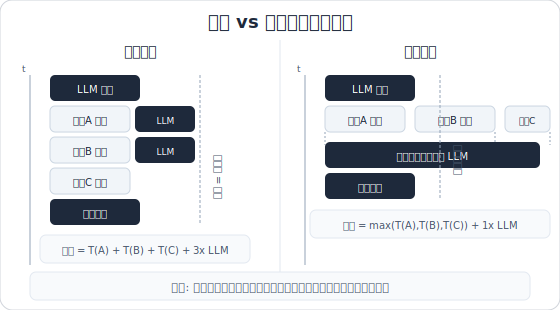

# Agent 架构与设计模式

> 面试高频指数：⭐⭐⭐⭐⭐





## 概述

Agent（智能体）是基于大语言模型（LLM）的自主系统，能够感知环境、进行推理规划、调用工具执行动作，并通过反馈循环迭代完成复杂任务。Agent 不是单纯的"对话机器人"，而是具备**自主决策能力**的任务执行系统。2026 年春招中，Agent 相关考点占比极高，涵盖理论框架（30%）、LangChain/LangGraph 实战（40%）、Multi-Agent 协作与 MCP 协议（30%）。

核心公式：**Agent = LLM（大脑） + Memory（记忆） + Planning（规划） + Tools（工具） + Action（执行）**

## 高频面试题

### Q1: LLM 和 Agent 到底有什么本质区别？
**考察点：** 概念理解、系统设计思维
**难度：** 基础
**答案要点：**
- **LLM 是"大脑"，Agent 是"完整的人"**：LLM 提供语言理解和生成能力，但不能独立执行操作；Agent 以 LLM 为核心，增加了规划、记忆、工具使用和自主性层
- **被动 vs 主动**：LLM 是被动系统，需要用户提示才生成响应；Agent 可以自主运行，设定目标后能在无人干预下做出决策
- **单轮 vs 多轮循环**：LLM 处理单次输入输出；Agent 有反馈循环，能检查结果、自我纠正、迭代执行直到目标完成
- **文本生成 vs 任务执行**：LLM 生成信息，Agent 完成工作——更新记录、发送消息、调用 API、触发流程
- **无状态 vs 有状态**：LLM 本身无记忆（靠上下文窗口），Agent 有短期记忆（当前对话）和长期记忆（向量数据库/知识图谱）

**深入追问：**
- 什么场景用 LLM 就够了，什么场景必须用 Agent？（输出只是文本选 LLM，需要多步骤协调和系统变更选 Agent）
- Agent 的 LLM 可以替换吗？如何做到框架与模型解耦？

> 相关来源：
> - [面试官问：LLM和Agent到底有什么本质区别](https://www.xiaohongshu.com/explore/69465bdb000000001f00a05f) - 大模型-瓦力 | 141赞
> - [关于什么是Agent、如何构建Agent，一文尽览](https://www.xiaohongshu.com/explore/676d5639000000000902eb7b) - AI Dance | 2260赞

---

### Q2: Agent 的核心组件有哪些？请详细说明每个模块的作用
**考察点：** 架构设计、模块化思维
**难度：** 基础
**答案要点：**
- **感知模块（Perception）**：从环境获取和解释数据，包括 NLP 处理用户输入、API 读取外部数据、计算机视觉处理图像等
- **认知/推理模块（Reasoning Engine）**：Agent 的"大脑"，通常由 LLM 担任，负责解释信息、设定目标、生成计划，将复杂任务拆解为可管理的子任务
- **规划模块（Planning）**：构建达成目标的行动序列，向前看多步以预测后果和依赖关系。包括任务分解、优先级排序、依赖管理
- **记忆模块（Memory）**：维持跨交互的上下文。短期记忆追踪当前任务上下文，长期记忆作为知识库（向量存储、知识图谱）
- **工具模块（Tools）**：Agent 可调用的外部能力集合，如搜索引擎、数据库、代码执行器、API 等
- **执行模块（Action/Execution）**：将推理结果转化为实际操作，紧密耦合"想"和"做"

**深入追问：**
- 这些模块之间如何通信？数据流是怎样的？
- 如果要增加一个"自我反思"模块，应该放在架构的哪个位置？

> 相关来源：
> - [面试官：搭建AI AGENT需要哪几个模块？](https://www.xiaohongshu.com/explore/68522038000000002202b665) - 24小时搬砖的黎同学 | 951赞
> - [关于什么是Agent、如何构建Agent，一文尽览](https://www.xiaohongshu.com/explore/676d5639000000000902eb7b) - AI Dance | 2260赞

---

### Q3: 什么是 ReAct 模式？请详细解释其工作原理
**考察点：** Agent 推理框架、核心范式理解
**难度：** 基础
**答案要点：**
- **定义**：ReAct（Reasoning + Acting）由 Yao 等人 2023 年提出，将链式思维（CoT）推理与外部工具使用结合
- **核心循环**：Thought（思考）→ Action（行动）→ Observation（观察），不断迭代
  - **Thought**：模型分析当前状态，决定下一步该做什么（推理）
  - **Action**：执行具体操作，如调用 API、搜索、计算（行动）
  - **Observation**：获取行动结果，作为下一次思考的输入（反馈）
- **终止条件**：每次循环后 Agent 判断是否已获得足够信息来回答问题，如果是则输出最终答案，否则继续循环
- **优势**：
  - 相比纯 CoT，能与外部工具交互获取真实信息，减少幻觉
  - 思考过程可见，提高可解释性和可信度
  - 在语言和决策任务上优于多个 SOTA 基线
- **实现方式**：通过 Prompt Engineering 将 Thought/Action/Observation 格式注入提示词，引导 LLM 按此模式输出

**深入追问：**
- ReAct 的 Prompt 模板是怎样的？如何设计 few-shot 示例？
- ReAct 有什么局限性？（容易陷入循环、对简单任务效率低、依赖 LLM 的推理质量）

> 相关来源：
> - [除了ReAct范式，Agent还有什么新架构？](https://www.xiaohongshu.com/explore/69670ffa000000000d009de2) - 丁师兄大模型 | 318赞
> - [2026大模型Agent面试全攻略（上）](https://www.xiaohongshu.com/explore/69ad4bb9000000000d00a454) - AI实战领航员 | 478赞

---

### Q4: Plan-and-Execute 模式与 ReAct 有什么区别？各自适用什么场景？


**考察点：** 架构对比、场景选型
**难度：** 进阶
**答案要点：**
- **核心区别**：
  - ReAct 是"边想边做"，一次只处理一步，每步都要 LLM 推理
  - Plan-and-Execute 是"先想后做"，先生成完整计划，再逐步执行
- **Plan-and-Execute 三大组件**：
  - **Planner（规划器）**：将业务目标翻译为结构化的分步计划，选择工具、设置优先级
  - **Executor（执行器）**：逐步执行计划，调用 API、更新系统、验证结果
  - **Replanner（重规划器）**：根据实际执行结果和反馈调整计划
- **Plan-and-Execute 优势**：
  - 整体方法更可预测（计划预先生成）
  - LLM 调用次数更少（主要推理在规划阶段）
  - 多步工作流完成更快，计算成本更低
- **场景选型**：
  - ReAct：探索性任务、信息不确定需要动态调整、简单的问答+工具调用
  - Plan-and-Execute：有明确步骤的复杂任务、多步工作流、需要全局规划的场景

**深入追问：**
- Plan-and-Execute 中如果某一步执行失败，Replanner 如何处理？
- 能否将两种模式混合使用？（可以，Plan 阶段用 Plan-and-Execute，每步执行时用 ReAct）

> 相关来源：
> - [除了ReAct范式，Agent还有什么新架构？](https://www.xiaohongshu.com/explore/69670ffa000000000d009de2) - 丁师兄大模型 | 318赞
> - [2026大模型Agent面试全攻略（上）](https://www.xiaohongshu.com/explore/69ad4bb9000000000d00a454) - AI实战领航员 | 478赞

---

### Q5: 除了 ReAct 和 Plan-and-Execute，还有哪些 Agent 架构/设计模式？
**考察点：** 知识广度、技术前沿
**难度：** 进阶
**答案要点：**
- **Reflexion（自我反思）**：Agent 执行后进行自我评估和反思，从失败中学习改进策略。包含 Actor、Evaluator、Self-Reflection 三个角色
- **Tree of Thoughts（思维树）**：将推理过程组织为树状结构，探索多条推理路径，支持回溯和剪枝
- **LATS（Language Agent Tree Search）**：结合蒙特卡洛树搜索（MCTS）与 LLM，在推理空间中进行高效搜索
- **Self-Ask**：Agent 自问自答，将复杂问题分解为子问题，逐个解决后汇总
- **Function Calling 模式**：直接利用 LLM 的 Function Calling 能力（如 OpenAI 的工具调用），LLM 输出结构化的函数调用请求
- **Router 模式**：根据输入类型路由到不同的专家 Agent 或处理链
- **Supervisor 模式**：一个"主管" Agent 协调管理多个子 Agent

**深入追问：**
- Reflexion 和 ReAct 可以结合吗？怎么结合？
- 在实际项目中如何选择合适的架构模式？

> 相关来源：
> - [除了ReAct范式，Agent还有什么新架构？](https://www.xiaohongshu.com/explore/69670ffa000000000d009de2) - 丁师兄大模型 | 318赞
> - [2026大模型Agent面试全攻略（上）](https://www.xiaohongshu.com/explore/69ad4bb9000000000d00a454) - AI实战领航员 | 478赞
> - [2026大模型Agent面试全攻略（下）](https://www.xiaohongshu.com/explore/69b4f22b000000002300777d) - AI实战领航员 | 162赞

---

### Q6: Function Calling / Tool Calling 的实现原理是什么？


**考察点：** 工具调用机制、工程实现
**难度：** 进阶
**答案要点：**
- **基本流程**：
  1. **工具定义**：将可用工具以 JSON Schema 格式描述（函数名、参数、描述），注册到 LLM
  2. **用户提问**：用户发送请求，连同工具定义一起发给 LLM
  3. **LLM 推理**：模型判断是否需要调用工具，如果需要则输出结构化的工具调用请求（函数名 + 参数 JSON）
  4. **工具执行**：应用层解析 LLM 输出，调用对应函数/API，获取结果
  5. **结果返回**：将工具执行结果作为新的消息发回 LLM
  6. **最终响应**：LLM 基于工具结果生成自然语言回答
  - 步骤 3-6 通常在循环中执行（可能需要多次工具调用）
- **OpenAI 实现**：通过 `tools` 参数传入工具定义，模型返回 `tool_calls` 字段，包含函数名和参数
- **关键设计要点**：
  - 工具描述的质量直接影响调用准确率（清晰的函数名、详细的参数说明）
  - 需要做参数校验和错误处理
  - 支持并行工具调用（parallel function calling）
  - 需要防止工具注入攻击

**深入追问：**
- 如何保证 LLM 生成的参数格式正确？（JSON Mode、结构化输出、Pydantic 校验）
- 如何让 Agent 稳定输出结构化结果？（System Prompt 约束 + Few-shot 示例 + 输出格式校验 + 重试机制）

> 相关来源：
> - [Agent开发如何让大模型稳定输出结构化结果](https://www.xiaohongshu.com/explore/69b259a40000000022022450) - AI研学社 | 577赞
> - [面试官最爱问的大模型×Agent面试题清单](https://www.xiaohongshu.com/explore/691ebfc6000000001d03eb87) - 极客时间 | 522赞

---

### Q7: Agent Loop（Agent 循环）和状态管理如何实现？
**考察点：** 工程实现、系统设计
**难度：** 进阶
**答案要点：**
- **Agent Loop 基本结构**：
  ```
  while not done:
      observation = perceive(environment)
      thought = llm.reason(observation, memory, goal)
      action = select_action(thought)
      result = execute(action)
      memory.update(result)
      done = check_termination(result, goal)
  ```
- **状态管理要素**：
  - **对话历史**：维护 messages 列表，包含用户输入、LLM 输出、工具调用及结果
  - **任务状态**：当前执行到哪一步、已完成的子任务、待执行的子任务
  - **中间结果**：每次工具调用的结果需要持久化存储
  - **全局上下文**：跨多次循环共享的变量和状态
- **LangGraph 的状态管理**：使用 TypedDict 或 Pydantic 定义 State，每个节点读取和更新 State，通过 Checkpointer 支持状态持久化和恢复
- **终止条件设计**：
  - 达到最大循环次数（防止无限循环）
  - LLM 判断任务完成
  - 遇到不可恢复的错误
  - 用户主动中断

**深入追问：**
- 如何防止 Agent 陷入无限循环？
- 如果 Agent 执行中途崩溃，如何从断点恢复？（LangGraph 的 Checkpointer 机制）

> 相关来源：
> - [字节跳动Agent开发一面](https://www.xiaohongshu.com/explore/69b4daa5000000001b020dc1) - K1ra | 1755赞
> - [字节agent开发实习一面](https://www.xiaohongshu.com/explore/69aa551f0000000028021738) - 我会成为传奇耐面王吗 | 1016赞

---

### Q8: 如何设计 Agent 的记忆机制？


**考察点：** 记忆架构、知识管理
**难度：** 进阶
**答案要点：**
- **记忆分层架构**：
  - **工作记忆（Working Memory）**：当前任务的上下文窗口，即 LLM 的 context window 中的内容
  - **短期记忆（Short-term Memory）**：当前会话的对话历史，任务结束后可清除
  - **长期记忆（Long-term Memory）**：跨会话持久化的知识，存储在向量数据库/知识图谱中
  - **情景记忆（Episodic Memory）**：过去任务的经验和教训，用于 few-shot 或经验检索
- **实现技术**：
  - 短期记忆：消息列表 + 滑动窗口/摘要压缩
  - 长期记忆：Embedding + 向量数据库（FAISS/Chroma/Milvus）进行相似度检索
  - 知识图谱：结构化的实体关系存储，支持精确查询
- **记忆管理策略**：
  - 上下文窗口超长时：摘要压缩、重要信息提取、滑动窗口
  - 记忆检索：根据当前任务语义检索相关历史记忆
  - 记忆更新：新经验写入，旧经验衰减或合并
- **OpenClaw 四层记忆参考**：感知层 → 工作记忆层 → 长期记忆层 → 元认知层

**深入追问：**
- 当上下文窗口不够时，如何压缩记忆又不丢失关键信息？
- 如何评估记忆检索的准确性？

> 相关来源：
> - [面试官问：如何设计Agent记忆机制？](https://www.xiaohongshu.com/explore/69a55587000000001b015dcd) - AI大模型开发 | 2428赞
> - [面试官：Agent如何突破上下文窗口上限？](https://www.xiaohongshu.com/explore/69a94265000000001b017833) - AI大模型开发 | 1190赞
> - [拆解OpenClaw四层记忆！Agent八股降维打击](https://www.xiaohongshu.com/explore/69b9686f000000001a0288e4) - 不转到大模型不改名 | 693赞

---

### Q9: 多 Agent 系统有哪些协作模式？


**考察点：** 多 Agent 架构、协调机制
**难度：** 进阶
**答案要点：**
- **主要协作模式**：
  - **Supervisor（主管模式）**：一个中心 Agent 分配任务、协调子 Agent、汇总结果。优点是控制集中、易于管理；缺点是中心 Agent 成为瓶颈
  - **Handoff（交接模式）**：Agent 之间直接传递控制权，当前 Agent 判断需要其他专业能力时交给下一个 Agent。如 OpenAI Swarm 框架
  - **Router（路由模式）**：根据输入类型将请求路由到最合适的专家 Agent
  - **Swarm（群体模式）**：去中心化的多 Agent 协作，Agent 之间点对点通信
  - **Debate（辩论模式）**：多个 Agent 对同一问题发表不同观点，通过辩论达成共识
  - **Pipeline（流水线模式）**：Agent 按固定顺序串联执行，上一个的输出是下一个的输入
- **多 Agent 系统五大核心要素**：环境、画像（角色定义）、通信、协作、演进
- **通信机制**：共享消息总线、直接消息传递、黑板系统（Blackboard）、发布-订阅模式
- **典型应用**：软件开发（PM Agent + 开发 Agent + 测试 Agent）、科研辩论、客服系统路由

**深入追问：**
- 多 Agent 之间如何避免死锁和冲突？
- Supervisor 模式中，主管 Agent 本身的推理能力不够怎么办？
- 如何评估多 Agent 系统的整体效果？

> 相关来源：
> - [大模型春招模拟面试多Agent之间是怎么协作](https://www.xiaohongshu.com/explore/69b7c7a60000000020038c80) - 跟着扶安学AI | 243赞
> - [2026大模型Agent面试全攻略（上）](https://www.xiaohongshu.com/explore/69ad4bb9000000000d00a454) - AI实战领航员 | 478赞

---

### Q10: Agent 与 Workflow 有什么区别？如何选择？
**考察点：** 概念辨析、架构选型
**难度：** 进阶
**答案要点：**
- **Workflow（工作流）**：
  - 预定义的固定流程，步骤和分支在编码时确定
  - 确定性强，可预测，易于调试
  - 适合流程明确、规则清晰的场景
  - LangChain 中的 Chain 就是典型的 Workflow
- **Agent（智能体）**：
  - 由 LLM 动态决定执行路径和工具选择
  - 灵活性强，能处理未预见的情况
  - 不确定性高，调试困难，成本更高
  - 适合开放性任务、需要动态决策的场景
- **Anthropic 的建议**：能用 Workflow 解决的就不要用 Agent，Agent 的不确定性会增加系统复杂度
- **混合方案**：在 Workflow 的某些节点嵌入 Agent 能力，既保证整体流程可控，又在需要灵活性的节点保留动态决策能力
- **LangGraph 的做法**：将 Agent 工作流建模为图结构，节点可以是确定性的（Workflow）也可以是 LLM 驱动的（Agent），边支持条件路由

**深入追问：**
- 如何将一个 Agent 系统逐步"硬化"为 Workflow？
- 在生产环境中如何平衡灵活性和可控性？

> 相关来源：
> - [都写AI Agent，怎么拉开技术差距？](https://www.xiaohongshu.com/explore/699e9c3c000000002602f901) - 小傅哥 | 709赞
> - [构建Agent就是调用大模型API？](https://www.xiaohongshu.com/explore/6964b8a1000000000b00ba19) - AI研学社 | 446赞

---

### Q11: 常见 Agent 框架对比（LangChain / LangGraph / AutoGen / CrewAI）
**考察点：** 框架选型、技术广度
**难度：** 进阶
**答案要点：**

| 框架 | 核心特点 | 适用场景 | 优劣势 |
|------|---------|---------|--------|
| **LangChain** | 链式调用，模块化组件丰富 | 简单线性工作流，快速原型 | 生态丰富但复杂，线性流程为主 |
| **LangGraph** | 有状态图结构，支持循环和分支 | 复杂多步骤 Agent、需要状态管理的场景 | 支持循环和持久化，学习曲线陡 |
| **AutoGen（微软）** | 多 Agent 对话框架，Agent 间自然语言通信 | 多 Agent 协作、代码生成与执行 | 多 Agent 开箱即用，但定制性受限 |
| **CrewAI** | 角色扮演式多 Agent，强调角色分工 | 团队协作模拟、复杂业务流程 | 上手简单，但灵活性不如 LangGraph |
| **OpenAI Swarm** | 轻量级多 Agent 框架，Handoff 机制 | Agent 间职责交接场景 | 简洁优雅，但功能较基础 |
| **Dify/Coze** | 低代码 Agent 平台 | 快速搭建、非技术人员使用 | 易用但定制性有限 |

- **选型原则**：任务线性用 LangChain，状态复杂用 LangGraph，多 Agent 用 AutoGen/CrewAI，快速验证用 Dify/Coze
- **LangGraph 核心概念**：节点（Node）= 计算单元，边（Edge）= 转换逻辑，State = 共享状态，Checkpointer = 状态持久化

**深入追问：**
- LangGraph 的 State 是如何在节点间传递的？
- 如何在生产中选择框架？需要考虑哪些因素？（性能、可维护性、社区活跃度、模型兼容性）

> 相关来源：
> - [国内几个Agent平台对比](https://www.xiaohongshu.com/explore/69827cc8000000002102a2a2) - Offer面试官 | 239赞
> - [关于什么是Agent、如何构建Agent，一文尽览](https://www.xiaohongshu.com/explore/676d5639000000000902eb7b) - AI Dance | 2260赞

---

### Q12: Agent 的失败处理与重试机制如何设计？
**考察点：** 系统健壮性、工程实践
**难度：** 深入
**答案要点：**
- **常见失败类型**：
  - LLM 输出格式错误（JSON 解析失败）
  - 工具调用失败（API 超时、参数错误）
  - Agent 陷入循环（反复执行相同操作）
  - 推理偏离（Agent 偏离原始目标）
  - Token 超限（上下文窗口溢出）
- **重试策略**：
  - **输出格式错误**：将错误信息反馈给 LLM，要求重新生成；使用 JSON Mode 或 Structured Output 强制格式
  - **工具调用失败**：指数退避重试（Exponential Backoff），设置最大重试次数；失败后换用备选工具
  - **循环检测**：记录历史动作序列，检测重复模式；设置最大步数限制
  - **推理偏离**：引入自我反思步骤（Reflexion），定期检查是否偏离目标；使用 Guardrail 限制行为范围
- **错误恢复**：
  - LangGraph Checkpointer：保存每步状态，支持从断点恢复
  - 回退机制（Fallback）：主路径失败时切换到备用路径
  - 人工介入（Human-in-the-loop）：关键步骤或不确定时请求人类确认
- **监控告警**：记录每步的输入输出、耗时、Token 用量，异常时触发告警

**深入追问：**
- 如何设计一个通用的 Agent 错误处理中间件？
- 在生产环境中如何做到 Agent 的可观测性（Observability）？

> 相关来源：
> - [美团AI Agent开发工程师面经](https://www.xiaohongshu.com/explore/688d81180000000025016420) - 求职青年 | 693赞
> - [字节后端Agent中台一面凉](https://www.xiaohongshu.com/explore/699c2762000000000e00fbb7) - 老夏聊编程 | 473赞

---

### Q13: 如何让 Agent 稳定输出结构化结果？
**考察点：** 输出控制、工程实践
**难度：** 进阶
**答案要点：**
- **Prompt 层面**：
  - System Prompt 中明确输出格式要求（JSON Schema、XML 等）
  - 提供 Few-shot 示例，展示期望的输出格式
  - 使用分隔符标记结构化输出区域
- **模型层面**：
  - 使用 OpenAI 的 JSON Mode（`response_format={"type": "json_object"}`）
  - 使用 Structured Output（基于 JSON Schema 强制约束输出格式）
  - 使用 Instructor / Outlines 等库强制结构化输出
- **后处理层面**：
  - Pydantic 模型验证：定义数据模型，解析和校验 LLM 输出
  - 正则表达式提取：从自由文本中提取结构化信息
  - 重试机制：校验失败时将错误信息附上，要求 LLM 重新生成
- **最佳实践**：三层防线 = Prompt 引导 + 模型约束 + 后处理校验

**深入追问：**
- 不同模型对结构化输出的支持差异？
- 如何处理模型输出的"幻觉"内容混入结构化字段？

> 相关来源：
> - [Agent开发如何让大模型稳定输出结构化结果](https://www.xiaohongshu.com/explore/69b259a40000000022022450) - AI研学社 | 577赞
> - [招Agent的开始问这些了](https://www.xiaohongshu.com/explore/688e2ff80000000023020191) - 凡人小北 | 918赞

---

### Q14: 搭建一个完整的 AI Agent 需要哪几个模块？（系统设计题）
**考察点：** 系统设计、全局架构
**难度：** 深入
**答案要点：**
- **完整 Agent 系统架构**：
  1. **用户接口层**：接收用户输入，返回结果（Web/API/CLI）
  2. **意图理解模块**：解析用户需求，识别任务类型
  3. **规划模块**：任务分解、制定执行计划、依赖分析
  4. **推理引擎（LLM）**：核心推理能力，支持多模型切换和 Fallback
  5. **工具注册与管理**：工具定义、发现、权限控制、版本管理
  6. **执行引擎**：工具调用、并行执行、超时管理、结果收集
  7. **记忆系统**：短期记忆（对话历史）+ 长期记忆（向量数据库）+ 经验记忆
  8. **状态管理**：任务状态追踪、检查点、断点恢复
  9. **安全与权限**：输入过滤、输出审查、工具调用权限控制、防注入
  10. **可观测性**：日志、指标、链路追踪（LangSmith/LangFuse）
- **设计原则**：
  - 模块化：各模块松耦合，可独立替换
  - 可扩展：工具和 Agent 可插拔
  - 可恢复：任何步骤失败都能优雅处理
  - 可观测：全链路追踪，方便调试和优化

**深入追问：**
- 如何设计工具注册中心？（类似 MCP 协议的思路）
- 如何做 Agent 的 A/B 测试和效果评估？

> 相关来源：
> - [面试官：搭建AI AGENT需要哪几个模块？](https://www.xiaohongshu.com/explore/68522038000000002202b665) - 24小时搬砖的黎同学 | 951赞
> - [阿里淘天AIAgent智能体开发，三轮技术面](https://www.xiaohongshu.com/explore/69a0f7e8000000002801c8cc) - 程序员峰哥 | 641赞

---

### Q15: 构建 Agent 就是调用大模型 API 吗？技术差距在哪？
**考察点：** 深度理解、工程能力
**难度：** 深入
**答案要点：**
- **调 API 只是最基础的一步**，真正的技术差距体现在：
  - **Prompt 工程**：如何设计系统提示词让 Agent 稳定、准确地完成任务
  - **工具编排**：工具选择策略、参数生成、结果解析、错误处理
  - **记忆管理**：高效的记忆检索、压缩、更新策略
  - **流程控制**：循环检测、超时处理、并发管理、死锁预防
  - **安全防护**：防 Prompt 注入、工具调用权限控制、输出审查
  - **性能优化**：Token 用量优化、延迟优化、缓存策略、并行调用
  - **评估体系**：如何量化 Agent 效果（成功率、步骤效率、用户满意度）
  - **可观测性**：全链路追踪，问题定位和根因分析
- **高级技术点**：
  - 动态工具发现与注册（MCP 协议）
  - 多 Agent 编排与协调
  - 人机协作（Human-in-the-loop）
  - Agent 自我进化（从经验中学习优化策略）
- **总结**：初级工程师会调 API，中级工程师会搭 Agent 框架，高级工程师会设计 Agent 系统（可靠性、可扩展性、可观测性）

**深入追问：**
- 你在项目中遇到过哪些 Agent 工程挑战？如何解决的？
- 如何衡量一个 Agent 系统的成熟度？

> 相关来源：
> - [构建Agent就是调用大模型API？](https://www.xiaohongshu.com/explore/6964b8a1000000000b00ba19) - AI研学社 | 446赞
> - [都写AI Agent，怎么拉开技术差距？](https://www.xiaohongshu.com/explore/699e9c3c000000002602f901) - 小傅哥 | 709赞
> - [Agent开发真的要又懂AI又懂后端吗](https://www.xiaohongshu.com/explore/68b0096b000000001c0106ca) - 女孩庄周 | 686赞

---

### Q16: MCP（Model Context Protocol）是什么？解决了什么问题？
**考察点：** 技术前沿、协议设计
**难度：** 进阶
**答案要点：**
- **定义**：MCP 是 Anthropic 提出的模型上下文协议，旨在标准化 LLM 与外部工具/数据源的连接方式
- **解决的问题**：
  - 工具集成碎片化：每个工具都需要单独的集成代码，MCP 提供统一接口
  - "N×M 问题"：N 个 Agent 框架 × M 个工具，需要 N×M 个适配器；MCP 降低为 N+M
  - 类比 USB 接口：为 AI 世界提供统一的"插口"标准
- **核心概念**：
  - MCP Server：工具提供方，暴露工具能力
  - MCP Client：Agent 端，发现和调用工具
  - 工具描述：标准化的工具能力描述格式
- **与 Function Calling 的关系**：Function Calling 是 LLM 层面的工具调用机制，MCP 是更上层的工具发现和管理协议

**深入追问：**
- MCP 和 Google 的 A2A（Agent-to-Agent）协议有什么区别？
- 如何自己实现一个 MCP Server？

> 相关来源：
> - [面试官：又看到个新词儿，让我来考考你](https://www.xiaohongshu.com/explore/69985617000000000a028daf) - 居丽叶 | 536赞
> - [2026大模型Agent面试全攻略（下）](https://www.xiaohongshu.com/explore/69b4f22b000000002300777d) - AI实战领航员 | 162赞

---

### Q17: 如何评估一个 Agent 系统的效果？
**考察点：** 评估方法、质量保证
**难度：** 深入
**答案要点：**
- **评估维度**：
  - **任务完成率**：Agent 能否正确完成目标任务
  - **步骤效率**：完成任务所需的平均步骤数/LLM 调用次数
  - **Token 消耗**：总 Token 用量，直接影响成本
  - **延迟**：端到端的响应时间
  - **工具调用准确率**：是否选对了工具、参数是否正确
  - **鲁棒性**：面对异常输入、工具失败时的表现
  - **一致性**：相同输入多次执行结果是否一致
- **评估方法**：
  - 构建 Benchmark 测试集（包含各种难度的任务）
  - 人工评估 + 自动评估（LLM-as-Judge）
  - 端到端测试 + 单元测试（每个工具/模块的测试）
  - A/B 测试对比不同架构/Prompt 策略的效果
- **关键指标**：成功率 > 95%、平均步骤数最小化、Token 成本在预算内、P99 延迟可接受

**深入追问：**
- 如何构建 Agent 的 CI/CD 流水线？
- 当 Agent 效果不好时，如何快速定位是哪个模块的问题？

> 相关来源：
> - [面试怎么讲？你的Agent效果咋样？](https://www.xiaohongshu.com/explore/688c564f000000002203b70e) - 亚慧AI产品经理 | 964赞
> - [AI产品经理面试必问：怎么评估一个Agent指标](https://www.xiaohongshu.com/explore/69b3f9550000000023023762) - AI产品果果姐 | 439赞

---

### Q18: 字节/快手等大厂 Agent 面试的高频实战题
**考察点：** 实战能力、系统设计
**难度：** 深入
**答案要点：**

**典型面试题一：设计一个能自动完成数据分析的 Agent**
- 用户输入自然语言需求 → Agent 理解意图 → 生成 SQL/Python 代码 → 执行代码 → 解读结果 → 生成报告
- 关键模块：NL2SQL、代码沙箱执行、结果可视化、错误处理
- 难点：SQL 生成准确性、代码执行安全性、结果解读的准确性

**典型面试题二：设计一个多 Agent 协作的客服系统**
- Router Agent 分流 → 专业 Agent（退款/物流/技术）处理 → 质检 Agent 审核 → 记忆系统保存经验
- 关键设计：路由策略、Agent 间上下文传递、人工介入机制、对话状态管理

**典型面试题三：如何解决 Agent 幻觉问题**
- 工具调用验证事实、RAG 增强检索、自我反思检查、多 Agent 交叉验证、Guardrail 输出过滤

**深入追问：**
- 如何保证 Agent 生成的代码在沙箱中安全执行？
- 多 Agent 系统中如何做到全链路可追踪？

> 相关来源：
> - [字节ai agent一面（贼难）](https://www.xiaohongshu.com/explore/69a52cbf000000001d027325) - 互联网代面 | 2170赞
> - [快手AI Agent开发一面](https://www.xiaohongshu.com/explore/69b65422000000001a0312bc) - Offer面试官 | 1026赞
> - [百度ai agent开发一面(贼难)](https://www.xiaohongshu.com/explore/69b58b330000000023024b2a) - 玥汐 | 483赞

---

### Q19: Function Calling 完整机制 — OpenAI、Claude、开源模型的工具调用对比

**考频：高** | 来源：Agent 核心能力必考

### 答题框架

**一、Function Calling 的完整生命周期**

```
用户输入 → [系统 Prompt + 工具定义 + 用户消息] 发给 LLM
→ LLM 判断是否需要调用工具
→ 是：输出结构化的 tool_call（函数名 + 参数 JSON）
→ 应用层执行工具，获取结果
→ 将工具结果作为新消息发回 LLM
→ LLM 基于工具结果生成最终回答（或继续调用其他工具）
```

**二、三大平台对比**

| 维度 | OpenAI（GPT-4o/GPT-5） | Anthropic（Claude） | 开源模型（Qwen/GLM/Llama） |
|------|------------------------|--------------------|-----------------------------|
| **API 参数** | `tools` 字段 + JSON Schema | `tools` 字段 + `input_schema` | 各家格式不同，部分兼容 OpenAI |
| **返回格式** | `tool_calls` 数组 | `tool_use` content block | 多数用 OpenAI 兼容格式 |
| **并行调用** | 支持（`parallel_tool_calls`） | 支持（多个 tool_use block） | 部分支持 |
| **结构化输出** | `strict: true` + Structured Output | 无严格模式，靠 Prompt 约束 | 部分支持 JSON Mode |
| **强制调用** | `tool_choice: {"type": "function", "function": {"name": "xxx"}}` | `tool_choice: {"type": "tool", "name": "xxx"}` | 各家不同 |
| **精度表现** | 工具调用最强，参数格式几乎零错误 | 多工具编排能力出色 | 取决于训练数据和模型规模 |
| **工具数量上限** | 128个（推荐 <20） | 推荐 <20 | 一般 <10 |

**三、工具描述设计最佳实践（JSON Schema）**

```json
{
  "type": "function",
  "function": {
    "name": "search_knowledge_base",
    "description": "搜索内部知识库。当用户询问产品功能、价格、政策等业务问题时使用。不要用于闲聊或通用知识问题。",
    "parameters": {
      "type": "object",
      "properties": {
        "query": {
          "type": "string",
          "description": "搜索查询语句，应提取用户问题的核心关键词"
        },
        "top_k": {
          "type": "integer",
          "description": "返回结果数量，默认5",
          "default": 5,
          "minimum": 1,
          "maximum": 20
        },
        "filter_category": {
          "type": "string",
          "enum": ["product", "pricing", "policy", "faq"],
          "description": "可选的类别过滤"
        }
      },
      "required": ["query"]
    }
  }
}
```

**关键设计原则**：
1. **函数名**：用动词_名词格式（`search_xxx`、`create_xxx`），语义明确
2. **description**：说明**什么时候用**和**什么时候不用**，比说明功能更重要
3. **参数描述**：每个参数都要有清晰的 description，包含示例值
4. **约束条件**：用 `enum`、`minimum`、`maximum`、`pattern` 限制参数范围
5. **必需参数最小化**：只把真正必需的放 `required`，其余给默认值

**四、工具数量与精度的关系**

- 1-5 个工具：精度最高（>95%）
- 6-10 个工具：精度略降（90-95%）
- 10-20 个工具：精度明显下降，context 消耗增大
- 20+ 个工具：不建议，需要做工具路由或动态工具加载

**优化策略**：工具太多时 → 先做意图分类 → 根据类别动态加载相关工具子集

### 速记

> **"OpenAI 精度最高用 strict，Claude 编排最强，开源要调教。工具描述写'什么时候用'比写'能干什么'更重要"**

> 相关来源：
> - [Agent开发如何让大模型稳定输出结构化结果](https://www.xiaohongshu.com/explore/69b259a40000000022022450) - AI研学社 | 577赞
> - [面试官最爱问的大模型×Agent面试题清单](https://www.xiaohongshu.com/explore/691ebfc6000000001d03eb87) - 极客时间 | 522赞
> - [自己整理的Agent/RAG学习笔记分享7](https://www.xiaohongshu.com/explore/69c35d93000000001b001370) - MorningRainn | 461赞

---

### Q20: 并行工具调用 vs 串行工具调用 — 如何设计高效的工具编排策略？



**考频：中** | 来源：Agent 工程实践进阶题

### 答题框架

**一、串行调用（Sequential Tool Calling）**

```
用户问"北京和上海明天的天气对比"
→ LLM: 调用 get_weather(city="北京")
→ 执行，返回结果
→ LLM: 调用 get_weather(city="上海")
→ 执行，返回结果
→ LLM: 对比两城市天气，生成回答
```

- 每次只调一个工具，等结果返回后再决定下一步
- **适用场景**：后一步依赖前一步结果（如先搜索、再用搜索结果查详情）
- **劣势**：多个独立工具调用时，延迟线性叠加

**二、并行调用（Parallel Tool Calling）**

```
用户问"北京和上海明天的天气对比"
→ LLM: 同时调用 get_weather(city="北京") + get_weather(city="上海")
→ 两个调用并行执行，同时返回结果
→ LLM: 对比两城市天气，生成回答
```

- OpenAI 从 GPT-4-turbo 开始支持，返回多个 tool_calls
- **适用场景**：多个工具调用之间无依赖关系
- **优势**：延迟降低为最慢工具调用的耗时（而非求和）

**三、工具编排策略设计**

1. **依赖分析**：将工具调用建模为 DAG（有向无环图），分析依赖关系
2. **分层执行**：同层无依赖的工具并行调用，有依赖的串行
3. **超时控制**：每个工具调用设置独立超时，避免一个慢工具阻塞全局
4. **结果缓存**：相同参数的工具调用在会话内缓存，避免重复执行
5. **降级策略**：并行调用中某个失败 → 其他成功的结果仍可用 → 部分回答优于无回答

**四、实现要点**

```python
# OpenAI 并行工具调用处理
response = client.chat.completions.create(
    model="gpt-4o",
    messages=messages,
    tools=tools,
    parallel_tool_calls=True  # 允许并行
)

# 处理多个 tool_calls
if response.choices[0].message.tool_calls:
    # 并行执行所有工具调用
    import asyncio
    tasks = [execute_tool(tc) for tc in response.choices[0].message.tool_calls]
    results = await asyncio.gather(*tasks)
    # 将所有结果一次性发回 LLM
```

### 速记

> **"无依赖就并行、有依赖就串行、每个工具要超时、失败要能降级"** -- 工具编排四原则

> 相关来源：
> - [字节跳动Agent开发一面](https://www.xiaohongshu.com/explore/69b4daa5000000001b020dc1) - K1ra | 1755赞
> - [腾讯agent开发一面](https://www.xiaohongshu.com/explore/69c27d23000000001b003a2d) - 忄ㄗξЮÇ | 511赞
> - [阿里大模型agent一面（贼难）](https://www.xiaohongshu.com/explore/69ab09440000000022039cb0) - 玥汐 | 273赞

---

### Q21: MCP（Model Context Protocol）协议详解 — 架构、原语、传输层全面解析

**考频：高** | 来源：2025-2026 最热新技术，必考

### 答题框架

**一、MCP 是什么？解决什么问题？**

MCP（Model Context Protocol）是 Anthropic 于 2024 年 11 月提出的开放协议，目标是**标准化 LLM 应用与外部工具/数据源的连接方式**。

**核心问题：N x M 集成困境**
- 没有 MCP：N 个 AI 应用 x M 个工具/数据源 = N*M 个定制集成
- 有了 MCP：N 个应用实现 MCP Client + M 个工具实现 MCP Server = N+M 个实现
- **类比**：MCP 之于 AI 应用 = USB 之于电脑外设 = LSP 之于 IDE

**里程碑事件**：2025 年 3 月，OpenAI 宣布其 Agents SDK 正式支持 MCP，标志着 MCP 成为行业事实标准。

**二、MCP 架构：Host / Client / Server**

```
┌─────────────────────────────────────┐
│  Host（宿主应用）                     │
│  如 Claude Desktop / Cursor / IDE    │
│  ┌─────────┐  ┌─────────┐          │
│  │ MCP     │  │ MCP     │  ...     │
│  │ Client 1│  │ Client 2│          │
│  └────┬────┘  └────┬────┘          │
└───────┼────────────┼────────────────┘
        │            │
  ┌─────┴─────┐ ┌───┴──────┐
  │ MCP       │ │ MCP      │
  │ Server A  │ │ Server B │
  │ (GitHub)  │ │ (数据库)  │
  └───────────┘ └──────────┘
```

- **Host**：宿主应用程序，用户直接交互的界面。如 Claude Desktop、Cursor IDE、自定义 Agent 应用。负责创建和管理 MCP Client 实例
- **Client**：运行在 Host 内部，与 MCP Server 建立一对一连接。负责协议协商（Capability Negotiation）、消息路由、请求/响应管理
- **Server**：独立运行的轻量级程序，封装特定工具或数据源的能力。通过 MCP 协议暴露 Tools、Resources、Prompts 三大原语

**关键设计原则**：
- 一个 Host 可以包含多个 Client，每个 Client 连一个 Server
- Server 之间互相隔离，不直接通信
- Server 是无状态的（状态由 Host 管理）

**三、三大原语（Primitives）**

| 原语 | 控制方 | 用途 | 类比 |
|------|--------|------|------|
| **Tools** | 模型控制（Model-controlled） | 可执行的函数/动作 | Function Calling 中的函数 |
| **Resources** | 应用控制（Application-controlled） | 只读数据源 | REST API 中的 GET 接口 |
| **Prompts** | 用户控制（User-controlled） | 预定义的交互模板 | Prompt 模板库 |

**1. Tools（工具）**
- 由 LLM 决定是否调用（模型自主决策）
- 执行操作并返回结果，可能有副作用（如写数据库、发消息）
- 示例：`search_files`、`create_issue`、`run_sql`
- 类似 Function Calling，但通过标准协议暴露

**2. Resources（资源）**
- 由应用程序控制（不是 LLM 自主调用）
- 提供只读的上下文数据，无副作用
- 通过 URI 标识：如 `file:///path/to/doc`、`db://users/123`
- 示例：文件内容、数据库记录、API 响应数据
- 用途：为 LLM 提供上下文信息，类似 RAG 中的检索文档

**3. Prompts（提示模板）**
- 由用户选择使用（如通过斜杠命令 `/summarize`）
- 预定义的交互模板，可包含参数
- 示例：`/review-code {file_path}`、`/translate {language}`
- 用途：标准化常见的交互模式，提升一致性

**四、传输层（Transport）**

MCP 基于 **JSON-RPC 2.0** 消息格式，支持两种传输方式：

**1. stdio（标准输入输出）**
- MCP Server 作为子进程启动，通过 stdin/stdout 通信
- **优势**：零网络开销、本地进程间通信、安全（无需网络暴露）
- **适用场景**：本地工具（IDE 插件、CLI 工具、本地文件系统访问）
- 示例：Claude Desktop 连接本地 MCP Server

**2. Streamable HTTP（原 SSE，2025-03-26 规范更新）**
- Client 通过 HTTP POST 发送请求，Server 可通过 SSE 流式返回
- **优势**：支持远程部署、支持 HTTP 认证（Bearer Token/API Key）、可穿透防火墙
- **适用场景**：远程服务、云端工具、多用户共享的 MCP Server
- 兼容标准 HTTP 基础设施（负载均衡、认证、日志）

**选择建议**：本地工具用 stdio（简单高效），远程服务用 Streamable HTTP（灵活安全）

**五、MCP 协议握手与能力协商**

```
Client → Server: initialize (发送客户端能力和协议版本)
Server → Client: initialize response (返回服务端能力和支持的原语)
Client → Server: initialized notification (确认初始化完成)
--- 连接建立，开始正常通信 ---
Client → Server: tools/list (获取可用工具列表)
Client → Server: tools/call (调用特定工具)
Client → Server: resources/list (获取可用资源列表)
Client → Server: resources/read (读取特定资源)
```

### 速记

> **"Host 是壳、Client 是桥、Server 是工具箱。Tools 让模型调、Resources 让应用读、Prompts 让用户选。stdio 跑本地、HTTP 跑远程"** -- MCP 架构三句话速记

> 相关来源：
> - [面试官：又看到个新词儿，让我来考考你](https://www.xiaohongshu.com/explore/69985617000000000a028daf) - 居丽叶 | 536赞
> - [2026大模型Agent面试全攻略（下）](https://www.xiaohongshu.com/explore/69b4f22b000000002300777d) - AI实战领航员 | 162赞
> - [OpenClaw 是如何工作的？](https://www.xiaohongshu.com/explore/69ba3c620000000023011c60) - dqw | 905赞

---

### Q22: MCP 与 Function Calling 的关系和区别 — 面试最易混淆的概念

**考频：高** | 来源：概念辨析高频考点

### 答题框架

**一、本质区别**

| 维度 | Function Calling | MCP |
|------|-----------------|-----|
| **层级** | LLM 模型层能力 | 应用架构层协议 |
| **本质** | 模型输出结构化的函数调用请求 | 标准化工具发现、注册、调用的通信协议 |
| **谁定义** | 模型提供商（OpenAI/Anthropic） | 开放协议（任何人可实现） |
| **范围** | 单次工具调用的请求/响应 | 工具的完整生命周期管理 |
| **类比** | "会说外语"（能力） | "翻译协议/规范"（标准） |

**二、两者的关系**

MCP **不是** Function Calling 的替代品，而是**互补关系**：

```
用户请求 → Agent/Host
  → MCP Client 通过 MCP 协议发现可用工具（tools/list）
  → 将工具定义转换为 LLM 的 Function Calling 格式
  → LLM 通过 Function Calling 能力决定调用哪个工具
  → MCP Client 通过 MCP 协议调用对应 Server 的工具（tools/call）
  → 结果返回 LLM
```

简单说：**MCP 负责"连接和管理工具"，Function Calling 负责"LLM 决定调哪个工具"**

**三、为什么需要 MCP（Function Calling 不够吗？）**

Function Calling 只解决了"模型能调用工具"，但没有解决：

1. **工具发现**：LLM 怎么知道有哪些工具可用？Function Calling 需要在代码中硬编码工具定义
2. **工具注册与分发**：新工具怎么注册？怎么让不同 Agent 共享？MCP Server 可独立部署
3. **标准化接口**：每个 LLM 提供商的 Function Calling 格式不同，MCP 提供统一接口
4. **工具生态**：MCP 有 Server Registry，社区可以共享和复用工具（类似 npm/pip）
5. **安全与权限**：MCP 协议层面支持能力协商和权限控制

**四、实际开发中如何结合使用**

```python
# 1. 用 MCP Client 连接多个 MCP Server，动态获取工具列表
tools = await mcp_client.list_tools()

# 2. 将 MCP 工具转换为 OpenAI Function Calling 格式
openai_tools = [mcp_tool_to_openai_format(t) for t in tools]

# 3. 调用 LLM，让模型通过 Function Calling 选择工具
response = openai.chat.completions.create(
    model="gpt-4o",
    tools=openai_tools,
    messages=messages
)

# 4. 如果模型选择了工具，通过 MCP 协议执行
if response.choices[0].message.tool_calls:
    for tool_call in response.choices[0].message.tool_calls:
        result = await mcp_client.call_tool(
            tool_call.function.name,
            json.loads(tool_call.function.arguments)
        )
```

### 速记

> **"Function Calling 是模型的嘴（会说调什么工具），MCP 是标准的路（怎么找到和连接工具）。模型用 FC 决定调啥，应用用 MCP 执行调用"**

> 相关来源：
> - [面试官：又看到个新词儿，让我来考考你](https://www.xiaohongshu.com/explore/69985617000000000a028daf) - 居丽叶 | 536赞
> - [自己整理的Agent/RAG学习笔记分享7](https://www.xiaohongshu.com/explore/69c35d93000000001b001370) - MorningRainn | 461赞
> - [Agent开发面试总结](https://www.xiaohongshu.com/explore/69bfe15f000000002102ec4c) - 是远远没错 | 271赞

---

### Q23: 如何自己实现一个 MCP Server？实战要点有哪些？

**考频：中** | 来源：MCP 工程实践考察

### 答题框架

**一、MCP Server 开发流程（Python SDK）**

```python
from mcp.server.fastmcp import FastMCP

# 1. 创建 MCP Server 实例
mcp = FastMCP("my-knowledge-server")

# 2. 定义 Tool（模型可调用的函数）
@mcp.tool()
def search_docs(query: str, top_k: int = 5) -> str:
    """搜索知识库文档。当用户询问业务相关问题时使用。

    Args:
        query: 搜索查询语句
        top_k: 返回结果数量
    """
    results = vector_db.search(query, limit=top_k)
    return format_results(results)

# 3. 定义 Resource（只读数据源）
@mcp.resource("docs://recent")
def get_recent_docs() -> str:
    """获取最近更新的文档列表"""
    return json.dumps(fetch_recent_docs())

# 4. 定义 Prompt（交互模板）
@mcp.prompt()
def summarize_doc(doc_id: str) -> str:
    """总结指定文档的内容"""
    doc = fetch_doc(doc_id)
    return f"请总结以下文档的核心要点：\n\n{doc}"

# 5. 运行 Server
if __name__ == "__main__":
    mcp.run(transport="stdio")  # 本地用 stdio
    # mcp.run(transport="streamable-http", port=8080)  # 远程用 HTTP
```

**二、MCP Server 设计最佳实践**

1. **单一职责**：每个 MCP Server 聚焦一个领域（如一个 Server 管数据库，一个管文件系统）
2. **工具命名清晰**：`search_xxx`、`create_xxx`、`get_xxx`，动词+名词
3. **错误信息友好**：返回可读的错误消息，LLM 能理解并重试
4. **幂等性**：尽量设计幂等的工具调用（重复调用结果一致）
5. **超时设置**：每个工具调用要有合理的超时限制
6. **日志记录**：记录每次调用的输入、输出、耗时，便于调试

**三、与 Claude Desktop 集成配置**

```json
// claude_desktop_config.json
{
  "mcpServers": {
    "my-knowledge-server": {
      "command": "python",
      "args": ["path/to/server.py"],
      "transport": "stdio"
    },
    "remote-db-server": {
      "url": "https://mcp.example.com/db",
      "transport": "streamable-http",
      "headers": {
        "Authorization": "Bearer xxx"
      }
    }
  }
}
```

**四、MCP 生态现状（2025-2026）**

- **官方 SDK**：Python、TypeScript、Java、Kotlin、C#
- **社区 Server**：GitHub、Slack、PostgreSQL、Google Drive、文件系统等 100+ 个开源 Server
- **支持的 Host 应用**：Claude Desktop、Cursor、Windsurf、Cline、OpenAI Agents SDK
- **Server Registry**：正在建设中的社区工具市场，类似 npm

### 速记

> **"用 FastMCP 三个装饰器（@tool @resource @prompt）就能写一个 MCP Server"** -- MCP Server 极简开发

> 相关来源：
> - [OpenClaw 是如何工作的？](https://www.xiaohongshu.com/explore/69ba3c620000000023011c60) - dqw | 905赞
> - [2026大模型Agent面试全攻略（下）](https://www.xiaohongshu.com/explore/69b4f22b000000002300777d) - AI实战领航员 | 162赞
> - [每次面试自己都像待价而沽的商品](https://www.xiaohongshu.com/explore/69c218cd0000000022001809) - Telescope | 209赞

---

### Q24: 工具调用失败的重试与降级策略 — 生产级 Agent 如何保障可靠性？

**考频：中** | 来源：工程健壮性深入考察

### 答题框架

**一、工具调用常见失败类型**

| 失败类型 | 原因 | 发生频率 |
|---------|------|---------|
| **参数格式错误** | LLM 生成的 JSON 解析失败或不符合 Schema | 高（尤其开源模型） |
| **API 超时** | 外部服务响应超时 | 中 |
| **API 限流** | 触发第三方 API 的 Rate Limit | 中 |
| **权限不足** | 调用了无权限的工具或资源 | 低 |
| **工具不存在** | LLM 幻觉出一个不存在的工具名 | 低 |
| **业务异常** | 参数合法但业务逻辑报错（如查询不到记录） | 高 |

**二、分层重试策略**

**第一层：参数格式修复（即时重试）**

```python
try:
    args = json.loads(tool_call.arguments)
    validate_with_schema(args, tool.schema)
except (JSONDecodeError, ValidationError) as e:
    # 将错误信息反馈给 LLM，要求重新生成
    messages.append({
        "role": "tool",
        "content": f"参数格式错误: {str(e)}. 请严格按照 JSON Schema 重新生成参数。",
        "tool_call_id": tool_call.id
    })
    # 重新调用 LLM（最多重试 2 次）
```

**第二层：指数退避重试（网络/限流问题）**

```python
# 对 API 超时和限流做指数退避
for attempt in range(max_retries):
    try:
        result = execute_tool(tool_name, args)
        break
    except (TimeoutError, RateLimitError):
        wait_time = base_delay * (2 ** attempt) + random.uniform(0, 1)
        await asyncio.sleep(wait_time)
```

**第三层：降级策略（不可恢复时）**

- **备选工具降级**：主工具失败 → 切换备用工具（如主搜索引擎不可用 → 切换备用搜索）
- **缓存降级**：工具不可用时 → 返回缓存的历史结果（标注"数据可能不是最新"）
- **优雅告知**：所有重试失败 → 告知用户该工具暂不可用，建议替代方案
- **部分结果**：并行调用中部分失败 → 基于成功的结果给出部分回答

**三、防御性设计**

1. **工具注入防护**：用户输入中可能包含引导 LLM 调用危险工具的内容 → 工具白名单 + 调用权限校验
2. **循环调用检测**：Agent 重复调用同一工具相同参数 → 检测重复模式 → 强制终止
3. **成本控制**：设置单次会话最大工具调用次数和 Token 预算
4. **沙箱执行**：代码执行类工具必须在隔离沙箱中运行（Docker/gVisor）

### 速记

> **"格式错让 LLM 重来，超时做退避重试，都不行就降级用缓存或告知用户"** -- 三层重试降级策略

> 相关来源：
> - [美团AI Agent开发工程师面经](https://www.xiaohongshu.com/explore/688d81180000000025016420) - 求职青年 | 693赞
> - [字节后端Agent中台一面凉](https://www.xiaohongshu.com/explore/699c2762000000000e00fbb7) - 老夏聊编程 | 473赞
> - [淘天ai agent一面(贼难)](https://www.xiaohongshu.com/explore/69afe286000000002203377e) - 玥汐 | 256赞

---

### Q25: 结构化输出保障 — JSON Mode、Structured Output 与 Constrained Decoding

**考频：中** | 来源：Agent 稳定性工程实践

### 答题框架

**一、为什么结构化输出是 Agent 的命门？**

Agent 的工具调用、状态更新、流程控制都依赖 LLM 输出结构化数据（JSON）。一旦输出格式异常，整个 Agent 循环就会中断。生产环境中，JSON 解析失败率如果 > 1% 就会严重影响用户体验。

**二、保障手段对比**

| 方案 | 原理 | 可靠性 | 适用场景 |
|------|------|--------|---------|
| **Prompt 约束** | System Prompt 中要求输出 JSON + Few-shot 示例 | 中（~85%） | 任何模型 |
| **JSON Mode** | `response_format={"type": "json_object"}`，模型层面保证输出合法 JSON | 高（~95%） | OpenAI GPT-4o+ |
| **Structured Output** | 传入 JSON Schema，模型输出**严格符合** Schema | 极高（~99%+） | OpenAI `strict: true` |
| **Constrained Decoding** | 在解码阶段用语法规则约束 token 选择（如 Outlines、LMQL） | 极高 | 开源模型自部署 |
| **后处理校验** | Pydantic 模型验证 + 正则提取 + 重试 | 辅助手段 | 所有场景 |

**三、OpenAI Structured Output 原理**

```python
response = client.chat.completions.create(
    model="gpt-4o",
    response_format={
        "type": "json_schema",
        "json_schema": {
            "name": "tool_response",
            "strict": True,  # 关键！启用严格模式
            "schema": {
                "type": "object",
                "properties": {
                    "action": {"type": "string", "enum": ["search", "calculate", "answer"]},
                    "parameters": {"type": "object"},
                    "reasoning": {"type": "string"}
                },
                "required": ["action", "parameters", "reasoning"],
                "additionalProperties": False
            }
        }
    }
)
```

- `strict: true` 会在推理时动态生成 Context-Free Grammar（CFG），约束每一步 token 的采样空间
- 首次使用新 Schema 有几秒预处理延迟（生成语法缓存），后续调用无额外开销
- 限制：不支持某些复杂 Schema 特性（如 `$ref` 循环引用）

**四、Constrained Decoding（开源模型方案）**

```python
# 使用 Outlines 库进行约束解码
import outlines

model = outlines.models.transformers("Qwen/Qwen2-7B-Instruct")

# 用 Pydantic 模型定义输出格式
from pydantic import BaseModel
class ToolCall(BaseModel):
    tool_name: str
    arguments: dict
    reasoning: str

generator = outlines.generate.json(model, ToolCall)
result = generator("用户问题：查询北京天气")
# result 一定是合法的 ToolCall 对象
```

- 原理：将 JSON Schema 编译为正则表达式 → 转化为有限状态自动机（FSA）→ 在每步解码时 mask 掉不合法的 token
- 优势：100% 保证输出格式合法
- 劣势：可能影响生成质量（强制格式可能导致内容不自然）

**五、生产最佳实践：三层防线**

```
第一层：模型层约束（Structured Output / Constrained Decoding）
第二层：后处理校验（Pydantic 验证 + 自动修复）
第三层：失败重试（错误信息反馈 + 重新生成，最多 3 次）
```

### 速记

> **"OpenAI 用 strict，开源用 Outlines，所有场景都加 Pydantic 校验兜底"** -- 结构化输出三层防线

> 相关来源：
> - [Agent开发如何让大模型稳定输出结构化结果](https://www.xiaohongshu.com/explore/69b259a40000000022022450) - AI研学社 | 577赞
> - [招Agent的开始问这些了](https://www.xiaohongshu.com/explore/688e2ff80000000023020191) - 凡人小北 | 918赞
> - [大模型应用开发面试都问些什么？](https://www.xiaohongshu.com/explore/69bdfe5c0000000022003c39) - Acyg | 351赞

---

### Q26: Agents-as-Tools 模式与 A2A 协议 — Agent 编排的高级模式


**考频：中** | 来源：多 Agent 架构进阶

### 答题框架

**一、Agents-as-Tools 模式**

核心思想：**将一个 Agent 封装为另一个 Agent 的工具**，实现层次化的 Agent 编排。

```
主 Agent（Orchestrator）
├── Tool 1: search_agent（专门做检索的 Agent）
├── Tool 2: code_agent（专门写代码的 Agent）
├── Tool 3: analysis_agent（专门做数据分析的 Agent）
└── Tool 4: get_weather（普通工具函数）
```

- **主 Agent** 只负责任务理解和分发，不直接执行具体操作
- **子 Agent 作为工具** 被主 Agent 调用，各自有独立的 Prompt、工具集、记忆
- 子 Agent 可以有自己的 Agent 循环（嵌套 Agent Loop）

**优势**：
- 模块化：每个子 Agent 可独立开发、测试、优化
- 专业化：每个子 Agent 有针对性的 Prompt 和工具集
- 可扩展：新增能力只需添加新的子 Agent

**劣势**：
- 延迟叠加：主 Agent → 子 Agent → 工具，多层调用延迟累加
- 调试困难：嵌套层级多时，错误定位复杂
- Token 消耗大：每个 Agent 都有自己的 context

**二、与 Supervisor 模式的区别**

| 维度 | Agents-as-Tools | Supervisor |
|------|----------------|------------|
| 子 Agent 感知 | 不知道自己被谁调用 | 知道有一个主管在协调 |
| 通信方式 | 通过工具调用的输入/输出 | 通过共享消息/状态 |
| 灵活性 | 主 Agent 自由选择调用 | 主管按策略分发 |
| 适用场景 | 任务类型多样，动态选择 | 固定团队，角色明确 |

**三、A2A（Agent-to-Agent）协议**

Google 于 2025 年 4 月提出，与 MCP 互补：

| 维度 | MCP | A2A |
|------|-----|-----|
| **定位** | Agent ↔ 工具/数据源 | Agent ↔ Agent |
| **通信对象** | Agent 调用无智能的工具 | Agent 与有智能的 Agent 协作 |
| **类比** | 人使用工具 | 人与人协作 |
| **核心概念** | Tools/Resources/Prompts | Agent Card（能力描述）、Task（任务协商） |
| **状态** | 行业采纳中 | 早期提案阶段 |

**四、未来趋势**

- MCP 解决 Agent-Tool 连接 → A2A 解决 Agent-Agent 协作 → 两者共同构建完整的 Agent 互操作生态
- 趋势：从"单体 Agent"到"Agent 网络"，不同组织的 Agent 通过标准协议互相发现和协作

### 速记

> **"Agents-as-Tools 把 Agent 当函数调，A2A 让 Agent 之间对话协作。MCP 管工具连接，A2A 管 Agent 协作"**

> 相关来源：
> - [2026大模型Agent面试全攻略（上）](https://www.xiaohongshu.com/explore/69ad4bb9000000000d00a454) - AI实战领航员 | 527赞
> - [2026大模型Agent面试全攻略（下）](https://www.xiaohongshu.com/explore/69b4f22b000000002300777d) - AI实战领航员 | 162赞
> - [大模型春招模拟面试多Agent之间是怎么协作](https://www.xiaohongshu.com/explore/69b7c7a60000000020038c80) - 跟着扶安学AI | 243赞

---

## 知识图谱速记

```
Agent 核心公式: Agent = LLM + Memory + Planning + Tools + Action

架构模式对比:
├── ReAct: Thought → Action → Observation (边想边做)
├── Plan-and-Execute: Plan → Execute → Replan (先想后做)
├── Reflexion: Act → Evaluate → Reflect (做完反思)
├── Function Calling: LLM → Tool Call → Result → Response (直接调工具)
└── Multi-Agent: Supervisor / Handoff / Router / Swarm (多人协作)

框架选型:
├── 线性简单 → LangChain
├── 状态复杂 → LangGraph
├── 多Agent → AutoGen / CrewAI
└── 快速验证 → Dify / Coze

记忆分层:
├── 工作记忆 → Context Window
├── 短期记忆 → 对话历史
├── 长期记忆 → 向量数据库
└── 情景记忆 → 经验库
```

## 相关小红书来源笔记

- [2428赞] 面试官问：如何设计Agent记忆机制？
- [2260赞] 关于什么是Agent、如何构建Agent，一文尽览
- [2170赞] 字节ai agent一面（贼难）
- [1755赞] 字节跳动Agent开发一面
- [1026赞] 快手AI Agent开发一面
- [951赞] 面试官：搭建AI AGENT需要哪几个模块？
- [918赞] 招 Agent 的开始问这些了，你准备好了吗？
- [709赞] 都写 AI Agent，怎么拉开技术差距？
- [693赞] 拆解OpenClaw四层记忆！Agent八股降维打击
- [577赞] Agent开发如何让大模型稳定输出结构化结果
- [446赞] 构建Agent就是调用大模型API？
- [318赞] 除了ReAct范式，Agent还有什么新架构？
- [243赞] 大模型春招模拟面试多Agent之间是怎么协作
- [141赞] 面试官问：LLM和Agent到底有什么本质区别

## 参考资料

- [大模型-Agent 面试八股文 - 知乎](https://zhuanlan.zhihu.com/p/30772276091)
- [AI大模型Agent面试精选15题 - 知乎](https://zhuanlan.zhihu.com/p/1980294044010702447)
- [Agent/LangGraph 面试八股文：核心难题20题 - 知乎](https://zhuanlan.zhihu.com/p/1914230995034564014)
- [阿里大模型面试：搞懂Agent刷掉了80%的人 - CSDN](https://agent.csdn.net/67d8ce071056564ee2463a92.html)
- [hello-agents 面试问题总结 - GitHub](https://github.com/datawhalechina/hello-agents/blob/main/Extra-Chapter/Extra01-%E9%9D%A2%E8%AF%95%E9%97%AE%E9%A2%98%E6%80%BB%E7%BB%93.md)
- [ReAct Agent 原理 - IBM](https://www.ibm.com/think/topics/react-agent)
- [ReAct 框架 - Prompt Engineering Guide](https://www.promptingguide.ai/zh/techniques/react)
- [AI Agent Components - IBM](https://www.ibm.com/think/topics/components-of-ai-agents)
- [Google Cloud Agent Architecture](https://docs.google.com/architecture/choose-agentic-ai-architecture-components)
- [LangGraph 深度解析 - 知乎](https://zhuanlan.zhihu.com/p/1945401093786940263)
- [LangGraph Agent Orchestration](https://www.langchain.com/langgraph)
- [多Agent系统设计与协作 - CSDN](https://blog.csdn.net/2401_84495872/article/details/148429741)
- [AI Agent设计模式 ReAct - 腾讯新闻](https://news.qq.com/rain/a/20240829A02WZI00)
- [Plan-and-Execute Agent - EMA](https://www.ema.ai/additional-blogs/addition-blogs/build-plan-execute-agents)
- [AI Agent vs LLM - Dust](https://dust.tt/blog/ai-agent-vs-llm)
