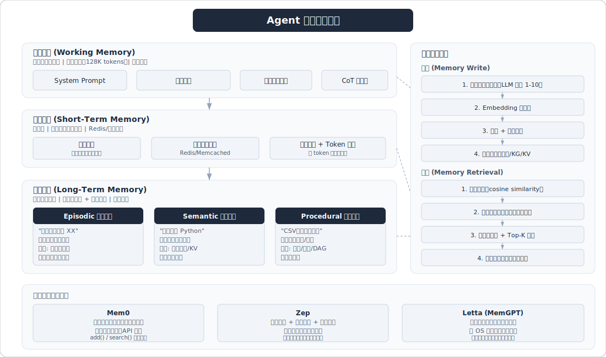
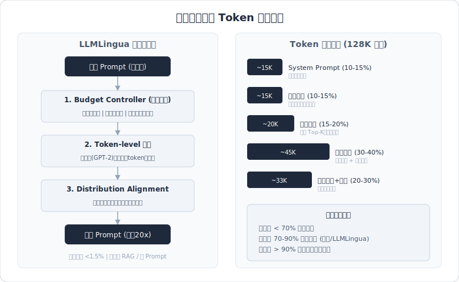
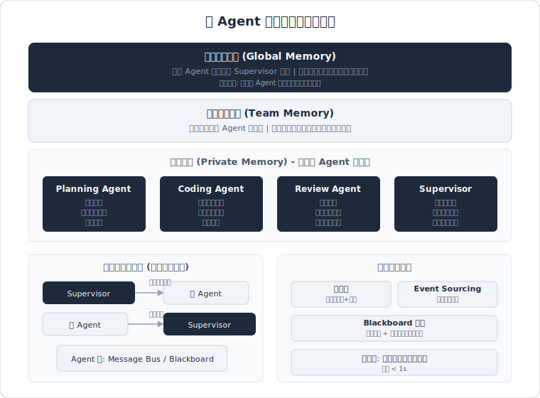

# 记忆与上下文管理

> 面试高频指数：⭐⭐⭐⭐⭐



## 概述

记忆与上下文管理是 Agent 系统设计中最核心的话题之一，直接决定了 Agent 能否在多轮交互中保持连贯性、个性化和长期学习能力。面试中几乎必考，涵盖从基础概念（短期/长期记忆）到工程落地（向量数据库选型、压缩策略、一致性保障）的全链路。掌握这个话题，能体现候选人对 Agent 系统"有状态"本质的深刻理解。

---

## 高频面试题

### Q1: Agent 的记忆机制整体架构是怎样的？短期记忆、长期记忆、工作记忆分别对应什么？

**考察点：** 对 Agent 记忆体系的全局理解，类比人类认知科学的能力
**难度：** 基础

**答案要点：**
- **短期记忆（Short-Term Memory）**：对应当前对话的上下文窗口内容，包括最近的对话历史、当前任务状态。实现上就是 LLM 的 context window（如 128K tokens）。类比人类的"工作台"，容量有限、即用即弃
- **工作记忆（Working Memory）**：Agent 当前正在"思考"的中间状态，包括推理过程中的假设追踪、多步计划状态、中间计算结果。类比人类的"草稿纸/心算板"。实现上可以是 scratchpad、chain-of-thought 缓存区
- **长期记忆（Long-Term Memory）**：跨会话持久化的信息，存储在外部系统中（向量数据库、关系数据库、知识图谱等）。进一步细分为：
  - **情景记忆（Episodic Memory）**：具体的交互事件记录（"用户上次问过 XX"）
  - **语义记忆（Semantic Memory）**：结构化的事实和概念知识（"用户偏好 Python"）
  - **程序记忆（Procedural Memory）**：学到的工作流程和技能（"处理 CSV 文件的标准流程"）

**深入追问：**
- 短期记忆和工作记忆在实现上如何区分？（短期记忆存"说了什么"，工作记忆存"正在想什么"）
- 三种长期记忆的存储介质分别用什么比较合适？（情景→向量DB，语义→知识图谱，程序→代码/配置）

> 相关来源：
> - [面试官问：如何设计Agent记忆机制？](https://www.xiaohongshu.com/explore/69a55587000000001b015dcd) - AI大模型开发 | 2428赞
> - [拆解OpenClaw四层记忆！Agent八股降维打击](https://www.xiaohongshu.com/explore/69b9686f000000001a0288e4) - 不转到大模型不改名 | 693赞

---

### Q2: 如何设计一个 Agent 的独立记忆系统？

**考察点：** 系统设计能力、工程落地思维
**难度：** 进阶

**答案要点：**
- **三层数据模型**：用户层 → 会话层 → 记忆片段层
  - 用户层：区分不同账号空间，隔离记忆
  - 会话层：隔离各对话上下文，支持会话内连贯性
  - 记忆片段层：存储具体内容 + 元数据（时间戳、重要性评分、来源标记）
- **写入策略**：
  - 实时写入：每轮对话结束后提取关键信息写入
  - 批量写入：任务完成后批量提取摘要存入
  - 评分过滤：用 LLM 评估信息的存储价值，过滤噪声
- **检索策略**：
  - 向量语义搜索（主路径）
  - 关键词匹配（辅助）
  - 元数据过滤（时间范围、重要性阈值）
  - 混合排序：综合相关度、时效性、重要性
- **开源参考**：Mem0 框架，支持工作记忆、事实记忆、情景记忆、语义记忆，包含核心记忆层、LLM层、Embedding层、向量存储层、图存储层、持久化存储层

**深入追问：**
- 如何决定哪些信息值得写入长期记忆？（LLM 评分 + 规则过滤 + 去重）
- 记忆系统的延迟要求是多少？如何优化？（检索 < 200ms，用 ANN 近似搜索 + 缓存热点记忆）

> 相关来源：
> - [面试官问：如何设计Agent记忆机制？](https://www.xiaohongshu.com/explore/69a55587000000001b015dcd) - AI大模型开发 | 2428赞
> - [2026届春招模拟面试：Agent独立记忆机制](https://www.xiaohongshu.com/explore/69b3e02800000000230173ed) - 跟着扶安学AI | 849赞

---

### Q3: LLM 上下文窗口限制怎么突破？

**考察点：** 对 LLM 底层原理和工程方案的综合理解
**难度：** 进阶

**答案要点：**

**模型层面突破：**
- **位置编码扩展**：LongRoPE 方法利用位置插值中的非均匀性，通过渐进扩展策略（先微调256K，再插值到2048K），实现 8 倍窗口扩展
- **Position Interpolation（PI）**：基于 RoPE 的位置插值，不到 1000 步微调即可将 LLaMA 扩展到 32K
- **Self-Extend**：无需微调，允许模型根据需要将先前文本纳入当前上下文
- **高效注意力**：FlashAttention 等技术使实用上下文从 2K 提升到 128K-1M

**工程层面突破：**
- **分块处理**：将长输入切分为短块（如每块 2048 tokens），独立处理后合并结果
- **RAG 检索增强**：只检索相关片段放入上下文，而非塞入全部内容
- **对话历史压缩**：用摘要替代原始对话，大幅减少 token 消耗
- **滑动窗口 + 摘要**：保留最近 N 轮原始对话 + 更早内容的摘要

**深入追问：**
- 模型层面的方案和工程层面的方案各有什么优缺点？（模型方案：通用但需训练资源；工程方案：灵活但有信息损失）
- 实际项目中你会怎么选？（多数场景用工程方案，RAG + 压缩性价比最高）

> 相关来源：
> - [面试官：Agent如何突破上下文窗口上限？](https://www.xiaohongshu.com/explore/69a94265000000001b017833) - AI大模型开发 | 1190赞
> - [面试官问：如何设计Agent记忆机制？](https://www.xiaohongshu.com/explore/69a55587000000001b015dcd) - AI大模型开发 | 2428赞

---

### Q4: 对话历史压缩与摘要策略有哪些？

**考察点：** 对上下文管理的工程实践理解
**难度：** 进阶

**答案要点：**

**主要策略：**
| 策略 | 描述 | 优点 | 缺点 |
|------|------|------|------|
| 全量保留 | 保存所有对话历史 | 无信息损失 | 快速撑爆窗口 |
| 滑动窗口 | 只保留最近 N 条消息 | 简单高效 | 丢失早期上下文 |
| 递归摘要 | 用 LLM 迭代生成对话摘要 | 保留关键信息 | 摘要质量依赖 LLM |
| RAG 检索 | 历史存入向量库，按需检索 | 扩展性好 | 检索延迟 + 可能遗漏 |
| 混合策略 | 最近 N 轮原文 + 更早内容摘要 + 关键信息 RAG | 平衡信息与效率 | 实现复杂 |

**触发机制：**
- **轮数触发**：每隔 3-5 轮对话自动生成摘要存入记忆
- **事件触发**：完成任务、场景转换等关键节点记录信息
- **Token 阈值触发**：当上下文使用率超过 70% 时触发压缩

**微软 ACON 框架**：通过对比分析成功和失败的任务轨迹，优化压缩指南，动态压缩环境观察和交互历史

**LangChain 实现**：Summarization 中间件配置 trigger（触发条件）、keep（保留最新消息数）、model（摘要用的模型）

**深入追问：**
- 压缩过程中如何避免丢失关键信息？（关键实体/决策点提取 + 重要性评分 + 保留原始关键句）
- 摘要和原始消息如何共存在 prompt 中？（`[摘要段] + [最近N轮原文] + [当前问题]` 的三段式结构）

> 相关来源：
> - [面试官：Agent如何突破上下文窗口上限？](https://www.xiaohongshu.com/explore/69a94265000000001b017833) - AI大模型开发 | 1190赞
> - [拆解OpenClaw四层记忆！Agent八股降维打击](https://www.xiaohongshu.com/explore/69b9686f000000001a0288e4) - 不转到大模型不改名 | 693赞

---

### Q5: 如何用向量数据库设计 Agent 的记忆库？

**考察点：** 向量检索工程能力、系统设计
**难度：** 进阶

**答案要点：**

**核心架构：**
```
用户输入 → Embedding Model → Query Vector
                                    ↓
                            Vector DB (ANN Search)
                                    ↓
                            Top-K 相关记忆片段
                                    ↓
                    拼入 Prompt → LLM 生成回答
```

**存储设计：**
- 每条记忆存储：原始文本 + 向量嵌入 + 元数据（时间戳、来源、重要性评分、用户ID、会话ID）
- 向量维度选择：OpenAI text-embedding-3-small (1536维)，或轻量模型 (384/768维)
- 索引类型：HNSW（高召回、适合中等规模）、IVF（大规模数据）

**常用向量数据库对比：**
| 数据库 | 特点 | 适用场景 |
|--------|------|----------|
| Pinecone | 全托管、开箱即用 | 快速上线 |
| Milvus | 开源、高性能、支持混合检索 | 大规模生产 |
| Chroma | 轻量、嵌入式 | 原型开发 |
| Qdrant | Rust 实现、高性能 | 性能敏感场景 |
| Weaviate | 支持多模态、GraphQL | 复杂查询需求 |
| pgvector | PostgreSQL 扩展 | 已有 PG 基础设施 |

**检索优化：**
- 混合检索：向量语义搜索 + BM25 关键词匹配，RRF 融合排序
- 元数据过滤：先按时间/用户/会话过滤，再做向量搜索
- 重排序（Rerank）：用 Cross-Encoder 对 Top-K 结果精排
- 时间衰减：距离越远的记忆权重越低（指数衰减函数）

**深入追问：**
- 向量数据库和知识图谱在记忆系统中各扮演什么角色？（向量DB：模糊语义匹配；KG：精确关系推理）
- 如何处理记忆更新？用户偏好变了怎么办？（版本化存储 + 时间加权 + 显式覆盖旧记忆）

> 相关来源：
> - [面试官问：如何设计Agent记忆机制？](https://www.xiaohongshu.com/explore/69a55587000000001b015dcd) - AI大模型开发 | 2428赞
> - [2026届春招模拟面试：Agent独立记忆机制](https://www.xiaohongshu.com/explore/69b3e02800000000230173ed) - 跟着扶安学AI | 849赞

---

### Q6: Agent 记忆的检索与遗忘机制怎么设计？

**考察点：** 记忆系统的生命周期管理
**难度：** 进阶

**答案要点：**

**检索机制：**
- **相关性检索**：基于语义相似度的向量搜索
- **时效性检索**：优先返回最近的记忆（时间衰减权重）
- **重要性检索**：按重要性评分排序（由 LLM 打分或访问频率计算）
- **综合评分**：`score = α × relevance + β × recency + γ × importance`

**遗忘机制（为什么需要遗忘）：**
- 存储成本控制
- 检索效率维护（记忆越多检索越慢、噪声越大）
- 避免过时信息干扰决策

**遗忘策略：**
- **时间衰减（Temporal Decay）**：`weight = e^(-λ × Δt)`，长时间未访问的记忆权重降低
- **重要性阈值**：低于重要性阈值的记忆定期清理
- **访问频率**：长期未被检索命中的记忆标记为可清理
- **容量淘汰**：类似 LRU 缓存，超出容量时淘汰最低优先级记忆
- **合并压缩**：多条相似记忆合并为一条概括性记忆

**深入追问：**
- 遗忘会不会导致"失忆"？怎么防止重要信息被误删？（关键记忆加"永不遗忘"标记 + 分级存储）
- 类比人类的遗忘曲线，Agent 的遗忘曲线该怎么设计？（艾宾浩斯曲线 + 间隔重复强化）

> 相关来源：
> - [面试官问：如何设计Agent记忆机制？](https://www.xiaohongshu.com/explore/69a55587000000001b015dcd) - AI大模型开发 | 2428赞
> - [拆解OpenClaw四层记忆！Agent八股降维打击](https://www.xiaohongshu.com/explore/69b9686f000000001a0288e4) - 不转到大模型不改名 | 693赞

---

### Q7: 多轮对话中的状态管理怎么做？

**考察点：** 对话系统工程实践
**难度：** 基础

**答案要点：**

**对话状态追踪（Dialogue State Tracking, DST）：**
- 维护结构化的对话状态对象，记录当前目标、已收集的槽位信息、对话阶段
- 每轮更新：解析用户意图 → 更新状态 → 生成响应

**Session 管理：**
- 会话标识：每个对话分配唯一 session_id
- 状态持久化：Redis/数据库存储会话状态，支持断点续传
- 超时策略：长时间无交互自动归档会话

**上下文拼接策略：**
```
System Prompt（角色设定 + 工具描述）
  ↓
[长期记忆摘要]（从记忆系统检索的相关信息）
  ↓
[历史摘要]（早期对话的压缩摘要）
  ↓
[最近 N 轮原始对话]
  ↓
[当前用户输入]
```

**OpenAI Agents SDK 的做法**：通过 Session 对象管理短期记忆，自动截断超长历史，支持 Notes 机制实现长期记忆持久化

**深入追问：**
- 用户中途切换话题怎么处理？（话题检测 → 旧话题状态归档 → 新话题初始化）
- 并发多会话场景下如何保证状态隔离？（session_id 隔离 + 分布式锁）

> 相关来源：
> - [面试官：Agent如何突破上下文窗口上限？](https://www.xiaohongshu.com/explore/69a94265000000001b017833) - AI大模型开发 | 1190赞
> - [大模型应用开发-agent相关面经](https://www.xiaohongshu.com/explore/697f48d5000000000e03c1d5) - 不爱秋招爱整理 | 1257赞

---

### Q8: 解释 OpenClaw 的四层记忆架构

**考察点：** 对前沿开源项目的了解、记忆系统分层设计思维
**难度：** 深入

**答案要点：**

**背景问题**：OpenClaw 默认的记忆压缩系统存在严重缺陷——完美存储但零检索。问题出在多层处理的级联损失：
1. 第一层：消息被截断为 200 字符片段
2. 第二层：消息体被替换为元数据占位符（如 "msg#28764, assistant, 362 tokens"）
3. 第三层：准备子 Agent prompt 时直接丢弃 content 字段

**LCM（Long Context Memory）解决方案**——四层树状记忆架构：
- **第一层：完整消息持久化**——所有消息永久保存到 SQLite 数据库，不做任何截断
- **第二层：叶节点摘要**——对较旧的消息生成叶层摘要（Leaf Summaries）
- **第三层：递归压缩节点**——对叶摘要再次摘要，形成更高层节点，构成树状结构
- **第四层：上下文组装**——每轮对话展示：最近的原始消息 + 更早内容的压缩摘要（从树中检索）

**设计精髓**：
- 永远不删除原始数据（只做压缩副本）
- 树状结构支持不同粒度的记忆检索
- 越近的记忆越详细，越远的记忆越抽象——模拟人类记忆特征

**深入追问：**
- 这种树状结构的时间复杂度和空间复杂度是什么？（写入 O(log n)，检索 O(log n)，空间 O(n)）
- 和直接用 RAG 检索历史消息相比有什么优势？（RAG 是点查询，树状结构保留了时序上下文的连续性）

> 相关来源：
> - [拆解OpenClaw四层记忆！Agent八股降维打击](https://www.xiaohongshu.com/explore/69b9686f000000001a0288e4) - 不转到大模型不改名 | 693赞
> - [面试官问：如何设计Agent记忆机制？](https://www.xiaohongshu.com/explore/69a55587000000001b015dcd) - AI大模型开发 | 2428赞

---

### Q9: 记忆的一致性与冲突处理怎么做？

**考察点：** 复杂系统设计、边界情况处理能力
**难度：** 深入

**答案要点：**

**一致性挑战：**
- **时序一致性**：用户偏好会随时间变化（"我之前喜欢 Java，现在转 Python 了"）
- **事实冲突**：不同来源/时间点的信息互相矛盾
- **多 Agent 并发写入**：多个 Agent 同时更新共享记忆，产生冲突

**冲突检测策略：**
- **时间戳比较**：新信息覆盖旧信息（Last Write Wins）
- **语义矛盾检测**：用 LLM 判断两条记忆是否矛盾
- **置信度评分**：每条记忆附带置信度，冲突时保留高置信度的

**冲突解决方案：**
- **时间优先**：默认以最新信息为准（适合用户偏好类记忆）
- **来源优先**：用户显式陈述 > Agent 推断 > 第三方信息
- **版本化存储**：保留所有版本，检索时返回最新版本但可追溯历史
- **主动确认**：检测到冲突时主动询问用户（"您之前提到喜欢 Java，现在更偏好 Python 了吗？"）

**多 Agent 场景的并发控制：**
- 读写锁 / 乐观锁机制
- 事件溯源（Event Sourcing）：只追加不修改，通过事件流重建状态
- 冲突合并策略：类似 Git 的 merge，可自动合并或标记需人工解决

**MemoryAgentBench 基准**：评估记忆 Agent 的四大能力——准确检索、测试时学习、长范围理解、冲突解决。结论是现有方法在冲突解决上普遍薄弱

**深入追问：**
- 如果两条记忆互相矛盾且同样重要，你怎么处理？（标记为"待确认"+ 下次交互时主动询问用户）
- CAP 定理在记忆系统中怎么体现？（多 Agent 分布式场景下，一致性 vs 可用性的权衡）

> 相关来源：
> - [面试官问：如何设计Agent记忆机制？](https://www.xiaohongshu.com/explore/69a55587000000001b015dcd) - AI大模型开发 | 2428赞
> - [2026届春招模拟面试：Agent独立记忆机制](https://www.xiaohongshu.com/explore/69b3e02800000000230173ed) - 跟着扶安学AI | 849赞

---

### Q10: 解释 Reflexion（反思记忆）机制及其在 Agent 中的应用

**考察点：** 对前沿研究论文的理解、Agent 自我改进机制
**难度：** 深入

**答案要点：**

**核心思想**：Reflexion 是一种"语言强化学习"框架，不通过更新模型权重来学习，而是通过自然语言形式的自我反思来改进行为。

**三大组件：**
1. **Actor（执行者）**：根据状态观察生成文本和行动，与环境交互产生轨迹
2. **Evaluator（评估者）**：对轨迹进行评估，生成奖励信号
3. **Self-Reflection（自我反思）**：基于奖励信号和当前轨迹，用 LLM 生成语言反馈（"我失败了因为 XX，下次应该 YY"）

**工作流程：**
```
定义任务 → 生成轨迹 → 评估结果 → 反思总结 → 存入记忆 → 生成下一轮轨迹（带反思记忆）
```

**记忆的关键作用**：
- 反思结果以自然语言形式存入长期记忆
- 下一轮尝试时，将之前的反思作为上下文提供给 LLM
- 实现"从错误中学习"而非"重复犯错"

**性能表现**：在编程（HumanEval）、推理（AlfWorld）等任务上显著提升成功率

**局限性**：
- 同一个模型既执行又反思，可能产生确认偏差（confirmation bias）
- 反思质量依赖 LLM 的自我评估能力
- 改进方向：MAR（Multi-Agent Reflexion）用多个 Agent 分别执行和反思，减少偏差

**深入追问：**
- Reflexion 和 CoT（Chain-of-Thought）的区别是什么？（CoT 是单次推理优化，Reflexion 是跨轮次的经验积累）
- 在生产环境中如何应用 Reflexion 思想？（任务失败后自动生成失败分析 → 存入经验库 → 类似任务时检索历史经验）

> 相关来源：
> - [面试官问：如何设计Agent记忆机制？](https://www.xiaohongshu.com/explore/69a55587000000001b015dcd) - AI大模型开发 | 2428赞
> - [字节ai agent一面（贼难）](https://www.xiaohongshu.com/explore/69a52cbf000000001d027325) - 互联网代面 | 2170赞

---

### Q11: 如何评估 Agent 记忆系统的效果？

**考察点：** 系统评估方法论
**难度：** 进阶

**答案要点：**

**评估维度：**
- **准确性**：检索到的记忆是否与当前问题相关（Recall@K、Precision@K）
- **时效性**：是否优先返回最新的相关记忆
- **一致性**：多轮对话中是否保持上下文一致（不自相矛盾）
- **效率**：检索延迟（P99 < 200ms）、存储成本

**评估基准：**
- **MemoryAgentBench**：评估准确检索、测试时学习、长范围理解、冲突解决四项能力
- **自定义测试集**：构造包含时间变化、偏好更新、事实冲突的多轮对话场景

**关键指标：**
- 记忆命中率：需要记忆时能检索到的比例
- 幻觉率：因记忆错误导致的错误回答比例
- 上下文利用率：实际使用的上下文窗口占比（过高浪费 token，过低遗漏信息）

**深入追问：**
- 怎么判断记忆系统是"记太多"还是"记太少"？（监控检索噪声比和遗漏率）
- A/B 测试中记忆系统的对照组怎么设计？（无记忆 vs 全量记忆 vs 智能记忆）

> 相关来源：
> - [面试怎么讲？你的Agent效果咋样？](https://www.xiaohongshu.com/explore/688c564f000000002203b70e) - 亚慧AI产品经理 | 964赞
> - [面试官问：如何设计Agent记忆机制？](https://www.xiaohongshu.com/explore/69a55587000000001b015dcd) - AI大模型开发 | 2428赞

---

## 快速记忆框架 / 速记表

### 记忆三层架构速记

```
┌─────────────────────────────────────────────────────┐
│                  Agent 记忆架构                       │
├─────────────────────────────────────────────────────┤
│  短期记忆 (STM)  │ Context Window │ 当前对话上下文    │
│  工作记忆 (WM)   │ Scratchpad     │ 推理中间状态      │
│  长期记忆 (LTM)  │ External Store │ 跨会话持久化      │
│    ├ 情景记忆     │ Vector DB      │ 具体交互事件      │
│    ├ 语义记忆     │ Knowledge Graph│ 事实与概念        │
│    └ 程序记忆     │ Code/Config    │ 工作流与技能      │
└─────────────────────────────────────────────────────┘
```

### 上下文管理策略速记

```
窗口不够用？四招解决：
1. 压缩 → 对话历史摘要化（递归摘要/ACON）
2. 检索 → RAG 按需取用（向量搜索 + Rerank）
3. 扩展 → 模型层扩窗（LongRoPE/PI/FlashAttention）
4. 分块 → 长文档切片处理（Map-Reduce 模式）
```

### 记忆生命周期速记

```
写入 → 评分过滤 → 向量化存储 → 检索召回 → 时间衰减 → 合并/淘汰
        ↑ LLM评分           ↑ ANN搜索        ↑ e^(-λt)
```

### OpenClaw 四层记忆速记

```
第1层：原始消息全量持久化（SQLite）
第2层：旧消息叶节点摘要
第3层：摘要的摘要（树状递归压缩）
第4层：近期原文 + 远期压缩摘要（上下文组装）
核心：永不删除原始数据，树状结构，近详远略
```

### Reflexion 机制速记

```
执行 → 失败 → 反思("我因为XX失败") → 存入记忆 → 重新执行(带反思)
关键：不改权重，改记忆；语言形式的强化学习
```

### 面试万能答题框架

```
记忆问题三步走：
1. 分类：这是什么类型的记忆问题？（存储/检索/更新/淘汰）
2. 方案：对应的技术方案是什么？（向量DB/摘要/RAG/衰减函数）
3. 权衡：方案的 trade-off 是什么？（精度vs效率/成本vs效果/复杂度vs可维护性）
```

---

---

### Q12: 主流记忆框架对比——Mem0 vs Letta（MemGPT） vs Zep，怎么选？

**考察点：** 技术选型能力、对开源生态的了解深度
**难度：** 进阶

**答案要点：**

**三大框架核心差异：**

| 维度 | Mem0 | Letta (MemGPT) | Zep |
|------|------|-----------------|-----|
| 核心理念 | 独立记忆层，从对话中提取记忆并持久化 | Agent 主动编辑自身记忆（自管理记忆） | 时序知识图谱，追踪信息随时间的变化 |
| 记忆写入 | 自动提取：LLM 从对话中抽取关键事实存储 | 主动编辑：Agent 在推理过程中调用 memory_write 工具修改记忆块 | 图谱更新：将事实存入时序图谱，保留变化历史 |
| 记忆存储 | 向量数据库 + 图存储（双通道） | 结构化记忆块（在 context window 内）+ 外部归档 | 时序知识图谱（Temporal Knowledge Graph） |
| 核心优势 | 平衡性最好，token 节省 92%，延迟仅 1.44s；支持多种存储后端 | 无限上下文幻觉——通过虚拟分页实现"无限记忆"；Agent 对记忆有完全控制权 | 时序推理最强——知道信息何时变化（"用户从 Austin 搬到 Seattle"不只记新地址，还知道旧地址和变更时间） |
| 适用场景 | 通用记忆层，快速集成到现有 Agent | 长时间运行的 Agent（代码助手、个人助理） | 需要时序推理的业务（客户画像演变、偏好追踪） |
| 接入成本 | 低——pip install mem0ai，几行代码集成 | 中——需要改造 Agent 的工具调用逻辑 | 中——需要部署图数据库 |

**其他值得关注的框架：**
- **Cognee**：知识图谱优先的 RAG 记忆方案，适合文档密集型 Agent
- **LangMem（LangChain）**：与 LangGraph 深度集成，适合已在 LangChain 生态的团队
- **MemOS**：国内开源，支持多 Agent 记忆共享和 Skill 自动沉淀

**选型决策树：**
```
需要快速集成？ → Mem0
需要 Agent 自主管理记忆？ → Letta
需要追踪信息时序变化？ → Zep
已在 LangChain 生态？ → LangMem
需要知识图谱 + RAG？ → Cognee
```

**深入追问：**
- 这些框架和自研记忆系统比，什么时候该用框架什么时候该自研？（MVP 阶段用框架快速验证，生产阶段根据定制化需求决定是否自研核心模块）
- Mem0 的"双通道存储"（向量 + 图）具体怎么协同工作？（向量通道做模糊语义检索，图通道做精确关系推理，查询时并行检索后融合排序）

> 相关来源：
> - [Agent的8种记忆策略，图解](https://www.xiaohongshu.com/explore/69132d31000000000700dd8a) - Erric的AI产品项目实战-匡集 | 168赞
> - [多 Agent 记忆方案、Skill 自动沉淀更新！](https://www.xiaohongshu.com/explore/69ae74aa000000001a026be8) - MemOS 满血版 | 158赞
> - [面试官：Agent长期记忆怎么设计？](https://www.xiaohongshu.com/explore/69c6071a000000002301e9b0) - 也许能耕耘token | 142赞

---

### Q13: 记忆安全与隐私保护怎么做？PII 过滤、记忆隔离架构怎么设计？

**考察点：** 安全意识、合规设计能力、多租户架构经验
**难度：** 高级

**答案要点：**

**记忆安全三大威胁：**
1. **PII 泄露**：用户在对话中无意透露身份证号、手机号、地址等敏感信息，被写入长期记忆后可能在其他上下文中被检索出来
2. **跨用户记忆污染**：多租户场景下用户 A 的记忆被用户 B 检索到
3. **记忆投毒（Memory Poisoning）**：恶意用户故意注入虚假信息到记忆中，影响 Agent 后续决策

**PII 过滤架构：**
```
用户输入 → PII 检测器 → 脱敏处理 → 记忆提取 → 存储
                ↓
         检测到敏感信息
                ↓
    方案1: 正则匹配（手机号、身份证、邮箱等固定模式）
    方案2: NER 模型识别（人名、地址、组织等实体）
    方案3: LLM 判断（复杂上下文中的隐式 PII）
                ↓
         脱敏策略:
    - 替换: "张三" → "[USER_NAME]"
    - 掩码: "13812345678" → "138****5678"
    - 删除: 直接移除敏感片段
    - 加密存储: 原文加密，仅授权场景解密
```

**多用户/多会话记忆隔离架构：**
```
┌─────────────────────────────────────────┐
│              记忆访问层                    │
│   Policy Engine (RBAC + ABAC)            │
├─────────────────────────────────────────┤
│  组织级记忆  │  团队级记忆  │  用户级记忆   │
│  (共享知识)  │  (协作上下文) │  (个人偏好)  │
├─────────────────────────────────────────┤
│              会话级记忆                    │
│   session_id 隔离 + 自动过期              │
├─────────────────────────────────────────┤
│         加密存储层 (AES-256)              │
│   行级安全 (Row-Level Security)           │
└─────────────────────────────────────────┘
```

**关键设计原则：**
- **最小权限原则**：记忆检索时附带 user_id/org_id 元数据过滤，确保只能访问自己的记忆
- **行级安全（RLS）而非仅命名空间隔离**：在数据库层面强制执行，避免应用层 bug 导致越权
- **GDPR Article 17 合规**："被遗忘权"——用户可要求删除所有相关记忆，系统必须支持彻底删除（包括向量索引中的条目）
- **审计日志**：记录所有记忆的读写操作，支持事后追溯

**深入追问：**
- 向量数据库中如何实现"彻底删除"？（删除向量条目 + 重建索引，部分数据库支持软删除需注意）
- 多 Agent 共享记忆时如何防止信息泄漏？（分层权限：Supervisor 可读全局，子 Agent 仅读取被授权的记忆范围）

> 相关来源：
> - [大模型记忆技术拆解图](https://www.xiaohongshu.com/explore/6917ec65000000001b0201f7) - AI折腾哥 | 165赞
> - [联合清北CMU伙伴｜Agent记忆能力的探索](https://www.xiaohongshu.com/explore/6961c9a5000000001a023a2a) - Hoopopi | 163赞
> - [AI产品经理如何设计Agent的记忆memory？](https://www.xiaohongshu.com/explore/691addf1000000000500394c) - 亚慧AI产品经理 | 159赞

---

### Q14: 基于 Embedding 的记忆检索 vs 基于时间衰减的检索，怎么选？

**考察点：** 检索策略的工程权衡、对记忆系统核心机制的理解
**难度：** 进阶

**答案要点：**

**两种检索范式对比：**

| 维度 | Embedding 语义检索 | 时间衰减检索 |
|------|-------------------|-------------|
| 核心逻辑 | 根据语义相似度检索最相关的记忆 | 根据时间距离检索最近的记忆，越远权重越低 |
| 适用场景 | 知识型对话（"我之前说过喜欢什么？"） | 任务型对话（最近几轮的操作上下文） |
| 优势 | 能跨越时间找到语义相关的记忆 | 简单高效，天然保证时效性 |
| 劣势 | 可能检索到过时信息（用户偏好已变）；对短文本效果差 | 可能错过重要但较早的记忆 |
| 计算开销 | 需要 Embedding 计算 + ANN 搜索 | 仅时间戳排序，接近 O(1) |

**生产环境的综合评分公式：**
```
final_score = α × semantic_similarity
            + β × recency_score
            + γ × importance_score
            + δ × access_frequency

其中：
  recency_score = e^(-λ × (now - timestamp))    # 指数衰减
  importance_score = LLM评分 或 规则评分 (0~1)
  access_frequency = log(1 + access_count)       # 对数平滑

权重参考：α=0.4, β=0.3, γ=0.2, δ=0.1
```

**不同场景的权重调优：**
- **客服 Agent**：β（时效性）权重高——最近的工单信息更重要
- **学习助手**：α（语义相关性）权重高——需要跨时间检索知识点
- **个人助理**：γ（重要性）权重高——重要事项不能被遗忘
- **代码 Agent**：α + δ 权重高——频繁引用的代码模式更重要

**进阶：基于 Cross-Encoder 的精排：**
- 粗排阶段用 Embedding 召回 Top-50
- 精排阶段用 Cross-Encoder 对 (query, memory) 对做精确相关性评分
- 再叠加时间衰减和重要性调整，输出 Top-5

**深入追问：**
- 权重参数 α/β/γ/δ 怎么调？（A/B 测试 + 人工评估 + 基于任务完成率的自动调优）
- 时间衰减函数用指数衰减还是线性衰减？（指数衰减更符合人类记忆曲线，但线性衰减在短期场景下更可控）

> 相关来源：
> - [谈谈对Agent记忆形式的个人理解](https://www.xiaohongshu.com/explore/6965a960000000001a028e7f) - jjyaoao | 159赞
> - [ReMem：Agent自进化记忆新范式](https://www.xiaohongshu.com/explore/692a85c6000000001e034122) - 量子智心 | 134赞

---

### Q15: 上下文压缩实战——LLMLingua、AutoCompressor 等方案怎么选？Token 预算怎么管？



**考察点：** 前沿技术跟踪、成本优化工程能力
**难度：** 高级

**答案要点：**

**主流上下文压缩方案对比：**

| 方案 | 原理 | 压缩率 | 性能损失 | 适用场景 |
|------|------|--------|----------|----------|
| **LLMLingua** (Microsoft) | 用小模型（如 GPT-2）评估每个 token 的重要性，删除低重要性 token | 最高 20x | <1.5% | RAG 场景、长 Prompt 压缩 |
| **LongLLMLingua** | LLMLingua 的长文本版本，增加了 question-aware 压缩 | 最高 17x | 更低 | 长文档 QA、多文档检索 |
| **AutoCompressor** | 训练模型将长文本压缩为 summary vectors（软提示） | 不限 | 依赖训练 | 需要端到端训练的场景 |
| **Selective Context** | 基于自信息（self-information）选择性保留高信息量内容 | 5-10x | 中等 | 通用对话压缩 |
| **递归摘要** | 用 LLM 生成自然语言摘要替代原文 | 不限 | 依赖 LLM | 对话历史压缩 |

**LLMLingua 三大核心模块：**
1. **Budget Controller（预算控制器）**：按 Prompt 的不同部分（instructions / demonstrations / query）分配压缩预算，指令部分少压缩，示例部分多压缩
2. **Iterative Token-level Compression**：将 Prompt 分段，逐段在 token 级别评估重要性，迭代压缩直到满足预算
3. **Distribution Alignment**：用指令微调对齐小模型和目标大模型的分布，提高压缩后 Prompt 在目标模型上的效果

**Token 预算管理策略：**
```
总预算分配 (以 128K 模型为例):
┌────────────────────────────────────────┐
│ System Prompt     │  10-15%  │ ~15K   │ 固定，不压缩
│ 工具描述          │  10-15%  │ ~15K   │ 按需加载，不常用工具惰性加载
│ 长期记忆          │  15-20%  │ ~20K   │ 检索 Top-K，压缩后注入
│ 对话历史          │  30-40%  │ ~45K   │ 近期原文 + 远期摘要
│ 当前输入 + 输出   │  20-30%  │ ~33K   │ 保留输出空间
└────────────────────────────────────────┘
```

**动态预算调整：**
- 监控每轮对话的 token 使用率
- 使用率超过 70% 时触发压缩（摘要/LLMLingua）
- 使用率超过 90% 时强制截断最远的历史
- 根据任务复杂度动态调整输出预算（复杂推理需要更大输出空间）

**深入追问：**
- LLMLingua 用小模型压缩后的 Prompt 给大模型用，语义对齐怎么保证？（Distribution Alignment + 验证集测试压缩后效果）
- 压缩和 RAG 哪个优先？（先 RAG 检索相关内容，再对检索结果做压缩——两者是互补关系）

> 相关来源：
> - [skill 全塞进prompt，上下文太大怎么办](https://www.xiaohongshu.com/explore/69bfbab1000000001f003450) - Offer面试官 | 353赞
> - [Agent，请给人类更好的上下文](https://www.xiaohongshu.com/explore/69c257e6000000002200f6cc) - 智跃Zleap | 741赞

---

### Q16: 长文本模型（Claude 200K、Gemini 1M+）对记忆系统的影响是什么？还需要记忆系统吗？

**考察点：** 对技术趋势的判断力、架构演进思维
**难度：** 高级

**答案要点：**

**核心观点：长窗口减轻但不消除记忆系统的必要性。**

**长窗口解决了什么：**
- 单次会话内的上下文问题基本解决——200K tokens 足够容纳数百轮对话
- 减少了滑动窗口/压缩的工程复杂度
- 长文档理解场景（合同分析、代码库阅读）不再需要分块处理

**长窗口没有解决什么：**
- **跨会话持久化**：窗口再大也只是单次推理的内存，关闭会话后一切归零——长期记忆仍需外部存储
- **成本问题**：200K tokens 的推理成本远高于精准检索 2K tokens 的相关记忆。以 Claude Sonnet 为例，200K input ≈ $0.60/次，而检索 2K 相关内容 ≈ $0.006/次——100 倍差距
- **注意力稀释（Lost in the Middle）**：研究表明即使在长窗口模型中，信息放在中间位置时召回率显著下降。模型对头部和尾部的注意力远强于中间部分
- **多用户记忆隔离**：窗口大小和记忆的权限管理、隔离是完全不同的问题
- **结构化记忆**：用户偏好、学到的技能等结构化知识需要专门的存储和索引，不能靠塞进窗口

**未来架构演进：**
```
当前最佳实践:
  短窗口模型 + 复杂记忆系统（压缩 + RAG + 摘要）

近期趋势:
  长窗口模型 + 精简记忆系统（仅做跨会话持久化 + 结构化存储）

远期可能:
  超长窗口 + 持久化 KV Cache + 轻量记忆索引
```

**面试推荐回答框架：**
"长窗口模型让我们的短期记忆管理变简单了，但 Agent 的三个核心记忆需求——跨会话持久化、成本控制、结构化知识管理——仍然需要独立的记忆系统。区别在于记忆系统的职责从'什么都管'变成了'管精华'。"

**深入追问：**
- 如果成本不是问题，能不能直接把所有历史塞进 1M 窗口？（不能——Lost in the Middle 问题、信噪比下降、推理速度线性下降）
- KV Cache 持久化技术（如 Gemini 的 Context Caching）对记忆系统有什么影响？（减少重复计算成本，但仍不解决跨会话和结构化存储问题）

> 相关来源：
> - [File System as Context：Agent的外部记忆](https://www.xiaohongshu.com/explore/6936c189000000001e0080ee) - 清欢 | 152赞
> - [Agent，请给人类更好的上下文](https://www.xiaohongshu.com/explore/69c257e6000000002200f6cc) - 智跃Zleap | 741赞

---

### Q17: 多 Agent 系统中的记忆共享与隔离怎么设计？



**考察点：** 多 Agent 架构设计、分布式系统思维
**难度：** 高级

**答案要点：**

**核心挑战**：多个 Agent 协作时，既需要共享必要的上下文（避免重复劳动），又需要隔离各自的工作记忆（避免干扰）。

**三层记忆共享模型：**
```
┌─────────────────────────────────────────┐
│          全局共享记忆 (Global Memory)      │
│  所有 Agent 可读，仅 Supervisor 可写      │
│  内容：任务目标、用户画像、全局约束        │
├─────────────────────────────────────────┤
│          团队共享记忆 (Team Memory)        │
│  同一子任务组的 Agent 可读写              │
│  内容：子任务状态、中间结果、协作上下文    │
├─────────────────────────────────────────┤
│          私有记忆 (Private Memory)         │
│  仅单个 Agent 可访问                      │
│  内容：推理草稿、工具调用缓存、个人状态    │
└─────────────────────────────────────────┘
```

**上下文传递策略——最小信息原则：**
- **Supervisor → 子 Agent**：裁剪上下文，只传递子任务相关的信息，不传递全量历史
- **子 Agent → Supervisor**：只回传结果摘要，不传递完整推理过程
- **Agent 间横向通信**：通过 Message Bus / Blackboard Pattern，结构化消息格式

**并发写入控制：**
- **乐观锁**：Agent 写入时检查版本号，冲突时重试（适合低冲突场景）
- **Event Sourcing**：所有写入都是追加事件，通过事件流重建最终状态
- **Blackboard 架构**：共享黑板 + 仲裁器，仲裁器决定哪些写入生效

**实际案例——代码 Agent 协作：**
- Planning Agent 写入全局记忆：任务分解结果
- Coding Agent 读取任务，写入团队记忆：代码片段、文件修改记录
- Review Agent 读取团队记忆，写入评审结果
- 各 Agent 的推理过程保留在私有记忆中，不污染共享空间

**深入追问：**
- 全局记忆的写入权限为什么要收紧？（防止子 Agent 的错误判断污染全局状态）
- 记忆共享的延迟怎么控制？Agent A 写入后 Agent B 多久能读到？（最终一致性 vs 强一致性的选择，通常最终一致性即可，延迟 < 1s）

> 相关来源：
> - [多 Agent 记忆方案、Skill 自动沉淀更新！](https://www.xiaohongshu.com/explore/69ae74aa000000001a026be8) - MemOS 满血版 | 158赞
> - [面试官问：如何设计Agent记忆机制？](https://www.xiaohongshu.com/explore/69a55587000000001b015dcd) - AI大模型开发 | 2428赞

---

## 相关小红书笔记来源

- [2428赞] 面试官问：如何设计Agent记忆机制？
- [1190赞] 面试官：Agent如何突破上下文窗口上限？
- [849赞] 2026届春招模拟面试：Agent独立记忆机制
- [741赞] Agent，请给人类更好的上下文
- [693赞] 拆解OpenClaw四层记忆！Agent八股降维打击
- [353赞] skill 全塞进prompt，上下文太大怎么办
- [168赞] Agent的8种记忆策略，图解
- [165赞] 大模型记忆技术拆解图
- [163赞] 联合清北CMU伙伴｜Agent记忆能力的探索
- [159赞] 谈谈对Agent记忆形式的个人理解
- [158赞] 多 Agent 记忆方案、Skill 自动沉淀更新！
- [152赞] File System as Context：Agent的外部记忆
- [142赞] 面试官：Agent长期记忆怎么设计？
- [134赞] ReMem：Agent自进化记忆新范式

---

## 参考资料链接

- [Agent技术解读：Memory记忆模块 - 知乎](https://zhuanlan.zhihu.com/p/714362269)
- [大模型-Agent 面试八股文 - 知乎](https://zhuanlan.zhihu.com/p/30772276091)
- [收藏必备！AI大模型Agent面试精选15题 - 知乎](https://zhuanlan.zhihu.com/p/1980294044010702447)
- [AI Agent开发工程师面试题精选 - CSDN](https://blog.csdn.net/pythonhy/article/details/145851999)
- [Agentic AI基础设施实践：Agent记忆模块最佳实践 - AWS博客](https://aws.amazon.com/cn/blogs/china/agentic-ai-infrastructure-deep-practice-experience-thinking-series-three-best-practices-for-agent-memory-module/)
- [LLM Agent Memory: Short & Long-Term - apxml](https://apxml.com/courses/multi-agent-llm-systems-design-implementation/chapter-2-architecting-agents-defining-roles/memory-mechanisms-llm-agents)
- [What Is AI Agent Memory? - IBM](https://www.ibm.com/think/topics/ai-agent-memory)
- [AI Agent Memory: Architecture and Implementation - Let's Data Science](https://www.letsdatascience.com/blog/ai-agent-memory-architecture)
- [Memory Architectures for Long-Term AI Agent Behavior - GoCodeo](https://www.gocodeo.com/post/memory-architectures-for-long-term-ai-agent-behavior)
- [突破LLM上下文长度的技术总结 - CSDN](https://blog.csdn.net/qq_45889056/article/details/148049253)
- [LLM上下文窗口突破200万 - 阿里云](https://developer.aliyun.com/article/1507173)
- [LongRoPE：LLM上下文窗口扩展方法 - CSDN](https://blog.csdn.net/yjh_SE007/article/details/136975406)
- [Reflexion: Language Agents with Verbal Reinforcement Learning - arXiv](https://arxiv.org/abs/2303.11366)
- [Reflexion | Prompt Engineering Guide](https://www.promptingguide.ai/techniques/reflexion)
- [OpenClaw Agent 记忆系统研究教程 - 博客园](https://www.cnblogs.com/gyc567/p/19559062)
- [Your OpenClaw Forgot Everything Again. Here's How We Fixed It. - Substack](https://augmentedmind.substack.com/p/your-openclaw-forgot-everything-again)
- [从对话到知识：AI Agent 记忆系统的设计与实现 - luozhiyun's Blog](https://www.luozhiyun.com/archives/911)
- [笔记：多轮对话中的上下文压缩与记忆增强 - 知乎](https://zhuanlan.zhihu.com/p/1974529752774762715)
- [How to Ensure Consistency in Multi-Turn AI Conversations - Maxim](https://www.getmaxim.ai/articles/how-to-ensure-consistency-in-multi-turn-ai-conversations/)
- [hello-agents 面试问题总结 - GitHub](https://github.com/datawhalechina/hello-agents/blob/main/Extra-Chapter/Extra01-%E9%9D%A2%E8%AF%95%E9%97%AE%E9%A2%98%E6%80%BB%E7%BB%93.md)
- [Microsoft Multi-Agent Reference Architecture: Short-Term Memory](https://microsoft.github.io/multi-agent-reference-architecture/docs/memory/Short-Term-Memory.html)
- [AI Agent Memory: What, Why and How It Works - Mem0](https://mem0.ai/blog/memory-in-agents-what-why-and-how)
- [Mem0: Building Production-Ready AI Agents with Scalable Long-Term Memory - arXiv](https://arxiv.org/html/2504.19413v1)
- [Survey of AI Agent Memory Frameworks - Graphlit](https://www.graphlit.com/blog/survey-of-ai-agent-memory-frameworks)
- [Top 6 AI Agent Memory Frameworks for Devs (2026) - DEV Community](https://dev.to/nebulagg/top-6-ai-agent-memory-frameworks-for-devs-2026-1fef)
- [AI Memory Benchmark: Mem0 vs OpenAI vs LangMem vs MemGPT - Mem0](https://mem0.ai/blog/benchmarked-openai-memory-vs-langmem-vs-memgpt-vs-mem0-for-long-term-memory-here-s-how-they-stacked-up)
- [AI Agent Memory Security Requires More Observability - Medium](https://medium.com/@oracle_43885/ai-agent-memory-security-requires-more-observability-b12053e39ff0)
- [Unveiling Privacy Risks in LLM Agent Memory - ACL 2025](https://aclanthology.org/2025.acl-long.1227.pdf)
- [AI Agent Security Cheat Sheet - OWASP](https://cheatsheetseries.owasp.org/cheatsheets/AI_Agent_Security_Cheat_Sheet.html)
- [LLMLingua: Compressing Prompts for Accelerated Inference - Microsoft](https://github.com/microsoft/LLMLingua)
- [How to Cut RAG Costs by 80% Using Prompt Compression - Towards Data Science](https://towardsdatascience.com/how-to-cut-rag-costs-by-80-using-prompt-compression-877a07c6bedb/)
- [Multi-Agent Memory from a Computer Architecture Perspective - arXiv](https://arxiv.org/html/2603.10062v1)
