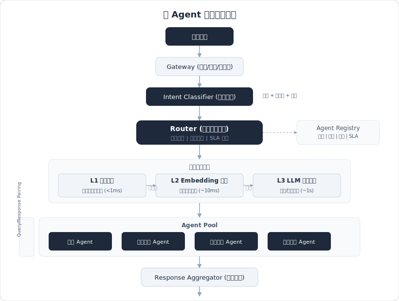
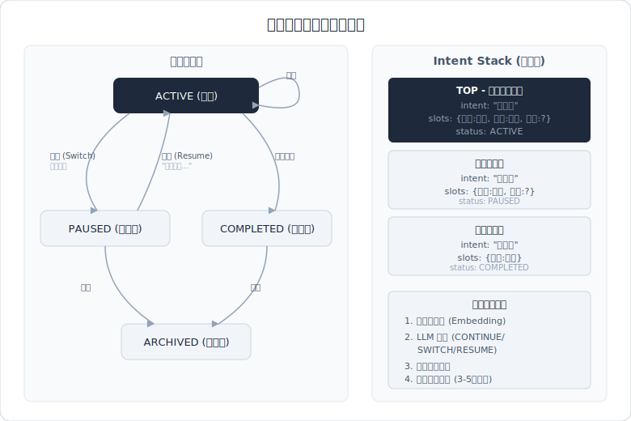

# 意图识别与任务路由

> 面试高频指数：⭐⭐⭐⭐⭐

## 概述

意图识别与任务路由是 Agent 系统的"入口门卫"——决定用户请求该由谁处理、怎么处理。在多 Agent 架构中，路由的准确性直接影响整个系统的响应质量和效率。面试中该模块的考察重点：意图识别技术选型（30%）、路由架构设计（35%）、异常处理与兜底（20%）、评估与冷启动（15%）。

核心链路：**用户输入 → 意图识别 → 路由决策 → Agent/工具分发 → 执行反馈**

## 高频面试题

### Q1: Agent 中意图识别有哪些主流方案？各自优缺点？
**考察点：** 技术选型能力、方案对比
**难度：** 基础
**答案要点：**
- **LLM 分类（Prompt-based）**：直接用大模型做 zero-shot/few-shot 意图分类，通过 Prompt 给出意图列表让 LLM 判断
  - 优点：无需训练数据，上线快，能处理复杂/模糊表述，理解上下文语义
  - 缺点：延迟高、成本高、结果不够稳定、受 Prompt 质量影响大
- **Embedding 相似度匹配**：将用户 query 和预定义意图描述分别做 Embedding，取余弦相似度最高的意图
  - 优点：速度快、成本低、可离线计算、对同义表述鲁棒
  - 缺点：依赖 Embedding 质量、难处理复合意图、意图描述需精心设计
- **规则引擎/关键词匹配**：基于正则、关键词、模式匹配等确定性规则
  - 优点：速度极快、完全可控、可解释性强、无额外成本
  - 缺点：覆盖率低、维护成本高、无法处理模糊表述
- **Fine-tuned 小模型分类器**：基于 BERT/RoBERTa 等微调的专用分类模型
  - 优点：精度高、推理快、成本低
  - 缺点：需要标注数据、新增意图需重新训练、泛化性有限
- **混合方案（推荐）**：规则引擎处理高频/确定性意图 → Embedding 做初筛 → LLM 做复杂/模糊意图兜底
  - 实际生产中 80% 请求由规则 + Embedding 处理，仅 20% 走 LLM，兼顾效率和效果

**深入追问：**
- 混合方案中各层级的置信度阈值怎么设？（规则层 100% 置信直接路由，Embedding 层 >0.85 直接路由，0.6~0.85 走 LLM 确认，<0.6 直接走 LLM）
- 如何在不重启服务的情况下热更新意图列表？

> 相关来源：
> - [大模型面试热点：Agent的意图识别怎么做？](https://www.xiaohongshu.com/explore/6884d37b0000000017031beb) - Ryan聊大模型 | 574赞
> - [AI产品面试：在Agent中怎么做意图识别？](https://www.xiaohongshu.com/explore/691699930000000007001dc8) - 老A的AI研究所 | 553赞

---

### Q2: 多意图识别怎么处理？
**考察点：** 复杂场景处理、架构设计
**难度：** 进阶
**答案要点：**
- **问题定义**：用户单条输入包含多个意图，如"帮我查下明天天气，顺便订个会议室"同时包含"天气查询"和"会议室预订"两个意图
- **检测方案**：
  - **多标签分类**：将单标签分类改为多标签分类（sigmoid 替代 softmax），每个意图独立判断是否命中
  - **LLM 结构化输出**：Prompt 引导 LLM 以 JSON 数组形式返回所有识别到的意图，附带置信度
  - **意图分割**：先用 LLM 将复合语句拆分为多个单意图子句，再分别做意图识别
- **执行策略**：
  - **串行执行**：有依赖关系的意图按顺序执行（如"查余额并转账"）
  - **并行执行**：无依赖关系的意图并行处理，合并结果返回
  - **优先级排序**：根据意图的紧急程度、依赖关系排序执行
- **数据要求**：多意图识别场景的标注数据量建议在单意图场景数据量的 20% 以上，且多意图涉及的意图需在单意图场景中出现过
- **结果合并**：多意图执行完毕后，需将多个结果统一整合为连贯的回复

**深入追问：**
- 多意图之间有冲突怎么办？（如"开灯"和"关灯"同时出现）
- 多意图的执行顺序如何确定？怎么处理意图间的依赖关系？

> 相关来源：
> - [大模型面试热点：Agent的意图识别怎么做？](https://www.xiaohongshu.com/explore/6884d37b0000000017031beb) - Ryan聊大模型 | 574赞
> - [AI产品面试：在Agent中怎么做意图识别？](https://www.xiaohongshu.com/explore/691699930000000007001dc8) - 老A的AI研究所 | 553赞

---

### Q3: 意图消歧策略有哪些？
**考察点：** 用户体验设计、对话管理
**难度：** 进阶
**答案要点：**
- **消歧触发条件**：Top-1 和 Top-2 意图置信度差距小于阈值（如 <0.15）；多个意图置信度均高于阈值；用户表述本身存在歧义
- **主动消歧（Clarification）**：
  - **选项式追问**：向用户展示可能的意图选项，让用户选择——"您是想查询订单还是退换商品？"
  - **开放式追问**：引导用户补充信息——"能具体说一下您想做什么吗？"
  - **槽位追问**：通过追问关键槽位来缩小意图范围——"您说的'苹果'是指水果还是手机？"
- **被动消歧（Context-based）**：
  - **上下文推断**：利用对话历史和用户画像自动推断最可能的意图
  - **场景约束**：根据当前业务场景缩小意图候选集（如在支付页面，"取消"大概率指取消支付）
  - **实体关联**：通过已识别的实体反推意图（识别到"航班号"→ 意图大概率是航班查询）
- **消歧次数控制**：设置最大消歧轮数（一般 2~3 轮），超过则走兜底策略，避免用户反感
- **LLM 辅助消歧**：利用 LLM 的上下文理解能力，结合对话历史自动做出最优判断，减少不必要的追问

**深入追问：**
- 如何平衡消歧准确性和用户体验？追问太多用户会流失
- 消歧和多轮对话管理怎么结合？状态机怎么设计？

> 相关来源：
> - [AI产品面试：在Agent中怎么做意图识别？](https://www.xiaohongshu.com/explore/691699930000000007001dc8) - 老A的AI研究所 | 553赞
> - [面试官最爱问的大模型×Agent面试题清单](https://www.xiaohongshu.com/explore/691ebfc6000000001d03eb87) - 极客时间 | 522赞

---

### Q4: Agent 路由策略有哪些设计模式？
**考察点：** 架构设计、多 Agent 系统理解
**难度：** 进阶
**答案要点：**
- **基于意图的路由（Intent-based Routing）**：
  - 根据意图分类结果直接映射到对应 Agent/工具
  - 实现简单，适用于意图与处理器一一对应的场景
  - 局限：意图新增需同步更新路由表
- **基于能力的路由（Capability-based Routing）**：
  - 每个 Agent 声明自己的能力描述（capability description），路由器根据 query 与能力描述的匹配度分发
  - 更灵活，新增 Agent 只需注册能力，无需修改路由逻辑
  - 类似"Agents as Tools"模式——将 Agent 视为可调用的高级工具
- **基于 LLM 的动态路由（LLM Router）**：
  - 用 LLM 作为路由器，输入 query + 各 Agent 的描述，让 LLM 判断最合适的 Agent
  - 优势：能理解微妙语义差异、支持多步路由、处理模糊请求
  - 适用于 Agent 数量多、边界模糊的复杂场景
- **确定性路由（Rule-based/Deterministic Routing）**：
  - 基于规则和条件判断做路由，不依赖 LLM
  - 适用于 Agent 或工作流可从初始输入直接确定的场景
  - 速度最快、最可预测、成本最低
- **混合路由**：
  - 第一层用规则做确定性路由（处理明确请求）
  - 第二层用 Embedding 相似度做能力匹配
  - 第三层用 LLM 做复杂决策和兜底

**深入追问：**
- 路由决策本身的延迟怎么控制？如何避免路由成为瓶颈？
- 路由错误怎么检测和纠正？（Agent 执行后发现无法处理，需要 re-route）

> 相关来源：
> - [大模型面试热点：Agent的意图识别怎么做？](https://www.xiaohongshu.com/explore/6884d37b0000000017031beb) - Ryan聊大模型 | 574赞
> - [字节跳动Agent开发一面](https://www.xiaohongshu.com/explore/69b4daa5000000001b020dc1) - K1ra | 1755赞

---

### Q5: 如何设计一个多 Agent 路由系统？



**考察点：** 系统设计、工程落地能力
**难度：** 高级
**答案要点：**
- **整体架构**：
  ```
  用户请求 → Gateway → Intent Classifier → Router → Agent Pool → Response Aggregator → 用户
  ```
- **核心组件**：
  - **Gateway**：统一入口，负责鉴权、限流、请求预处理
  - **Intent Classifier**：意图识别模块，输出意图 + 置信度 + 提取的实体/槽位
  - **Router（路由器/Supervisor）**：核心决策中枢，根据意图、上下文、Agent 状态做路由决策
  - **Agent Registry**：Agent 注册表，记录每个 Agent 的能力、状态、负载、SLA
  - **Agent Pool**：可用 Agent 集合，按领域划分（客服 Agent、数据分析 Agent、工具 Agent 等）
  - **Response Aggregator**：多 Agent 结果聚合，统一回复格式
- **路由决策要素**：
  - 意图匹配度（语义相关性）
  - Agent 当前负载和可用性
  - 用户偏好和历史交互
  - SLA 要求（时延敏感 vs 质量敏感）
- **两种 Agent 选择范式**：
  - **Query-Pairing**：直接基于 query 选择 Agent，更快但精度有限
  - **Response-Pairing**：多个 Agent 同时生成回答，选最优的返回，更慢但效果更好
- **上下文传递策略**（最小信息原则）：
  - Supervisor 拿到全量上下文，拆任务、选 Agent、裁剪上下文
  - 子 Agent 只看到被裁剪后的输入，避免信息过载
- **关键设计模式**：
  - **Supervisor 模式**：中央 LLM 监督者动态分发任务，支持多步骤循环路由
  - **Handoff 模式**：Agent 之间动态委派，每个 Agent 评估是否自己处理还是转交
  - **Agents as Tools 模式**：主 Agent 将子 Agent 视为工具函数调用

**深入追问：**
- 如何做到 Agent 的热插拔？新增/下线 Agent 不影响系统运行？
- 多 Agent 间的上下文共享怎么设计？如何避免信息泄漏？
- 如何处理 Agent 间的循环依赖？

> 相关来源：
> - [面试官：搭建AI AGENT需要哪几个模块？](https://www.xiaohongshu.com/explore/68522038000000002202b665) - 24小时搬砖的黎同学 | 951赞
> - [字节ai agent一面（贼难）](https://www.xiaohongshu.com/explore/69a52cbf000000001d027325) - 互联网代面 | 2170赞
> - [大模型应用开发-agent相关面经](https://www.xiaohongshu.com/explore/697f48d5000000000e03c1d5) - 不爱秋招爱整理 | 1257赞

---

### Q6: Fallback/兜底机制怎么设计？
**考察点：** 系统鲁棒性、异常处理
**难度：** 进阶
**答案要点：**
- **多层级兜底架构**：
  - **L1 - 路由级兜底**：意图识别置信度低于阈值时，不做路由，直接走通用 Agent 或发起消歧
  - **L2 - Agent 级兜底**：目标 Agent 不可用/超时时，切换到备用 Agent 或降级处理
  - **L3 - 模型级兜底**：主力模型（如 GPT-4）不可用时，回退到备用模型（如 GPT-3.5/本地模型）
  - **L4 - 系统级兜底**：所有 AI 服务不可用时，转人工/返回预制回复
- **触发条件**：
  - 意图识别置信度 < 阈值（如 0.5）
  - Agent 响应超时（如 > 10s）
  - Agent 返回错误码（HTTP 4xx/5xx）
  - 执行结果质量评估不达标
- **重试策略**：
  - 指数退避重试（exponential backoff）：用于可重试的临时性错误
  - 降级执行（graceful degradation）：简化请求重试，如关闭 RAG 直接用 LLM 回答
  - 模型降级：切换到更小但更稳定的模型
- **兜底响应设计**：
  - 诚实告知能力边界，不要编造回答
  - 提供替代方案或引导路径
  - 记录失败案例用于后续优化
- **容错执行模式**：分析错误类型 → 可重试错误走指数退避 → 不可重试错误走降级执行 → 关键错误走人工兜底

**深入追问：**
- 兜底的阈值怎么调优？太低漏掉太多，太高误触发太多
- 如何区分"语义级失败"（意图未达成但形式上完成了）和"语法级失败"（报错/超时）？

> 相关来源：
> - [招Agent的开始问这些了](https://www.xiaohongshu.com/explore/688e2ff80000000023020191) - 凡人小北 | 918赞
> - [快手AI Agent开发一面](https://www.xiaohongshu.com/explore/69b65422000000001a0312bc) - Offer面试官 | 1026赞

---

### Q7: 意图识别的评估指标有哪些？
**考察点：** 量化评估、质量保障
**难度：** 基础
**答案要点：**
- **分类指标（单意图场景）**：
  - **Accuracy（准确率）**：正确分类数 / 总样本数，适用于类别均衡场景
  - **Precision（精确率）**：真正例 / (真正例 + 假正例)，衡量"说对了多少"
  - **Recall（召回率）**：真正例 / (真正例 + 假负例)，衡量"漏掉了多少"
  - **F1-Score**：Precision 和 Recall 的调和平均，综合评估指标
  - **Macro-F1 vs Micro-F1**：Macro 对每个意图平等对待，Micro 按样本量加权
- **多意图场景额外指标**：
  - **Subset Accuracy（完全匹配率）**：所有意图都正确才算对，最严格
  - **Hamming Loss**：错误标签比例，越低越好
  - **Sample-F1**：每个样本计算 F1 后取平均
- **路由相关指标**：
  - **路由准确率**：请求被分配到正确 Agent 的比例
  - **首次路由成功率**：第一次路由就正确的比例（不需要 re-route）
  - **平均路由延迟**：从收到请求到完成路由决策的时间
  - **兜底触发率**：触发 fallback 的请求比例，过高说明主路由能力不足
- **业务指标**：
  - **任务完成率**：最终成功完成用户意图的比例
  - **平均消歧轮数**：需要几轮追问才能确定意图
  - **用户满意度**：主观评分

**深入追问：**
- 当意图类别极度不均衡时（90% 是闲聊，10% 是业务意图），该关注哪个指标？（Macro-F1 + 各类别单独的 Recall）
- 如何做线上评估？A/B 测试怎么设计？

> 相关来源：
> - [面试怎么讲？你的Agent效果咋样？](https://www.xiaohongshu.com/explore/688c564f000000002203b70e) - 亚慧AI产品经理 | 964赞
> - [AI产品经理面试必问：怎么评估一个Agent指标](https://www.xiaohongshu.com/explore/69b3f9550000000023023762) - AI产品果果姐 | 439赞

---

### Q8: 冷启动场景下意图识别怎么做？
**考察点：** 实际工程经验、创新能力
**难度：** 高级
**答案要点：**
- **冷启动核心挑战**：新业务/新场景上线时，没有或只有极少量标注数据，每个意图可能只有几个样本
- **解决方案**：
  - **LLM Zero-shot 分类**：直接用大模型做意图分类，无需任何训练数据，通过精心设计的 Prompt 描述各意图含义即可启动
  - **Few-shot In-Context Learning**：为每个意图准备 3~5 个示例，放入 Prompt 作为上下文示例，快速达到可用水平
  - **意图描述驱动**：用自然语言描述每个意图的含义和典型表述，基于 Embedding 相似度匹配，不需要分类训练
  - **小样本学习（Few-shot Learning）**：使用 Siamese Network、Prototypical Network 等元学习方法，从少量样本学习意图表征
  - **数据增强启动**：
    - 用 LLM 为每个意图生成合成样本（paraphrase、风格转换）
    - 基于模板 + 槽位填充批量生成训练数据
    - 利用回译（back-translation）做数据扩充
  - **迁移学习**：用相似领域的已有意图分类模型做初始化，在少量新数据上微调
- **冷启动到成熟的演进路径**：
  1. **Day 0**：规则 + LLM zero-shot，快速上线
  2. **Week 1-2**：收集真实用户数据，人工标注，用 LLM 辅助标注加速
  3. **Month 1**：积累足够数据后训练专用分类器，替换 LLM 分类降低成本
  4. **持续迭代**：线上 bad case 分析 → 补充训练数据 → 模型更新 → 重复
- **主动学习（Active Learning）加速标注**：选择模型最不确定的样本优先标注，用最少的标注量获得最大的模型提升

**深入追问：**
- 冷启动阶段 LLM 分类的成本怎么控制？（缓存高频 query、使用小模型做初筛）
- 从 LLM 分类切换到专用模型时，如何保证无缝过渡？（并行运行 + 对比测试 + 灰度切换）

> 相关来源：
> - [大模型面试热点：Agent的意图识别怎么做？](https://www.xiaohongshu.com/explore/6884d37b0000000017031beb) - Ryan聊大模型 | 574赞
> - [26春招阿里淘天Agent一面面经分享](https://www.xiaohongshu.com/explore/6991c26a000000001a02f9a0) - Agent搬砖日记 | 1284赞

---

### Q9: Embedding 相似度做意图路由，具体怎么实现？有哪些坑？
**考察点：** 工程实现、实战经验
**难度：** 进阶
**答案要点：**
- **实现流程**：
  1. 为每个 Agent/意图编写能力描述文本（capability description）
  2. 用 Embedding 模型（如 text-embedding-3-small）将描述文本转为向量，存入向量库
  3. 用户 query 到来时，同样做 Embedding，计算与所有意图向量的余弦相似度
  4. 取相似度最高且超过阈值的意图作为识别结果
- **核心优化点**：
  - **描述文本设计**：不仅写意图名称，要写详细描述 + 典型 query 示例，每个意图可以有多个描述向量
  - **多向量表示**：一个意图用多个 Embedding 向量表示（中心向量 + 边界样本向量），提高召回
  - **阈值调优**：通过验证集找到最佳相似度阈值，平衡准确率和覆盖率
  - **不确定性估计**：利用 Monte Carlo Dropout 估计不确定性，不确定的 query 走 LLM 兜底
- **常见坑**：
  - Embedding 模型对短文本（1~3 个词）效果差，需要对短 query 做扩展
  - 语义相近但意图不同的 query 容易混淆（如"取消订单"vs"查询订单"）
  - Embedding 模型更换后所有向量需要重新计算
  - 相似度分数不是概率，不同 query 的分数分布不同，固定阈值有局限

**深入追问：**
- 向量检索的性能如何保证？Agent 数量从 10 个扩展到 1000 个怎么办？（ANN 近似最近邻检索）
- 如何在线更新意图向量而不影响服务？

> 相关来源：
> - [AI产品面试：在Agent中怎么做意图识别？](https://www.xiaohongshu.com/explore/691699930000000007001dc8) - 老A的AI研究所 | 553赞
> - [都写AI Agent，怎么拉开技术差距？](https://www.xiaohongshu.com/explore/699e9c3c000000002602f901) - 小傅哥 | 709赞

---

### Q10: 对比 Query-Pairing 和 Response-Pairing 两种 Agent 选择范式
**考察点：** 高级架构理解、权衡能力
**难度：** 高级
**答案要点：**
- **Query-Pairing（基于请求匹配）**：
  - 原理：根据用户 query 直接选择最匹配的 Agent，只有被选中的 Agent 执行
  - 实现：Router 对 query 做意图分类/相似度匹配 → 选中 Agent → 执行 → 返回
  - 优点：速度快、资源消耗低、延迟可控
  - 缺点：路由错误无法纠正（一旦选错就错到底）、精度依赖路由器质量
  - 适用场景：意图明确、Agent 边界清晰、延迟敏感的场景
- **Response-Pairing（基于响应选择）**：
  - 原理：多个候选 Agent 同时处理同一个 query，生成各自的回答，再由评判器选择最优回答
  - 实现：Router 选出 Top-K 候选 Agent → 全部执行 → Evaluator 评估 → 选最优结果
  - 优点：效果更好，容错能力强，能发现更优的 Agent
  - 缺点：成本高（多个 Agent 同时运行）、延迟高（需等最慢的 Agent）、资源浪费
  - 适用场景：质量优先、成本不敏感的场景
- **混合方案**：
  - 高置信度请求走 Query-Pairing（快速路由）
  - 低置信度请求走 Response-Pairing（保证质量）
  - 根据业务重要性动态切换策略

**深入追问：**
- Response-Pairing 的 Evaluator 怎么设计？用 LLM 当裁判的偏见问题怎么解决？
- 成本和质量的权衡公式怎么建模？

> 相关来源：
> - [字节ai agent一面（贼难）](https://www.xiaohongshu.com/explore/69a52cbf000000001d027325) - 互联网代面 | 2170赞
> - [字节跳动Agent开发一面](https://www.xiaohongshu.com/explore/69b4daa5000000001b020dc1) - K1ra | 1755赞

---

### Q11: Semantic Router 是什么？怎么实现？和 LLM Router 怎么选？

**考察点：** 前沿工具认知、工程权衡能力
**难度：** 进阶

**答案要点：**

**Semantic Router 核心原理：**
- 由 Aurelio Labs 开源，核心思想：将路由决策从"LLM 推理"降级为"向量相似度查找"
- 预先为每个路由（Route）定义一组示例话语（utterances），用 Embedding 模型编码为向量
- 运行时：用户 query → Embedding → 与所有路由向量做余弦相似度 → 取最高匹配的路由
- 本质是一个"超轻量的意图分类器"，不需要 LLM 参与

**实现步骤：**
```python
from semantic_router import Route, SemanticRouter
from semantic_router.encoders import OpenAIEncoder

# 1. 定义路由和示例话语
weather_route = Route(
    name="weather",
    utterances=["天气怎么样", "明天会下雨吗", "气温多少度"],
)
booking_route = Route(
    name="booking",
    utterances=["帮我订会议室", "预约明天的房间", "订一个下午3点的会"],
)

# 2. 初始化路由器
encoder = OpenAIEncoder()
router = SemanticRouter(encoder=encoder, routes=[weather_route, booking_route])

# 3. 路由决策
result = router("明天北京热不热")  # → "weather"
```

**Semantic Router vs LLM Router 工程权衡：**

| 维度 | Semantic Router | LLM Router |
|------|----------------|------------|
| 延迟 | ~5-10ms（仅 Embedding + 向量匹配） | ~500-2000ms（需要 LLM 推理） |
| 成本 | 极低（Embedding API 调用费用） | 高（每次路由都消耗 LLM tokens） |
| 准确率 | 固定意图集合下可达 95%+ | 更高，尤其对模糊/新意图 |
| 灵活性 | 仅支持预定义路由，无法处理未见过的意图 | 可处理开放域、复杂多步路由 |
| 可确定性 | 高——相同输入相同输出 | 低——LLM 有随机性 |
| 维护成本 | 需要维护示例话语集 | 需要维护 Prompt |

**2025-2026 新趋势——vLLM Semantic Router：**
- Red Hat / vLLM 社区将 Semantic Router 概念引入推理框架
- 根据请求的语义复杂度动态路由到不同规模的模型（简单问题 → 小模型，复杂推理 → 大模型）
- 使用 ModernBERT 做分类器，比 LLM 路由快 50 倍、便宜 100 倍

**生产推荐：混合架构**
```
用户 query → Semantic Router (置信度 > 0.85?)
    是 → 直接路由到目标 Agent
    否 → LLM Router 做复杂判断
```

**深入追问：**
- Semantic Router 的示例话语怎么设计？数量多少合适？（每个路由 5-20 条，覆盖同义表述、口语化/书面化变体）
- 新增路由时如何避免和已有路由语义冲突？（可视化路由向量的分布，检查新路由和已有路由的最小距离）

> 相关来源：
> - [大模型面试热点：Agent的意图识别怎么做？](https://www.xiaohongshu.com/explore/6884d37b0000000017031beb) - Ryan聊大模型 | 574赞
> - [AI产品面试：在Agent中怎么做意图识别？](https://www.xiaohongshu.com/explore/691699930000000007001dc8) - 老A的AI研究所 | 553赞

---

### Q12: 多轮对话中的意图跟踪与切换怎么处理？



**考察点：** 对话管理深度理解、状态机设计
**难度：** 高级

**答案要点：**

**核心挑战：**
- 用户在多轮对话中可能：保持同一意图（深入追问）、切换到新意图、回到之前的意图、同时推进多个意图
- Agent 需要准确判断当前意图状态，不能简单地把每轮输入独立分类

**意图跟踪的三种模式：**

1. **意图延续（Continuation）**：用户在同一意图下追问
   - 信号："还有呢"、"继续"、省略主语的追问
   - 处理：沿用当前意图和已有槽位，补充新信息

2. **意图切换（Switch）**：用户转到全新话题
   - 信号：话题突变、出现新领域关键词
   - 处理：归档当前意图状态，初始化新意图

3. **意图恢复（Resume）**：用户回到之前中断的意图
   - 信号："刚才那个..."、"回到之前的话题"
   - 处理：从状态栈中恢复之前的意图和槽位

**状态管理架构——意图栈（Intent Stack）：**
```
Intent Stack:
┌──────────────────────┐
│ 当前活跃意图          │ ← Top (正在处理)
│ intent: "订机票"      │
│ slots: {出发: 北京,   │
│   目的: 上海, 日期: ?}│
├──────────────────────┤
│ 已暂停意图            │ ← 可恢复
│ intent: "查天气"      │
│ slots: {城市: 北京}   │
│ status: COMPLETED     │
├──────────────────────┤
│ 已暂停意图            │
│ intent: "订酒店"      │
│ slots: {城市: 上海,   │
│   日期: ?, 预算: ?}   │
│ status: PAUSED        │
└──────────────────────┘
```

**意图切换检测方案：**
- **基于相似度阈值**：当前轮 query 与活跃意图的 Embedding 相似度低于阈值 → 可能切换
- **基于 LLM 判断**：将对话历史 + 当前输入交给 LLM，显式判断 "CONTINUE / SWITCH / RESUME"
- **基于实体变化**：识别到的实体类型与当前意图的槽位不匹配 → 可能切换

**意图超时与自动清理：**
- 活跃意图超过 N 轮未推进 → 自动提示用户是否继续
- 暂停意图超过阈值时间 → 自动归档
- 栈深度限制（通常 3-5 层），防止状态爆炸

**深入追问：**
- 意图切换和意图消歧怎么区分？（切换是用户主动改变话题，消歧是系统对当前话题不确定）
- 用户说"算了不订了"，怎么判断取消的是哪个意图？（优先取消栈顶意图；如有歧义，主动确认）

> 相关来源：
> - [AI产品面试：在Agent中怎么做意图识别？](https://www.xiaohongshu.com/explore/691699930000000007001dc8) - 老A的AI研究所 | 553赞
> - [面试官最爱问的大模型×Agent面试题清单](https://www.xiaohongshu.com/explore/691ebfc6000000001d03eb87) - 极客时间 | 522赞

---

### Q13: Slot Filling（槽位填充）在 Agent 中怎么用？和传统对话系统有什么区别？

**考察点：** 任务型对话理解、LLM 时代的技术演进
**难度：** 进阶

**答案要点：**

**传统 Slot Filling vs LLM 时代的 Slot Filling：**

| 维度 | 传统方案 | LLM 时代 |
|------|----------|----------|
| 槽位定义 | 硬编码在 schema 中 | 可以用自然语言描述，LLM 自动理解 |
| 提取方式 | NER 模型 + 规则模板 | LLM 结构化输出（JSON Mode / Function Calling） |
| 校验方式 | 正则 + 枚举值校验 | LLM 理解 + 规则校验混合 |
| 追问策略 | 预定义模板追问 | LLM 生成自然语言追问 |
| 灵活性 | 低——新增槽位需改代码 | 高——修改 Prompt 即可 |
| 准确性 | 特定域内高 | 通用性强但偶有幻觉 |

**Agent 中 Slot Filling 的典型实现：**
```python
# 定义任务的槽位 schema
task_schema = {
    "intent": "订机票",
    "required_slots": {
        "departure": {"type": "city", "prompt": "请问从哪里出发？"},
        "destination": {"type": "city", "prompt": "要去哪个城市？"},
        "date": {"type": "date", "prompt": "什么时候出发？"},
    },
    "optional_slots": {
        "cabin_class": {"type": "enum", "values": ["经济舱","商务舱","头等舱"]},
        "airline_preference": {"type": "string"},
    }
}

# LLM 提取槽位
def extract_slots(user_input, current_slots, schema):
    prompt = f"""根据用户输入提取槽位信息:
    当前已有槽位: {current_slots}
    用户输入: {user_input}
    需要提取的槽位: {schema}
    输出 JSON 格式的更新后的槽位。"""
    return llm.generate(prompt, response_format="json")
```

**关键设计点：**
- **增量更新**：每轮只更新变化的槽位，不重新提取全部
- **隐式槽位提取**："帮我订明天去上海的机票"一句话可能填充 date + destination 两个槽位
- **槽位冲突处理**：用户修改已填槽位时（"不去上海了，改去杭州"），需要正确覆盖
- **必填槽位追问**：所有 required_slots 填充完毕才触发工具调用；缺失槽位按优先级追问
- **槽位校验**：提取后用规则校验（日期不能是过去、城市必须存在等），LLM 幻觉出的无效值需拦截

**深入追问：**
- 槽位填充和 Function Calling 的参数提取有什么关系？（Slot Filling 是意图级的参数收集，Function Calling 是工具级的参数传递——Agent 先做 Slot Filling 确认完整后再调 Function）
- 多意图场景下槽位冲突怎么办？（每个意图维护独立的槽位集，通过意图栈隔离）

> 相关来源：
> - [大模型面试热点：Agent的意图识别怎么做？](https://www.xiaohongshu.com/explore/6884d37b0000000017031beb) - Ryan聊大模型 | 574赞
> - [招Agent的开始问这些了](https://www.xiaohongshu.com/explore/688e2ff80000000023020191) - 凡人小北 | 918赞

---

### Q14: 动态路由 vs 静态路由怎么选？各自适用场景是什么？

**考察点：** 架构设计权衡、运维经验
**难度：** 进阶

**答案要点：**

**定义：**
- **静态路由**：路由规则在部署时确定，运行时不变。意图 A → Agent X，意图 B → Agent Y，写死在配置中
- **动态路由**：路由决策在运行时基于上下文动态生成。可能同一个意图根据不同条件路由到不同 Agent

**对比：**

| 维度 | 静态路由 | 动态路由 |
|------|---------|---------|
| 决策方式 | 规则表 / 配置文件 | LLM 推理 / 策略模型 |
| 延迟 | <1ms（查表） | 100ms-2s（依赖 LLM） |
| 可预测性 | 完全可预测 | 有不确定性 |
| 灵活性 | 低——新 Agent 需改配置重部署 | 高——新 Agent 注册后自动被发现 |
| 可解释性 | 高——规则可审计 | 低——LLM 决策是黑盒 |
| 维护成本 | 随 Agent 数量线性增长 | 相对稳定 |
| 适用场景 | Agent 少（<10）、边界清晰 | Agent 多（>10）、边界模糊 |

**动态路由的实现模式：**

1. **LLM-as-Router**：直接让 LLM 根据 Agent 描述选择
   ```
   System: 你是一个路由器。根据用户请求选择最合适的 Agent。
   可用 Agent: [Agent描述列表]
   User: {query}
   Output: {"agent": "xxx", "confidence": 0.9, "reason": "..."}
   ```

2. **基于能力向量的动态匹配**：每个 Agent 注册能力描述向量，新 query 匹配最近的能力

3. **策略网络**：训练一个轻量分类模型做路由决策，定期用线上数据更新

**混合方案（推荐）：**
```
用户请求
  ↓
静态规则层 (处理明确、高频请求)
  ↓ 未命中
Embedding 匹配层 (快速语义路由)
  ↓ 置信度不足
LLM 动态路由层 (处理复杂/模糊请求)
  ↓
目标 Agent
```

**热更新设计：**
- Agent 注册表存储在配置中心（如 Consul / etcd），Agent 上下线自动更新
- 静态规则通过配置热加载，无需重启
- Embedding 向量通过后台任务增量更新

**深入追问：**
- 动态路由的 LLM 调用成本怎么控制？（缓存高频 query 的路由结果 + 对重复 pattern 自动生成静态规则）
- 路由决策本身失败了怎么办？（超时兜底到默认 Agent + 记录失败路由用于后续优化）

> 相关来源：
> - [字节跳动Agent开发一面](https://www.xiaohongshu.com/explore/69b4daa5000000001b020dc1) - K1ra | 1755赞
> - [字节ai agent一面（贼难）](https://www.xiaohongshu.com/explore/69a52cbf000000001d027325) - 互联网代面 | 2170赞

---

### Q15: 路由链路的可观测性怎么做？

**考察点：** 生产运维能力、系统可靠性保障
**难度：** 高级

**答案要点：**

**为什么路由可观测性特别重要：**
- 路由是 Agent 系统的"第一跳"——路由错了，后面全错
- 路由错误往往是"静默失败"——Agent 会正常返回结果，但是错误 Agent 的结果
- 没有可观测性，排查"为什么 Agent 答错了"会非常困难

**三大可观测性支柱在路由中的应用：**

| 支柱 | 路由场景应用 |
|------|-------------|
| **Metrics（指标）** | 路由准确率、各 Agent 的请求分布、路由延迟 P50/P95/P99、兜底触发率、意图分布变化 |
| **Logs（日志）** | 每次路由决策的完整记录：query → 候选意图 + 置信度 → 最终路由 → 目标 Agent |
| **Traces（链路追踪）** | 从用户请求到最终响应的全链路 trace：Gateway → Intent Classifier → Router → Agent → Response |

**路由决策日志结构（推荐）：**
```json
{
  "trace_id": "abc-123",
  "timestamp": "2026-03-31T10:00:00Z",
  "query": "帮我查下明天天气",
  "routing_decision": {
    "method": "semantic_router",       // 哪一层做的决策
    "candidates": [
      {"intent": "weather", "score": 0.92},
      {"intent": "calendar", "score": 0.31}
    ],
    "selected": "weather",
    "confidence": 0.92,
    "target_agent": "weather_agent",
    "latency_ms": 8
  },
  "fallback_triggered": false,
  "re_route_count": 0
}
```

**关键监控告警：**
- **意图漂移告警**：某个意图的请求占比突然变化（可能是新业务上线或 Prompt 变更导致）
- **路由准确率下降**：通过人工标注采样或用户反馈检测
- **兜底率突增**：说明主路由能力不足或有新类型请求涌入
- **路由延迟突增**：可能是 LLM Router 超时或 Embedding 服务异常

**工具链推荐：**
- **Langfuse / Arize Phoenix**：LLM 应用专用可观测性平台，支持 trace 可视化
- **OpenTelemetry**：标准化的分布式追踪协议，Agent 框架越来越多支持
- **Grafana + Prometheus**：传统监控栈，适合自定义指标面板

**深入追问：**
- 如何从日志中自动发现路由错误？（用 LLM 评估路由结果和 Agent 输出的匹配度，低分标记为疑似路由错误）
- 可观测性数据怎么反哺路由优化？（分析高频兜底 query → 补充到对应意图的训练数据/示例话语中）

> 相关来源：
> - [面试怎么讲？你的Agent效果咋样？](https://www.xiaohongshu.com/explore/688c564f000000002203b70e) - 亚慧AI产品经理 | 964赞
> - [快手AI Agent开发一面](https://www.xiaohongshu.com/explore/69b65422000000001a0312bc) - Offer面试官 | 1026赞

---

### Q16: 路由的 A/B 测试怎么做？

**考察点：** 数据驱动决策、实验设计能力
**难度：** 高级

**答案要点：**

**路由 A/B 测试的特殊性：**
- 不同于普通 A/B 测试（只比较 UI 或文案），路由 A/B 测试影响的是"哪个 Agent 处理请求"——直接影响回答质量
- 需要同时评估路由准确率和下游 Agent 的表现

**测试场景：**
1. **路由策略对比**：规则路由 vs Embedding 路由 vs LLM 路由
2. **模型对比**：Embedding 模型 A vs B 做路由的效果差异
3. **阈值调优**：置信度阈值 0.7 vs 0.8 vs 0.9 的兜底率和准确率权衡
4. **新 Agent 上线**：新 Agent 灰度接入部分流量，验证路由和响应质量

**实验设计：**
```
流量分配:
  用户请求 → AI Gateway (流量分割器)
              ├── 50% → 路由策略 A (Control)
              └── 50% → 路由策略 B (Treatment)

分流维度:
  - 按 user_id 哈希分流 (保证同一用户一致性)
  - 或按 session_id 分流 (同一会话内策略一致)

评估指标:
  - 主指标: 任务完成率、用户满意度
  - 辅助指标: 路由准确率、首次路由成功率、平均响应延迟
  - 安全指标: 兜底触发率不能显著升高
```

**Multi-Armed Bandit（MAB）自适应路由：**
- 传统 A/B 测试需要等实验结束才能得出结论，MAB 可以边测边调
- Thompson Sampling / UCB 算法：表现好的路由策略自动获得更多流量
- 适合需要快速收敛的场景（如新 Agent 上线的灰度阶段）

**灰度发布流程：**
```
Phase 1: Shadow Mode (影子模式)
  新路由策略在后台运行，记录决策但不实际执行
  对比新旧策略的决策差异

Phase 2: Canary (金丝雀)
  5% 流量走新策略，监控关键指标

Phase 3: Gradual Rollout (渐进发布)
  5% → 20% → 50% → 100%
  每一步都设置自动回滚阈值

Phase 4: Full Rollout
  100% 切换，保留旧策略作为 fallback
```

**深入追问：**
- A/B 测试中如何处理多轮对话？（同一会话的所有轮次必须走同一策略，避免中途切换导致状态不一致）
- 样本量怎么估算？（取决于 baseline 指标和期望提升幅度，通常需要数千到数万请求）

> 相关来源：
> - [AI产品经理面试必问：怎么评估一个Agent指标](https://www.xiaohongshu.com/explore/69b3f9550000000023023762) - AI产品果果姐 | 439赞
> - [2026大模型Agent面试全攻略（上）](https://www.xiaohongshu.com/explore/69ad4bb9000000000d00a454) - AI实战领航员 | 527赞

---

## 速记框架

```
意图识别四大方案：
  规则引擎 → Embedding → Fine-tuned 小模型 → LLM（成本递增、灵活性递增）

生产推荐混合架构：
  L1 规则（高频确定意图）→ L2 Embedding（相似度匹配）→ L3 LLM（复杂兜底）

路由四大模式：
  确定性路由 | 意图路由 | 能力路由 | LLM 动态路由

多 Agent 选择范式：
  Query-Pairing（快但可能不准）vs Response-Pairing（准但慢且贵）

Agent 架构模式：
  Supervisor（中央调度）| Handoff（动态委派）| Agents-as-Tools（子 Agent 当工具）

兜底四层：
  路由级 → Agent级 → 模型级 → 系统级（人工）

冷启动演进：
  Day0 规则+LLM → 收集数据 → 训练专用模型 → 持续迭代

消歧三原则：
  1. 追问不超过3轮  2. 能用上下文推断就别问  3. 超限走兜底

Semantic Router 决策树：
  置信度 > 0.85 → 直接路由
  0.6~0.85 → LLM 确认
  < 0.6 → LLM 完整判断

意图跟踪三模式：
  延续 (Continuation) | 切换 (Switch) | 恢复 (Resume)
  用 Intent Stack 管理，支持暂停/恢复

Slot Filling 新旧对比：
  传统: NER + 规则 + 模板追问
  LLM时代: 结构化输出 + 自然语言追问 + Prompt即schema

路由可观测性三支柱：
  Metrics (准确率/延迟/分布) + Logs (决策记录) + Traces (全链路)

A/B 测试四阶段：
  Shadow → Canary 5% → Gradual → Full Rollout
```

## 相关小红书笔记来源

- [2170赞] 字节ai agent一面（贼难）
- [1755赞] 字节跳动Agent开发一面
- [1284赞] 26春招阿里淘天Agent一面面经分享
- [1026赞] 快手AI Agent开发一面
- [964赞] 面试怎么讲？你的Agent效果咋样？
- [951赞] 面试官：搭建AI AGENT需要哪几个模块？
- [918赞] 招Agent的开始问这些了
- [574赞] 大模型面试热点：Agent的意图识别怎么做？
- [553赞] AI产品面试：在Agent中怎么做意图识别？
- [527赞] 2026大模型Agent面试全攻略（上）
- [522赞] 面试官最爱问的大模型×Agent面试题清单
- [439赞] AI产品经理面试必问：怎么评估一个Agent指标

---

## 来源

- [大模型-Agent 面试八股文（知乎）](https://zhuanlan.zhihu.com/p/30772276091)
- [AI大模型Agent面试精选15题（知乎）](https://zhuanlan.zhihu.com/p/1980294044010702447)
- [Intent Recognition and Auto-Routing in Multi-Agent Systems](https://gist.github.com/mkbctrl/a35764e99fe0c8e8c00b2358f55cd7fa)
- [AI Agent Routing: Tutorial & Best Practices - Patronus AI](https://www.patronus.ai/ai-agent-development/ai-agent-routing)
- [Ultimate Guide to AI Agent Routing - Botpress](https://botpress.com/blog/ai-agent-routing)
- [Best Practices for Building an Agent Router - Arize AI](https://arize.com/blog/best-practices-for-building-an-ai-agent-router/)
- [Intent Detection in the Age of LLMs (arXiv)](https://arxiv.org/html/2410.01627v1)
- [Semantic Similarity as an Intent Router - Zep](https://blog.getzep.com/building-an-intent-router-with-langchain-and-zep/)
- [多Agent路由策略 - 博客园](https://www.cnblogs.com/gogoSandy/p/18411463)
- [多Agent路由策略 - 腾讯云](https://cloud.tencent.com/developer/article/2451000)
- [Choosing the Right Multi-Agent Architecture - LangChain Blog](https://blog.langchain.com/choosing-the-right-multi-agent-architecture/)
- [AI Agent Orchestration Patterns - Microsoft Azure](https://learn.microsoft.com/en-us/azure/architecture/ai-ml/guide/ai-agent-design-patterns)
- [Chapter 2: Routing - Agentic Design Patterns](https://adp.xindoo.xyz/original/Chapter%202_%20Routing/)
- [Hybrid LLM + Intent Classification Approach (Medium)](https://medium.com/data-science-collective/intent-driven-natural-language-interface-a-hybrid-llm-intent-classification-approach-e1d96ad6f35d)
- [Building an Intent Classification Pipeline - Langfuse](https://langfuse.com/guides/cookbook/example_intent_classification_pipeline)
- [基于小样本学习的意图识别冷启动（知乎）](https://zhuanlan.zhihu.com/p/65801219)
- [为语言模型应用添加Failback机制（CSDN）](https://blog.csdn.net/fgayif/article/details/146385690)
- [Semantic Router - Aurelio Labs (GitHub)](https://github.com/aurelio-labs/semantic-router)
- [vLLM Semantic Router: Next Phase in LLM Inference](https://blog.vllm.ai/2025/09/11/semantic-router.html)
- [LLM Semantic Router: Intelligent Request Routing - Red Hat](https://developers.redhat.com/articles/2025/05/20/llm-semantic-router-intelligent-request-routing)
- [Building a Real-Time Intent Router Without a Large LLM (Medium)](https://moshe-haim-makias.medium.com/building-a-real-time-intent-router-why-you-dont-need-a-large-llm-44ff0eda24b6)
- [对话理解：意图识别 & 槽位填充（知乎）](https://zhuanlan.zhihu.com/p/581792419)
- [如何借助 LLM 设计任务型对话 Agent - Thoughtworks](https://www.thoughtworks.com/zh-cn/insights/blog/machine-learning-and-ai/how-to-design-task-based-dialogue-Agent-with-LLM)
- [5 Strategies for A/B Testing for AI Agent Deployment - Maxim](https://www.getmaxim.ai/articles/5-strategies-for-a-b-testing-for-ai-agent-deployment/)
- [A/B Testing Strategies for AI Agents - Maxim](https://www.getmaxim.ai/articles/a-b-testing-strategies-for-ai-agents-how-to-optimize-performance-and-quality/)
- [Agent Factory: Top 5 Agent Observability Best Practices - Microsoft Azure](https://azure.microsoft.com/en-us/blog/agent-factory-top-5-agent-observability-best-practices-for-reliable-ai/)
- [AI Agent Observability: A Practical Framework - N-iX](https://www.n-ix.com/ai-agent-observability/)
- [15 AI Agent Observability Tools in 2026 - AIMultiple](https://aimultiple.com/agentic-monitoring)
