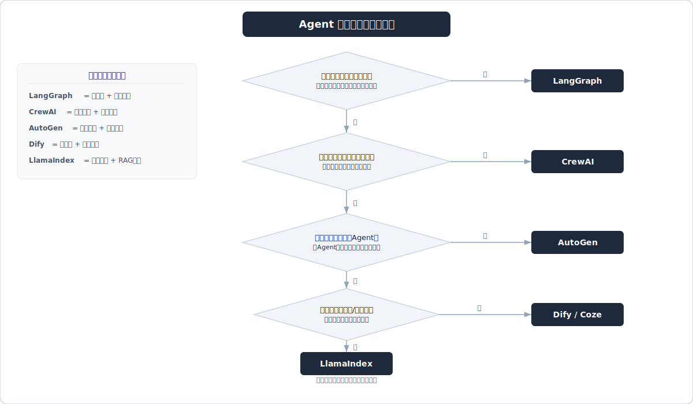
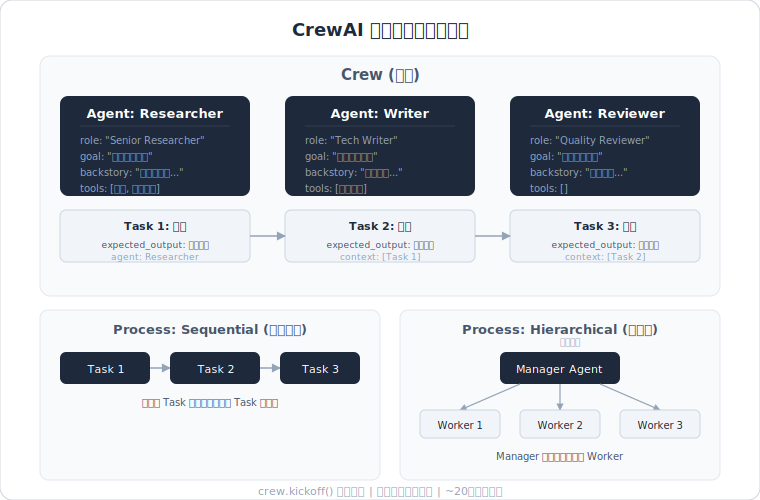

# LangChain / LangGraph / LlamaIndex 框架实战



> 面试高频指数：⭐⭐⭐⭐⭐

## 概述

2026 届春招中，**LangGraph 是最高频的框架考点**，几乎所有大模型应用开发岗位（阿里、字节、快手、京东、联想）都会追问 LangGraph 的核心机制。LangChain 作为基础设施仍被考察，LlamaIndex 主要出现在"框架对比选型"场景。考察维度分三类：**框架核心概念**（节点/状态/Graph 结构）、**工程实战细节**（并发安全/Checkpoint 持久化/Memory 隔离）、**框架选型理由**（为什么用这个框架而不是另一个）。

---

## LangGraph 高频面试题

### Q1: LangGraph 的核心组件有哪些？上下文是如何管理的？

**考察点：** LangGraph 基础架构、状态管理机制
**难度：** ⭐⭐（基础）

**答案要点：**
- **核心组件**：
  - **StateGraph**：整个图的容器，定义节点（Node）和边（Edge）的拓扑结构
  - **State（状态对象）**：用 TypedDict 定义，贯穿整个图的共享数据结构；每个节点读取 State、执行逻辑后返回更新后的 State
  - **Node（节点）**：Python 函数，接收 State 返回 State 的局部更新；可以是 LLM 调用、工具调用、条件判断
  - **Edge（边）**：定义节点间的流转，分为：普通边（固定跳转）、条件边（`add_conditional_edges`，根据 State 动态路由）
  - **Checkpointer（持久化层）**：将每步执行后的 State 快照持久化（支持 MemorySaver、SQLiteSaver、PostgresSaver），实现断点续跑和人机交互（Human-in-the-loop）
  - **Memory Store**：跨线程的长期记忆存储，与 Checkpointer（线程内短期记忆）互补

- **上下文管理机制**：
  - LangGraph 用 `thread_id` 区分不同会话的上下文，同一 `thread_id` 共享 Checkpointer 中的历史 State
  - 节点之间通过 State 对象传递上下文，而不是通过全局变量
  - State 字段可定义 `Annotated[list, add_messages]` 等 reducer 函数，控制多次更新时的合并策略（追加 vs 覆盖）

**深入追问：**
- State 中如何区分"需要追加"的字段（如消息历史）和"需要覆盖"的字段（如当前工具调用结果）？（用 Annotated + reducer 函数，消息用 `add_messages`，普通字段直接赋值覆盖）
- Checkpointer 和 Memory Store 的区别是什么？（Checkpointer 是线程内短期记忆/执行状态，Store 是跨线程的长期记忆）

> 相关来源：
> - [京东大模型算法工程二面记录+点评](https://www.xiaohongshu.com/explore/69169d2f000000000d00e6b0) — 121赞
> - [20260310阿里国际Agent实习一面](https://www.xiaohongshu.com/explore/69b02f230000000022023c75) — 50赞

---

### Q2: 相比 LangChain，LangGraph 在循环任务和状态管理上有哪些优势？LangGraph 适用于什么场景？

**考察点：** 框架对比选型、工程决策能力
**难度：** ⭐⭐（基础）

**答案要点：**
- **LangChain 的局限**：
  - 基于 Chain（链式调用），本质是线性 DAG，不支持原生循环（循环需要用回调或自己递归）
  - 复杂分支逻辑靠 `RunnableBranch` 或 `RouterChain`，可读性差，难以维护
  - 状态在 Chain 间传递不透明，调试困难
  - 不原生支持 Human-in-the-loop（人工干预）

- **LangGraph 的优势**：
  - **原生支持循环**：StateGraph 可以定义 `node -> node -> node -> ... -> END` 的循环路径，天然适合 ReAct 等需要迭代的模式
  - **显式状态管理**：State 对象让数据流完全可见、可追溯，方便调试
  - **Checkpointer 持久化**：支持中断后恢复，可实现 Human-in-the-loop（在节点间插入人工审批节点）
  - **条件路由清晰**：`add_conditional_edges` + 路由函数，分支逻辑与业务逻辑分离，代码更清晰

- **LangGraph 适用场景**：
  - 需要**循环和反思**的 Agent（ReAct、自我纠错、反复检索直到满足条件）
  - 需要**人工干预**的工作流（审批、确认、内容审核）
  - **多 Agent 协作**（每个子 Agent 是图中的一个节点或子图）
  - 需要**断点续跑**的长流程任务
  - 状态复杂、分支多的 Agent 系统（状态机思维建模）

- **LangGraph 不适合的场景**：
  - 简单的一次性问答（直接调 API 就够了，框架反而带来额外复杂度）
  - 高度定制化的工业级需求（框架约束太多，可能需要手搓）
  - 对延迟极度敏感的场景（框架本身有开销）

**深入追问：**
- 什么时候应该放弃 LangGraph 直接手搓 Agent？（当框架的状态机模型和业务逻辑发生严重阻抗不匹配时）
- Multi-Agent 场景下，LangGraph 如何组织多个 Agent？（Supervisor 模式：一个 Orchestrator 节点根据 State 路由到不同 Worker 子图；或 Hierarchical 多级 Graph 嵌套）

> 相关来源：
> - [上海某初创公司，发面经攒功德🙏](https://www.xiaohongshu.com/explore/69a82dd2000000002800b15a) — 226赞
> - [阿里大模型agent一面（贼难）](https://www.xiaohongshu.com/explore/69ab09440000000022039cb0) — 273赞
> - [20260310阿里国际Agent实习一面](https://www.xiaohongshu.com/explore/69b02f230000000022023c75) — 50赞
> - [面试前刷一刷，Multi-Agent的坑可以少一个](https://www.xiaohongshu.com/explore/698c3021000000001a024da5) — 195赞

---

### Q3: LangGraph 的状态对象怎么设计？如何避免多轮迭代中 State 序列化过慢？

**考察点：** LangGraph 工程优化，大厂实战细节
**难度：** ⭐⭐⭐（进阶）

**答案要点：**
- **State 设计原则**：
  - 只在 State 中存**跨节点必须共享**的数据，不要把所有中间变量都塞进去
  - 消息历史用 `Annotated[list[BaseMessage], add_messages]`，避免全量替换
  - 对于大对象（文档内容、图片 base64），考虑只存**引用/ID**，实际数据存外部存储（Redis/S3）
  - 区分"需要持久化"的字段和"只在当前 Turn 用"的临时字段，临时字段可以不加入 State（改为节点局部变量传参）

- **序列化性能优化**：
  - 避免在 State 中存大量嵌套的复杂 Python 对象，优先用基础类型（str/int/list/dict）
  - 如果使用 PostgresSaver 等持久化后端，State 会在每个节点执行后序列化写入；减少 State 体积直接降低每步 I/O
  - 对于消息历史，定期触发**摘要压缩**（Summarize），用一条摘要消息替换多轮历史，控制 State 增长
  - 长期记忆迁移到 Memory Store，不要让消息历史无限膨胀在 State 中

- **LangGraph 构建 Agent 的方式**：
  - **ReAct Agent**：`create_react_agent` 工厂函数，快速创建带工具调用的标准 Agent
  - **自定义 StateGraph**：手动定义 nodes + edges，适合复杂业务逻辑
  - **子图（Subgraph）**：将复杂 Agent 封装为子图节点，实现 Multi-Agent 的模块化组合
  - **Workflow + Agent 混合**：部分节点是确定性逻辑（Workflow），部分节点是 LLM 决策（Agent），灵活组合

**深入追问：**
- 字节面试真实问题：如何避免多轮迭代 State 序列化过慢？（减少 State 体积 + 只存引用 + 消息摘要压缩）
- LangGraph 的 `interrupt` 机制是怎么工作的？（在节点执行前/后插入 interrupt，Checkpointer 保存当前 State，等待外部输入后用 `Command(resume=value)` 恢复）

> 相关来源：
> - [字节 大模型应用开发 一面面经](https://www.xiaohongshu.com/explore/69b6b81d000000002800a800) — 237赞
> - [阿里大模型agent一面（贼难）](https://www.xiaohongshu.com/explore/69ab09440000000022039cb0) — 273赞

---

### Q4: LangGraph 并发执行节点时，多个流程同时修改 State 的同一变量（非 list 类型）会怎样？

**考察点：** LangGraph 并发安全，工程细节
**难度：** ⭐⭐⭐（进阶）

**答案要点：**
- **LangGraph 的并发执行**：当多条边从同一节点出发时，LangGraph 会并发执行这些分支节点（Fan-out），然后在汇聚节点（Fan-in）合并 State
- **State 合并规则**：
  - 对于有 **reducer 函数**的字段（如 `add_messages`），并发更新会按 reducer 语义合并
  - 对于**没有 reducer**的普通字段（如 `str` 类型），最后写入的值会覆盖先写入的值（后写胜）——这是**不确定行为**，并发顺序依赖执行时序
- **解决方案**：
  - 对于需要并发安全的字段，**定义 reducer 函数**（如合并列表、取最大值、取最新值等）
  - 避免多个并发分支写同一个非 list 字段
  - 对于需要最终汇聚的结果，用 list 类型 + reducer 收集各分支结果，在汇聚节点统一处理
  - 将共享的可变状态放到**外部存储**（如 Redis），用锁机制保证原子性

- **实际影响**：联想面试中这道题考察候选人是否真正在生产环境用过 LangGraph，而不只是玩过 demo

**深入追问：**
- LangGraph 的 Fan-out/Fan-in 是如何实现的？（在 StateGraph 中，从一个节点引出多条边到不同节点，这些节点并发执行；用 `add_edge` 添加汇聚边到下游节点）
- 如果某个并发节点失败了，整个图怎么处理？（默认异常冒泡中止整个图；可用 try/except 在节点内部捕获，或用 Checkpointer 实现失败重试）

> 相关来源：
> - [天津Ai算法工程师面试笔记-联想集团篇（三）](https://www.xiaohongshu.com/explore/69085e590000000004017f5e) — 83赞

---

### Q5: LangGraph 的 Agent 挂掉后，重启能接着执行吗？如何实现？

**考察点：** LangGraph Checkpoint 持久化机制，生产可靠性
**难度：** ⭐⭐⭐（进阶）

**答案要点：**
- **默认行为**：使用内存 Checkpointer（`MemorySaver`）时，进程重启后 State 丢失，无法续跑
- **持久化 Checkpointer**：使用 `SqliteSaver` 或 `PostgresSaver` 将每步 State 持久化到磁盘/数据库，重启后可以恢复
  ```python
  from langgraph.checkpoint.sqlite import SqliteSaver
  checkpointer = SqliteSaver.from_conn_string("checkpoints.db")
  graph = workflow.compile(checkpointer=checkpointer)
  ```
- **续跑机制**：
  1. 重启后用相同的 `thread_id` 调用图
  2. LangGraph 自动从 Checkpointer 加载最后一个 State 快照
  3. 从断点处继续执行，已完成的节点不会重复执行
- **State 快照（Snapshot）**：
  - 每次节点执行后自动保存一个 Checkpoint，包含当前 State + 下一步待执行的节点
  - 支持**时间旅行（Time Travel）**：可以回滚到任意历史 Checkpoint，修改 State 后重新执行（`update_state` + 从指定 checkpoint 重跑）
- **Human-in-the-Loop 的实现基础**：Checkpoint 让 Agent 可以暂停等待人工输入，人工确认后再继续，底层就是利用持久化 Checkpoint

**深入追问：**
- 联想面试原题：如果 langgraph 的 agent 突然挂掉了，重启 agent 后还能接着执行吗？怎么办？（换用持久化 Checkpointer）
- 如何实现"回滚到某次执行的中间状态"？（用 `graph.get_state_history(config)` 获取历史，用 `graph.update_state` 修改指定 Checkpoint，再从该 Checkpoint invoke）

> 相关来源：
> - [天津Ai算法工程师面试笔记-联想集团篇（三）](https://www.xiaohongshu.com/explore/69085e590000000004017f5e) — 83赞
> - [20260310阿里国际Agent实习一面](https://www.xiaohongshu.com/explore/69b02f230000000022023c75) — 50赞

---

### Q6: LangGraph 中如何定义循环终止条件，防止 Agent 陷入死循环？

**考察点：** LangGraph 工程安全，循环控制
**难度：** ⭐⭐（基础）

**答案要点：**
- **条件边（Conditional Edge）**：核心终止机制，路由函数返回 `END` 则图终止
  ```python
  def should_continue(state) -> str:
      if state["messages"][-1].tool_calls:
          return "tools"  # 继续调用工具
      return END           # 没有工具调用，终止

  graph.add_conditional_edges("llm", should_continue)
  ```
- **计数器终止**：在 State 中加 `iteration_count` 字段，每次循环 +1，超过阈值（如 10）强制终止
- **目标达成检测**：在路由函数中检查 State 中的"任务完成标志"字段（如 `task_done: bool`），由执行节点设置
- **`recursion_limit` 参数**：LangGraph 内置最大递归深度限制，默认 25，可在 `config` 中设置：
  ```python
  graph.invoke(inputs, config={"recursion_limit": 50})
  ```
  超过限制自动抛出 `GraphRecursionError`，可捕获处理
- **超时机制**：在节点内部设置调用超时，配合外部监控告警

**深入追问：**
- 快手面试追问：你的安全护栏是关键词匹配，还是调了专门的模型？（安全护栏可以是独立节点：先过滤有害输入，再进入主 Agent 流程）
- 如果递归上限触发，如何优雅降级而不是报错？（捕获 `GraphRecursionError`，返回当前最优结果 + 提示用户）

> 相关来源：
> - [快手 AI应用开发 二面面经](https://www.xiaohongshu.com/explore/69c10f9b000000002301ea78) — 97赞
> - [字节 大模型应用开发 一面面经](https://www.xiaohongshu.com/explore/69b6b81d000000002800a800) — 237赞

---

### Q13: LangGraph 相比于传统 RAG 的区别是什么？

**考察点：** LangGraph 定位理解，与 RAG 管道的区别
**难度：** ⭐⭐（基础）

**答案要点：**
- **传统 RAG 是静态管道**：固定的"检索 → 生成"线性流程，一次性完成，没有循环和状态
  - 流程：Query → Embedding → 向量检索 → 召回文档 → LLM 生成 → 输出
  - 特点：无状态、无反馈、无法自我纠错

- **LangGraph 是有状态的动态工作流引擎**：
  - 可以将 RAG 作为图中的**一个节点**，而不是整个系统
  - 支持循环：检索结果不满意时可以重写 Query 再检索（Agentic RAG）
  - 支持条件分支：根据问题类型路由到不同的检索策略
  - 支持多步骤：先检索 → 判断是否够用 → 不够则再检索 → 生成 → 自我评估 → 不满意则重试

- **核心区别对比**：

| 维度 | 传统 RAG | LangGraph（Agentic RAG） |
|------|----------|--------------------------|
| 流程结构 | 线性管道，固定步骤 | 有向图，支持循环和分支 |
| 状态管理 | 无状态 | 显式 State，全局共享 |
| 自我纠错 | 无法自动重试 | 可评估输出质量后重新检索 |
| Query 改写 | 需要手动串联 | 可作为图中节点自动触发 |
| 适用场景 | 简单单轮问答 | 多跳推理、复杂问题分解 |

- **腾讯面试标准回答**：传统 RAG 是工具，LangGraph 是"工具的编排框架"，LangGraph 可以把 RAG 包裹进去，加上循环、自我反思、多策略路由，构建出更强的 Agentic RAG 系统

**深入追问：**
- 什么情况下传统 RAG 就够了，不需要用 LangGraph？（问题简单、单轮、检索质量稳定，不需要迭代时）
- Agentic RAG 的典型架构是怎样的？（Router → Retriever → Grader（相关性判断）→ Generator → Hallucination Checker → Answer Grader，失败则重写 Query 循环）

> 相关来源：
> - [腾讯技术提前批后台开发二面面经](https://www.xiaohongshu.com/explore/69a6ec59000000001a02dbb1) — 58赞

---

## LangChain 高频面试题

### Q7: LangChain 有哪些核心组件？各自的作用是什么？

**考察点：** LangChain 基础架构理解
**难度：** ⭐⭐（基础）

**答案要点：**
- **Model I/O（模型输入输出）**：
  - `ChatModel` / `LLM`：统一的模型接口，支持 OpenAI、Anthropic、本地模型等
  - `PromptTemplate`：提示词模板，支持变量插值和结构化提示
  - `OutputParser`：结构化输出解析，将文本转为 Python 对象（Pydantic、JSON 等）

- **Retrieval（检索）**：
  - `VectorStore`：向量数据库封装（Chroma、Milvus、Pinecone 等），统一接口
  - `Embeddings`：文本嵌入模型接口
  - `DocumentLoader`：文档加载器（PDF、网页、数据库等）
  - `TextSplitter`：文档分块策略（RecursiveCharacterTextSplitter 等）
  - `Retriever`：检索器接口，支持向量检索、BM25、混合检索

- **Memory（记忆）**：
  - `ConversationBufferMemory`：保存完整对话历史
  - `ConversationSummaryMemory`：对历史做摘要压缩
  - `ConversationBufferWindowMemory`：保留最近 K 轮
  - `VectorStoreRetrieverMemory`：用向量数据库存储和检索长期记忆

- **Chains（链）**：
  - `LLMChain`：最基础的 Prompt + LLM 组合
  - `RetrievalQA`：RAG 链，检索 + 生成
  - `LCEL（LangChain Expression Language）`：用 `|` 管道符组合 Runnable 组件

- **Agents（代理）**：
  - `create_react_agent` / `AgentExecutor`：工具使用 Agent
  - `Tool`：工具定义，包含名称、描述、可调用函数

- **Callbacks（回调）**：
  - `LangSmith`集成：追踪每次 LLM 调用、Token 消耗、执行耗时
  - 可自定义 Callback Handler 实现日志、监控

**深入追问：**
- 联想面试原题：langchain 怎么看中间每个节点执行过程？（用 `LangSmith` 追踪，或设置 `verbose=True` 打印，或自定义 `CallbackHandler`）
- langchain 怎么计算 token 数？（`get_openai_callback()` context manager 自动统计；也可用 `tiktoken` 手动 encode 计算；`llm.get_num_tokens(text)` 方法）

> 相关来源：
> - [天津Ai算法工程师面试笔记-联想集团篇（三）](https://www.xiaohongshu.com/explore/69085e590000000004017f5e) — 83赞
> - [面试官最爱问的大模型八股文题目-Agent篇](https://www.xiaohongshu.com/explore/6988a338000000001d02613b) — 176赞

---

### Q8: LangChain 和 LangGraph 的区别是什么？

**考察点：** 框架选型、对比分析
**难度：** ⭐⭐（基础）

**答案要点：**

| 维度 | LangChain | LangGraph |
|------|-----------|-----------|
| **核心抽象** | Chain（线性/树状流程） | StateGraph（有向图，支持循环） |
| **控制流** | 线性、有限分支 | 循环、任意图结构 |
| **状态管理** | 依赖 Memory 对象，隐式传递 | 显式 State 对象，节点间共享 |
| **持久化** | 无原生支持 | Checkpointer 原生持久化 |
| **Human-in-loop** | 难以实现 | 原生支持 interrupt/resume |
| **适用场景** | 简单 RAG、一次性问答、线性工作流 | 复杂 Agent、循环推理、Multi-Agent |
| **学习曲线** | 相对简单 | 需理解图结构和 State 设计 |
| **调试** | verbose/LangSmith | LangSmith + Checkpoint 时间旅行 |

- **关系**：LangGraph 是 LangChain 生态的一部分（同一个 LangChain 团队开发），但设计理念不同；两者可以混用（LangGraph 节点内部可以用 LangChain 的 Retriever、Chain 等）
- **趋势**：LangChain 官方推荐用 LangGraph 构建 Agent，LangChain 更多作为工具库（Retriever、OutputParser 等）而不是 Agent 框架使用

**深入追问：**
- 什么情况下继续用 LangChain 而不升级到 LangGraph？（已有稳定运行的简单 RAG 管道，迁移成本高；团队不熟悉图结构；任务确实是线性的）
- LangGraph 能替代所有 LangChain 的功能吗？（不能完全替代，LangChain 的 Retriever、DocumentLoader、TextSplitter 等组件仍然很有价值）

> 相关来源：
> - [上海某初创公司，发面经攒功德🙏](https://www.xiaohongshu.com/explore/69a82dd2000000002800b15a) — 226赞
> - [面试官最爱问的大模型八股文题目-Agent篇](https://www.xiaohongshu.com/explore/6988a338000000001d02613b) — 176赞

---

### Q9: 多用户并发下，LangChain 的 Memory 怎么做隔离？怎么保证线程安全？

**考察点：** LangChain 工程实战，并发安全
**难度：** ⭐⭐⭐（进阶）

**答案要点：**
- **问题根源**：`ConversationBufferMemory` 等 LangChain Memory 对象默认是**单实例有状态**的，如果多个用户共享同一个 Memory 实例，会导致历史记录串扰

- **隔离方案**：
  1. **按用户实例化独立 Memory**：每个用户/会话创建独立的 Memory 实例，存入字典 `session_id -> memory`
  2. **使用外部存储后端**：
     - `RedisChatMessageHistory`：以 `session_id` 为 key 存储每个用户的对话历史
     - `DynamoDBChatMessageHistory`：AWS 环境下的持久化方案
     - `MongoDBChatMessageHistory`：MongoDB 后端
  3. **LangGraph 的 `thread_id`**：换用 LangGraph 后，天然用 `thread_id` 隔离不同用户的 State，推荐方案

- **线程安全保证**：
  - Python 的 `asyncio` 事件循环：使用 `chain.ainvoke()` 异步调用，每个请求独立 coroutine，内存隔离
  - 避免共享 mutable 状态：不要用全局变量存 Memory，每次请求从存储后端加载
  - 如必须共享对象，用 `threading.Lock` 或 `asyncio.Lock` 保护

- **生产推荐架构**：
  ```
  请求 -> 从 Redis 加载 session 历史 -> 构建 Memory 实例 -> 执行 Chain -> 保存更新历史到 Redis -> 返回响应
  ```

**深入追问：**
- 面试官追问：如果用 FastAPI + LangChain，每个请求的 Memory 生命周期怎么管理？（在 FastAPI 的依赖注入中，按 `session_id` 加载 RedisChatMessageHistory，请求结束自动持久化）

> 相关来源：
> - [面试官最爱问的大模型八股文题目-Agent篇](https://www.xiaohongshu.com/explore/6988a338000000001d02613b) — 176赞

---

### Q10: LangChain 的 Context 管理有哪四种策略？底层逻辑是什么？

**考察点：** Agent 上下文管理，LangChain 官方文档
**难度：** ⭐⭐⭐（进阶）

**答案要点：**
LangChain 官方文档将上下文（Memory）管理归纳为四种操作，理解其**底层逻辑**而不只是记名词是面试区分度所在：

- **Write（写入）**：将信息显式存入记忆系统
  - 底层逻辑：LLM 提取信息 → 存入向量数据库/键值存储
  - 场景：用户提到"我叫小明"→ 主动存入长期记忆

- **Select（选择）**：从记忆中检索相关历史
  - 底层逻辑：当前消息 Embedding → 向量相似度检索 → 取 Top-K 相关记忆注入 Prompt
  - 场景：新一轮对话时，检索与当前话题相关的历史片段

- **Compress（压缩）**：当上下文过长时压缩历史
  - 底层逻辑：LLM 对历史对话做摘要 → 用一条摘要替换多轮历史（`ConversationSummaryMemory`）
  - 场景：对话超过 N 轮时自动触发摘要，防止 Token 溢出

- **Isolate（隔离）**：不同任务/子 Agent 使用独立的记忆空间
  - 底层逻辑：维护多个 Memory 实例或用命名空间隔离存储 Key
  - 场景：Multi-Agent 中每个子 Agent 有独立记忆，避免互相干扰

- **为什么需要这四种策略**：LLM 上下文窗口有限（本质约束），所以需要主动管理"什么该记、怎么记、记多久、谁能读"

**深入追问：**
- 阿里面试被追问"长记忆机制"：长期记忆的写入时机怎么设计？（对话结束时异步提取关键事实写入；或在关键节点（如用户主动声明信息）即时写入）
- 如何判断一条历史记忆是否仍然"有效"？（加时间戳 + 重要性分数，超过 TTL 的记忆降权或清除）

> 相关来源：
> - [上下文概念混乱，读完官方文档全清楚了](https://www.xiaohongshu.com/explore/69ac197f000000001b01d86f) — 42赞
> - [面试官最爱问的大模型八股文题目-Agent篇](https://www.xiaohongshu.com/explore/6988a338000000001d02613b) — 176赞

---

### Q15: LangChain 的核心概念有哪些？各模块详细说明

**考察点：** LangChain 底层模块认知，阿里/字节校招高频
**难度：** ⭐⭐（基础）

**答案要点：**

LangChain 核心概念分 7 个子模块：

- **Components and Chains（组件与链）**
  - Component：LangChain 的基本构建块，如 LLM、Prompt、Retriever
  - Chain：将多个 Component 串联成一个有序的处理流程（Prompt → LLM → OutputParser）；LCEL 用 `|` 管道符组合

- **Prompt Templates and Values（提示词模板）**
  - `PromptTemplate`：带变量占位符的模板，`{variable}` 语法
  - `ChatPromptTemplate`：多角色对话模板（System/Human/AI）
  - `FewShotPromptTemplate`：包含示例的 few-shot 模板
  - `PartialPromptTemplate`：预填充部分变量，剩余变量后续填入

- **Example Selectors（示例选择器）**
  - 动态从示例库中选取与当前输入最相关的 few-shot 示例注入 Prompt
  - 实现方式：`SemanticSimilarityExampleSelector`（向量相似度）、`MaxMarginalRelevanceExampleSelector`（多样性优先）

- **Output Parsers（输出解析器）**
  - 将 LLM 的文本输出结构化为 Python 对象
  - 常用：`PydanticOutputParser`、`JsonOutputParser`、`CommaSeparatedListOutputParser`
  - 原理：在 Prompt 中注入格式说明，解析器对输出做后处理

- **Indexes and Retrievers（索引与检索器）**
  - `Retriever`：统一接口，`get_relevant_documents(query)` 返回相关文档
  - 底层可接：向量数据库（Chroma/Milvus）、BM25、Ensemble（混合检索）
  - `VectorStoreRetriever`：最常用，基于 Embedding 的语义检索

- **ChatMessageHistory（对话历史）**
  - 存储和管理对话历史消息
  - 后端：`InMemoryChatMessageHistory`（内存）、`RedisChatMessageHistory`（持久化）
  - 与 `ConversationBufferMemory` 配合使用注入历史到 Prompt

- **Agents and Toolkits（Agent 与工具集）**
  - `Tool`：定义工具名称、描述、可调用函数，描述是 LLM 决策"用哪个工具"的依据
  - `Toolkit`：相关工具的集合（如 `SQLDatabaseToolkit`）
  - `AgentExecutor`：执行 Agent 的运行时，管理工具调用循环

**如何使用 LangChain（4 类核心操作）：**
1. `LangChain如何调用LLMs`：`llm = ChatOpenAI(model="gpt-4"); llm.invoke("问题")`
2. `修改提示模板`：`prompt = ChatPromptTemplate.from_messages([...]); chain = prompt | llm`
3. `链接多个组件处理下游任务`：LCEL 管道 `retriever | format_docs | prompt | llm | StrOutputParser()`
4. `Embedding & vector store`：`embeddings = OpenAIEmbeddings(); db = Chroma.from_documents(docs, embeddings)`

**深入追问：**
- 阿里校招原题：了解 langchain 吗？讲讲其结构（直接对应本题）
- `ChatMessageHistory` 和 Memory 的区别？（History 只存消息，Memory 是更高层抽象，负责从 History 中提取并注入 Prompt）

> 相关来源：
> - [最新大模型面试题，背完面试通过率98%](https://www.xiaohongshu.com/explore/697b761a000000002202dfee) — 131赞（AI小白菜，图片第4张：langchain面24题）
> - [天津Ai算法工程师面试笔记-联想集团篇（三）](https://www.xiaohongshu.com/explore/69085e590000000004017f5e) — 83赞

---

### Q16: LangChain 存在哪些问题？有哪些替代方案？

**考察点：** 技术批判性思维，框架局限性认知
**难度：** ⭐⭐⭐（进阶）

**答案要点：**

**LangChain 的 5 大痛点**（字节/阿里内部实践总结）：

1. **低效的令牌使用问题**
   - LangChain 内置的一些 Chain（如 `ConversationalRetrievalChain`）会在 Prompt 中插入大量固定模板文本，消耗不必要的 Token
   - 解决：用 LCEL 自定义 Chain，精简 Prompt 模板，只保留必要内容

2. **文档混乱问题**
   - 文档版本迭代快，旧版 API（如 `LLMChain`）与新版 LCEL 并存，文档不一致
   - 解决：以官方最新文档为准，优先使用 LCEL 而非旧式 Chain

3. **"辅助"函数泛滥，概念混乱**
   - LangChain 封装层级过多，同一功能有多种实现方式（如 Memory 就有 10+ 种），学习曲线陡
   - 底层逻辑被过度封装，出问题难以调试
   - 解决：只使用必要的抽象，复杂场景直接用 LCEL 手动组合基础组件

4. **行为不一致且隐藏细节**
   - 不同版本的同名函数行为可能不同；部分 Chain 内部会自动修改 Prompt，导致实际发出的 Prompt 与预期不符
   - 解决：用 LangSmith 追踪实际发出的每次 LLM 调用，验证 Prompt 内容

5. **缺乏标准的可互操作数据类型**
   - 早期 LangChain 的 Document 格式与外部库不兼容，数据在不同 Retriever 之间传递时需要转换
   - LCEL 的 `Runnable` 接口部分解决了这个问题

**LangChain 替代方案对比**：

| 替代方案 | 适用场景 | 优势 |
|----------|----------|------|
| **LangGraph** | 复杂 Agent、循环流程 | 状态管理更清晰，官方推荐 |
| **LlamaIndex** | 以 RAG 为核心 | 数据索引和查询更专业 |
| **直接调 SDK** | 简单场景 | 零依赖，完全可控 |
| **DSPy** | 需要自动优化 Prompt | Prompt 自动化编程 |
| **Haystack** | 企业级 NLP 管道 | 生产稳定性更好 |

**深入追问：**
- 你在项目中遇到过 LangChain 的哪些坑？怎么解决的？（这是考察真实使用经验的追问，要结合项目回答）
- 为什么 LangChain 官方自己推出了 LangGraph？（因为 LangChain 的 Chain 范式无法优雅支持循环 Agent，LangGraph 是对这个架构缺陷的根本性解决）

> 相关来源：
> - [最新大模型面试题，背完面试通过率98%](https://www.xiaohongshu.com/explore/697b761a000000002202dfee) — 131赞（AI小白菜，图片第4张：langchain面24题）
> - [Agent 开发，用哪个框架？](https://www.xiaohongshu.com/explore/69a4ee720000000022032ab2) — 821赞

---

## LlamaIndex 与框架选型

### Q11: LlamaIndex 是什么？与 LangChain/LangGraph 的定位有何不同？Agent 开发如何选型？

**考察点：** 框架生态认知，技术选型判断力
**难度：** ⭐⭐（基础）

**答案要点：**
- **LlamaIndex 定位**：以**数据连接和 RAG 为核心**的框架
  - 专注于将私有数据（文档、数据库、API）高效接入 LLM
  - 强项：文档解析（`SimpleDirectoryReader`）、索引构建（`VectorStoreIndex`、`KnowledgeGraphIndex`）、查询引擎（`QueryEngine`）、高级 RAG（`SubQuestionQueryEngine`、`RouterQueryEngine`）
  - Agent 能力：`ReActAgent`、`OpenAIAgent`、`LlamaIndex Workflows`（类似 LangGraph 的图编排）

- **三大框架对比**：

| 框架 | 核心强项 | 选型场景 |
|------|----------|----------|
| **LlamaIndex** | 数据接入 + RAG 管道 + 知识索引 | 以 RAG 为核心的知识库问答、文档检索系统 |
| **LangChain** | 工具链组合 + Prompt 管理 + 生态丰富 | 快速原型、简单 RAG、工具链调用 |
| **LangGraph** | 复杂 Agent 编排 + 状态管理 + 循环流程 | 多步骤 Agent、Multi-Agent、生产级工作流 |

- **面试标准答案框架**（字节/阿里高频追问"为什么选这个框架"）：
  1. **说清楚业务场景**：是 RAG 为主还是工具调用为主？是否需要循环？
  2. **说清楚框架优势**：在该场景下这个框架有什么具体优势（不要泛泛而谈）
  3. **说清楚局限与取舍**：选了这个框架放弃了什么，知道什么时候该换
  4. **说出演进路径**：如果规模扩大会怎么调整

- **真实建议**（来自 821 赞高赞笔记）：框架选型的重要性被高估了。真正做 Agent 开发，会发现框架能帮你的远比想象少，很多核心逻辑需要自己实现。不要过度依赖框架，理解底层原理更重要。

**深入追问：**
- LlamaIndex 的 `Workflow` 和 LangGraph 的 StateGraph 本质区别是什么？（Workflow 基于 event-driven 事件驱动，LangGraph 基于状态机/图；Workflow 更轻量，LangGraph 状态管理更显式可控）
- 多模态 RAG 用哪个框架？（LlamaIndex 在多模态数据索引上支持更好，有 `MultiModalVectorStoreIndex`；也可结合 CLIP 等模型自己实现）

> 相关来源：
> - [Agent 开发，用哪个框架？](https://www.xiaohongshu.com/explore/69a4ee720000000022032ab2) — 821赞（DailyLLM）
> - [现在最流行的8类 AI Agent 框架！](https://www.xiaohongshu.com/explore/69243859000000001e005917) — 726赞
> - [阿里大模型agent一面（贼难）](https://www.xiaohongshu.com/explore/69ab09440000000022039cb0) — 273赞

---

### Q12: 是否用过 LangChain 或 LangGraph？为什么选这个框架？（真实面试高频题）

**考察点：** 项目经验，技术选型能力，表达框架
**难度：** ⭐⭐（基础但关键）

**答案要点：**
这是面试中**考察频率极高**的开放题（多次出现于阿里、字节、快手等大厂），重点不在于答案对错，而在于展示**技术判断力**。

**结构化回答模板**：

1. **用过什么**：我在项目中用了 LangGraph 构建了 [具体项目描述]

2. **为什么选它**：
   - 我的业务场景需要 [循环推理/多 Agent 协作/Human-in-loop]
   - LangGraph 的 [StateGraph + Checkpointer] 能直接解决这个需求
   - 相比手搓，LangGraph 帮我少写了 [状态管理/断点续跑] 的代码

3. **它的局限**：
   - 学习曲线陡，State 设计需要仔细考虑
   - 对于简单任务反而引入了不必要的复杂度
   - 某些高度定制化需求仍然需要绕过框架自己实现

4. **取舍判断**：
   - 如果任务是简单线性的，我会直接用 LangChain LCEL 或者调 SDK
   - 如果需要循环 + 状态管理，LangGraph 是值得引入的

**反例（避免这样回答）**：
- "因为 LangGraph 很流行所以选了它"（没有技术判断）
- "LangGraph 什么都能做"（不知道局限）

> 相关来源：
> - [面试官最爱问的大模型八股文题目-Agent篇](https://www.xiaohongshu.com/explore/6988a338000000001d02613b) — 176赞
> - [2025/10/13 Agent研发实习 面经](https://www.xiaohongshu.com/explore/68ecf7bd0000000007039c2d) — 66赞
> - [20260310阿里国际Agent实习一面](https://www.xiaohongshu.com/explore/69b02f230000000022023c75) — 50赞

---

### Q14: Agent 开发中，模型能力重要还是框架设计重要？

**考察点：** 工程哲学，框架与模型的关系认知
**难度：** ⭐⭐（开放题）

**答案要点：**
这是一道考察**工程判断力和思维深度**的开放题，没有标准答案，但有高分和低分回答结构。

- **高分回答框架**：两者都重要，但在不同阶段的权重不同

  1. **模型能力是天花板**：再好的框架设计也无法让弱模型完成超出其能力边界的任务。规划能力差的模型在复杂 ReAct 循环中会频繁走错路，框架无法弥补

  2. **框架设计是放大器**：同等的模型能力，好的框架设计可以显著提升实际效果
     - 合理的任务拆分让模型专注于更小的子问题
     - 清晰的 State 传递让模型每步都有足够上下文
     - 反思机制让模型有机会自我纠错

  3. **实际经验**：从 50+ 次面试的真实反馈来看——简单任务框架设计影响有限，复杂任务框架设计差距显著

  4. **成本视角**：更强的模型成本更高；好的框架设计可以用较弱的模型达到接近的效果，这在工程上非常有价值

- **极端情况**：
  - 模型极弱（3B 以下）：框架再好也无济于事
  - 任务极简单（单轮问答）：框架几乎没有作用
  - 任务极复杂（多跳推理、长流程）：框架设计的好坏影响可达到几倍的成功率差距

- **结论**：模型能力决定下限，框架设计拓展上限。实际工作中应先确认模型能力满足基线要求，再花精力在框架设计上

**深入追问：**
- 如果给你一个效果很差的 Agent，你会先升级模型还是先优化框架？（先诊断：如果是模型在子任务上频繁出错，升级模型；如果是流程设计导致上下文丢失或任务分解不合理，优化框架）

> 相关来源：
> - [大模型算法八股整理(3)-Agent](https://www.xiaohongshu.com/explore/6980a2cd000000000b012d14) — 71赞
> - [Agent 开发，用哪个框架？](https://www.xiaohongshu.com/explore/69a4ee720000000022032ab2) — 821赞

---

## 编排框架对比与选型（补充）

### Q17: CrewAI 框架的核心概念是什么？适合什么场景？



**考察点：** 多 Agent 编排框架认知，与 LangGraph 对比
**难度：** ⭐⭐（基础）

**答案要点：**
- **CrewAI 核心概念**：
  - **Agent**：角色化的智能体，定义 `role`（角色名）、`goal`（目标）、`backstory`（背景描述），LLM 根据这些信息决定行为
  - **Task**：具体的任务单元，包含 `description`（描述）、`expected_output`（期望输出格式）、`agent`（执行者）、`context`（依赖的上游 Task）
  - **Crew**：一组 Agent + Task 的组合，类似一个"团队"，定义协作方式
  - **Process**：Crew 内任务编排方式，分为：
    - `sequential`：顺序执行，上一个 Task 输出作为下一个 Task 的上下文
    - `hierarchical`：层级式，由 Manager Agent 自动分配任务给 Worker Agent
  - **Tool**：Agent 可调用的工具，支持自定义工具和内置工具（搜索、文件读写等）

- **CrewAI 的设计哲学**：用"角色扮演"驱动多 Agent 协作，强调 Agent 的角色设定和团队分工，降低编排复杂度

- **典型代码结构**：
  ```python
  from crewai import Agent, Task, Crew, Process

  researcher = Agent(role="Senior Researcher", goal="发现最新技术趋势", backstory="你是一位资深技术分析师...")
  writer = Agent(role="Tech Writer", goal="撰写高质量技术报告", backstory="你是一位专业技术作者...")

  research_task = Task(description="调研2026年Agent框架趋势", agent=researcher, expected_output="研究报告")
  write_task = Task(description="基于研究撰写博客文章", agent=writer, expected_output="博客文章", context=[research_task])

  crew = Crew(agents=[researcher, writer], tasks=[research_task, write_task], process=Process.sequential)
  result = crew.kickoff()
  ```

- **适用场景**：
  - 需要**快速原型**的多 Agent 协作场景（20 行代码即可搭建）
  - 任务可以明确分解为**角色 + 职责**的工作流（如调研-撰写-审核）
  - 团队对图结构编程不熟悉，偏好**声明式**而非命令式的编排
  - 非关键路径的内部工具或辅助系统

- **不适用场景**：
  - 需要精细控制状态流转和条件分支（LangGraph 更合适）
  - 需要 Human-in-the-Loop 和断点续跑（CrewAI 原生支持较弱）
  - 需要高并发生产级部署（CrewAI 的生产化成熟度不如 LangGraph）

**深入追问：**
- CrewAI 的 `hierarchical` Process 和 LangGraph 的 Supervisor 模式有什么区别？（CrewAI 的 Manager 是框架自动生成的，LangGraph 需要手动编写 Orchestrator 节点；CrewAI 更黑盒，LangGraph 更可控）
- CrewAI 的 Task 之间如何传递上下文？（通过 `context` 参数指定依赖 Task，框架自动将上游 Task 输出注入下游 Task 的 Prompt）

> 相关来源：
> - [LangGraph vs CrewAI vs AutoGen: Top 10 AI Agent Frameworks](https://o-mega.ai/articles/langgraph-vs-crewai-vs-autogen-top-10-agent-frameworks-2026)
> - [CrewAI vs LangGraph vs AutoGen: Choosing the Right Framework](https://www.datacamp.com/tutorial/crewai-vs-langgraph-vs-autogen)

---

### Q18: AutoGen 框架的核心概念和设计理念？当前状态如何？

**考察点：** 多 Agent 对话框架理解，框架生态变化
**难度：** ⭐⭐（基础）

**答案要点：**
- **AutoGen 核心概念**（微软研究院出品）：
  - **ConversableAgent**：所有 Agent 的基类，核心能力是"对话"——Agent 之间通过消息交互完成任务
  - **AssistantAgent**：带 LLM 能力的 Agent，可以推理、生成代码、调用工具
  - **UserProxyAgent**：代表用户的 Agent，可以执行代码、请求人工输入；支持 `human_input_mode` 控制是否需要人工介入
  - **GroupChat**：多 Agent 群聊机制，多个 Agent 在同一个对话空间中交互；`GroupChatManager` 负责决定下一个发言的 Agent
  - **对话模式**：
    - 两人对话（Two-Agent Chat）：最简单的 Agent-Agent 交互
    - 群聊（GroupChat）：多 Agent 轮流发言，Manager 控制发言顺序
    - 嵌套对话（Nested Chat）：对话中触发子对话

- **AutoGen 的设计哲学**：以"对话"为核心抽象，Agent 之间的协作就是一场结构化的对话；适合需要多方讨论、辩论、共识达成的场景

- **AutoGen 当前状态（2026）**：
  - 微软已将 AutoGen **转入维护模式**，推出更广泛的 **Microsoft Agent Framework**（整合 AutoGen + Semantic Kernel）
  - 社区分支 **AG2**（AutoGen 2.0）由社区独立维护，继续活跃开发
  - 面试中仍会被问到 AutoGen 的概念，但需要知道其生态变化

- **适用场景**：
  - 多 Agent **对话/辩论**场景（如多轮讨论达成共识）
  - 代码生成 + 自动执行 + 人工审核的循环（AutoGen 的经典用法）
  - 研究/原型阶段的多 Agent 实验

**深入追问：**
- AutoGen 和 CrewAI 最本质的区别是什么？（AutoGen 以"对话"为核心，Agent 通过聊天协作；CrewAI 以"任务"为核心，Agent 通过完成分配的任务协作）
- 微软为什么要把 AutoGen 和 Semantic Kernel 合并？（统一企业级 Agent 开发体验，Semantic Kernel 负责单 Agent 能力编排，AutoGen 负责多 Agent 对话协作，合并后减少重复建设）

> 相关来源：
> - [CrewAI vs LangGraph vs AutoGen (2026)](https://openagents.org/blog/posts/2026-02-23-open-source-ai-agent-frameworks-compared)
> - [LangGraph vs AutoGen vs CrewAI: Complete Comparison 2025](https://latenode.com/blog/platform-comparisons-alternatives/automation-platform-comparisons/langgraph-vs-autogen-vs-crewai-complete-ai-agent-framework-comparison-architecture-analysis-2025)

---

### Q19: LangGraph vs CrewAI vs AutoGen 详细对比，如何选型？

**考察点：** 多 Agent 框架选型能力，面试高频对比题
**难度：** ⭐⭐⭐（进阶）

**答案要点：**

**三大框架详细对比表**：

| 维度 | LangGraph | CrewAI | AutoGen/AG2 |
|------|-----------|--------|-------------|
| **核心抽象** | StateGraph（有向图 + 状态机） | Crew（角色 + 任务团队） | ConversableAgent（对话） |
| **编排方式** | 显式定义节点和边，命令式 | 声明式角色分配，任务驱动 | 对话驱动，GroupChat 管理 |
| **状态管理** | 显式 State + Reducer，最成熟 | Task 输出隐式传递 | 对话历史作为状态 |
| **持久化** | Checkpointer 原生支持，时间旅行 | 有限支持 | 内存为主，需自行扩展 |
| **Human-in-Loop** | 原生 interrupt/resume | 支持但不如 LangGraph 灵活 | UserProxyAgent 天然支持 |
| **循环支持** | 原生支持任意循环 | 通过 Task 链间接实现 | 对话轮次天然循环 |
| **并发执行** | Fan-out/Fan-in 原生支持 | sequential/hierarchical | GroupChat 串行发言 |
| **学习曲线** | 最陡（需理解图 + 状态机） | 最低（~20 行代码上手） | 中等 |
| **生产成熟度** | 最高（400+ 企业生产使用） | 中等（快速增长中） | 低（已转维护模式） |
| **月搜索量** | ~27,100 | ~14,800 | 下降中 |
| **模型兼容** | 完全模型无关 | 完全模型无关 | 完全模型无关 |
| **社区生态** | LangChain 生态，最大 | 活跃，融资充足 | 微软支持转弱 |
| **典型用户** | Cisco, Uber, LinkedIn, BlackRock | 中小企业、快速原型 | 研究机构、微软生态 |

**框架选型决策树**：

```
你的 Agent 需求是什么？
│
├── 简单单轮问答 / 线性 RAG
│   └── 不需要框架，直接调 SDK 或用 LangChain LCEL
│
├── 需要循环推理 + 精细状态控制 + 生产级部署
│   └── ✅ LangGraph（首选）
│       - 需要 Human-in-Loop → LangGraph（interrupt/resume）
│       - 需要断点续跑 → LangGraph（Checkpointer）
│       - 多 Agent 编排 → LangGraph（Supervisor/子图）
│
├── 快速原型 + 角色分工明确 + 非关键路径
│   └── ✅ CrewAI
│       - 低代码快速搭建 → CrewAI（声明式）
│       - 调研/写作/分析类团队 → CrewAI（角色驱动）
│
├── 多 Agent 对话/辩论/共识
│   └── ✅ AutoGen/AG2（但注意维护状态）
│
├── 以 RAG/知识检索为核心
│   └── ✅ LlamaIndex（数据索引专长）
│       - 需要 Agent 编排 → LlamaIndex Workflows
│
├── 企业级 + 微软生态
│   └── ✅ Semantic Kernel / Microsoft Agent Framework
│
└── 非开发者 / 低代码需求
    └── ✅ Dify / Coze / FastGPT（见 Q20）
```

**面试回答建议**：不要只说"LangGraph 最好"，而是说清楚**在你的场景下为什么选它**，以及你知道其他框架的优劣。

**深入追问：**
- 如果你要做一个客服 Agent，用哪个框架？（如果是简单客服，直接 SDK + RAG 就够了；如果是复杂多轮客服需要工具调用和人工介入，LangGraph；如果是快速 MVP 验证，CrewAI）
- 2026 年框架生态最大的变化是什么？（AutoGen 转维护模式、微软推出统一 Agent Framework、CrewAI 大额融资加速发展、LangGraph 企业采用率大幅增长达 34.5M 月下载量）

> 相关来源：
> - [LangGraph vs CrewAI vs AutoGen: Which Framework in 2026?](https://medium.com/data-science-collective/langgraph-vs-crewai-vs-autogen-which-agent-framework-should-you-actually-use-in-2026-b8b2c84f1229)
> - [Best Multi-Agent Frameworks in 2026](https://gurusup.com/blog/best-multi-agent-frameworks-2026)
> - [Comparing Open-Source AI Agent Frameworks](https://langfuse.com/blog/2025-03-19-ai-agent-comparison)

---

### Q20: Dify / Coze / FastGPT 等低代码 Agent 平台对比，怎么选？

**考察点：** 低代码 Agent 平台生态认知，平台选型
**难度：** ⭐⭐（基础）

**答案要点：**

**主流低代码 Agent 平台对比**：

| 维度 | Dify | Coze（扣子） | FastGPT | n8n |
|------|------|-------------|---------|-----|
| **定位** | LLM 应用操作系统，面向开发者 | AI 小程序平台，面向产品/运营 | 私有化知识库机器人 | 通用自动化工作流 + AI |
| **开发方式** | 低代码 + API，可视化编排 | 无代码拖拽，极低门槛 | 低代码，可视化流程 | 可视化节点连接 |
| **核心强项** | LLMOps 标准化、多租户、团队协作 | 多平台发布（飞书/微信/网页）、场景化效率 | 开源、私有化部署、知识库 | 自动化集成（400+ 连接器） |
| **RAG 能力** | 强（内置文档解析 + 向量检索） | 中（知识库插件） | 强（核心能力就是知识库QA） | 弱（需外接向量库） |
| **Agent 编排** | 可视化工作流，支持条件分支 | 可视化 Workflow，插件丰富 | 简单流程编排 | 复杂工作流，条件/循环支持好 |
| **私有化部署** | 支持（Docker/K8s） | Coze Studio 已开源 | 支持（Docker） | 支持（Docker） |
| **模型支持** | 多模型（OpenAI/Claude/开源） | 主推豆包模型，也支持其他 | 多模型 | 多模型 |
| **适用团队** | 技术团队、需要深度定制 | 产品/运营团队、快速上线 | 中小企业私有化部署 | DevOps/自动化团队 |
| **开源情况** | 开源（Apache 2.0） | Coze Studio/Coze Loop 已开源 | 开源（Apache 2.0） | 开源（Fair-code） |

**选型建议**：

| 场景 | 推荐平台 | 理由 |
|------|----------|------|
| 企业内部知识库问答 | FastGPT / Dify | 私有化部署 + RAG 能力强 |
| 面向C端的聊天机器人 | Coze | 多渠道发布 + 无代码 + 快速上线 |
| 技术团队构建复杂AI应用 | Dify | LLMOps + API + 多租户 |
| 已有工作流需要加入AI | n8n | 400+ 连接器 + AI 节点 |
| 需要最高灵活性 | 代码框架（LangGraph/CrewAI） | 低代码平台在复杂场景有天花板 |

**低代码 vs 代码框架的取舍**：
- **低代码平台优势**：上手快、非技术人员可用、内置可视化监控
- **低代码平台劣势**：复杂逻辑难以表达、调试困难、性能天花板、vendor lock-in 风险
- **实际建议**：用低代码平台快速验证 MVP → 验证可行后根据需要迁移到代码框架

**深入追问：**
- 字节为什么既做 Coze 又做 Agent TARS？（Coze 面向低代码/无代码用户，快速上线；Agent TARS 面向开发者深度定制，满足复杂场景；两者互补覆盖不同用户群）
- Dify 和 LangGraph 能结合使用吗？（可以，Dify 作为前端可视化编排 + 管理平台，后端用 LangGraph 实现复杂 Agent 逻辑；Dify 也支持自定义代码节点接入外部框架）

> 相关来源：
> - [Open Source AI Agent Platform Comparison 2026](https://jimmysong.io/blog/open-source-ai-agent-workflow-comparison/)
> - [国内几个Agent平台对比](https://www.xiaohongshu.com/explore/69827cc8000000002102a2a2) — 239赞
> - [Coze, Dify, FastGPT 选型指南](https://www.sohu.com/a/928116600_122342248)

---

### Q21: OpenAI Agents SDK vs 开源框架（LangGraph 等），怎么选？

**考察点：** OpenAI 官方方案 vs 开源生态的对比认知
**难度：** ⭐⭐⭐（进阶）

**答案要点：**

- **OpenAI Agents SDK**（2025 年初发布）：
  - **定位**：轻量级 Agent 构建工具包，是 OpenAI Assistants API 的进化版
  - **核心特性**：
    - Agent Loop：内置 ReAct 循环，自动处理工具调用
    - Handoff：Agent 之间的任务移交机制，类似客服转接
    - Guardrails：输入/输出校验，内置安全护栏
    - Tracing：内置追踪能力，可视化 Agent 执行过程
  - **设计理念**：极简 API，Python-native，虽由 OpenAI 出品但设计为**模型无关**
  - **局限**：状态管理能力弱，无原生持久化，复杂编排不如 LangGraph

- **对比表**：

| 维度 | OpenAI Agents SDK | LangGraph |
|------|-------------------|-----------|
| **上手难度** | 极低（几行代码） | 中高（需理解图+状态机） |
| **状态管理** | 简单（内存中） | 强大（Checkpointer + 时间旅行） |
| **持久化** | 无原生支持 | 原生支持多种后端 |
| **编排复杂度** | 简单线性 + Handoff | 任意图结构、循环、条件分支 |
| **模型兼容** | 设计上模型无关 | 完全模型无关 |
| **企业采用** | 增长中 | 领先（34.5M 月下载量） |
| **生态集成** | OpenAI 生态 | LangChain 生态 + 广泛集成 |
| **适合场景** | 快速原型、简单 Agent、OpenAI 生态 | 生产级、复杂流程、Multi-Agent |

- **选型建议**：
  - 如果是**快速原型**或**简单 Agent**，OpenAI Agents SDK 上手最快
  - 如果需要**生产级**复杂编排，LangGraph 是更成熟的选择
  - 如果已深度使用 **OpenAI 模型栈**（GPT-4o、o3 等），Agents SDK 集成更顺畅
  - 两者**不冲突**：可以用 OpenAI Agents SDK 处理简单子任务，复杂编排用 LangGraph

**深入追问：**
- OpenAI Assistants API 和 Agents SDK 的区别？（Assistants API 是托管服务，状态在 OpenAI 服务端；Agents SDK 是本地 SDK，更灵活可控，是 Assistants API 的替代品）
- 为什么 OpenAI 自己也要做 Agent 框架？（Agent 是 LLM 的核心应用场景，OpenAI 需要提供端到端的开发体验；同时也希望通过 SDK 锁定开发者生态）

> 相关来源：
> - [OpenAI Agents SDK vs LangGraph vs Autogen vs CrewAI](https://composio.dev/blog/openai-agents-sdk-vs-langgraph-vs-autogen-vs-crewai)
> - [The State of AI Agent Frameworks: LangGraph, OpenAI Agent SDK, Google ADK](https://medium.com/@roberto.g.infante/the-state-of-ai-agent-frameworks-comparing-langgraph-openai-agent-sdk-google-adk-and-aws-d3e52a497720)

---

### Q22: LlamaIndex 的 Agent 能力如何？与 LangChain Agent 有什么区别？

**考察点：** LlamaIndex Agent 能力深度认知
**难度：** ⭐⭐⭐（进阶）

**答案要点：**

- **LlamaIndex 的 Agent 能力演进**：
  - 早期：以 RAG 为核心，Agent 能力是附加功能
  - 现在：**LlamaIndex Workflows** 提供了类似 LangGraph 的图编排能力
    - 基于**事件驱动**（Event-Driven）架构
    - 用 `@step` 装饰器定义步骤，用事件触发流转
    - 支持循环、条件分支、并发执行

- **LlamaIndex Agent vs LangChain Agent 对比**：

| 维度 | LlamaIndex Agent | LangChain Agent |
|------|------------------|-----------------|
| **强项** | 数据索引 + 查询引擎 | 工具链 + Prompt 管理 |
| **Agent 类型** | ReActAgent, OpenAIAgent | create_react_agent + AgentExecutor |
| **RAG 集成** | 原生深度集成（QueryEngine 直接作为 Tool） | 需手动组合 Retriever + Chain |
| **图编排** | Workflows（事件驱动） | LangGraph（状态机） |
| **多模态** | MultiModalVectorStoreIndex 原生支持 | 需要额外组合 |
| **数据连接器** | 100+ Loader（LlamaHub） | DocumentLoader 生态也丰富 |
| **适合场景** | 以 RAG 为核心的 Agent | 以工具调用为核心的 Agent |

- **何时选 LlamaIndex 的 Agent 而非 LangChain/LangGraph**：
  - 你的 Agent 80% 的工作是**知识检索和文档理解**
  - 需要复杂的 RAG 策略（子问题分解、路由查询、多索引切换）
  - 需要处理**多模态数据**（图片、表格、PDF 混合检索）
  - 需要将多个知识源（数据库 + 文档 + API）统一为查询引擎

- **混合使用模式**：实际项目中常见 LlamaIndex（RAG 能力） + LangGraph（Agent 编排）的组合——LlamaIndex 构建知识检索 Tool，LangGraph 编排整体 Agent 流程

**深入追问：**
- LlamaIndex Workflows 和 LangGraph StateGraph 的本质区别？（Workflows 是事件驱动，松耦合，步骤间通过事件通信；StateGraph 是状态机，紧耦合，节点间通过共享 State 通信；Workflows 更轻量灵活，StateGraph 状态管理更强）
- 多模态 RAG Agent 技术栈怎么选？（LlamaIndex 的 MultiModal 索引 + ColPali/ColQwen 视觉检索模型 + LangGraph 编排，三者结合）

> 相关来源：
> - [Agent 开发，用哪个框架？](https://www.xiaohongshu.com/explore/69a4ee720000000022032ab2) — 821赞
> - [A Detailed Comparison of Top 6 AI Agent Frameworks in 2026](https://www.turing.com/resources/ai-agent-frameworks)

---

## 编排框架速记总览

| 题号 | 关键词 | 一句话速记 |
|------|--------|-----------|
| Q17 | CrewAI | 角色+任务+Crew，声明式低门槛，快速原型首选 |
| Q18 | AutoGen | 对话驱动、GroupChat，已转维护模式注意替代 |
| Q19 | 框架对比选型 | LangGraph生产级 > CrewAI快速原型 > AutoGen对话场景 |
| Q20 | 低代码平台 | Dify技术团队/Coze产品运营/FastGPT私有化知识库 |
| Q21 | OpenAI SDK | 极简上手但编排弱，复杂场景仍需LangGraph |
| Q22 | LlamaIndex Agent | RAG核心场景首选，Workflows提供图编排能力 |
