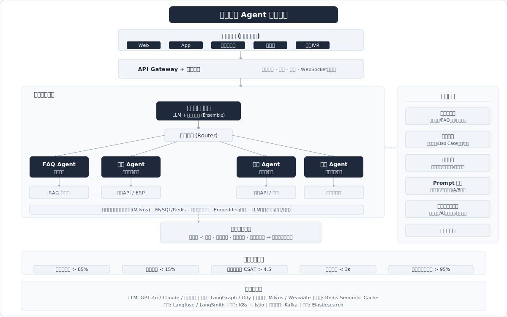
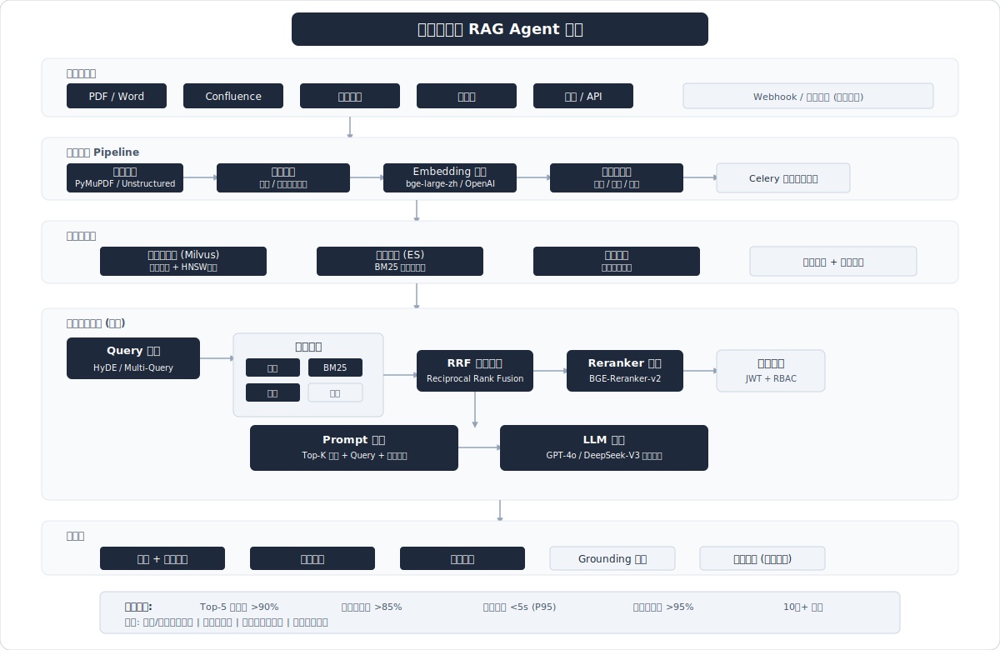
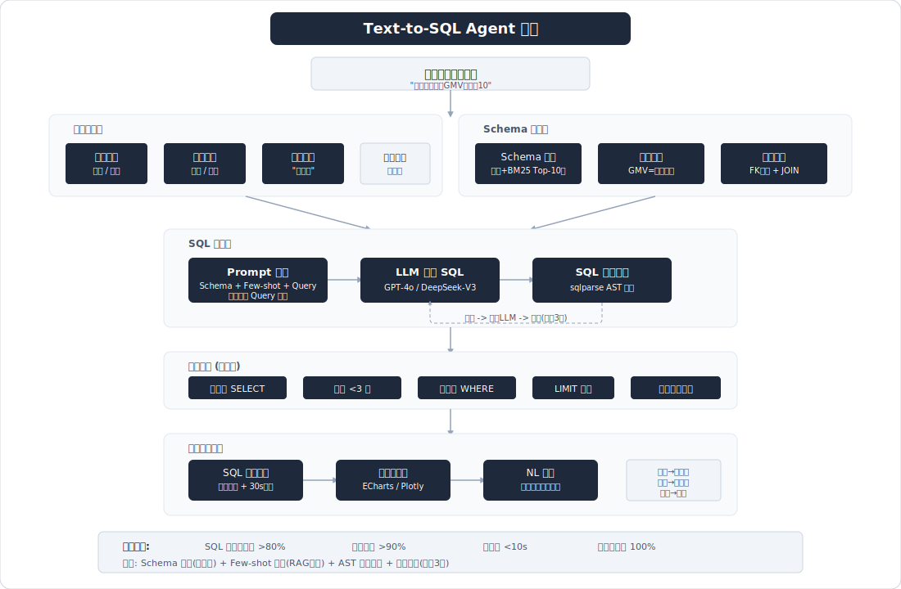
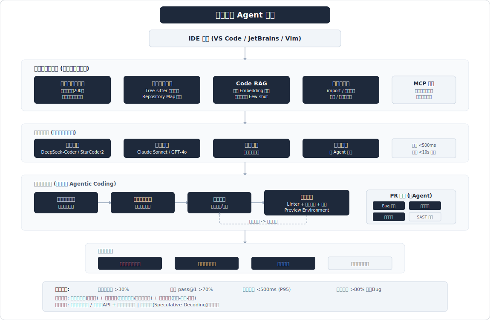
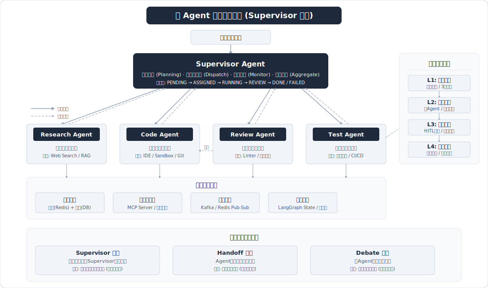
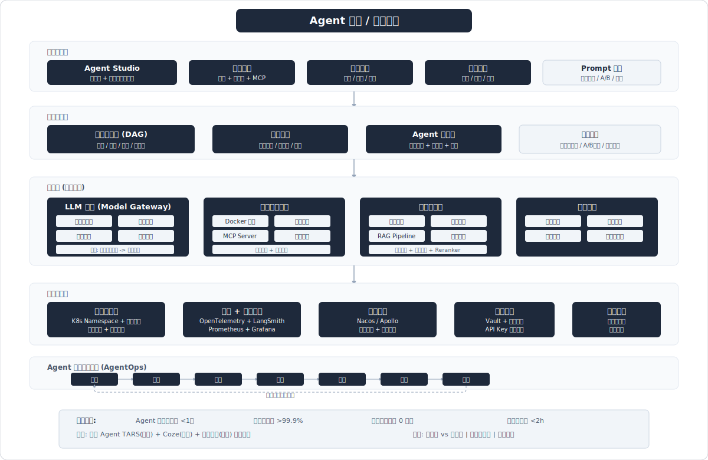
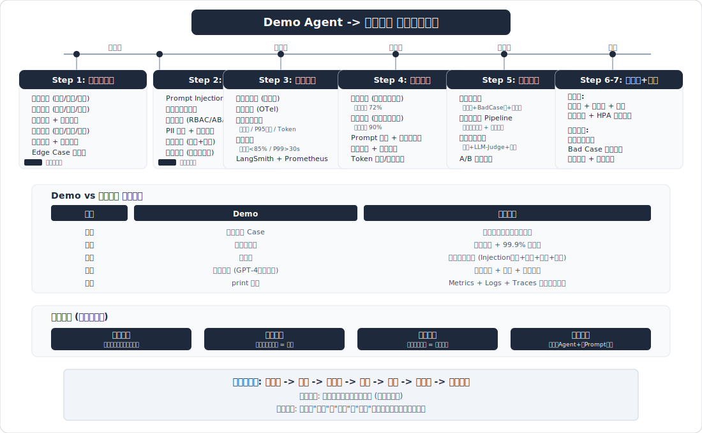

# 场景系统设计题 -- Agent 开发工程师面试笔记

> 面试高频指数：⭐⭐⭐⭐⭐
>
> 端到端 Agent 系统方案设计，覆盖常见面试场景题。这是面试中最重要的开放题型，考察候选人的架构设计能力、技术选型判断力和工程落地经验。

## 概述

场景系统设计题是Agent开发工程师面试中权重最高的题型（通常占面试时间40-60%）。面试官期望看到的不是"标准答案"，而是候选人的**结构化思维、取舍判断、技术深度和工程直觉**。

答题通用框架（5步法）：
1. **需求澄清**：主动提问，明确功能边界、用户规模、性能要求、约束条件
2. **架构设计**：分层架构图，核心模块拆解
3. **关键模块深入**：选2-3个核心模块展开技术细节
4. **难点与权衡**：主动提出设计中的Trade-off和解决方案
5. **评估与演进**：如何度量效果、如何迭代优化

---

## Q1: 设计一个智能客服 Agent 系统



**考频：极高** | 来源：字节、阿里、美团、快手等大厂高频面试题

### 答题框架

#### 1. 需求分析与约束

**功能需求**：
- 7x24小时自动回复用户咨询
- 支持多轮对话，理解上下文
- 覆盖FAQ、订单查询、退换货、投诉等场景
- 无法解决时平滑转接人工客服
- 支持多渠道（App、Web、微信、电话）

**非功能需求**：
- QPS：峰值1000+并发会话
- 延迟：首次回复<3s，后续回复<2s
- 准确率：意图识别>95%，回复准确率>90%
- 可用性：99.9%

**约束条件**：
- 不能给出错误的订单信息（零容忍）
- 不能承诺超出政策范围的补偿
- 敏感问题（法律、投诉升级）必须转人工

#### 2. 整体架构

```
用户请求 → API Gateway → 会话管理层 → 意图识别与路由
                                          ↓
                    ┌──────────────────────┼──────────────────────┐
                    ↓                      ↓                      ↓
              FAQ Agent           订单查询Agent           投诉处理Agent
              (RAG+LLM)          (Tool Call)             (LLM+人工)
                    ↓                      ↓                      ↓
                    └──────────────────────┼──────────────────────┘
                                          ↓
                              回复生成 → 安全过滤 → 输出
                                          ↓
                              (必要时) → 人工客服转接
```

**技术分层**：
- **接入层**：API Gateway（Kong/Nginx）+ WebSocket长连接
- **会话管理层**：Redis存储会话状态，支持多轮上下文
- **智能层**：意图识别（LLM Router或轻量分类模型）→ 子Agent分发
- **知识层**：FAQ知识库（向量数据库 + BM25混合检索）
- **工具层**：订单系统API、CRM系统API、工单系统API
- **安全层**：NeMo Guardrails输入输出过滤
- **监控层**：LangSmith链路追踪 + Prometheus指标

#### 3. 核心模块设计

**意图识别与路由**：
- 方案一（推荐）：LLM-based Router，用System Prompt定义意图分类体系，LLM直接输出意图+置信度
- 方案二：轻量BERT分类模型（延迟更低，成本更低）用于一级分类，LLM处理模糊/复杂意图
- 意图体系：一级意图（咨询/查询/投诉/闲聊）→ 二级意图（订单查询/退换货/物流...）
- 兜底策略：置信度<0.7时触发澄清提问

**多轮对话管理**：
- 短期记忆：当前会话的完整对话历史（Redis，TTL=30min）
- 槽位填充：关键信息（订单号、商品名、问题类型）逐轮收集
- 上下文窗口：最近10轮对话 + 摘要压缩的历史
- 对话状态机：跟踪当前任务进度（信息收集中/处理中/已解决/已转人工）

**人工介入机制**：
- 触发条件：情绪检测为愤怒、Agent连续3次未解决、用户主动要求、涉及敏感话题
- 转接流程：保留完整对话历史+Agent摘要，传递给人工客服
- 协作模式：人工客服可调用Agent辅助（如查询知识库、生成回复建议）

#### 4. 关键技术选型

| 组件 | 选型 | 理由 |
|------|------|------|
| LLM | GPT-4o-mini（日常）+ GPT-4o（复杂） | 智能路由降本72% |
| 向量数据库 | Milvus / Qdrant | 支持高并发，混合检索 |
| 会话存储 | Redis Cluster | 低延迟，支持TTL |
| 框架 | LangGraph | 支持复杂对话流和状态机 |
| 监控 | LangSmith + Prometheus | 全链路可观测 |
| 安全 | NeMo Guardrails | 话题控制+PII过滤 |

#### 5. 难点与解决方案

- **难点1：Agent幻觉导致承诺无法兑现的补偿** → Grounding验证+输出规则引擎，所有涉及金额的回复必须经过业务规则校验
- **难点2：高并发下LLM延迟** → 语义缓存（相似问题复用回答）+ 流式输出（SSE）+ 智能路由（简单FAQ用小模型）
- **难点3：多轮对话上下文过长** → 对话摘要压缩（每5轮生成摘要）+ 关键槽位提取

#### 6. 评估指标

| 指标 | 目标值 | 衡量方法 |
|------|--------|---------|
| 意图识别准确率 | >95% | 人工标注测试集 |
| 自助解决率 | >80% | 未转人工的会话占比 |
| 用户满意度(CSAT) | >4.2/5 | 会话结束评分 |
| 首次回复时间 | <3s | P95延迟监控 |
| 平均对话轮次 | <5轮 | 日志统计 |
| 转人工率 | <20% | 转接事件统计 |

### 深入追问

- 如果知识库更新频繁（每天有新政策），RAG如何做增量更新？
- 用户情绪检测不准怎么办？误转人工和漏转人工哪个更严重？
- 如何做客服Agent的冷启动（没有历史数据的情况）？
- 多语言客服如何支持？翻译+回答 vs 多语言模型？

### 速记

> **"客服Agent = 意图路由 + 子Agent分发 + RAG知识库 + 多轮状态机 + 人工兜底，核心指标：自助解决率>80%"**

> 相关来源：
> - [面试字节AI Agent岗被问到的问题](https://www.xiaohongshu.com/explore/699af24b000000000b0108d4) - 梦梦睡醒啦 | 219赞
> - [淘天ai agent面经](https://www.xiaohongshu.com/explore/69188729000000000503bb66) - 程序员峰哥 | 277赞
> - [快手AI Agent开发一面](https://www.xiaohongshu.com/explore/69b65422000000001a0312bc) - Offer面试官 | 1026赞
> - [美团｜AI Agent开发工程师面经](https://www.xiaohongshu.com/explore/691c38df000000001e00e999) - 猫米咪 | 233赞

---

## Q2: 设计一个企业知识库 RAG Agent



**考频：极高** | 来源：字节、阿里、腾讯等大厂高频题

### 答题框架

#### 1. 需求分析与约束

**功能需求**：
- 接入多种数据源（文档PDF/Word/PPT、Confluence、飞书文档、数据库、API）
- 支持自然语言提问，返回精准答案并附带来源引用
- 支持权限控制（不同角色看到不同范围的知识）
- 支持增量更新（文档变更后自动更新索引）
- 支持多轮追问和关联查询

**非功能需求**：
- 文档规模：10万+文档，持续增长
- 查询延迟：<5s（含检索+生成）
- 准确率：Top-5召回率>90%，答案准确率>85%
- 支持100+并发查询

#### 2. 整体架构

```
┌─────────────────── 数据接入层 ───────────────────┐
│  PDF解析  │  Confluence API  │  飞书API  │ 数据库  │
└─────────────────────┬───────────────────────────┘
                      ↓
┌─────────────────── 文档处理Pipeline ─────────────┐
│  格式统一 → 智能分块 → Embedding生成 → 元数据提取  │
└─────────────────────┬───────────────────────────┘
                      ↓
┌─────────────────── 索引存储层 ────────────────────┐
│  向量数据库(Milvus)  │  全文索引(ES)  │  知识图谱   │
└─────────────────────┬───────────────────────────┘
                      ↓
┌─────────────────── 检索与生成层 ──────────────────┐
│  Query改写 → 混合检索 → 重排序 → Prompt构建 → LLM │
└─────────────────────┬───────────────────────────┘
                      ↓
┌─────────────────── 应用层 ────────────────────────┐
│  权限过滤  │  答案生成  │  来源引用  │  反馈收集    │
└─────────────────────────────────────────────────┘
```

#### 3. 核心模块设计

**文档处理Pipeline**：

- **格式解析**：
  - PDF：PyMuPDF/Unstructured（支持表格、图片OCR）
  - Word/PPT：python-docx / python-pptx
  - 网页：Playwright爬取 + HTML解析
  - 统一输出Markdown格式

- **智能分块（Chunking）**：
  - 策略一：语义分块（Semantic Chunking），基于embedding相似度断句，保证语义完整性
  - 策略二：递归字符分块（RecursiveCharacterTextSplitter），按段落→句子→字符递归切分
  - 策略三：文档结构感知分块，按标题层级切分，保留文档结构
  - 块大小：512-1024 tokens，重叠128 tokens
  - 每个chunk附加元数据：来源文档、章节标题、页码、更新时间、权限标签

- **Embedding生成**：
  - 中文场景：bge-large-zh-v1.5 / text2vec-large-chinese
  - 多语言场景：Cohere embed-multilingual-v3 / OpenAI text-embedding-3-large
  - 批量生成，异步处理

**混合检索**：

```
用户Query → Query改写(LLM) → 多路检索 → 融合排序
                                 ↓
              ┌─────────────────┼─────────────────┐
              ↓                 ↓                 ↓
         向量检索          BM25全文检索       知识图谱检索
         (语义匹配)        (关键词匹配)      (实体关系)
              ↓                 ↓                 ↓
              └─────────────────┼─────────────────┘
                                ↓
                    RRF融合排序 → Reranker重排序(BGE-Reranker/Cohere)
                                ↓
                          Top-K文档 → 权限过滤
```

- **Query改写**：HyDE（假设文档嵌入）、Multi-Query（多角度改写）、Step-back（抽象化提问）
- **混合检索**：向量检索（语义匹配）+ BM25（关键词精确匹配）+ 可选知识图谱（实体关系）
- **融合排序**：RRF（Reciprocal Rank Fusion）融合多路检索结果
- **重排序**：BGE-Reranker-v2 或 Cohere Rerank，将Top-50压缩到Top-5

**权限控制**：
- 文档级权限：每个文档/chunk携带权限标签（部门、角色、密级）
- 检索时过滤：在向量数据库查询时附加权限filter条件
- 实现方式：用户JWT Token → 解析角色/部门 → 注入检索filter → 只返回有权限的内容

**增量更新**：
- 监听数据源变更（Webhook / 定时扫描）
- 增量处理：只处理新增/修改的文档，删除已移除文档的embedding
- 版本管理：保留文档历史版本的embedding，支持时间点查询
- 实现：Celery任务队列 + 变更检测（文件hash对比）

#### 4. 关键技术选型

| 组件 | 选型 | 理由 |
|------|------|------|
| 向量数据库 | Milvus（大规模）/ Qdrant（中小规模） | 支持过滤查询，高性能 |
| 全文检索 | Elasticsearch | 成熟的BM25实现，支持中文分词 |
| Embedding | bge-large-zh-v1.5 | 中文MTEB榜首级别 |
| Reranker | BGE-Reranker-v2-m3 | 多语言重排，效果好 |
| LLM | GPT-4o / DeepSeek-V3 | 长上下文支持，中文能力强 |
| 文档解析 | Unstructured | 支持多格式，表格/图片处理 |
| 任务队列 | Celery + Redis | 异步文档处理 |

#### 5. 难点与解决方案

- **难点1：表格和图表信息丢失** → 表格转Markdown保留结构，图表用多模态模型生成文字描述，作为额外chunk存储
- **难点2：跨文档知识关联** → 构建文档间引用关系图（知识图谱），检索时支持关联文档扩展
- **难点3：大量文档的检索性能** → 分库分表+HNSW索引优化+缓存高频查询结果
- **难点4：答案缺乏可解释性** → 强制带来源引用，输出格式包含"参考文档+页码+原文片段"

#### 6. 评估指标

| 指标 | 目标值 | 衡量方法 |
|------|--------|---------|
| Top-5召回率 | >90% | 标注测试集 |
| 答案准确率 | >85% | LLM-as-Judge + 人工抽检 |
| 查询延迟 | <5s（P95） | 端到端监控 |
| 引用准确率 | >95% | 来源引用与答案一致性 |
| 用户满意度 | >4.0/5 | 用户评分 |

### 深入追问

- 文档更新后，已缓存的旧答案如何失效？
- 如何处理矛盾信息（两个文档对同一问题给出不同答案）？
- 知识库中没有答案时，Agent应该如何回复？
- 10万文档场景下，embedding存储和检索的成本如何控制？

### 速记

> **"企业RAG = 多源接入 + 智能分块 + 混合检索(向量+BM25+图谱) + RRF融合 + Reranker + 权限过滤 + 增量更新"**

> 相关来源：
> - [面试官：RAG检索结果怎么截断？只答TopK你](https://www.xiaohongshu.com/explore/694a8ecc000000001e03a93e) - 程序员不鸭 | 268赞
> - [字节面试官怒怼："你的RAG系统召回了一堆](https://www.xiaohongshu.com/explore/69b01fd50000000006009df3) - 闭眼拿下大模型offer | 209赞
> - [项目中如何使用RAG？](https://www.xiaohongshu.com/explore/69ac6e480000000015020df2) - Offer面试官 | 198赞
> - [如何系统性地评估一个RAG项目的效果？](https://www.xiaohongshu.com/explore/69bcc298000000001b0037dc) - 予枫与时 | 185赞

---

## Q3: 设计一个数据分析 Agent（Text-to-SQL）



**考频：高** | 来源：字节、美团、阿里数据分析岗

### 答题框架

#### 1. 需求分析与约束

**功能需求**：
- 用户用自然语言提问（"上个月各城市GMV排名前10"），Agent生成SQL并执行
- 支持多表关联查询
- 结果可视化（自动生成图表）
- 支持追问（"环比呢？""去掉北京的数据"）
- 查询历史和常用报表收藏

**非功能需求**：
- SQL生成准确率：>80%（一次生成正确）
- 查询延迟：SQL生成<5s，执行取决于数据量
- 安全：只读查询，防止SQL注入和数据越权

**约束**：
- 数据库Schema复杂：100+表，500+字段
- 包含敏感数据（需要列级权限控制）
- 用户非技术人员，提问方式多样

#### 2. 整体架构

```
用户自然语言 → Query理解 → Schema匹配 → SQL生成 → SQL校验
                                                      ↓
                                                SQL执行引擎
                                                      ↓
                                          结果格式化 → 可视化
                                                      ↓
                                          自然语言解读 → 用户
```

**详细架构**：

```
┌─── 输入理解层 ────┐
│ 意图识别(分析/报表) │
│ 实体抽取(指标/维度) │
│ 时间范围解析       │
│ 追问上下文融合     │
└────────┬──────────┘
         ↓
┌─── Schema理解层 ──┐
│ 表/字段语义映射    │
│ 业务术语词典      │
│ 表关联关系图      │
│ 相似Query检索     │
└────────┬──────────┘
         ↓
┌─── SQL生成层 ─────┐
│ Prompt构建        │
│ (Schema+示例+Query)│
│ LLM生成SQL        │
│ SQL语法校验       │
│ 自动纠错重试      │
└────────┬──────────┘
         ↓
┌─── 执行与展示层 ──┐
│ 安全校验(只读/权限) │
│ SQL执行           │
│ 结果可视化        │
│ 自然语言总结      │
└───────────────────┘
```

#### 3. 核心模块设计

**Schema理解与匹配**：
- **问题**：100+表的完整Schema太长，无法全部放入Prompt
- **方案**：Schema检索
  1. 为每张表和字段生成语义描述embedding
  2. 用户Query → 检索相关表和字段（Top-10表）
  3. 只将相关Schema注入Prompt
  4. 补充业务术语词典（"GMV"="订单金额"，"DAU"="日活用户数"）
- **表关联**：维护表间Foreign Key关系图，自动补充JOIN关系

**SQL生成Prompt设计**：
```
System: 你是一个SQL专家，根据用户问题生成PostgreSQL查询。

Schema信息：
{检索到的相关表Schema}

业务术语映射：
{相关业务术语}

历史相似Query示例（Few-shot）：
问题：上个月北京的订单总额
SQL: SELECT SUM(amount) FROM orders WHERE city='北京' AND ...

注意事项：
- 只生成SELECT查询
- 使用参数化查询
- 大表查询必须有WHERE条件和LIMIT
```

**SQL安全校验**：
1. 语法检查：使用sqlparse解析SQL AST
2. 权限校验：检查查询涉及的表和列是否在用户权限范围内
3. 安全规则：
   - 禁止非SELECT语句（INSERT/UPDATE/DELETE/DROP）
   - 禁止子查询超过3层嵌套
   - 必须有WHERE条件（防止全表扫描）
   - 必须有LIMIT限制（默认1000行）
   - 禁止敏感列访问（如手机号、身份证号）
4. 执行超时：设置30s超时，防止慢查询

**自动纠错**：
- SQL执行报错 → 将错误信息反馈给LLM → 生成修正SQL → 最多重试3次
- 记录纠错案例，用于后续Few-shot示例

**结果可视化**：
- 根据查询类型自动选择图表：
  - 排名类 → 柱状图
  - 趋势类 → 折线图
  - 占比类 → 饼图
  - 对比类 → 分组柱状图
- 技术方案：LLM生成ECharts/Plotly配置 或 Python可视化代码

#### 4. 关键技术选型

| 组件 | 选型 | 理由 |
|------|------|------|
| LLM | GPT-4o / DeepSeek-V3 | SQL生成能力强 |
| Schema检索 | 向量检索 + BM25 | 精准匹配表字段 |
| SQL解析 | sqlparse / sqlglot | SQL AST分析和安全校验 |
| 可视化 | ECharts / Plotly | 丰富的图表类型 |
| 执行引擎 | 只读副本数据库 | 不影响主库性能 |

#### 5. 难点与解决方案

- **难点1：SQL生成准确率不够高** → Few-shot示例检索（RAG方式找相似历史Query）+ Schema压缩（只传相关表）+ 业务术语词典
- **难点2：复杂多表JOIN查询** → 维护表关联图，自动推断JOIN路径，限制最大JOIN表数
- **难点3：追问上下文理解** → 将前一轮的SQL和结果作为上下文，LLM理解"环比"是在已有SQL基础上加时间对比
- **难点4：用户表达模糊** → 生成SQL前先澄清："您说的'最近'是指最近7天还是30天？"

#### 6. 评估指标

| 指标 | 目标值 | 衡量方法 |
|------|--------|---------|
| SQL一次生成正确率 | >80% | 标注测试集（参考Spider基准） |
| 含纠错后正确率 | >90% | 重试后最终正确率 |
| 端到端延迟 | <10s | SQL生成+执行+渲染 |
| 安全拦截率 | 100% | 非法SQL拦截率 |

### 深入追问

- 如果用户问的问题在数据库中无法回答（如需要外部数据），Agent应该怎么处理？
- 如何处理数据库Schema变更（加表加字段）的情况？
- Text-to-SQL和直接用LLM写Python分析代码，各有什么优劣？
- 如何积累高质量的Few-shot示例库？

### 速记

> **"Text-to-SQL = Schema检索(不全放) + Few-shot示例 + SQL生成 + AST安全校验 + 自动纠错 + 可视化，准确率>80%靠Few-shot和Schema匹配"**

> 相关来源：
> - [我面试阿里AI Agent岗被问到这些问题](https://www.xiaohongshu.com/explore/699c3ca4000000002801cd39) - 梦梦睡醒啦 | 372赞
> - [算法面经：美团大模型应用算法12.07](https://www.xiaohongshu.com/explore/69354276000000000d00dde2) - AI实战领航员 | 330赞
> - [淘天ai agent一面(贼难)](https://www.xiaohongshu.com/explore/69afe286000000002203377e) - 玥汐互联网大厂offer助手 | 256赞

---

## Q4: 设计一个代码助手 Agent



**考频：高** | 来源：字节、快手、阿里等有Copilot产品的公司

### 答题框架

#### 1. 需求分析与约束

**功能需求**：
- 代码补全：根据上下文自动补全代码
- 代码生成：根据自然语言描述生成完整函数/模块
- 代码解释：解释选中代码的功能
- 测试生成：为指定函数自动生成单元测试
- 代码审查：Review PR，发现Bug、安全隐患、代码风格问题
- 代码重构建议：识别Code Smell并提供重构方案

**非功能需求**：
- 补全延迟：<500ms（打字不能被打断）
- 生成延迟：<10s（可流式输出）
- 支持多语言（Python、Java、Go、TypeScript至少）
- 代码隐私：企业代码不能泄露到外部

#### 2. 整体架构

```
IDE插件(VS Code/JetBrains)
        ↓
┌─── 代码上下文引擎 ───┐
│ 当前文件分析          │
│ 项目结构理解          │
│ 依赖关系图           │
│ 相关文件检索          │
└────────┬─────────────┘
         ↓
┌─── 智能路由层 ────────┐
│ 补全 → 轻量模型(快)    │
│ 生成 → 强力模型(准)    │
│ 审查 → 多Agent协作     │
└────────┬─────────────┘
         ↓
┌─── 执行与验证层 ──────┐
│ 代码生成              │
│ 语法检查              │
│ 单测执行验证          │
│ 安全扫描(SAST)        │
└────────┬─────────────┘
         ↓
┌─── 反馈学习层 ────────┐
│ 用户采纳率跟踪        │
│ 编辑距离分析          │
│ 偏好学习              │
└───────────────────────┘
```

#### 3. 核心模块设计

**代码上下文工程**：
- 这是代码助手最核心的差异化能力
- **当前文件上下文**：光标前后各200行 + 当前函数完整代码
- **项目级上下文**：
  - 相关文件检索：基于import关系、调用关系找到相关文件
  - Repository Map：用Tree-sitter解析项目结构，生成函数签名索引
  - 技术栈识别：自动检测框架版本、代码风格
- **代码库检索（Code RAG）**：
  - 将代码库中的函数/类生成embedding
  - 用户需求 → 检索相似代码片段作为Few-shot
  - 支持语义检索（"处理用户登录的函数"）和代码结构检索

**多Agent协作（代码审查场景）**：
```
PR代码 → Orchestrator Agent
              ↓
    ┌─────────┼─────────┐
    ↓         ↓         ↓
Bug检测    安全扫描   风格检查
Agent      Agent      Agent
    ↓         ↓         ↓
    └─────────┼─────────┘
              ↓
        汇总审查报告
```
- Orchestrator无直接代码访问权，强制委托给专项Agent
- 3-5个专项Agent是最佳配置（Token成本线性增长，3个聚焦Agent优于5个分散Agent）
- 每个Agent独立检查后汇总，避免单Agent遗漏

**闭环执行（Agentic Coding）**：
- 与传统代码补全的核心区别：Agent在闭环中运行
- 流程：读取代码状态 → 规划变更序列 → 执行变更 → 验证结果 → 报告完成
- 验证手段：语法检查(linter) + 类型检查 + 单元测试 + 预览环境（Preview Environment）
- Preview Environment：通过IaC短期部署完整应用栈，运行冒烟测试后销毁

**安全扫描**：
- 静态分析（SAST）：检测SQL注入、XSS、硬编码密钥等
- 依赖安全：检查引入的第三方包是否有已知漏洞
- 敏感信息检测：防止API Key、密码等硬编码到代码中

#### 4. 关键技术选型

| 组件 | 选型 | 理由 |
|------|------|------|
| 补全模型 | DeepSeek-Coder-V2 / StarCoder2 | 低延迟，代码专精 |
| 生成模型 | Claude Sonnet / GPT-4o | 强推理，长上下文 |
| 代码解析 | Tree-sitter | 多语言AST解析，轻量快速 |
| 代码检索 | 代码Embedding + 语义搜索 | 项目级代码理解 |
| 协议 | MCP（Model Context Protocol） | 标准化工具接入 |

#### 5. 难点与解决方案

- **难点1：补全延迟要求极高（<500ms）** → 推测解码（Speculative Decoding）+ 本地小模型补全 + 缓存高频补全模式
- **难点2：项目级代码理解** → Repository Map + 增量更新的代码索引 + 调用图分析
- **难点3：生成代码的正确性** → 自动生成单元测试 + 执行验证 + 多次采样选最优
- **难点4：企业代码隐私** → 本地部署模型 或 私有化部署API + 代码片段脱敏

#### 6. 评估指标

| 指标 | 目标值 | 衡量方法 |
|------|--------|---------|
| 补全采纳率 | >30% | IDE埋点统计 |
| 代码生成pass@1 | >70% | 单测通过率（SWE-bench） |
| 补全延迟 | <500ms（P95） | IDE端计时 |
| 代码审查覆盖率 | >80%的真实Bug | 与人工Review对比 |

### 深入追问

- 代码助手的上下文窗口有限，如何选择最相关的代码片段放入Prompt？
- Copilot类产品的商业模式和成本结构是什么？每个用户每天大约消耗多少Token？
- 如何评估代码助手对开发者生产力的实际提升？
- 代码补全和代码生成用同一个模型还是不同模型？为什么？

### 速记

> **"代码Agent = 上下文工程(最核心) + 智能路由(补全→快模型，生成→强模型) + 闭环执行(生成→验证→修复) + 安全扫描"**

> 相关来源：
> - [字节大模型Agent算法二面-秋招面经](https://www.xiaohongshu.com/explore/69759d8e00000000210309d8) - 算法Leo | 389赞
> - [26年春招｜字节Agent一面面经分享](https://www.xiaohongshu.com/explore/69931383000000000e03d5d1) - Agent搬砖日记 | 227赞
> - [字节妙搭AI agent两轮面经，面吐了](https://www.xiaohongshu.com/explore/69bc3275000000001d01d148) - Java怎么辅助 | 202赞

---

## Q5: 设计一个多 Agent 协作系统



**考频：极高** | 来源：字节、阿里、腾讯等大厂

### 答题框架

#### 1. 需求分析与约束

**功能需求**：
- 将复杂任务自动分解为子任务
- 多个专项Agent并行/串行执行子任务
- Agent之间可以通信和协调
- 支持任务失败后的重试和降级
- 人工可以监控和干预执行过程

**场景示例**：自动化内容创作系统
- 需求：给定一个主题，自动完成调研→写作→审校→配图→发布
- 各子任务由专项Agent负责

#### 2. 架构模式对比

| 模式 | 描述 | 优点 | 缺点 | 适用场景 |
|------|------|------|------|---------|
| **Supervisor模式** | 一个主管Agent分发任务给子Agent | 控制清晰，易调试 | 主管成为瓶颈 | 流程明确的任务 |
| **对等协作模式** | Agent之间直接通信，无中心 | 灵活，无单点瓶颈 | 难以控制，可能死锁 | 头脑风暴/辩论 |
| **分层规划模式** | Planner规划 + Worker执行，分层 | 规划与执行解耦 | 规划失误代价高 | 复杂多步骤任务 |
| **竞争模式** | 多Agent独立执行同一任务，选最优 | 质量高 | 成本高（冗余执行） | 高质量要求场景 |

**推荐：Supervisor模式（面试首选）**

#### 3. Supervisor模式详细设计

```
用户任务 → Supervisor Agent（主管）
                ↓
          任务分解与规划
                ↓
    ┌──────────┼──────────┐
    ↓          ↓          ↓
Research    Writing    Review
 Agent       Agent      Agent
    ↓          ↓          ↓
    └──────────┼──────────┘
                ↓
        Supervisor汇总与质检
                ↓
           最终输出给用户
```

**核心组件**：

1. **Supervisor Agent（主管）**：
   - 职责：任务分解、子Agent调度、结果汇总、质量把控
   - 实现：LLM + 路由Prompt，输出结构化调度指令
   - 关键：Supervisor不直接执行任务，强制委托（Forced Delegation）

2. **子Agent（Worker）**：
   - 每个Agent有独立的System Prompt、工具集和专项能力
   - 如：Research Agent有搜索工具，Writing Agent有文档模板，Review Agent有语法检查器
   - Agent间数据传递通过共享State实现

3. **状态管理（Shared State）**：
   - 使用LangGraph的State Graph管理全局状态
   - 每个Agent读写特定的State字段
   - 支持使用占位符动态引用State数据（Agent间数据传递的关键机制）

**Agent间通信设计**：

```python
# LangGraph State定义示例
class WorkflowState(TypedDict):
    task: str                    # 用户原始任务
    plan: list[SubTask]          # Supervisor的任务规划
    research_result: str         # Research Agent输出
    draft: str                   # Writing Agent输出
    review_feedback: str         # Review Agent反馈
    final_output: str            # 最终输出
    current_agent: str           # 当前执行的Agent
    retry_count: int             # 重试计数
```

#### 4. 错误恢复机制

- **重试策略**：子Agent失败后自动重试（指数退避，最多3次）
- **降级方案**：
  - 工具调用失败 → 不使用工具，LLM直接回答
  - 子Agent超时 → 跳过并在最终输出中标注
  - 模型API不可用 → 切换到备用模型
- **人工介入**：
  - 关键节点设置检查点（Checkpoint），人工可审批后继续
  - 支持暂停/恢复/回滚到任意检查点
- **死循环检测**：设置最大步数（如20步），超过自动终止

#### 5. 关键技术选型

| 组件 | 选型 | 理由 |
|------|------|------|
| 编排框架 | LangGraph | 原生支持Supervisor模式和状态图 |
| 通信机制 | Shared State | 简单可靠，适合单进程 |
| 持久化 | LangGraph Checkpointer | 支持断点恢复 |
| 监控 | LangSmith | 可视化Agent执行轨迹 |

**框架对比**：
- **LangGraph**：基于图的编排，灵活度最高，适合自定义拓扑
- **CrewAI**：声明式定义Agent角色和任务，上手快，但灵活度有限
- **AutoGen**：微软出品，强调对话式Agent协作，适合研究场景
- **推荐**：生产环境用LangGraph，快速原型用CrewAI

#### 6. 难点与解决方案

- **难点1：上下文膨胀** → 每个Agent只看到自己需要的State字段，Supervisor做摘要传递
- **难点2：Agent间信息丢失** → 结构化State定义，强制输出格式校验
- **难点3：调试困难** → LangSmith可视化执行图，每步State快照
- **难点4：成本控制** → Token消耗随Agent数线性增长，3个聚焦Agent优于5个分散Agent

#### 7. 评估指标

| 指标 | 目标值 | 衡量方法 |
|------|--------|---------|
| 端到端任务成功率 | >85% | 自动化+人工评估 |
| 子Agent调度准确率 | >95% | Supervisor路由正确率 |
| 平均执行步数 | <10步 | 日志统计 |
| 错误恢复成功率 | >70% | 重试后成功的比例 |

### 深入追问

- Supervisor模式中，Supervisor Agent本身出错了怎么办？
- 多Agent系统如何做A/B测试？（整体 vs 单个Agent级别）
- 对等协作模式下如何避免Agent之间的"无限对话"？
- 多Agent系统的监控和调试有什么特殊挑战？

### 速记

> **"多Agent首选Supervisor模式：任务分解→子Agent执行→结果汇总，核心：上下文工程(每个Agent看什么) + 错误恢复(重试/降级/人工) + 状态管理(共享State)"**

> 相关来源：
> - [面试前刷一刷，Multi-Agent的坑可以少一个](https://www.xiaohongshu.com/explore/698c3021000000001a024da5) - Nick | 195赞
> - [多智能体要凉了？和Autogen头号开发者探讨](https://www.xiaohongshu.com/explore/68ec37bc000000000301a332) - 黄泽洲 Zachary Huang | 565赞
> - [已拒offer，人得卷在值得的事上](https://www.xiaohongshu.com/explore/69bcb7da000000002301c4a0) - Agent搬砖日记 | 1231赞
> - [京东AI Agent实习二面](https://www.xiaohongshu.com/explore/69c60e6e000000002003a8a2) - 钱多多 | 193赞

---

## Q6: 设计一个 Agent 中台/平台



**考频：高** | 来源：字节、阿里、美团等有中台需求的大厂

### 答题框架

#### 1. 需求分析与约束

**功能需求**：
- 支持多业务线快速创建和部署Agent
- 可视化Agent编排（拖拽式工作流设计）
- 统一的工具/插件市场
- 多租户隔离
- Agent全生命周期管理（开发→测试→部署→监控→迭代）
- 统一的监控大盘

**非功能需求**：
- 支持100+个Agent同时在线运行
- 租户间数据完全隔离
- 99.9%可用性
- 新Agent从创建到上线<1天

#### 2. 整体架构

```
┌────────────────── 用户界面层 ──────────────────────┐
│  Agent Studio    │  工具市场    │  监控大盘  │  管理后台 │
│  (可视化编排)    │  (插件商店)  │  (运营面板) │  (权限管理)│
└────────────────────────┬──────────────────────────┘
                         ↓
┌────────────────── 编排引擎层 ──────────────────────┐
│  工作流引擎(DAG)  │  对话引擎  │  Agent调度器        │
│  条件/循环/并行   │  多轮管理  │  负载均衡+优先级    │
└────────────────────────┬──────────────────────────┘
                         ↓
┌────────────────── 能力层 ─────────────────────────┐
│ LLM网关       │ 工具执行引擎   │ 知识库服务         │
│ (多模型路由)   │ (沙箱+权限)   │ (向量+全文)        │
│ 缓存+限流     │ MCP Server    │ RAG Pipeline       │
└────────────────────────┬──────────────────────────┘
                         ↓
┌────────────────── 基础设施层 ─────────────────────┐
│ 多租户隔离    │ 日志+追踪    │ 配置中心  │  密钥管理  │
│ 数据分区      │ Metrics     │ 版本管理  │  审计日志  │
└──────────────────────────────────────────────────┘
```

#### 3. 核心模块设计

**Agent Studio（可视化编排）**：
- 双模开发引擎：
  - 对话式开发（ChatBox模式）：通过对话描述Agent行为，自动生成配置
  - 工作流模式（拖拽式）：可视化拖拽组件构建复杂流程
- 支持条件判断、循环控制、子流程嵌套
- 内置30+系统工具（搜索、HTTP调用、代码执行、文档解析等）
- Prompt模板管理：版本控制、A/B测试、灰度发布

**LLM网关（Model Gateway）**：
- 统一接口：屏蔽不同LLM提供商的API差异
- 智能路由：按任务复杂度、成本、延迟要求路由到不同模型
- 负载均衡：多个API Key轮询，避免Rate Limit
- 缓存层：语义缓存（相似请求复用结果）+ Prompt缓存
- 成本控制：按租户/Agent设置Token配额和费用上限
- 降级策略：主模型不可用时自动切换备用模型

**工具市场（Tool Marketplace）**：
- 内置工具：搜索、数据库查询、HTTP调用、代码执行等
- 自定义工具：用户通过MCP协议或OpenAPI Spec接入自有API
- 工具审核：第三方工具需经过安全审核后上架
- 工具版本管理：支持多版本并存，灰度升级

**多租户隔离**：
- **数据隔离**：
  - 方案一：共享数据库 + 租户ID字段过滤（成本低，隔离弱）
  - 方案二：Schema级隔离（每个租户独立Schema）
  - 方案三：独立数据库（隔离最强，成本最高）
  - 推荐：核心数据Schema级隔离，日志数据共享+过滤
- **运行时隔离**：
  - Agent执行在独立沙箱容器中
  - 网络策略隔离（Kubernetes NetworkPolicy）
  - 密钥管理：每个租户独立密钥空间（Vault）
- **资源配额**：
  - 按租户设置LLM调用配额
  - CPU/内存资源限制
  - 存储空间配额

**Agent生命周期管理**：
```
创建/设计 → 开发/配置 → 测试 → 审核 → 部署 → 监控 → 迭代/下线
    ↑                                              ↓
    └────────────── 反馈驱动优化 ────────────────────┘
```
- 版本管理：每次变更生成新版本，支持回滚
- 灰度发布：按用户/流量百分比逐步放量
- 自动化测试：CI/CD集成，每次变更触发回归测试
- AgentOps：将DevOps/MLOps能力扩展到Agent系统的运维范式

**监控大盘**：
- 总览：在线Agent数、活跃会话数、总请求量
- 质量：任务成功率、用户满意度、幻觉率
- 性能：延迟分布、吞吐量、错误率
- 成本：Token消耗、API费用、按Agent/租户维度
- 告警：成功率下降、延迟突增、成本异常

#### 4. 关键技术选型

| 组件 | 选型 | 理由 |
|------|------|------|
| 编排引擎 | LangGraph + 自研DAG | 灵活度高，支持复杂流程 |
| LLM网关 | 自研（基于LiteLLM） | 统一多模型接口 |
| 工具执行 | Docker沙箱 + gRPC | 安全隔离+低延迟 |
| 多租户 | Kubernetes Namespace | 运行时隔离 |
| 监控 | Prometheus + Grafana + LangSmith | 全栈可观测 |
| 配置中心 | Nacos / Apollo | 动态配置，灰度发布 |

#### 5. 难点与解决方案

- **难点1：编排灵活性与易用性的平衡** → 双模引擎（简单用对话式，复杂用拖拽式），提供预设模板
- **难点2：多租户资源争抢** → 资源配额+优先级调度+弹性扩缩容
- **难点3：工具安全（第三方MCP Server）** → 工具审核机制 + 沙箱执行 + 网络隔离
- **难点4：版本管理复杂** → Prompt+工具+模型三要素联合版本，整体快照

#### 6. 评估指标

| 指标 | 目标值 | 衡量方法 |
|------|--------|---------|
| Agent创建到上线时间 | <1天 | 流程耗时 |
| 平台可用性 | >99.9% | 监控统计 |
| 租户间数据泄露 | 0事件 | 安全审计 |
| 新工具接入时间 | <2小时 | MCP标准化 |

### 深入追问

- Agent中台和传统的低代码平台有什么本质区别？
- 如何解决不同租户对同一模型的争抢问题？
- Prompt版本管理和代码版本管理有什么不同？
- 如何衡量Agent中台本身的ROI（投入产出比）？

### 速记

> **"Agent中台 = Agent Studio(可视化编排) + LLM网关(多模型路由) + 工具市场(MCP标准) + 多租户隔离(数据+运行时+配额) + 全生命周期管理(AgentOps)"**

> 相关来源：
> - [字节后端Agent中台一面凉](https://www.xiaohongshu.com/explore/699c2762000000000e00fbb7) - 老夏聊编程 | 473赞
> - [已拒offer，人得卷在值得的事上](https://www.xiaohongshu.com/explore/69bcb7da000000002301c4a0) - Agent搬砖日记 | 1231赞
> - [都写AI Agent，怎么拉开技术差距？](https://www.xiaohongshu.com/explore/699e9c3c000000002602f901) - 小傅哥 | 709赞
> - [字节后端实习agent一面](https://www.xiaohongshu.com/explore/69b3a4a20000000021007dbe) - Friday.. | 412赞

---

## Q7: 如何将一个 Demo Agent 落地为生产系统？



**考频：极高** | 来源：几乎所有Agent面试必问的开放题

### 答题框架

#### 1. POC/Demo 与生产系统的关键差距

这是面试中最高频的开放题之一，考察候选人的工程成熟度。

| 维度 | Demo | 生产系统 |
|------|------|---------|
| 输入 | 预设的测试Case | 千奇百怪的真实用户输入 |
| 规模 | 单用户测试 | 千人并发 |
| 可靠性 | 偶尔报错可接受 | 99.9%可用性 |
| 安全 | 无防护 | 全面安全体系 |
| 成本 | 不计成本 | 严格预算约束 |
| 监控 | print日志 | 全链路可观测 |
| 迭代 | 手动修改 | CI/CD自动化 |

#### 2. 落地路线图（7大关键步骤）

**Step 1: 鲁棒性加固**

```
Demo: 只处理"正常"输入
生产: 处理所有可能的输入
```

- 输入校验：长度限制、格式验证、恶意内容检测
- 异常处理：LLM超时/限流/错误的优雅降级
- 工具调用失败的重试和兜底策略
- 输出校验：格式检查、内容安全过滤、幻觉检测
- 超时熔断：单步超时 + 整体超时 + 最大步数限制
- Edge Case库：收集并积累边界情况，转化为回归测试

**Step 2: 安全体系建设**

```
Demo: 无安全考量
生产: 多层安全防护
```

- Prompt Injection防御（六层防御体系，参见09安全章节）
- 工具执行沙箱化
- 权限控制（RBAC/ABAC）
- 输出安全过滤（PII脱敏、有害内容拦截）
- 数据加密（传输+存储）
- 审计日志（所有操作可追溯）

**Step 3: 可观测性体系**

```
Demo: print("debug info")
生产: Metrics + Logs + Traces
```

- 结构化日志：每步决策的完整轨迹（意图识别→规划→工具调用→输出）
- 链路追踪：端到端调用链，每步耗时和状态
- 核心指标：成功率、延迟（p50/p95/p99）、Token消耗、错误分类
- 监控告警：成功率<85%、P99>30s、成本异常等自动告警
- 工具选型：LangSmith（Agent专属）+ Prometheus/Grafana（基础监控）+ OpenTelemetry（标准化）

**Step 4: 成本优化**

```
Demo: GPT-4处理所有请求
生产: 智能路由+缓存+压缩
```

- 智能路由：简单任务→小模型（GPT-4o-mini），复杂任务→大模型（GPT-4o/Claude）
- 语义缓存：相似问题复用已有回答（可降成本90%）
- Prompt压缩：精简System Prompt，裁剪无关上下文
- 批量处理：合并可以批量执行的请求
- 成本预算：设置每用户/每日的Token消耗上限
- 数据参考：某电商客服Agent通过智能路由，成本降低72%，速度提升55%

**Step 5: 评估体系**

```
Demo: "看起来效果不错"
生产: 量化指标+自动化评测
```

- 建立评测数据集（基础能力集 + Bad Case回归集 + 边界Case集）
- 自动化评测Pipeline：每次变更自动触发，设置质量门禁
- 评估方法组合：规则评估 + LLM-as-Judge + 人工抽检
- A/B测试框架：新版本灰度验证

**Step 6: 高可用架构**

```
Demo: 单机单进程
生产: 分布式高可用
```

- 无状态服务设计：会话状态外置到Redis
- 负载均衡：多实例部署，流量分发
- 限流降级：过载保护（令牌桶/滑动窗口限流）
- 故障恢复：模型API故障自动切换备用、工具调用重试
- 弹性伸缩：基于QPS自动扩缩容（K8s HPA）

**Step 7: 持续迭代机制**

```
Demo: 一次性开发
生产: 持续迭代优化
```

- 用户反馈闭环：采集→分析→优化→验证
- Bad Case驱动：线上Bad Case沉淀→定位根因→Prompt/策略优化→回归测试
- 灰度发布：新版本小流量验证→逐步放量→全量
- 数据飞轮：用户交互数据 → 评测集扩充 → 模型/Prompt优化 → 更好的用户体验

#### 3. 落地优先级排序

```
第一周：鲁棒性加固 + 基础安全（最高优先级）
第二周：可观测性体系 + 基础监控告警
第三周：成本优化（智能路由+缓存）
第四周：评估体系 + 自动化测试
持续：A/B测试 + 用户反馈闭环 + Bad Case迭代
```

#### 4. 常见陷阱

- **过早优化**：没有监控数据就盲目优化成本
- **忽视安全**：先上线再补安全 → 出事故损失更大
- **评估缺失**：没有评估指标就迭代Prompt → 不知道是变好还是变差
- **过度工程**：初期不需要完美的多Agent系统，单Agent+好Prompt就够用

### 深入追问

- 如果给你3个月时间把一个Demo Agent做成生产系统，你的里程碑规划是什么？
- 生产环境中Agent突然准确率大幅下降，你的排查步骤是什么？
- 如何说服老板投入资源做Agent的可观测性？（很多老板觉得"能用就行"）
- Demo阶段效果很好但上线后效果差很多，可能的原因有哪些？

### 速记

> **"Demo→生产七步法：鲁棒性→安全→可观测→成本→评估→高可用→持续迭代，第一周先搞鲁棒性和安全，最大陷阱：过早优化和忽视安全"**

> 相关来源：
> - [都写AI Agent，怎么拉开技术差距？](https://www.xiaohongshu.com/explore/699e9c3c000000002602f901) - 小傅哥 | 709赞
> - [投AI Agent开发凉在后端基础上怎么办](https://www.xiaohongshu.com/explore/6961bca7000000000a02a63f) - 好吃哈奇 | 305赞
> - [面试了个程序员转AI Agent方向 有点无语...](https://www.xiaohongshu.com/explore/69b25f40000000001503131b) - AI践行者刘沙 | 241赞
> - [某教育agent开发面经](https://www.xiaohongshu.com/explore/69a002ca000000001a01dd93) - OSAKO | 234赞
> - [阿里云agent开发实习一面](https://www.xiaohongshu.com/explore/69b77e07000000002301de42) - 我会成为传奇耐面王吗 | 191赞

---

## 场景设计题答题速记总表

```
┌──────────────────────────────────────────────────────────────┐
│                 场景设计题 7题速记                             │
├──────┬───────────────────────────────────────────────────────┤
│ Q1   │ 智能客服 = 意图路由+子Agent+RAG+状态机+人工兜底        │
│ Q2   │ 企业RAG = 多源接入+智能分块+混合检索+RRF+Reranker+权限  │
│ Q3   │ Text2SQL = Schema检索+Few-shot+AST校验+自动纠错       │
│ Q4   │ 代码Agent = 上下文工程+智能路由+闭环执行+安全扫描       │
│ Q5   │ 多Agent = Supervisor模式+共享State+错误恢复            │
│ Q6   │ Agent中台 = Studio+LLM网关+工具市场+多租户+AgentOps    │
│ Q7   │ Demo→生产 = 鲁棒→安全→可观测→成本→评估→高可用→迭代    │
└──────┴───────────────────────────────────────────────────────┘
```

### 通用答题框架速记

```
1. 需求澄清  → 主动提问，明确边界和约束
2. 架构分层  → 画架构图，分层拆模块
3. 核心深入  → 选2-3个模块展开技术细节
4. 难点权衡  → 主动提出Trade-off和解决方案
5. 评估演进  → 定义指标，说明如何迭代

口诀：需架核难评
```

---

## 参考资料

### 搜索来源
- [2170赞] 字节ai agent一面（贼难）— 涵盖Agent安全、RAG、系统设计
- [1231赞] 已拒offer，人得卷在值得的事上 — Agent中台和多Agent设计经验
- [1026赞] 快手AI Agent开发一面 — 智能客服和评估体系
- [709赞] 都写AI Agent，怎么拉开技术差距？— 从Demo到生产的关键差距
- [565赞] 多智能体要凉了？和Autogen头号开发者探讨 — 多Agent架构深度讨论

### 系统设计参考
- [GitHub - AI_Interview](https://github.com/kingaimaster/AI_Interview) — 200+ AI面试题和26份流程图
- [GitHub - AgentGuide](https://github.com/adongwanai/AgentGuide) — AI Agent开发指南，涵盖LangGraph实战
- [A Deep Dive into Deep Agent Architecture for AI Coding Assistants](https://dev.to/apssouza22/a-deep-dive-into-deep-agent-architecture-for-ai-coding-assistants-3c8b) — 代码助手Agent架构深入分析
- [The Code Agent Orchestra](https://addyosmani.com/blog/code-agent-orchestra/) — 多Agent代码协作的架构模式
- [Architecting for Agentic AI on AWS](https://aws.amazon.com/blogs/architecture/architecting-for-agentic-ai-development-on-aws/) — AWS Agent架构最佳实践
- [多Agent协作架构模式实战](https://dev.to/jiade/duo-agentxie-zuo-jia-gou-mo-shi-shi-zhan-cong-fen-ceng-gui-hua-dao-dong-tai-bian-pai-de-wan-zheng-zhi-nan-467a) — 从分层规划到动态编排完整指南

### RAG与知识库
- [企业级RAG知识库构建实战](https://zhuanlan.zhihu.com/p/1961801396513923706) — 关键细节与平台选型
- [企业内部RAG Q&A Agent搭建核心策略](https://zhuanlan.zhihu.com/p/1954200517346591287) — 从0到1构建智能知识问答系统
- [大厂RAG面试题24道](https://www.cnblogs.com/crazymakercircle/p/18980652) — RAG面试高频题库

### Text-to-SQL
- [数据可视化Agent-基于Text2SQL的数据分析方案](https://zhuanlan.zhihu.com/p/682851514) — 端到端方案设计
- [Tool-SQL: 基于LLM和Agent的Text2SQL新方案](https://deepseek.csdn.net/682465b1c89bb16498922210.html) — Agent增强的SQL生成
- [To B最容易落地的Agent场景：DataAgent](https://www.53ai.com/news/qiyejingying/293.html) — 数据分析Agent落地经验

### Agent平台与中台
- [AI-Agentforce企业级智能体中台](https://www.163.com/dy/article/K80I4IQ70552YZST.html) — 工作流+知识库+多租户
- [Agent服务多租户隔离与资源调度](https://blog.csdn.net/sinat_28461591/article/details/147675111) — 多租户治理实战
- [Agentic AI基础设施实践](https://aws.amazon.com/cn/blogs/china/agentive-ai-infrastructure-practice-series-1/) — AWS Agent平台化经验

### 安全相关
- [AI Agent Security in 2026](https://swarmsignal.net/ai-agent-security-2026/) — Agent安全五大攻击面
- [OWASP Top 10 for Agentic Applications](https://genai.owasp.org/2025/12/09/owasp-top-10-for-agentic-applications-the-benchmark-for-agentic-security-in-the-age-of-autonomous-ai/) — Agent安全权威框架
- [AI Agent Guardrails & Output Validation 2026](https://toolhalla.ai/blog/ai-agent-guardrails-io-validation-2026) — Guardrails最佳实践

### 面试准备
- [AI大模型面试题530+](https://xiaolincoding.com/other/ai.html) — 涵盖Agent系统设计的完整题库
- [LLM & Agent面试问题总结](https://github.com/datawhalechina/hello-agents/blob/main/Extra-Chapter/Extra01-%E9%9D%A2%E8%AF%95%E9%97%AE%E9%A2%98%E6%80%BB%E7%BB%93.md) — DataWhale整理的Agent面试题
