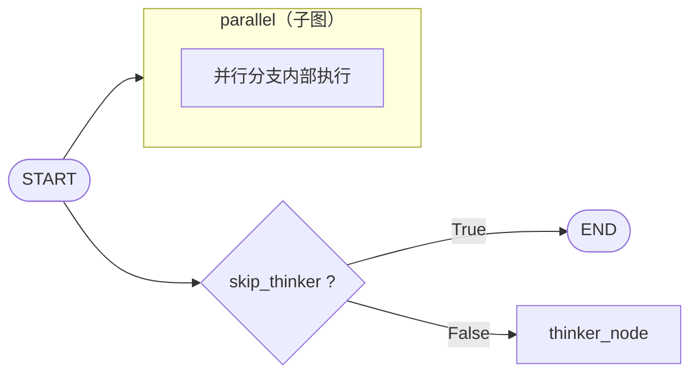
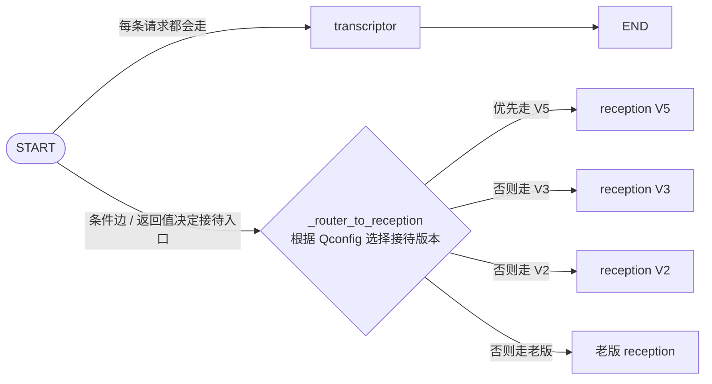

# 父图：



## thinker_node
```
thinker_node 不负责路由到下一个业务节点，只负责在父图并行分支里产出一类可流式展示的「思考」消息；主流程仍由 parallel 子图完成。
```
1. 拼输入

	- 用 history_message_converters 里每条历史，按 ==ContextLevel.NANO 压成短上下文==（注释写明 thinker 用 NANO）。
	
	- 再拼上 current_messages。
	
	- 然后套 thinker 的 prompt 模板。

2. 调模型（流式）

	- 用业务配置里的 thinker 模型，stream 而不是 invoke，方便 LangGraph 收到 on_chat_model_stream，给前端「思考过程」类流式展示。

3. 写回状态

	- 把流式块拼成完整 response_content，往 state["messages"] 里追加一条 AIMessage，name="thinker"。

4. 结束

	- goto=END：这条分支到此为止，不会再进接待、路线等任何业务节点。
	
	- 真正走业务的是另一条分支上的 parallel_node → 子图。

# 业务节点（parallel_node）


##  transcriptor
	
